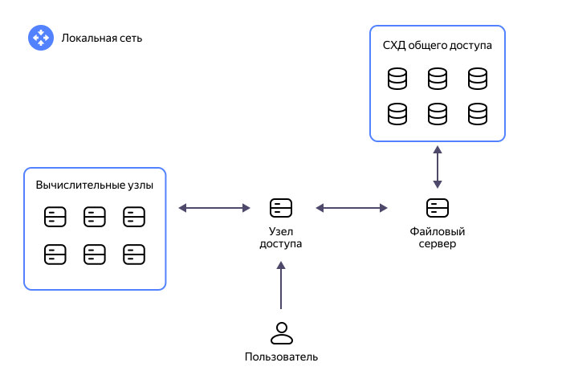
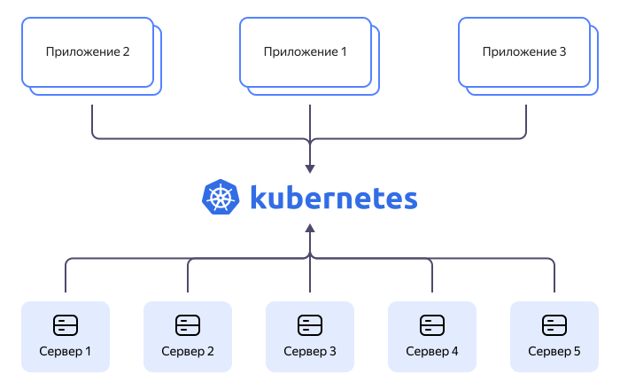

# Кластер

Кластер — это группа серверов, объединенных с помощью коммуникационных каналов для совместного решения информационно-вычислительных задач. Для пользователя кластер выступает единой системой, независимо от своей структуры и состава.

Кластеры применяются в научных исследованиях, финансовой аналитике, обработке медицинских изображений и многих других областях, где требуются большие вычислительные ресурсы. Сложные задачи выполняются сразу на нескольких узлах кластера, что значительно повышает производительность.

## Из чего состоят кластеры {#components}

Кластер состоит из нескольких физических или [виртуальных машин](vm.md) и вспомогательных ресурсов для взаимодействия с клиентами, хранения данных и решения вычислительных задач. Основные компоненты кластера:

* Узел доступа — сервер или маршрутизатор, расположенный между сетью клиента и кластером. Он обеспечивает их связь — в том числе передачу данных и управление доступом.
* Узлы кластера — компьютеры, которые входят в состав кластера. Ими могут быть как физические серверы, так и виртуальные машины.
* Сеть — совокупность коммуникационных каналов, которые используются для передачи данных и команд между узлами кластера.
* Хранилище данных — локальное или удаленное хранилище различных ресурсов, необходимых кластеру.
* Программное обеспечение — операционные системы, приложения и инструменты для управления кластером, выполнения задач, масштабирования и др.
* Инструменты оркестрации и репликации — средства автоматизации развертывания и управления кластером, а также обеспечения надежности и доступности ресурсов.

## Виды кластеров {#types}

Выделяет три основных типа кластеров:

1. Кластеры высокой доступности (High Availability).
1. Кластеры с балансировкой нагрузки (Network Load Balancing, NLB).
1. Высокопроизводительные кластеры (High-performance Cluster, HPC).

### Кластеры высокой доступности {#high-availability}

Приложение, запущенное на одном компьютере, достаточно уязвимо. Из-за этого надежность всей системы резко снижается. Если компьютер выйдет из строя, работа приложения будет приостановлена. Избежать этого помогает предварительный запуск приложения на резервной системе, которая сможет перехватить выполнение задачи, если что-то пойдет не так.

Кластеры высокой доступности построены по этому принципу. Они содержат избыточные узлы, одновременно выполняющие один и тот же процесс и позволяющие избежать потерь: если один узел выйдет из строя, остальные примут на себя его рабочую нагрузку.

Кластеры высокой доступности применяются для критических серверных приложений, например:

* серверов баз данных;
* терминальных и почтовых серверов;
* серверов общего доступа к файлам.

К главным преимуществам таких кластеров относят:

* стабильность — способность к восстановлению после сбоя;
* отказоустойчивость — способность продолжать работу в случае сбоя;
* надежность — способность работать должным образом в случае сбоя.

### Кластеры с балансировкой нагрузки {#load-balanced}

Балансировка нагрузки — это распределение трафика между узлами кластера. Она помогает оптимизировать производительность и предотвратить поступление непропорционально больших объемов задач на отдельные узлы.

Балансировщик нагрузки может быть установлен как на главных узлах кластера, так и вне его. Он контролирует работоспособность узлов, определяет сбои и при необходимости перенаправляет входящий трафик на другие машины.

Кластеры с балансировкой нагрузки широко применяются для поддержания баз данных. Системы управления базами данных (СУБД) создают огромную нагрузку на сервер: на чтение идет бесконечный поток запросов, и часто одна машина не справляется. При кластеризации СУБД запускается сразу на нескольких серверах, один из которых назначается главным. Он занимается записью и актуализацией данных в базе. Остальные серверы — его реплики — обслуживают чтение, равномерно распределяя нагрузку между собой и сокращая время отклика.

### Высокопроизводительные кластеры {#high-performance}

Высокопроизводительные кластеры способны обрабатывать данные и выполнять сложные расчеты с огромной скоростью — в несколько квадриллионов операций в секунду — за счет параллельного запуска тысяч вычислительных узлов.

Такие кластеры популярны в сфере науки, промышленности и общественной жизни. Именно они обеспечивают работу интернета вещей и искусственного интеллекта, проведение живых стримингов с высоким разрешением, возможность прогнозирования природных катаклизмов и анализа финансовых рынков.

## Преимущества кластеризации {#advantages}

Кластеризация помогает многократно усилить вычислительные мощности и повысить надежность приложений. Среди самых явных преимуществ:

* **Надежность и доступность.** В случае сбоя одного из серверов кластер автоматически переводит нагрузку на другие серверы, гарантируя непрерывность работы. Это повышает доступность сервисов.

* **Масштабируемость.** С помощью кластеризации можно легко увеличивать или уменьшать число серверов в группе без изменения инфраструктуры. Это помогает быстро адаптировать ресурсы под новые требования.

* **Высокая производительность.** Объединение нескольких серверов приводит к более эффективному использованию ресурсов, что увеличивает производительность приложений.

* **Резервное копирование и восстановление.** Кластеры позволяют создавать резервные копии данных и восстанавливать их в случае сбоя. Это обеспечивает защиту данных и их надежность.

* **Снижение затрат.** Расходы на оборудование и обслуживание сокращаются, так как для выполнения одних и тех же задач при использовании кластеров требуется меньше серверов.

* **Ускорение разработки.** Кластеризация ускоряет разработку и внедрение новых приложений, поскольку для тестирования и отладки доступны сразу несколько серверов.

## Проблемы кластеризации {#disadvantages}

Несмотря на все положительные стороны, иногда кластеризация может оказаться слишком сложной и затратной технологией:

* **Сложность настройки.** Кластеризация требует тщательной настройки: ошибки в конфигурации могут привести к нестабильному функционированию кластера или даже к его неработоспособности.

* **Ограничения оборудования.** Некоторые серверы могут не поддерживать технологии, необходимые для создания отказоустойчивых конфигураций.

* **Высокая стоимость создания и масштабирования.** Создание физического кластера может потребовать значительных финансовых, временных и ресурсных затрат на приобретение дополнительного оборудования, кабелей, коммутаторов и программного обеспечения, а также на настройку системы и ее обслуживание.

* **Проблемы совместимости.** Серверы и программное обеспечение могут иметь разные версии, что приводит к проблемам совместимости при создании кластера, а значит, ошибкам, сбоям и нестабильности в будущем.

* **Ограничения пропускной способности.** Физический кластер может иметь ограниченную пропускную способность между серверами из-за использования общей шины или кабелей. Это влечет за собой задержки и снижение производительности.

* **Проблемы безопасности.** При создании физического кластера необходимо учитывать вопросы безопасности: например, если серверы находятся в одном помещении, нужно гарантировать им защиту от атак и несанкционированного доступа.

## Облачные решения {#cluster-in-cloud}

Решить большинство проблем кластеризации помогают современные облачные технологии. Кластер в облачных вычислениях реализуется в виде группы узлов, размещенных на виртуальных машинах и соединенных внутри виртуального частного облака. Облако позволяет полностью исключить большую часть накладных расходов, связанных с настройкой кластера:

1. Виртуальные машины могут подготавливаться по требованию, что обеспечивает масштабируемость кластера за считанные минуты.
1. Инфраструктуру можно быстро обновлять, придавая кластеру гибкость, необходимую для адаптации к меняющимся потребностям.
1. Развертывание узлов в нескольких зонах и регионах доступности может ускорить время отклика, а также повысить устойчивость и безопасность.   

## Кластеры и контейнеризация приложений {#app-containerization}

[Контейнеризацией](./containerization.md) называют развертывание ПО, при котором весь код приложения, инструменты разработки, все файлы и компоненты, требуемые для запуска, объединяются в единое целое. Благодаря этому можно запускать приложение на любой инфраструктуре без настройки окружения и не тратить время на поиск версий под конкретные операционные системы.

Запуск контейнерных приложений на узлах кластера повышает доступность, масштабируемость и производительность веб-приложений. Однако управлять контейнерами на большом количестве машин очень сложно. Поэтому была создана [Kubernetes®](https://kubernetes.io/) — система с открытым исходным кодом для автоматического развертывания, масштабирования и управления контейнерными приложениями.

Она позволяет создавать дополнительные группы контейнеров, когда возрастает трафик, и автоматически восстанавливать вышедшие из строя компоненты. Кроме того, Kubernetes® динамически реагирует на изменения в сетевой инфраструктуре, балансирует нагрузку, применяет правила безопасности и выполняет другие функции.

Kubernetes® функционирует как посредник между контейнерными приложениями и узлами кластера:

Несмотря на то что Kubernetes® применяется в самых разных проектах, поддерживать ее своими силами не всегда получается. Часто для этого не хватает ресурсов или компетенций в команде. В таком случае часть задач можно делегировать провайдеру услуги.

## Что предлагает {{ yandex-cloud }} {#cluster-yc}

Инфраструктура для работы с контейнерными приложениями в {{ yandex-cloud }} представлена сервисом [Managed Service for Kubernetes®](/services/managed-kubernetes). Он позволяет развертывать, масштабировать и контролировать контейнерные приложения с помощью Kubernetes®. Вы сможете предоставлять доступ к вашим приложениям через публичные и приватные [сервисы разных типов](../managed-kubernetes/concepts/service.md), а также через приложения из Cloud Marketplace. Данные хранятся в надежно защищенной инфраструктуре {{ yandex-cloud }} с возможностью их резервного копирования в [{{ objstorage-full-name }}](/services/storage/) и другие хранилища.

{{ yandex-cloud }} осуществляет мониторинг различных проблем, таких как повреждения файловой системы, сбои ядра, потеря интернет-соединения и проблемы с компонентами Kubernetes®, и имеет механизм автоматического восстановления неисправных компонентов. Вам остается лишь создать кластер в Managed Service for Kubernetes® и группу узлов, а провайдер возьмет на себя настройку основной конфигурации системы.

В номенклатуре {{ yandex-cloud }} также представлено множество других управляемых сервисов для самых разнообразных сценариев использования. Например, для управления кластерами баз данных компания предлагает:

* [{{ mmy-full-name }}](/services/managed-mysql/) — для управления кластерами самой популярной реляционной СУБД MySQL®. [Документация {{ mmy-name }}](../managed-mysql/).

* [{{ mpg-full-name }}](/services/managed-postgresql/) — для управления кластерами объектно-реляционной СУБД PostgreSQL. [Документация {{ mpg-name }}](../managed-postgresql/).

* [{{ mch-full-name }}](/services/managed-clickhouse/) — для управления кластерами высокопроизводительной колоночной СУБД ClickHouse®. [Документация {{ mch-name }}](../managed-clickhouse/).

Подробнее обо всех сервисах {{ yandex-cloud }} вы можете прочитать в [документации]({{ link-docs }}).

## Полезные ссылки {#links}

* [Пошаговые инструкции для Managed Service for Kubernetes®](../managed-kubernetes/operations/)
* [Управление доступом в Managed Service for Kubernetes®](../managed-kubernetes/security/)
* [Вопросы и ответы про Managed Service for Kubernetes®](../managed-kubernetes/qa/all.md)
* [Документация {{ ydb-name }}](../ydb/)


