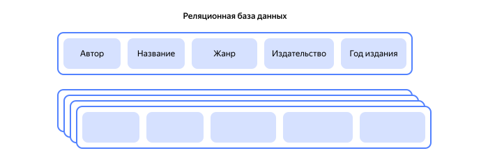

# Что такое колоночные базы данных

_Колоночные (столбцовые) базы данных_ — это формат организации данных, при котором информация упорядочивается и сохраняется по столбцам. Несмотря на то, что каждый из столбцов по сути представляет из себя таблицу, состоящую из одного столбца, колоночные базы принципиально отличаются от [реляционных баз данных](relational-databases.md), где хранение и обработка данных происходит так же в таблицах, но построчно. Использование колоночных баз данных особенно полезно для аналитических запросов, когда необходимо извлечь конкретные характеристики данных из большого объема информации. 

Колоночные базы данных появились в 1970-х годах, но широко применяться стали только в 2000-х. Это связано с ростом объемов данных, появлением новых типов данных (научных, геопространственных, временных рядов), а также со стремлением к повышению производительности за счет распараллеливания и оптимизированных алгоритмов сжатия и обработки данных. Использование колоночных баз данных стало революционным подходом к хранению и обработке данных, предоставляя ИТ-специалистам новые возможности для анализа.

##	Сравнение колоночных и реляционных баз данных {#comparison}

Чтобы лучше понять ключевые особенности колоночных баз данных, сравним их с реляционными.

|                                 | **Реляционные базы данных**             | **Колоночные базы данных**   |
|:-------------------------------:|:---------------------------------------:|:----------------------------:|
| **Структура данных**            | Связанные таблицы                       | Столбцы                      |
| **Скорость запросов**           | Средняя                                 | Высокая                      |
| **Сложность добавления данных** | Просто                                  | Сложно                       |
| **Применение**                  | Работа с постоянно обновляемыми данными | Анализ статистических данных |

### Особенности работы реляционных баз данных {#relational}

Рассмотрим простой пример: база данных библиотеки, где у каждой книги есть несколько характеристик — автор, название, жанр и т.д.

Реляционные базы данных организуют данные в виде связанных таблиц. Каждая книга — это строка в таблице, а ее характеристики — столбцы.

Чтобы узнать, например, сколько книг определенного автора находится в библиотеке, реляционной базе данных необходимо проверить каждую строку таблицы. И если библиотека большая, это может занять достаточно много времени. 

При этом добавить новую книгу в базу данных очень просто — достаточно добавить всего одну строку с нужной информацией.

Таким образом реляционные базы данных чаще используют при работе с постоянно обновляемыми данными, когда нужна высокая надежность и безопасность (например, для банковских и [ERP (Enterprise Resource Planning)](https://ru.wikipedia.org/wiki/ERP) систем).

### Особенности работы колоночных баз данных {#column-db}

Колоночные базы данных организуют данные в виде столбцов. Каждый столбец содержит данные об одной из характеристик книги.

Чтобы узнать количество книг определенного автора, в базе данных такого типа поиск будет выполняться всего по одному столбцу «Автор». Это позволяет значительно быстрее обрабатывать большие объемы информации. 

Однако добавить в колоночную базу данных новую книгу сложнее — нужно добавить информацию во все необходимые столбцы. Поэтому колоночные базы чаще используют для анализа данных, а не для их постоянного обновления (например, в рекламных технологиях и интернет-магазинах).

## Преимущества колоночных баз данных {#advantages}

Специфика функционирования баз данных, организованных в виде колонок, позволяет им иметь определенные преимущества по сравнению с другими типами баз данных:

* Оптимизация хранения данных: благодаря тому, что в каждой колонке содержатся однотипные данные, алгоритмы сжатия могут сокращать объем информации без потери качества. Сжатие данных с помощью Run-Length Encoding (замена повторяющихся символов на один символ и число его повторов), Bitmap Indexing (индексирование данных для обозначения наличия или отсутствия значения в колонке) и других методов позволяет значительно сократить затраты на хранение и увеличить скорость извлечения данных. Это имеет большое значение для анализа данных в бизнесе и других видов деятельности, где необходимо оперативно получать результаты.

* Эффективность чтения данных: аналитические запросы в колоночных базах данных выполняются с большой скоростью. Это особенно полезно в ситуациях, когда нужно обработать большой массив информации и извлечь информацию из нескольких столбцов.

* Умение решать задачи [OLAP](./olap.md): колоночные базы данных эффективнее выполняют суммирование, подсчет, вычисление среднего значения и другие операции. Это объясняется их структурой и возможностью обрабатывать данные прицельно по колонкам, без загрузки лишней информации.

* Масштабируемость: колоночные базы данных могут легко подстраиваться под растущий объем и меняющиеся требованиям к обработке информации благодаря способности распределять ее между несколькими серверами.

Исходя из перечисленных выше свойств, очевидно, что колоночные базы данных — это лучший выбор для оперативной обработки большого количества информации. Они не только гарантируют высокую скорость работы, но и позволяют оптимизировать расходы на хранение данных.

## Недостатки колоночных баз данных {#disadvantages}

Не существует универсального решения, которое могло бы удовлетворить все запросы. Каждый вид базы данных имеет свои плюсы и минусы. Это касается и колоночных баз данных. Поэтому, прежде чем выбрать этот тип для реализации проекта, необходимо проанализировать его слабые стороны:

* Трудности в решении [OLTP-задач](./oltp.md): базы, организованные в виде колонок, эффективно обрабатывают аналитические запросы. Однако специфика их структуры предполагает, что добавление новой записи чаще всего влияет сразу на множество столбцов. Это очень тормозит и усложняет процесс.

* Сложность управления: настройка и администрирование колоночных баз данных сложнее, чем реляционных. Специалист по работе с колоночными базами данных должен иметь более глубокие знания, чтобы работать со сжатыми данными, распределенной нагрузкой, а также индексами. 

* Трудоемкость создания резервных копий: резервное копирования в колоночных базах — это длительный процесс, который тратит большое количество ресурсов. Это может быть крайне значимо в системах, где скорость восстановления данных после сбоя играет критическую роль.

* Сложность в интеграции с существующими системами и процессами: из-за различий в архитектурах и подходах к обработке данных миграция на колоночные базы может потребовать дополнительных усилий и временных затрат.

* Ограниченная поддержка [ACID-свойств](https://ru.wikipedia.org/wiki/ACID): поскольку не все колоночные базы данных поддерживают требования к транзакционной системе, существует риск повреждения и искажения информации.

## Сценарии применения {#application}

Плюсы и минусы колоночных баз данных в совокупности определяют ключевые области, в которых они наиболее эффективны. Ниже рассмотрим несколько наиболее популярных сценариев применения баз данных такого типа.

* **Анализ больших объемов данных**

  [Big Data](./bigdata.md) аналитика — один из наиболее востребованных сценариев применения колоночных баз данных. Использование баз данных такого типа позволяет быстро и эффективно анализировать петабайты и даже эксабайты данных, выявляя закономерности и тенденции. Часто такая аналитика выполняется в режиме реального времени. Это позволяет специалистам не только отслеживать необходимую информацию, но и эффективно и своевременно использовать полученные данные.

* **Интернет вещей (IoT)**

  Колоночные базы данных эффективно справляются с колоссальным объемом информации, который создают устройства [IoT](https://ru.wikipedia.org/wiki/Интернет_вещей). Поток полученных от них данных быстро обрабатывается и анализируется. Это очень важно в таких отраслях, как умный дом, промышленный интернет вещей или мониторинг состояния окружающей среды.

* **Бизнес-аналитика и отчетность**

  [Бизнес-аналитика](./business-analytics.md) и отчетность являются традиционными областями применения колоночных баз данных. Эти базы предоставляют возможность оперативно получать и обрабатывать информацию, формируя отчеты и дашборды о финансовых операциях, показателях эффективности и других ключевых метриках. Это может быть полезно для стратегического планирования и оперативного руководства компанией.

* **Исследование и анализ временных рядов**

  Колоночные базы данных хорошо подходят для задач, связанных с анализом временных рядов, например, мониторинга производительности оборудования, прогнозирования погоды или анализа финансовых рынков. Способность быстро суммировать или агрегировать данные по времени значительно улучшает производительность запросов.

* **Научные исследования**

  В исследовательских центрах проводится анализ большого объема научных данных, например результатов экспериментов, наблюдений, статистических данных. Колоночные базы данных способны эффективно обрабатывать данные такого типа.

* **Хранилища данных**

  Для хранилищ данных, содержащих огромные объемы информации, прекрасным выбором являются колоночные базы данных, способные эффективно сжимать информацию и выполнять сложные аналитические запросы.

* **Геоинформационные системы (ГИС)**

  Применение колоночных баз данных работы с геопространственными данными существенно ускоряет выполнение операций, связанных с определением местоположения и планированием маршрутов. Это крайне востребовано в географических и геологических исследованиях, а также в изучении городской среды и экологических данных, где требуется работа с большим объемом информации о координатах, зонах, картах и местоположении.

* **Рекомендательные системы**

  Колоночные базы данных также применяются для детального анализа поведения клиентов (например, в интернет-магазинах). Это позволяет отслеживать их действия на сайте, разделять аудиторию на группы и создавать персональные предложения.

## Колоночные базы данных в {{ yandex-cloud }} {#column-db-yc}

{{ yandex-cloud }} предлагает различные решения для работы с данными, включая поддержку колоночных баз данных в сервисах:

* [{{ mch-full-name }}](../managed-clickhouse/) — сервис для работы с колоночными базами данных [{{ CH }}](https://clickhouse.com). С его помощью вы сможете анализировать и хранить данные, быстро обрабатывать большие объемы, а также сжимать информацию для экономии места. {{ CH }} легко масштабировать и интегрировать с другими сервисами.
* [{{ dataproc-full-name }}](../data-proc/) — управляемый сервис, работающий на базе популярных инструментов обработки больших данных. Позволяет интегрировать колоночные базы данных с [Apache Hive](https://hive.apache.org/) и [Apache Spark](https://spark.apache.org/) для проведения более сложной аналитики и машинного обучения.
* [{{ datalens-full-name }}](../datalens/) — сервис для визуализации и анализа данных, который может работать с данными из {{ CH }} и других источников.

## Заключение {#finale}

Базы данных на основе колонок не могут заменить реляционные базы данных, но они являются отличным выбором для решения аналитических задач. Такие решения, как ClickHouse, [Apache Cassandra](https://ru.wikipedia.org/wiki/Apache_Cassandra) и [Amazon Redshift](https://ru.wikipedia.org/wiki/Amazon_Redshift), уже зарекомендовали себя надежными и эффективными инструментами для работы с большими объемами данных. Они предлагают гибкость и возможность масштабирования, что делает их незаменимыми в современном мире.

Если вы ищете эффективный способ анализировать большие объемы данных, рассмотрите возможность внедрения колоночных баз данных. Это не только ускорит обработку информации, но и позволит сократить расходы на ее хранение. 

#### См. также {#see-also}

* [{#T}](./relational-databases.md)