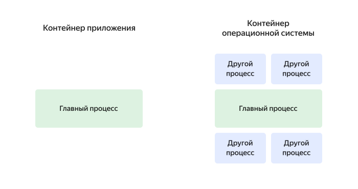
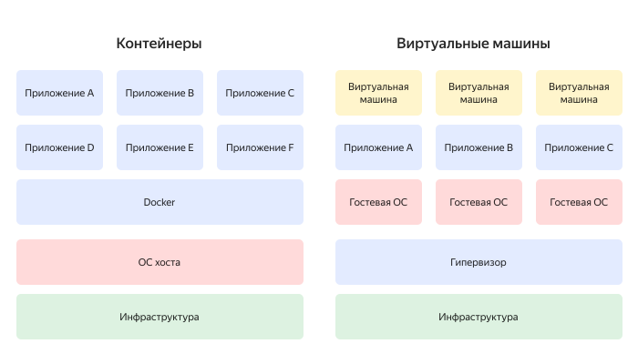

# Что такое контейнеризация

Контейнеризация — метод, с помощью которого программный код упаковывается в единый исполняемый файл вместе с библиотеками и зависимостями, чтобы обеспечить его корректный запуск. Такие файлы называют контейнерами. Контейнеры можно разворачивать в разных средах и там управлять их работой.

Если код разрабатывается в определенной вычислительной среде (например, при переносе на новый сервер), часто возникают ошибки, связанные с тонкостями настройки. При контейнеризации таких проблем значительно меньше. Ведь контейнер не зависит от настроек основной операционной системы и может работать на любой платформе или в облаке.

Интерес к решениям на основе контейнеров и их широкое использование привело к тому, что в 2015 году компания [Docker](https://ru.wikipedia.org/wiki/Docker) и другие лидеры отрасли в рамках проекта [Open Container Initiative (OCI)](https://opencontainers.org/) разработали стандарты упаковки программного кода в контейнеры.

Благодаря стандартам пользователи могут использовать технологию контейнеризации любого поставщика, сертифицированного по OCI.

## Типы контейнеров {#type-of-containers}

Контейнер универсален — его можно развернуть в любой операционной системе независимо от настроек. Выделяют два основных типа контейнеров — приложений и операционной системы.

### Контейнеры приложений {#containers-apps}

Чтобы организовать работу микросервисов с горизонтальной масштабируемостью, применяются _контейнеры приложений_. Внутри каждого контейнера такой архитектуры запускается один процесс. Лучше всего они подходят для неизменяемых инфраструктур. Когда запускается любой контейнер приложения, он запускает один процесс, который, в свою очередь, запускает одно приложение.

### Контейнеры операционной системы {#containers-os}

_Контейнеры операционной системы_ близки по особенностям работы к виртуальным машинам. Они нужны, чтобы хранить операционную систему и запускать несколько процессов одновременно.

Такой тип обычно используется для больших, неделимых и классических приложений. В одном контейнере могут содержаться конфигурации системы, архитектура, а также инструменты. Часто контейнеры операционной системы создаются с помощью шаблонов или образов, которые фактически определяют структуру и содержимое этого контейнера. Следовательно, можно создавать контейнеры с идентичными средами, используя одинаковые версии пакетов и конфигурации для всех контейнеров.

 

Чтобы создавать контейнеры операционной системы, используются такие технологии, как OpenVZ, LXC, Linux VServer и Solaris.

## Контейнеры и виртуальные машины: отличия {#container-vs-vm}

По функциональным особенностям и назначению контейнеры схожи с виртуальными машинами. Но есть и некоторые различия.

Виртуальная машина (ВМ) — операционная система (ОС), которая развернута внутри другой операционной системы. ВМ имеет свое ядро и некоторые обособленные ресурсы.

Контейнеры — это модули, в каждом из которых запускается одно приложение. Они занимают меньше памяти, используют небольшое количество ресурсов и почти не зависят от операционной системы кластера.

На одинаковом оборудовании можно запустить большое количество контейнеров, тогда как ВМ будет в разы меньше. Это важно при использовании облачной инфраструктуры — потребуется меньше ресурсов.

 

## Применение контейнеризации {#application-of-containerization}

* Построение архитектуры микросервисов — настройка различных контейнеров, которые работают параллельно, для использования и вывода из эксплуатации по мере необходимости.

* Создание баз данных с использованием контейнеров как строительных блоков — контейнеризация сегментов базы данных преобразует монолитные базы данных в их модульные аналоги.

* Автоматизирование разворачивания приложений на различных хостах.

* Перенос программ в более современные среды.

* Экономия места и памяти на устройствах.

* Повышение уровня безопасности систем.

* Увеличение скорости и эффективности работы систем.

## Какие преимущества у контейнеризации? {#benefits-of-containerization}

Контейнеризация помогает программистам разрабатывать очень гибкие и масштабируемые продукты, позволяет разворачивать их быстрее и безопаснее и обеспечивает поддержку приложений.

#|
|| Преимущество | Описание ||
|| Высокая скорость |

Контейнеры не перегружены излишними накладными расходами, потому что они совместно используют операционную систему основного хоста.

Эта облегченная структура обеспечивает более высокую эффективность сервера и сокращает время запуска. Более высокая скорость снижает нагрузки на сервер.
||

|| Локализация ошибок |

Каждое контейнерное приложение работает независимо. Это упрощает выявление любых сбоев.

Пока команда решает техническую проблему, остальные контейнеры могут работать без простоев.
||

|| Высокая эффективность |

Контейнеры имеют меньшую емкость, чем виртуальные машины, быстро загружаются и имеют большую вычислительную мощность.

Эти характеристики делают контейнеры более эффективными, особенно при обработке ресурсов, а также снижают затраты на сервер и лицензирование.

||

|| Безопасность |

Контейнерные приложения изолированы, а значит, если вредоносный код проникнет в одно из приложений, система управления не даст распространиться вирусу за пределы текущего контейнера.

Разработчики могут определять разрешения безопасности, которые контролируют доступ и обмен данными между контейнерами.
||

|| Перераспределение ресурсов |

Контейнеризация позволяет ограничивать различные ресурсы — память, локальное хранилище, центральный процессор и другое.

Всякий раз, когда функция перерасходует ресурсы, она немедленно завершается, а контейнеризация распределяет ресурсы на другие контейнеры пропорционально в зависимости от рабочей нагрузки и верхних потолков.
||

|#

## Управление контейнерами {#manage-containers}

Чтобы работать с контейнерами, используются платформы оркестрации. Такие платформы позволяют:

* автоматизировать установку приложений и сервисов, упакованных в контейнеры;
* автоматизировать развертывание новых версий, запись логов, мониторинг и отладку;
* управлять масштабированием;
* настраивать автономную работу контейнеров в зависимости от нагрузки на систему.

## Kubernetes — что это? {#kubernetes}

Kubernetes (K8S) — среда управления приложениями, которые обернуты в контейнеры. K8S автоматизирует запуск контейнеров, масштабирует и координирует их работу в условиях рабочего пространства.

K8S поддерживает основные современные виды контейнеризации, а также предоставляет следующие возможности:

* **Планирование запусков контейнеров** — оценивает, какие и сколько ресурсов нужно контейнерам, и планирует подходящее время для их автоматического запуска.

* **Балансировка нагрузки** — экземпляры контейнеров приложения балансируются по нагрузке.

* **Откат изменений** — во время обновлений отслеживается работоспособность новых экземпляров, и в случае сбоя он может автоматически откатиться к предыдущей версии.

* **Управление томами** — управляет постоянным хранилищем, которое использует приложение.

* **Самовосстановление** — в случае сбоя контейнера для его замены будет создан новый.

* **Горизонтальное масштабирование** — наблюдает за центральным процессором и пользовательскими показателями, а затем добавляет или удаляет экземпляры, если необходимо.

* **Управление конфигурацией** — управляет конфигурацией приложения и безопасностью его работы.

Kubernetes — достаточно сложная система. Ее можно развернуть на собственном оборудовании компании или воспользоваться решениями облачного провайдера.

Для получения хорошо работающей системы важно правильно ее настроить — создать кластер, выставить сетевые настройки, права к сервису, логирование и резервное копирование.

Чтобы избежать этих трудностей, можно использовать сервис [{{ managed-k8s-full-name }}](/services/managed-kubernetes/).

Создайте кластер [{{ managed-k8s-full-name }}](../managed-kubernetes/concepts/index.md#kubernetes-cluster) и [группу узлов](../managed-kubernetes/concepts/index.md#node-group), а облачный провайдер настроит основную конфигурацию системы.

Полезные ресурсы K8S:
* [Пошаговые инструкции](../managed-kubernetes/operations/index.md)
* [Управление доступом](../managed-kubernetes/security/index.md)
* [Вопросы и ответы](../managed-kubernetes/qa/all.md)

