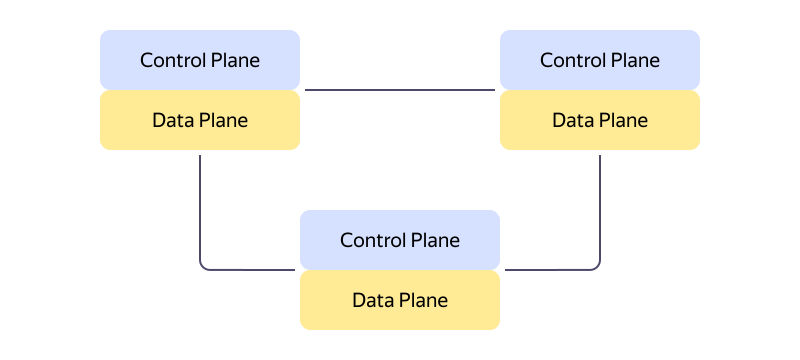
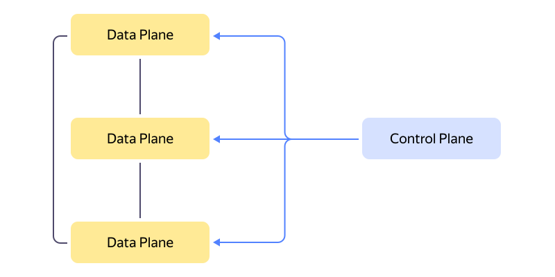

# Control Plane и Data Plane

_Control Plane (управляющий слой)_ и _Data Plane (передающий слой)_ — это два основных уровня, на которые разделяют функции управления цифровыми системами — сетями, приложениями и облачными сервисами. Такое разделение функций имеет ряд преимуществ:

* улучшение производительности и масштабируемости;
* повышение безопасности;
* облегчение управления и настройки.

Control Plane — это слой для конфигурирования, мониторинга и управления цифровой инфраструктурой. Основная задача Control Plane — обеспечить условия для того, чтобы все компоненты системы могли выполнять свои функции максимально эффективно и безопасно. 

Data Plane, с другой стороны, реализует основную функциональность всей системы, обеспечивая выполнение инструкций, полученных от Control Plane. Он работает на более низком уровне абстракции, чем Control Plane, и не имеет функций управления и контроля. 

Control Plane и Data Plane работают в тесной взаимосвязи, представляя собой изолированные слои одного процесса. Ключевое различие между ними заключается в том, что Control Plane управляет логикой и стратегическими решениями, тогда как Data Plane отвечает за выполнение этих решений и перенос данных. 

## История возникновения и развития концепций Control Plane и Data Plane {#history}

История Control Plane и Data Plane тесно связана с историей развития компьютерных сетей. Первые сети были небольшими, и управление выполнялось вручную, отдельно для каждого узла. С развитием сетей стало очевидно, что необходим механизм для централизованного управления и маршрутизации. Так, в 1980-х годах возникла идея разделения функций на управляющие и передающие, чтобы повысить эффективность на каждом этапе обработки сетевой информации.

### Control Plane аппаратного типа {#hardware}

В начале своего развития разделение управляющего и передающего слоя выполнялось с помощью специального оборудования — маршрутизаторов и коммутаторов. Протоколы Control Plane работали на сетевом уровне [модели OSI](https://ru.wikipedia.org/wiki/Сетевая_модель_OSI) и использовали таблицы маршрутизации для определения пути, по которому пакет должен пройти через сеть. За непосредственную пересылку данных согласно принятым решения отвечал Data Plane. Такое разделение функций позволило эффективно находить оптимальные пути для передачи данных и управлять сетевыми ресурсами, значительно повышая эффективность работы больших и сложных сетей.

**Преимущества:**

* Высокая производительность: маршрутизаторы, коммутаторы и сетевые контроллеры могут выполнять функции Control Plane с высокой скоростью и низкой задержкой.
* Надежность и стабильность: специализированные устройства имеют встроенные механизмы для обеспечения отказоустойчивости и надежности.

**Недостатки:**

* Стоимость: маршрутизаторы, коммутаторы и сетевые контроллеры могут быть дорогими.
* Сложность управления: управление аппаратными устройствами может быть сложным и требовать специализированных навыков.
* Сложность в модернизации и масштабировании: аппаратные устройства сложно изменять и масштабировать для поддержки больших сетей.

### Control Plane программного типа {#hardware}

В последующие годы, с развитием концепций [SDN (Software-Defined Networking)](https://ru.wikipedia.org/wiki/Программно-определяемая_сеть), различие между Control Plane и Data Plane стало еще более важным. SDN позволил отделить Control Plane от специализированных устройств, реализуя его функции через программное обеспечение, которое работает на серверах или виртуальных машинах. Таким образом Control Plane и Data Plane стали полностью изолированы друг от друга. В результате управление сетевыми ресурсами стало более простым и гибким, поскольку изменения в сетевой политике или конфигурации применяются централизованно и динамически.

**Преимущества:**

* Гибкость в модернизации и масштабировании: программное обеспечение Control Plane может быть легко адаптировано к различным сетевым требованиям.
* Простота управления: программное обеспечение позволяет легко изменять настройки и политики без необходимости физического вмешательства в оборудование.
* Экономичность: программное обеспечение дешевле, чем аппаратные устройства.

**Недостатки:**

* Зависимость от сервера: надежность и производительность зависят от сервера или облачной инфраструктуры. При недостаточно мощном оборудовании возможны задержки обработки данных.

Современные технологии, включая маршрутизацию IP, MPLS, и новые сферы, такие как NFV (виртуализация сетевых функций), продолжают расширять возможности и функциональность Control Plane.

## Функции Control Plane и Data Plane {#functions}

Разделение управляющего и передающего слоя играет ключевую роль в управлении и координации различных технологических сред: от сетевых устройств (например, маршрутизаторы, коммутаторы) до автоматизации облачных служб (например, {{ yandex-cloud }}, AWS, Azure и Google Cloud). Независимо от технологической платформы, без эффективно настроенной работы Control Plane и Data Plane сложно достичь высокой производительности и надежности системы.

В таблице ниже представлены основные функции Control Plane и Data Plane в различных цифровых инфрастуктурах:

#|
|| | **Control Plane** | **Data Plane** ||
|| **Сетевые устройства**
|
* Контролирует маршрутизацию данных.
* Анализирует состояние сети.
* Принимает решения о том, как именно данные должны быть переданы между устройствами.
* Обеспечивает правильную и эффективную доставку данных от отправителя к получателю. 
|
* Передает данные между устройствами на основе решений, принятых в Control Plane.
* Обрабатывает и направляет пакеты данных в соответствии с таблицами маршрутизации и протоколами, установленными на уровне Control Plane.
* Выполняет функции свитчинга и маршрутизации на аппаратном уровне для обеспечения максимальной скорости передачи данных.
* Применяет правила фильтрации и безопасности (например, ACL) к проходящему трафику для контроля доступа и обеспечения безопасности сети. ||
|| **{{ k8s }}**
|
* Отвечает за принятие решений в кластере, например, где запускать поды, когда и какие ресурсы назначать.
* Отслеживает состояние кластера и определяет, нужно ли создавать, обновлять или удалять экземпляры приложений в зависимости от статуса кластера.
* Реагирует на изменения в кластере (например, отказы узлов) для обеспечения надежности и доступности ресурсов.
* Управляет сетью внутри кластера, чтобы обеспечить доступность и безопасность взаимодействующих друг с другом сервисов и подов. 
|
* Отвечает за фактическую передачу данных и выполнение заданий в кластере, таких как запуск контейнеров в подах.
* Обрабатывает трафик, поступающий к подам и исходящий от них, в соответствии с правилами маршрутизации и политиками безопасности, установленными Control Plane.
* Обеспечивает выделение и использование ресурсов (CPU, память) для запущенных контейнеров.
* Поддерживает связь между различными компонентами кластера через подсистему сети, которая создает виртуальную сетевую среду для подов. ||
|| **Облачные платформы** 
|
* Управляет развертыванием и масштабированием приложений, виртуальных машин и других облачных ресурсов.
* Обеспечивает безопасность на уровне управления через аутентификацию, авторизацию и мониторинг активностей пользователей и сервисов.
* Отслеживает состояние облачной инфраструктуры и автоматически управляет инцидентами (например, выполняет восстановление после сбоев).
* Управляет сетевыми настройками, такими как правила фаервола, маршрутизация и частные подсети. 
|
* Обрабатывает и транспортирует данные между облачными сервисами и пользовательскими приложениями без прямого взаимодействия с механизмами управления.
* Обеспечивает производительность и доступность приложений и данных путем оптимизации распределения ресурсов и маршрутизации сетевого трафика.
* Применяет политики безопасности на уровне данных, такие как шифрование передачи и хранения данных.
* Исполняет логику прикладных программ и API-вызовов в рамках предоставленных облачных сервисов. ||
|#

### Интеграция Control Plane с различными инструментами и сервисами {#integration}

Реализация функций Control Plane через программное обеспечение (см. [Control Plane программного типа](#hardware)) позволило интегрировать его с различными инструментами и сервисами, такими как:

* Системы мониторинга и управления сетью (Network Management Systems, NMS): Control Plane собирает информацию о состоянии всех сетевых устройств в реальном времени и отправляет уведомления администраторам в случае возникновения проблем.
* Системы обнаружения и предотвращения вторжений (Intrusion Detection and Prevention Systems, IDS/IPS): Control Plane анализирует сетевой трафик и обнаруживает вредоносные активности.
* Системы управления доступом (Access Control Systems, ACS): Control Plane управляет доступом пользователей и устройств к сетевым ресурсам.

Такие интеграции позволяют администраторам более эффективно управлять сетевыми ресурсами, автоматически распознавая и реагируя на возникающие проблемы.

## Control Plane и Data Plane в сервисах {{ yandex-cloud }} {#yc}

В {{ yandex-cloud }} разделение на управляющий и передающий слой применяется для более эффективного управления и обработки данных. Это позволяет клиентам легко масштабировать свои приложения, управлять настройками безопасности и оптимизировать производительность.

В [{{ compute-full-name }}](../compute/) Control Plane отвечает за управление различными видами ресурсов, включая виртуальные машины, сетевые настройки и хранилища данных. Он автоматизирует такие задачи, как развертывание новых виртуальных машин, резервирование сетевых адресов или настройка прав доступа. Это не только повышает удобство работы для пользователей, но и способствует оптимизации ресурсов, что приводит к снижению затрат. Data Plane в {{ compute-name }} непосредственно выполняет инструкции и запросы, которые координируются Control Plane. В развертывании, управлении и масштабировании виртуальных машин, а также в обработке сетевых запросов и хранении данных, Data Plane обеспечивает выполнение всех требуемых операций.

[{{ monitoring-full-name }}](../monitoring/) и [{{ cloud-logging-full-name }}](../logging/) используют Control Plane, чтобы следить за производительностью, собирать логи и анализировать состояние приложений и сервисов. Data Plane отвечает за непосредственный сбор, обработку и хранение полученных данных.

В [{{ alb-full-name }}](../application-load-balancer/) и [{{ network-load-balancer-full-name }}](../network-load-balancer/) Control Plane отвечает за управление балансировщиками и целевыми группами, а также за настройку балансировки трафика. Data Plane, с другой стороны, исполняет роль непосредственного обработчика и диспетчера трафика.

В [{{ managed-k8s-full-name }}](../managed-kubernetes/) Control Plane создает кластеры, группы узлов и сеть между ними. Data Plane играет ключевую роль в обеспечении выполнения рабочих нагрузок, непосредственно развернутых на этих кластерах.

Интеграция вышеперечисленных сервисов позволяет пользователям эффективно разрабатывать, тестировать и развертывать приложения на платформе {{ yandex-cloud }}, используя мощные инструменты для автоматизации и управления ресурсами на многих уровнях.