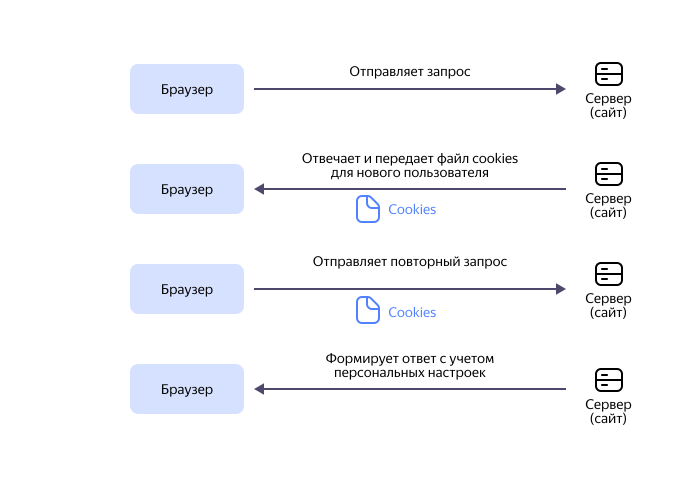

# Cookie

Cookie (англ. «печенье») — это небольшие текстовые файлы с информацией о пользователе, которые хранятся на его устройстве. Они позволяют сайту узнавать пользователя и настраивать под него сессию. Например, когда вам не требуется заново вводить логин и пароль учетной записи, это значит, что с помощью cookie сайт запомнил ваш браузер и устройство. В cookie-файлах также может храниться информация о цветовой теме сайта или регионе для отображения погоды, статистика активности и многое другое.

Хранятся cookie в папке браузера. Вы можете открыть их и прочитать с помощью любого текстового редактора, однако настраивать их там не получится. Это можно сделать на самих сайтах или в настройках браузера.

Термин «cookie» произошел от китайских «волшебных печенек» с предсказаниями и в контексте интернета впервые был применен в 1994 году, когда инженер компании Netscape Communications Лу Монтулли с помощью них реализовал виртуальную корзину покупок. В 1996 году идея сохранять такие файлы стала очень популярна, но подверглась критике из-за угрозы нарушения конфиденциальности.

В 1997 году появилась первая спецификация [RFC 2109](https://datatracker.ietf.org/doc/html/rfc2109), которая рекомендовала сайтам блокировать сторонние cookie. Интернет с тех пор сильно эволюционировал, и современные браузеры способны решить большинство проблем конфиденциальности cookie. Некоторые транснациональные корпорации даже работают над полным отказом от cookie.

## Принцип работы {#how-work}

Cookie работают по принципу билета: сам по себе он бесполезен, но если предъявить его контролеру, то он пустит вас на ваше место. Так же в общем случае и с сайтами: они получают ваши cookie и позволяют вам войти в свой аккаунт. Происходит это следующим образом:

1. Браузер нового посетителя сайта делает запрос на сервер.
1. Сайт передает браузеру файлы cookie с данными для идентификации.
1. При повторном входе на сайт браузер отправляет ему полученные cookie.
1. Сайт персонализирует страницу с учетом полученных данных и отправляет ответ браузеру.

<center>



</center>

Чтобы работать с cookie, браузеру достаточно уметь следующее:

1. Поддерживать передачу файлов размером до 4 килобайт.
1. Запоминать не менее 50 файлов для каждого сайта.
1. В общей сложности запоминать не менее 3000 cookie-файлов.

Пример простого файла cookie, содержащего тему оформления пользователя, токен сессии и срок его действия:

```js
HTTP/1.0 200 OK
Content-type: text/ html
Set-Cookie: theme=dark
Set-Cookie: sessionToken= abc123; Expires= Ср., 15 августа 2024 г. 12:19:26 GMT
```

## Функции cookie {#functions}

Подробнее рассмотрим основные задачи, которые решают cookie:

1. **Управление сессиями**.

   Чаще всего cookie используются для управления сессиями — передают статус аутентификации пользователя, содержимое корзины покупок, прогресс в браузерных играх и другое. Даже если вы не аутентифицируетесь, сайт все равно может запомнить ваши действия в рамках сессии.

   Несмотря на то, что изначально cookie были придуманы для создания виртуальной корзины товаров, сегодня такие корзины чаще всего хранятся в базе данных сервера, а cookie лишь помогают определить владельца корзины.

   Для управления сессиями достаточно лишь идентификатора пользователя. Все остальное владельцы сайта могут хранить в своих базах данных, что делает возможности персонализации страницы под конкретного пользователя безграничными.

1. **Персонализация**.

   Если сайт не хранит информацию о настройках пользователя в своей базе данных, он может хранить ее в cookie-файлах. Пользователь совершает какие-то действия по персонализации сайта под свои нужды, в то время как сервер кодирует их в файл, а затем отправляет в браузер в форме cookie.

   Это могут быть настройки оформления, регион для поиска товаров или новостных материалов, язык страницы, поисковые запросы и так далее. Например, поисковая система Google раньше позволяла пользователям выбирать отображаемое количество результатов при запросе и хранила эти настройки в форме cookie.

1. **Отслеживание**.

   Cookie с этой функцией следят за привычками пользователей. Например, записывают товары, которые ему нравятся, чтобы потом показать релевантную рекламу. Как это работает:

   * Пользователь впервые посещает сайт.
   * Сайт присваивает ему уникальный идентификатор и отправляет его в форме cookie.
   * С этого момента сайт хранит данные о всех посещенных пользователях страницах на этом сайте.
   * Анализируя данные о посещениях, можно составить список предпочтений пользователя.

   Некоторые компании устанавливают такие cookie на сторонние сайты с помощью рекламных баннеров. Они могут использовать полученные данные для рекламы, сбора статистики для улучшения своих товаров, а также продавать их третьим лицам.

## Типы cookie {#types}

Cookie отличаются по времени хранения, области действия и назначению:

* **Сессионные** — хранятся во временной памяти и удаляются после закрытия браузера. Они содержат такие данные, как предыдущие посещенные страницы, чтобы можно было вернуться на них, нажав кнопку «Назад».

* **Постоянные** — срок хранения зависит от настроек сайта и браузера. К ним относятся данные для авторизации, товары в корзинах интернет-магазинов и многое другое.

* **Сторонние** — загружаются с тех сайтов, которые встраивают на свои страницы контент с других доменов. Например, рекламные баннеры. С помощью них рекламодатели делают персонализированную рекламу. Большинство современных браузеров позволяют отключать сторонние cookie.

* **Super-cookie** — опасный вид cookie, который действует на [домены верхнего уровня](./fqdn.md#tld) (например, `.ru`). То есть если вы получили их на сайте `example-1.ru`, то они будут действовать и на `example-2.ru`. Это позволяет злоумышленникам выдавать себя за другого пользователя. Обычно браузеры блокируют такие cookie.

* **Зомби-cookie** — cookie, у которых есть механизмы защиты от удаления. Они позволяют компаниям следить за статистикой пользователей, даже если они регулярно чистят cookie. Это нарушает конфиденциальность пользователя и может послужить поводом для судебного разбирательства.

## Cookie и безопасность {#safety}

Как правило, если сайт использует [протокол HTTPS](https://ru.wikipedia.org/wiki/HTTPS), то передача cookie безопасна. Утечка данных может случиться, только если владельцы домена сами это позволят. По вине недобросовестных сайтов к третьим лицам могут попасть ваши паспортные данные, номер телефона, данные банковской карты и другое.

Чтобы этого не случилось, соблюдайте следующие рекомендации:

* Не заходите на подозрительные сайты.
* Всегда проверяйте правильность написания домена. Например, `yandeks.ru` — это не сайт Яндекса.
* Если на подозрительный сайт зайти все-таки нужно, то используйте режим инкогнито, в котором никакие данные не сохраняются. Например, в [Яндекс Браузере](https://yandex.ru/support/browser/) это можно сделать несколькими способами:
   * Перейдите в настройки и выберите **Режим Инкогнито**.
   * Нажмите на ссылку правой кнопкой мыши и выберите **Открыть ссылку в режиме Инкогнито**.
   * Используйте сочетание клавиш **Ctrl** + **Shift** + **N** (в Windows и Linux) или **Cmd** + **Shift** + **N** (в macOS).
* Своевременно обновляйте браузер и антивирусную систему.

Многие сайты предлагают выбрать: хранить все cookie или только самые важные. Во втором случае обычно отключаются только те, которые отвечают за персонализированную рекламу или редко используемые функции сайта. Реклама при этом все равно будет показываться, но перестанет основываться на ваших предпочтениях.

Если вам хочется оставаться анонимным, то cookie можно полностью отключить. В ином случае отключение принесет больше неудобств, чем пользы — некоторые сайты не смогут работать в привычном для вас формате.

Также вы можете самостоятельно удалить все cookie или только cookie с выбранного сайта. Чтобы сделать это в Яндекс Браузере, воспользуйтесь [инструкцией](https://yandex.ru/support/common/browsers-settings/browsers-cookies.html) для вашего устройства.

## Законодательство о cookie {#legislation}

Чтобы правильно собирать cookie и не нарушить закон, необходимо руководствоваться [152-ФЗ «О персональных данных»](https://www.consultant.ru/document/cons_doc_LAW_61801/). Прежде всего владелец сайта должен уведомить пользователя о сборе cookie и другой личной информации. Сделать это можно двумя способами:

1. Опубликовать «Политику конфиденциальности» с подробным описанием всего, что касается сбора данных. У пользователей должна быть возможность попасть на страницу с политикой с любой другой страницы сайта. Обычно ссылка на нее размещается в «подвале» или в верхнем меню сайта.
1. При первом входе пользователя на сайт или регистрации прислать ему уведомление о собираемых сайтом данных и получить от него согласие на их обработку.

Строгих правил составления «Политики конфиденциальности» нет, но вы можете воспользоваться [рекомендациями с сайта «Роскомнадзора»](https://rkn.gov.ru/personal-data/p908/).

Помимо законов конкретных стран, также существуют глобальные — [Закон о защите данных в интернете](https://ru.wikipedia.org/wiki/Общий_регламент_по_защите_данных) (GDPR) и [Закон о конфиденциальности в сети](https://ru.wikipedia.org/wiki/Директива_2002/58/ЕС) (ePrivacy Directive). Их несоблюдение может повлечь штрафы, судебное преследование, снижение доверия пользователей и поисковых систем.

## Использование cookie в сервисах {{ yandex-cloud }} {#cookie-yc}

Платформа {{ yandex-cloud }} использует cookie `yc_session` для авторизации пользователя. Для консоли управления каждого сервиса используется независимые друг от друга cookie, но все они привязаны к единой логической сессии.

Чтобы узнать подробнее о системе защиты персональных данных {{ yandex-cloud }}, см. страницу [{#T}](../security/conform.md).
