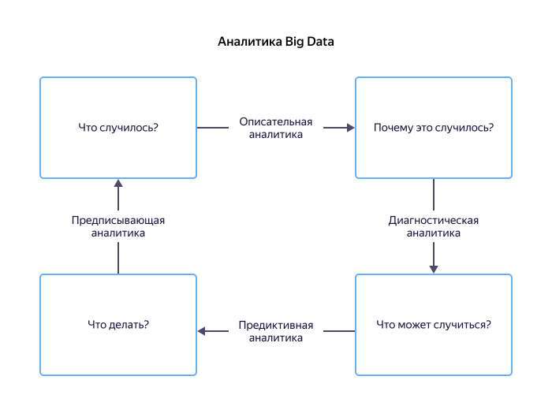

# Аналитика данных

Аналитика данных применяется, когда нужно собрать, обработать и проанализировать значительный объем данных. Это помогает представить информацию в наглядном виде и сделать выводы.

## Цели и задачи аналитики данных

Аналитика данных занимается большими данными — огромными массивами структурированных и неструктурированных данных, которые поступают с высокой скоростью. Их можно собирать только с помощью автоматизированных средств, а обрабатывать и анализировать — статистическими методами с применением математического аппарата. Например, к большим данным можно отнести данные о банковских транзакциях и действиях пользователей в социальных сетях или о работе умных устройств и интернета вещей.

В задачи аналитики данных входят:
* сбор, систематизация, обработка и визуализация данных;
* моделирование и исследование процессов;
* сопоставление возможных решений;
* выявление аномалий.

Все это помогает проанализировать настоящее и спрогнозировать будущее, а также сформировать базу для принятия стратегических решений.

Аналитика данных используется во всех сферах экономики: от рекламы и маркетинга до управления финансами и безопасности. Так, аналитик в сфере банковских услуг может проанализировать заемщиков по возрасту или социальному статусу и точно узнать, какие факторы влияют на платежеспособность положительно, а какие — отрицательно. Полученные знания позволят изменить условия кредитования так, чтобы снизить риски невозврата займов.

## Типы аналитики больших данных

Существует четыре основных типа аналитики больших данных, каждый из которых имеет свою область применения:

1. **Описательная** — с ее помощью можно описать текущую ситуацию или события, произошедшие за определенный период времени. Такой тип аналитики позволяет выявлять положительные и отрицательные тенденции, но не их причины. Компании предпочитают использовать этот тип аналитики в сочетании с другими.

1. **Диагностическая** — нужна для того, чтобы изучить ситуацию более подробно и сфокусироваться на причинах происходящего. Здесь аналитик строит гипотезы, выявляет зависимости и поведенческие шаблоны. Компании прибегают к этому типу аналитики, чтобы глубже изучить ту или иную проблему.

1. **Предсказательная** — способствует прогнозированию будущих событий на основе накопленных данных описательной и диагностической аналитики. Прогнозирование является оценочным и его точность сильно зависит от качества данных и стабильности ситуации в изучаемой сфере.

1. **Предписывающая** — помогает составить рекомендации о действиях, которые нужно предпринять, чтобы устранить вероятную проблему или получить желаемый результат, например максимальную возможную прибыль. Предписывающая аналитика предполагает использование продвинутых инструментов и технологий обработки данных, в том числе машинного обучения и нейронных сетей, что делает ее применение достаточно дорогим и сложным. Здесь нужно сопоставлять затраты на внедрение такого типа аналитики и ожидаемый от этого рост прибыли.

## Ценность аналитики данных для бизнеса

Аналитика данных в бизнесе — это основа для принятия решений. С ее помощью компании могут оценить происходящее и спрогнозировать будущее, а затем выбрать стратегию развития. Такой подход помогает избегать потенциальных проблем и повышать прибыльность бизнеса.

В частности, грамотный анализ данных позволяет:
* лучше понимать потребности клиентов;
* прогнозировать спрос на товар или услугу;
* повышать эффективность бизнес-процессов;
* оценивать вероятность неудач при принятии решений;
* следить за состоянием оборудования;
* управлять логистикой;
* быстро выявлять аномалии в данных и находить их причины;
* следить за результативностью отделов и сотрудников.

### Примеры применения аналитики в бизнесе

Сфера деятельности | Описание
--- | ---
Разработка продукта | **Прогноз спроса на продукт** Производители применяют данные фокус-групп, социальных сетей, тестовых рынков и ранних продаж, чтобы смоделировать запуск нового продукта. При этом сравнивают результаты моделирования для разных значений одного и того же параметра (например, в сфере модной одежды это может быть цвет, материал или фасон платья). Так выявляются решения, которые приводят к более успешному запуску продукта.
Техническое обслуживание и профилактика оборудования | **Раннее выявление неисправностей** Факторы, которые могут предсказать механические неисправности, могут скрываться в таких данных, как год выпуска и модель оборудования, записи журналов, показания датчиков, сообщения об ошибках. Их анализ помогает выявлять потенциальные проблемы и вовремя проводить техобслуживание, увеличивая время безотказной работы.
Работа с клиентами |	**Изучение портрета пользователей** Анализ поведения пользователей в социальных сетях, статистики посещений веб-сайтов и журналов вызовов ведет к улучшению взаимодействия с клиентами. Благодаря аналитике данных компании могут предоставлять персонализированные предложения, сокращать отток клиентов и исключать потенциальные проблемы.
Безопасность | **Обнаружение мошенников** Аналитика позволяет находить закономерности, которые указывают на действия мошенников. Это особенно актуально для финансовой и банковской сфер бизнеса.
Эффективность производства | **Оптимизация процессов** Методы аналитики помогают оценивать производственные процессы, собирать и обрабатывать отзывы клиентов, изучать причины возврата товаров и анализировать другие данные, чтобы сокращать простои и предсказывать будущие потребности.

## Инструменты аналитики от {{ yandex-cloud }}

Существует огромное количество инструментов аналитики: это и бесплатные программы с открытым исходным кодом, и дорогостоящие системы широкого профиля для нужд большого бизнеса.

Классифицировать все многообразие инструментов можно по их назначению:
1. Системы баз данных — реализуют сбор и хранение данных.
1. Средства анализа данных — извлекают данные из источников и выполняют их обработку по заданным критериям.
1. Средства визуализации данных — помогают представить результаты анализа данных в удобном наглядном виде.
1. Средства прогнозирования — инструменты прогнозирования на основе языков программирования.

[Платформа {{ yandex-cloud }} для бизнес-аналитики](/solutions/data-analysis) объединяет инструменты для решения большинства задач: от сбора и хранения до обработки и графического представления данных любого типа. По сути, это комплексная безопасная система, способная закрыть все потребности бизнес-аналитики. Поэтому список компаний, которые доверяют сервисам {{ yandex-cloud }}, [постоянно растет](/cases).

В частности, платформа {{ yandex-cloud }} предлагает бесплатный сервис для анализа и визуализации данных [{{ datalens-full-name }}]({{ link-datalens-main }}/), который позволяет напрямую подключаться к различным источникам данных, отслеживать продуктовые метрики и представлять информацию в виде графиков и дашбордов.

В числе важных преимуществ {{ datalens-name }}:
* бесплатный неограниченный доступ;
* простота освоения;
* надежность и безопасность;
* наличие маркетплейса расширений;
* возможность совместной работы с коллегами, партнерами и клиентами;
* поддержка экосистемы Яндекса;
* разнообразие источников данных;
* многочисленные варианты визуализации данных.

В [документации {{ datalens-full-name }}](../datalens) подробно описаны первые шаги и собрана вся информация, которая поможет при работе с сервисом. [Зарегистрируйтесь]({{ link-console-main }}/) в {{ yandex-cloud }} и начните пользоваться возможностями платформы уже сегодня.

Видео по теме:
* Видео [{{ datalens-full-name }}: зачем использовать и как](https://www.youtube.com/watch?v=ntlppg2JhxU)
* Видео [{{ datalens-name }}: аналитика за пределами собственных данных](https://www.youtube.com/watch?v=AEJuXBrgOtg)
