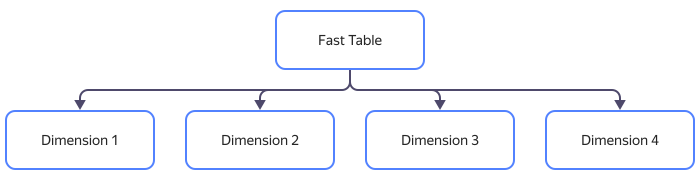
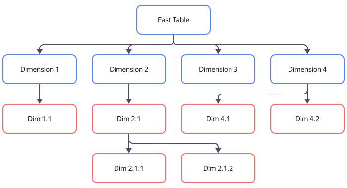
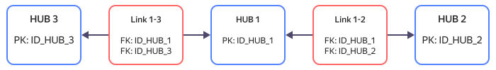

# Data Vault

Data Vault — одна из моделей хранилища данных ([Data Warehouse](/blog/posts/2022/06/data-warehouse)). Структура Data Vault предусматривает длительное хранение больших объемов разнородной информации. Модель Data Vault содержит временные отметки размещения данных и позволяет проследить изменение хранимой информации во времени. Поэтому этот вид хранилища используется, например, при работе систем учета взаимоотношений с клиентами (CRM), в системах анализа и управления технологическими процессами, а также в аудите.

## История появления Data Vault {#history}

Модель Data Vault была описана создателем, Дэном Линстедтом, в конце 1990-х и представлена общественности в 2000 году. Дэн Линстедт в пяти статьях разобрал общую концепцию модели хранилища, правила создания и соединения основных компонентов (таблиц), привел примеры использования выборки информации для обработки запросов пользователей, а также методы загрузки данных в хранилище.

В 2013 году появилась концепция Data Vault 2.0, в которой разобрано использование хранилища в NoSQL СУБД, при работе с неструктурированной информацией и большими данными (Big Data), описаны методы бесшовной интеграции и разобраны лучшие практики внедрения Data Vault.

## Отличия Data Vault от других типов хранилищ данных {#differences}

Основное назначение любого вида Data Warehouse — надежное хранение больших объемов разнородной информации. При этом прочие параметры, такие как скорость доступа, достоверность или избыточность информации, являются вторичными.
С учетом требований к хранимым данным выделяют два основных типа хранилищ: хранилища в третьей нормальной форме (3NF) и хранилища с измерениями (типа «Звезда» или «Снежинка»).

### 3NF {#3nf}

Хранилище третьей нормальной формы содержат только нормализованные таблицы. Достоинства такого подхода — простота создания и управления базой данных.

Требование к 3NF в отсутствии дублирования информации, тем не менее, является и недостатком для больших хранилищ этого типа. Любой запрос по выборке данных содержит срезы из множества таблиц, включая различные типы сложных соединений. Следовательно, кратно возрастают время и вычислительные мощности для обработки запросов.

Чтобы обойти этот недостаток, используют вспомогательные базы данных — витрины ([Data Mart](datamart.md)). Витрины являются срезом данных из 3NF по определенной интересующей нас тематике. В дальнейшем для предоставления отчетов пользователям используют запросы к витринам. Для сложных многоуровневых хранилищ 3NF приходится использовать многоуровневые витрины.

### Хранилища с измерениями {#dimensional-storage}

Хранилища с измерениями строят по схемам «звезда» или «снежинка». Данные расположены в узлах хранилища в виде таблиц фактов. Связывающие таблицы фактов лучи также являются отдельными таблицами и называются таблицами измерений. Отличие подтипа «снежинка» от подтипа «звезда» — в наличии цепочек из таблиц измерений. Благодаря этому каждую отдельную таблицу измерений можно привести к третьей нормальной форме (в модели «звезда» таблицы измерений не нормализованы).

Пример структуры хранилища по схеме «звезда»:

Пример структуры хранилища по схеме «снежинка»:

Так как таблицы измерений логически связывают таблицы фактов, вместо сложных запросов к фактовым таблицам используют запросы к таблицам измерений. Это является основным достоинством такого типа хранилищ — относительная (по сравнению с 3NF) простота запросов и высокая скорость выборки интересующих пользователя данных.

Недостаток хранилищ с измерениями — необходимость перестраивать множество связанных таблиц измерений при любой реорганизации информации, например, при добавлении ключевых полей в одну из фактовых таблиц. Также использование нормализованных таблиц для хранилищ с измерениями является не обязательным требованием, а рекомендацией. Это приводит к дублированию информации и росту объема базы данных.

### Особенности Data Vault {#features}

Data Vault можно отнести к подтипу хранилищ с измерениями. Концепция Data Vault — следствие необходимости избавиться от последовательного изменения множества связанных таблиц в случае изменения ключевых полей одной из них (основной недостаток моделей «звезда» и «снежинка»).

Для этого создатель модели Дэн Линстедт ввел в структуру хранилища третью табличную сущность — Спутник (Satellite). Таблицы Спутники содержат дополнительные описания к фактовым таблицам (Хабам, Hub) и таблицам измерений (Связям, Link). Структура существующих Хабов и Связей на протяжении всего жизненного цикла правильно спроектированного Data Vault остается неизменной. При необходимости реорганизации архитектор баз данных меняет структуру Спутников, что не затрагивает связанные таблицы.

Основным недостатком при таком подходе является потребность в высококвалифицированных архитекторах (разработчиках) Data Vault.

Характеристика | 3NF | Звезда / Снежинка | Data Vault
---------------|-----|-------------------|-----------
Нормализация таблиц	| Обязательная | Не обязательная | Не обязательная
Структура хранилища	| Простая | Сложная | Сложная
Объем хранимой информации | Средний или малый | Большой | Большой
Скорость доступа к информации| Средняя | Высокая | Высокая
Затраты на разработку и реорганизацию | Низкие | Высокие | Средние

### Data Vault и 3NF {#datavault-vs-3nf}

Несмотря на то, что Data Vault является разновидностью хранилища с измерениями, для которых не обязательна нормализация таблиц, этот тип хранилища может быть сконструирован как для NoSQL, так и для реляционных СУБД. Благодаря гибкой структуре вспомогательных таблиц Сателлитов, отдельные ветки или даже всю базу данных можно привести к классической третьей нормальной форме (3NF).

## Структура Data Vault {#structure}

1. **Хаб (Hub)** — единичная бизнес-сущность, например клиент, договор, поставка и т.п.:

    * Уникальный бизнес-ключ (набор ключей);
    * Суррогатный ключ (рекомендуется хеш бизнес-ключей);
    * Дата-время загрузки;
    * Источник записи.

1. **Связь (Link)** — связь между сущностями (Хабами):

    * Суррогатные ключи связываемых сущностей (может быть больше 2);
    * Дата-время загрузки;
    * Источник записи.

1. **Сателлит (Satellite)** — описательные атрибуты сущностей (хабов) и связей:

    * Суррогатный ключ родителя;
    * Значения атрибутов;
    * Дата-время начала действия версии;
    * Дата-время загрузки;
    * Источник записи.

### Хабы (Hub) {#hub}

Хаб в терминах Data Vault — таблица фактов. Основное назначение Хабов — хранение ключевой информации о сущностях базы данных.
Набор измерений Хаба определяется при проектировании и остается неизменным:

* Поля с натуральными ключами сущности (бизнес-ключи).
* Уникальный суррогатный ключ, который определяется, например, как хеш-функция от набора натуральных ключей.
* Ссылка на источник записи.
* Время добавления записи.

Записи в Хабах не имеют версионности и неизменны в процессе работы с хранилищем. Это гарантирует относительную стабильность структуры базы данных и отсутствие необходимости перестройки Связей между Хабами.

### Связи (Link) {#link}

Связи между сущностями являются отдельным типом таблиц — Связь. Таблицы Связей строятся по принципу «многие ко многим» и содержат ссылки на суррогатные ключи связанных Хабов.

### Сателлиты (Satellite) {#satellite}

Все изменяемые атрибуты сущностей, включая их версии при наличии версионности, хранятся в отдельных таблицах Сателлитах.
У каждого Хаба и у каждой Связи может быть сколько угодно вспомогательных таблиц Сателлитов с различными наборами полей.

Обычно количество и структура Сателлитов определяется из логической связности и частоты изменений данных. Например, в одном Сателлите можно хранить условно постоянные данные (информацию об учетной записи клиента), во втором — данные, имеющие версионность (ФИО клиента, паспортные данные), в третьем — часто изменяющуюся информацию (дату и сумму заказа, адрес доставки и т. п.).

У такой организации хранилища несколько существенных преимуществ перед хранилищами других типов:

* Хранение версионных записей в небольших специализированных Сателлитах, а не полноразмерных фактовых таблицах, уменьшает общий объем базы данных.
* Сателлиты связаны с Хабами и Связями по принципу «один ко многим» (например, несколько контактных телефонов одного клиента). Это делает структуру хранилища интуитивно понятной и обеспечивает простой доступ к анализу информации.
* При необходимости можно создать дополнительные Сателлиты под конкретные задачи без нарушения структуры Data Vault (например, отдельный Сателлит для загрузки информации из нескольких внешних источников данных).

## Преимущества Data Vault {#advantages}

Одним из неочевидных преимуществ построения хранилищ по модели Data Vault является возможность использования гибкого подхода к конструированию. Структура хранилища может быть спроектирована целиком «сверху вниз», но создавать Data Vault допустимо «снизу вверх», благодаря относительной независимости ключевых таблиц (Хабов и Связей). Такая гибкая архитектура позволяет:

* После разворачивания «скелета» хранилища, состоящего только из Хабов и Связей, предоставить клиенту первый результат в виде отчетов верхнего уровня.
* Создавать вспомогательные таблицы Сателлиты, начиная с наиболее критичных «веток» хранилища, например, в первую очередь реализовать хранение данных о заказах клиентов CRM системы, что позволит уже на начальном этапе использовать аналитические отчеты по продажам. Всю дополнительную служебную информацию (контактные данные клиента, информацию об акциях и т. п.) возможно подгрузить после реализации соответствующих разделов Data Vault.
* Дополнительные доработки и пожелания клиента вносить в Data Vault без изменений ключевой структуры хранилища. Для этого необходимо использовать новые вспомогательные таблицы Сателлиты, связанные с существующей моделью.

## Реализация Data Vault с помощью сервисов {{ yandex-cloud }} {#datavault-yc}

Идеальной средой разработки подобных решений является облачное хранилище, например, хранилище от {{ yandex-cloud }}. Один из примеров оптимизации работы хранилища с помощью модернизации его структуры по принципу Data Vault в экосистеме Яндекса приведен в [статье](/cases/hoff) «Как Hoff и AERO создали масштабируемое хранилище данных в {{ yandex-cloud }}»:
1. Специалистами eCommerce агентства [AERO](https://aeroidea.ru/) был проведен рефакторинг исходного хранилища клиента (сети гипермаркетов [Hoff](https://hoff.ru/)), в результате чего объем хранилища данных сократился вдвое.
1. С учетом измененной структуры были переработаны запросы к хранилищу, что привело к сокращению времени работы сложных аналитических отчетов в несколько раз (до 20 минут).
1. Было принято решение о переносе модернизированного хранилища на облачную отказоустойчивую платформу {{ yandex-cloud }}, что совместно с вышеприведенными результатами в конечном итоге позволило оптимизировать финансовые затраты клиента на поддержку работы сервиса.

При реализации проекта использовались такие инструменты как:
* универсальное масштабируемое облачное объектное хранилище [{{ objstorage-full-name }}](../storage/);
* управляемые сервисы баз данных [{{ mch-full-name }}](../managed-clickhouse/) и [{{ mgp-full-name }}](../managed-greenplum/);
* сервис визуализации и анализа данных [{{ datalens-full-name }}](../datalens/).

Чтобы начать работу с сервисами {{ yandex-cloud }}, [войдите]({{ link-console-cloud }}) в свой аккаунт в {{ yandex-cloud }} или зарегистрируйтесь.
