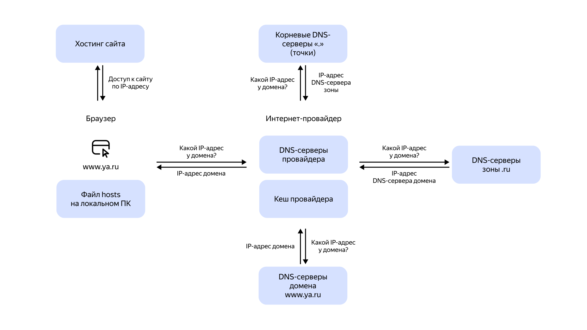

# Domain Name System (DNS)

Система доменных имен или DNS — базовая технология современной всемирной сети. Она основана на иерархическом именовании устройств, служб и ресурсов.

Впервые спецификация доменных имен была описана в 1983 году Джоном Постелом и Полом Мокапетрисом. Они разработали особую структуру идентификации хостов, содержащую имя и категорию.

Через год была представлена классификация gTLD, которая содержала описание основных доменов — `.com`, `.org`, `.edu` и других.

## Как используется DNS

Любой сайт, доступный в глобальной сети, располагается на определенном физическом устройстве. Чтобы идентифицировать такое устройство в сети, ему назначается IP-адрес — идентификатор вида `XXX.XXX.XXX.XXX`.

Для открытия определенного сайта необходимо узнать IP-адрес девайса, на котором тот расположен.

Пользователи каждый день работают с множеством сайтов, и очень сложно запомнить IP-адреса стольких устройств. Поэтому, чтобы проще было работать, используется система доменных имен.

## Основной алгоритм

Любому IP-адресу назначается домен — простое и понятное имя. После ввода доменного имени в браузер:

1. Этот запрос переадресуется на DNS-сервер.
1. DNS-сервер анализирует доменное имя и трансформирует его в IP-адрес.
1. По IP-адресу устройство ищется во всемирной паутине.
1. Если оно найдено, запрос обрабатывается и возвращается ответ. В итоге пользователь видит запрошенный сайт.
1. Если не удалось определить IP-адрес устройства, пользователь получает сообщение об ошибке.

## DNS-сервер

Система доменных имен работает в результате взаимодействия DNS-серверов.

DNS-сервер — устройство, на котором хранится специальная база соотношений IP-адресов и имен доменов.

Чтобы записать данные в систему DNS, добавляются ресурсные записи. Главные из них — это записи `A`, `CNAME`, `MX`, `TXT` и `SPF`.

* `A` — самая главная ресурсная запись сервера DNS. Устанавливает соответствие имени сайта IP-адресу и обозначает адрес.

  К сайту не получится обратиться с помощью доменного имени, если запись типа `A` не задана.

  **Пример**

  | Name | Type | Value |
  | ------ | ------ | ------ |
  | yandex.ru | A | 000.000.000.000 |
  | cloud.yandex.ru | A | 000.000.000.000 |

* `CNAME` — определяет привязку поддоменов к основному имени. Например, `www.yandex.ru` к `yandex.ru`.

  **Пример**

  | Name | Type | Value |
  | ------ | ------ | ------ |
  |www.yandex.ru | CNAME | yandex.ru |

  В примере, если для поддомена `www.yandex.ru` будет прописано `CNAME` и указано значение `yandex.ru`, то `www.yandex.ru` будет открываться с того же IP-адреса, что и `yandex.ru`.

* `MX` — отвечает за работу почтового сервера. С помощью таких записей отправляющая сторона узнает, на какой сервер отправить почту для указанного домена.

  **Пример**

  | Name | Type | Priority | Value |
  | ------ | ------ | ------ | ------ |
  | yandex.ru | MX | 10 | mail1.yandex.ru |
  | yandex.ru | MX | 20 | mail2.yandex.ru |

  Здесь `mail1.yandex.ru` и `mail2.yandex.ru` — сервера для отправки, обработки и принятия электронной почты.

  Можно задать и использовать несколько почтовых серверов. Когда приоритетный недоступен, почта будет отправлена на другой, следующего приоритета.

  На какой именно сервер будет отправлено письмо первым указывает выставленный приоритет. В примере столбец `Priority`. Приоритет одного сервера выше, чем у другого, если у него указано меньшее число.

  Если приоритеты равны, почтовый сервер определяется произвольно.

* `TXT` — хранит текстовые данные о домене. Пример: подтверждение сертификатов безопасности.

* `NS` — устанавливает компетентные DNS-серверы для текущего домена. Показана как последовательность меток.

* `SPF` — хранит список различных серверов, для которых можно отправлять почту от имени прописанного домена.

## Как работают DNS-сервера

В вебе множество DNS-серверов, и любой из них исполняет положенный функционал в глобальной системе.

### Этап 1

Если пользователь ввел в браузер адрес сайта, допустим `yandex.ru`, предварительно браузер выполняет поиск файла соответствий на компьютере пользователя. Этот файл называется `hosts`. В нем указываются локальные соответствия домена IP-адресу. Такое возможно, если на компьютере пользователя развернут веб-сервер.

Допустим введенный адрес нашелся в `hosts` — сайт загрузится сразу. Иначе браузер сконфигурирует и отошлет DNS-запрос к серверам провайдера интернета, чтобы найти IP-адрес домена.

### Этап 2

Любой интернет-провайдер настраивает на своем сетевом оборудовании локальные кеширующие DNS-серверы. Далее сервер DNS ищет в кеше записи о соответствии домена IP-адресу.

Запись нашлась — браузер примет IP-адрес, по которому по специальным протоколам будет найдено физическое устройство. Пользователю откроется нужная страница. Если запись не найдена — сервер провайдера перекинет запрос на корневые DNS-серверы.

### Этап 3

Корневые DNS-серверы помнят информацию о DNS-серверах заданной доменной зоны и посылают им на проверку доменное имя. В нашем случае доменная зона — `.ru`.

### Этап 4

DNS-серверы `.ru`-зоны хранят данные DNS-серверов всех доменов своей зоны. На DNS-сервере адресата можно получить IP-адрес введенного домена `yandex.ru`.

Сервер провайдера принимает IP-адрес домена, фиксирует его у себя в кеше и отправляет браузеру ответ.

## Какие есть типы DNS-серверов

* **Авторитативные** — располагаются на низшей ступени иерархии, хранят ресурсные записи и стремятся вернуть IP-адреса.

* **TLD-серверы** — хранят домены верхнего уровня некоторого хоста.

* **Корневые** — находятся на самом верхнем уровне древовидной системы доменных имен. Количество таких серверов — 13. Они анализируют запросы на информацию о доменах верхнего уровня и контролируются аккредитованными ICANN организациями.

  Если DNS-сервер не может преобразовать запрос, он направляется на корневой, который, в свою очередь, перенаправляет его по иерархии ниже на TLD-сервера.

## Типы DNS-запросов

DNS-запросы — это запросы от одного сервера к другому.

Существует следующие DNS-запросы:

* **Итеративные** — отправляются, если резолвер не способен вернуть ответ из-за того, что он не закеширован.

* **Рекурсивные** — первоначальные запросы поиска DNS. Их делают пользователи к резолверу. Резолвер — это специальный механизм, преобразующий имена хостов в IP-адреса. Чаще всего рекурсивные запросы отправляются провайдеру интернета.

* **Нерекурсивные** — запросы к резолверу, который немедленно возвращает результат. Резолвер возвращает результат сразу, если запросы сразу попадают на авторитарный сервер или в локальном DNS-сервере закеширован требующийся IP-адрес.

## Управление Cloud DNS

{{ dns-full-name }} предоставляет управление зонами DNS и доменными именами ресурсов из консоли {{ yandex-cloud }} и с помощью интерфейсов API, CLI и Terraform.

1. Создайте [зоны DNS](../dns/operations/zone-create-private.md), где будут храниться ресурсные записи, связывающие IP-адреса ваших виртуальных машин с их доменными именами. Можно создать [внутреннюю DNS-зону](../dns/operations/zone-create-private.md) и [публичную DNS-зону](../dns/operations/zone-create-public.md).

1. Добавьте [ресурсные записи](../dns/operations/resource-record-create.md) и [управляйте доступом](../dns/security/index.md).

1. Чтобы предоставить сотруднику вашей компании доступ к {{ dns-name }}, настройте соответствующие роли для их [аккаунтов на Яндексе](../iam/concepts/users/accounts.md#passport) или [сервисных аккаунтов](../iam/concepts/users/service-accounts.md), либо для одной из [системных](../iam/concepts/access-control/system-group.md) или [публичных](../iam/concepts/access-control/public-group.md) групп. Как назначить роли см. [Назначение роли](../iam/operations/roles/grant.md).
