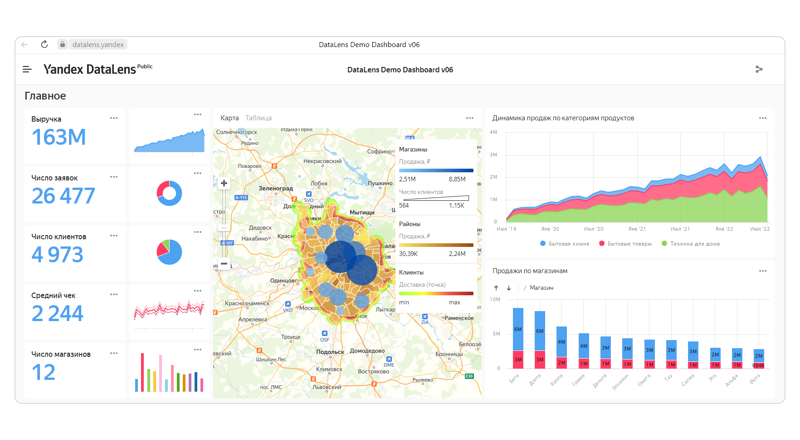
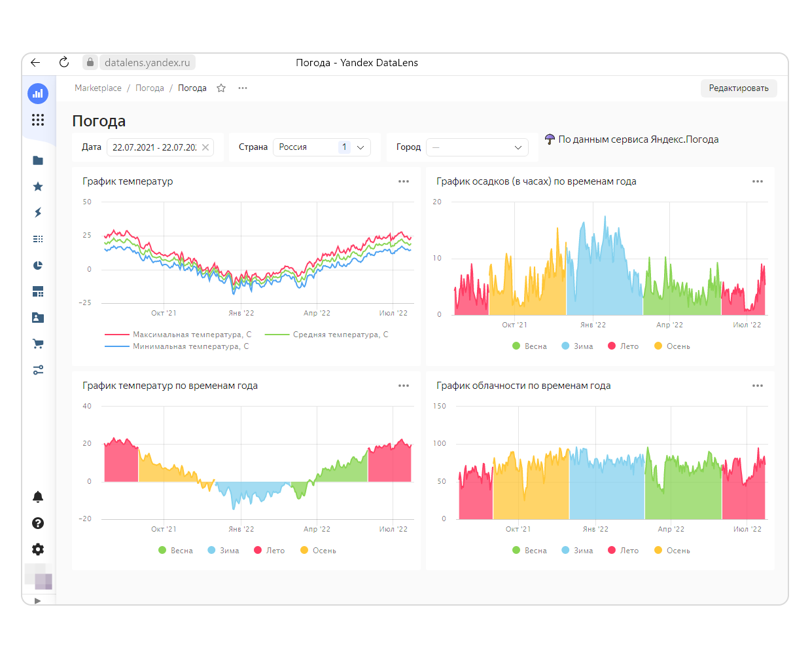

# Что такое сквозная аналитика

Вы заметили, что делать покупки в интернет-магазинах стало гораздо проще? С первых шагов (вернее, кликов) магазин начинает вам подсказывать:
* Вот товары, похожие на те, что вы смотрели или покупали раньше, и обратите внимание — сейчас у нас сезонные скидки.
* Вот пункты доставки, ближайшие к вашему дому.
* А вот это — товары, которые тоже могут вам пригодиться. Например, купили рюкзак для походов — не забудьте про трекинговые ботинки и крем от комаров.

Такая забота о покупателе возможна потому, что магазин внедрил инструменты сквозной аналитики.

Быт, о котором мы только мечтаем — холодильник, который сам закажет заканчивающиеся продукты ваших любимых марок, или входная дверь, которая напомнит взять зонтик, потому что сегодня у вас запланирована прогулка с друзьями, а к вечеру ожидается дождь — это всё тоже будущие проявления сквозной аналитики (конечно, вместе с другими технологиями, такими как интернет вещей и пр.). 

На самом деле, сквозная аналитика — это гораздо больше и глубже.

**Сквозная аналитика** — это современный подход к изучению данных, ориентированный на поддержку принятия решений.

Сквозная аналитика преследует две цели: 
* объединить данные из различных источников и выявить скрытые взаимосвязи, тенденции и неочевидные закономерности;
* представить результаты в наглядном и простом для понимания виде, чтобы с ними было легко работать. Если речь идет о конечных пользователях — это могут быть интеллектуальные подсказки, которые встраиваются в различные приложения (о них мы говорили в самом начале статьи). Но чаще всего для профессиональной работы с данными создаются _дашборды_ — интерактивные страницы с графиками, диаграммами, таблицами и ключевыми показателями. Кликнув на любой сводный показатель, можно посмотреть исходные данные, из которых сложилось это значение — этот процесс называется _детализацией_. Часто говорят, что по клику можно «провалиться» в детальные данные (в английском языке используют термин _drill-down_ — «просверлить» сводный показатель, чтобы заглянуть внутрь). 

## Для чего и как используется сквозная аналитика

Идея сквозной аналитики родилась как ответ на лавинообразный рост объемов данных, которые оказались в распоряжении человека благодаря автоматизации (когда многие процессы стали оцифрованными) и интернету. Чтобы охарактеризовать новую реальность, придумали даже специальный термин — большие данные (big data). Особенности больших данных описывают тремя **V**:
* **Volume** — огромные объемы;
* **Variety** — разнообразие;
* **Velocity** — высокая скорость поступления и обработки.

Скоро стало понятно, что собираемые данные имею большую ценность — это «нефть» цифровой экономики. Но прежними методами, с помощью таблиц Excel, с новыми задачами справляться сложно. И поэтому были разработаны инструменты следующего поколения, способные не только пропускать через себя насыщенные информационные потоки, но и перерабатывать разрозненные данные в целостную картину. Такой подход помогает бизнесу лучше понимать причины роста и падения спроса, улавливать тенденции, строить прогнозы, а значит — выгодно инвестировать, сохранять устойчивость в любых обстоятельствах и постоянно развиваться.  

## Где востребована сквозная аналитика

Наиболее частые сценарии применения сквозной аналитики — анализ трафика корпоративных сайтов и электронная коммерция, т.е. розничные продажи через интернет. На любом сайте и в любом интернет-магазине сегодня установлены счетчики Яндекс Метрики или Google Analytics. С их помощью можно посмотреть типичный «путь пользователя» (последовательность переходов по страницам сайта) и понять, как лучше расположить и представить информацию о товарах и услугах, привлечь внимание к рекламным акциям, сделать более удобным весь процесс интернет-покупок. Особенно важно связать интернет-статистику с данными реального физического мира, которые фиксируются в учетных системах CRM и 1С. Для таких задач — объединения данных из разных источников — идеально подходят инструменты сквозной аналитики.

Сетевые ретейлеры используют сквозную аналитику для планирования закупок, расширения розничной сети, оптимизации перевозок. Причем речь идет не только о долгосрочных стратегических решениях, но и о ежедневном оперативном управлении. Например, для логистов данные из систем геопозиционирования корпоративного автотранспорта накладывают на географические карты, объединяя с информацией о погоде, пробках на дорогах и расходах на топливо — это помогает выстраивать маршруты доставки товаров в магазины или управлять работой курьерской службы.

Финансовые компании одними из первых начали использовать сквозную аналитику — без нее невозможно свести в общую картину десятки факторов, на которые обращают внимание при работе с ценными бумагами или выдаче кредитов.

Для промышленности сегодня самая актуальная тема — создание «цифровых предприятий» (digital enterprise), где все производственные операции моделируются и управляются в специализированных информационных системах. С помощью сквозной аналитики удается выявлять нарушения в производственных процессах и «докапываться» до их первопричин, а значит — уменьшать простои оборудования и вредные выбросы, экономить сырье и энергию, на порядки повышать качество продукции. 

## {{ datalens-name }} как инструмент аналитики

С данными сегодня работают не только профессиональные аналитики, привыкшие к таблицам, схемам и расчетам. Чтобы концепция сквозной аналитики стала всепроникающей, нужны инструменты, которые просты и удобны, как смартфон — интуитивно понятные, привлекательные, быстрые.

Пример такого инструмента — [{{ datalens-full-name }}](https://cloud.yandex.ru/services/datalens). С помощью {{ datalens-name }} можно загрузить данные из внешних систем, отфильтровать, связать между собой, настроить расчеты и вывести результаты на дашборд. В {{ datalens-name }} много готовых шаблонов, большая часть настроек не требует программирования и выполняется «на лету» после минимального обучения. А возможность «проваливаться» из сводных данных в детальные встроена в саму платформу, ее даже не нужно настраивать отдельно.

{{ datalens-name }} отлично визуализирует тенденции и выделяет отклонения. Данные подгружаются в режиме онлайн, информация на дашбордах постоянно обновляется, поэтому их можно использовать и для оперативного управления, и для стратегического анализа.

{{ datalens-name }} решает следующие типы задач:
* Анализ данных из нескольких однородных источников — например, чтобы сравнить продажи с нескольких сайтов или оценить работу партнерской сети. 
* Сводный анализ разнородных данных из различных систем — например, вы можете объединить данные по розничным продажам из кассовых систем, по закупкам и товарообороту — из учетных систем 1С, по поставщикам и партнерам — из CRM. Эти сводные данные можно использовать для планирования ассортимента, управления запасами, ценообразованием.
* Быстрый анализ «сырых» данных — чтобы проанализировать новую ситуацию, понять, что происходит, проверить гипотезу.
* Оперативное управление — например, с помощью преднастроенных дашбордов удобно контролировать работу службы доставки, мониторить оборудование в цехах или отслеживать уровень запасов на складе. 
* Поддержка принятия решений — ключевые показатели работы компании для совещаний топ-менеджеров. 

{{ datalens-name }} входит в экосистему {{ yandex-cloud }}, что дает дополнительные преимущества — данные можно хранить и обрабатывать в облаке, не заботясь об ИТ-инфраструктуре. Вы сможете быстро получать дополнительные ресурсы для обработки данных в период пиковых нагрузок (например, сезонного спроса) и высвобождать эти ресурсы, когда они больше не нужны.

С данными и дашбордами в {{ datalens-name }} удобно работать совместно — вы можете поделиться инсайтами с коллегами или обосновать свои решения перед руководством. При этом {{ yandex-cloud }} обеспечивает высокую надежность хранения данных и защиту от нежелательного доступа.

Кроме того, {{ datalens-name }} интегрируется с разнообразными сервисами Яндекса, в том числе специализированными — например, вы можете встроить в свои приложения инструменты распознавания и синтеза речи {{ speechkit-full-name }}. Это позволит выйти на новый уровень и предложить сервисы, которых нет у ваших конкурентов (и приблизить тот самый «быт будущего»).

Кстати, именно {{ datalens-name }} используется для мониторинга работы облачных сервисов и инфраструктуры {{ yandex-cloud }}. [Зарегистрируйтесь](https://console.cloud.yandex.ru/) на платформе {{ yandex-cloud }}, чтобы начать пользоваться {{ datalens-name }} уже сегодня.