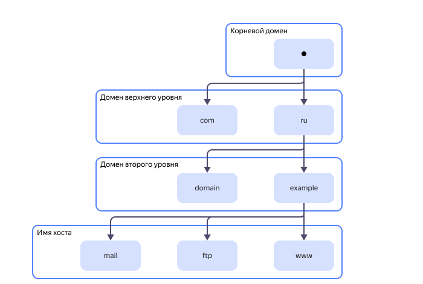

# Полное доменное имя (FQDN)

FQDN (Fully Qualified Domain Name) или полное доменное имя — это полный адрес компьютера или интернет-хостинга в системе _доменных имен_ ([DNS](dns.md)). FQDN представляет собой уникальную текстовую метку, которая позволяет однозначно идентифицировать ресурс в глобальной сети.

Любой сайт в интернете имеет идентификатор вида `XXX.XXX.XXX.XXX` — IP-адрес. IP-адреса могут использоваться для навигации в сети, но такой способ очень неудобный. Использование полного доменного имени играет ключевую роль в обеспечении доступности сайта и простоты навигации. FQDN позволяет пользователям легко находить ваш сайт или онлайн-сервисы и получать к ним доступ.

## Преимущества использования FQDN {#advantages}

FQDN — это не единственный способ идентификации узлов в сети. Также используются IP-адреса и MAC-адреса. Однако у FQDN есть ряд преимуществ:

* **Уникальная идентификация**

  FQDN — это идентификатор, который помогает однозначно отличить устройство от других в сети. FQDN упрощает управление сетью, а также поиск и устранение сетевых неполадок. Гораздо легче найти устройство, если оно идентифицируется своим FQDN, а не IP-адресом.

* **Улучшение безопасности**

  FQDN используется для обеспечения мер безопасности, таких как внесение IP-адресов в белый список. Это помогает предотвратить несанкционированный доступ к сетевым ресурсам.

* **Совместимость со стандартами**

  FQDN соответствует стандартам, определенным Инженерным советом Интернета ([Internet Engineering Task Force](https://www.ietf.org/), IETF). Это обеспечивает совместимость с различными сетевыми протоколами и приложениями.

* **Улучшение производительности**

  FQDN способствует повышению производительности сети. Например, кеширование DNS позволяет сократить время, необходимое для преобразования FQDN в IP-адреса.

* **Совместимость с виртуализацией**

  FQDN используется для уникальной идентификации в виртуализированных средах. Это помогает гарантировать, что виртуальные машины не будут затронуты изменениями, вносимыми в другие виртуальные машины с похожими IP-адресами.

## Структура полного доменного имени {#structure}

FQDN имеет иерархическую структуру, которая определена системой доменных имен. Полное доменное имя состоит из нескольких частей, которые вместе образуют уникальную комбинацию, позволяя идентифицировать ресурс в сети. Синтаксис FQDN выглядит следующим образом:

`<Имя хоста>.<Поддомен>.<Домен второго уровня>.<Домен верхнего уровня>.<Корневой домен>`

Имена отдельных уровней в области доменных имен называются метками и отделяются друг от друга точками. Каждая метка содержит от 1 до 63 символов, а общая длина полного доменного имени не превышает 255 символов. Можно использовать только буквы, цифры или тире. В начале каждой метки должна быть либо буква, либо цифра.

### Корневой домен {#root-domain}

Корневой домен — это начальный уровень в структуре доменных имен, обозначающий самую верхнюю точку в DNS-иерархии. Без него было бы невозможно функционирование DNS и доступ к информации в интернете. Все остальные домены выстраиваются в структуру, опираясь на него. Корневой домен — ключевой элемент для любых DNS-запросов, обеспечивающий маршрутизацию этих запросов к доменам верхнего уровня.
  
Корневой домен не имеет собственного имени, обозначается точкой `.` и расположен в самом конце FQDN. Таким образом, каждое полное доменное имя должно заканчиваться точкой.

При этом отсутствие точки в конце FQDN некритично в большинстве веб-браузеров, поскольку они автоматически подразумевают ее. Например, `www.example.ru.` приравнивается к `www.example.ru`. Таким образом, использование точки в конце FQDN зависит от контекста и конкретной ситуации. В большинстве случаев точка в конце FQDN не имеет особого значения и может считаться просто символом, который используется для разделения частей имени.

### Домен верхнего уровня (Top-Level Domain, TLD) {#tld}

За корневым доменом в иерархической структуре FQDN следует _домен верхнего уровня_ (TLD), указывающий доменную зону. TLD может быть двух типов:

* географического — указывает принадлежность домена к той или иной территории, обычно состоит из двух букв. Примеры TLD географического типа приведены в таблице ниже.

  | TLD | Страна |
  | --- | -------|
  | ru  | Россия |
  | рф  | Россия |
  | kz  | Казахстан |
  | su  | Страны СНГ |
  | uk  | Великобритания |
  | de  | Германия |

* административного — указывает тип организации, обычно состоит из трех букв. Примеры TLD административного типа приведены в таблице ниже.

  | TLD | Тип организации |
  | --- | -------|
  | com  | Коммерческая |
  | edu  | Образовательная |
  | net  | Коммуникационная |
  | org  | Некоммерческая |
  | int  | Международная |

Например, в полном доменном имени `www.mail.example.ru` домен верхнего уровня `ru` принадлежит России.
  
### Домен второго уровня (Second-Level Domain, SLD) {#sld}

На следующем уровне FQDN расположен _домен второго уровня_ (SLD) — уникальное имя ресурса, зарегистрированное в какой-либо из доменных зон. Таким образом, в одной доменной зоне не может быть зарегистрировано несколько ресурсов с одинаковым SLD.

Домен второго уровня — это самая запоминающаяся часть полного доменного имени, поэтому он играет ключевую роль в обеспечении узнаваемости вашего ресурса. Кроме того, правильный выбор SLD способствует поисковой оптимизации.

В качестве домена второго уровня лучше использовать:

* короткие и запоминающиеся слова, не содержащие дефисов и цифр (например, `habr`, `dzen`, `ok`);
* ключевые слова, соответствующие тематике ресурса (например, `culture`, `auto`, `championat`);
* слова, которые точно соответствуют названию вашего бренда (например, `yandex`, `lego`, `adidas`).

Домен второго уровня в полном доменном имени расположен сразу перед доменом верхнего уровня и отделен от него точкой. Например, `example` в полном доменном имени `www.example.ru` — это домен второго уровня.

### Поддомен {#subdomain}

За доменом второго уровня следует необязательный уровень поддоменов (также могут использоваться термины _субдомен_ или _домен третьего уровня_). У одного домена второго уровня может быть несколько поддоменов.
  
Поддомены широко используются для организации структуры сайтов. Они позволяют создавать отдельные разделы своего сайта, которые функционируют независимо. Это упрощает навигацию по ресурсам, ускоряет работу сайта, способствует продвижению в поисковой выдаче, а также обеспечивают удобный доступ с разных устройств.

Поддомен расположен сразу перед доменом второго уровня и отделен от него точкой.
  
Например, `mail` в полном доменном имени `www.mail.example.ru` и `support` в полном доменном имени `www.support.example.ru` — это поддомены одного и того же домена `example.ru`.

#### Разница между поддоменами и подкаталогами {#subdomains-subdirectories}

И поддомены, и подкаталоги позволяют структурировать ресурсы с помощью создания разделов. Однако между ними есть принципиальная разница, которую важно понимать.

Использование поддоменов предполагает создание нескольких разделов сайта, которые будут полностью независимыми и могут располагаться на различных серверах. При этом у каждого раздела будет собственное полное доменное имя. Например, `www.mail.example.ru`, `www.support.example.ru`.

Использование подкаталога предполагает создание папок на хостинге вашего основного сайта. Например, `www.example.ru/mail`, `www.example.ru/support`. При этом полное доменное имя остается неизменным (в примере — `www.example.ru`).

Хотя оба варианта имеют свои преимущества, решение об использовании поддоменов или подкаталогов зависит от конкретных потребностей. Подкаталоги лучше использовать для небольших разделов, а поддомены для крупных обособленных разделов.

### Имя хоста {#hostname}

Имя хоста — это уникальный идентификатор серверной службы или сетевого узла, доступного в сети. В зависимости от типа устройства и его роли в сети, имя хоста может содержать различную информацию. Например, имя сервера может содержать название отдела или проекта, к которому он относится.

В локальных сетях или на автономных компьютерах именем хоста может быть локально настроенное имя компьютера.

С точки зрения системы доменных имен, имя хоста — это только крайняя левая часть структуры. Например, в полном доменном имени `www.example.ru` имя хоста — `www`. Также часто встречаются следующие имена хостов:

* `ftp` — для обмена файлами между серверами, обновления содержимого сайтов, резервного копирования данных и других задач, связанных с управлением файлами и сервером;
* `admin` — для доступа к панели администрирования сайта;
* `mail` — для почтового сервера.



Понятие «имя хоста» может вызвать некоторую путаницу между теми, кто работает с архитектурой IP, и теми, кто работает в веб-секторе. Во втором случае под хостом понимается часть URL-адреса, соответствующая полному доменному имени.



## Полное доменное имя, относительное доменное имя и домен: в чем разница? {#difference}

В области сетевых технологий для идентификации устройств в сети используется несколько понятий — _полное доменное имя_, _относительное доменное имя_, _доменное имя_ и _домен_. Иногда это может вносить некоторую путаницу, поэтому важно понимать различие между ними.

Термины _домен_ и _доменное имя_ чаще всего используются как синонимы, хотя между ними все-таки есть разница. Домен — это область пространства иерархических имен сети интернет, которая обозначается уникальным доменным именем. Для лучшего понимания, сравним домен с домом, где хранится информация вашего сайта. Доменное имя в таком случае будет адресом этого дома.

Доменное имя в свою очередь может быть полным (FQDN) или относительным (PQDN).

Относительное доменное имя (Partially Qualified Domain Name, PQDN) — это часть полного доменного имени, которое не включает в себя всю иерархию доменного пространства. PQDN предоставляет неполную информацию о том, где находится ресурс в интернете. Например, для полного доменного имени `www.example.ru` относительные доменные имена — `example`, `example.ru`, `www.example`, а также `www` и `ru`.

PQDN более доступный и простой в использовании, чем FQDN. Кроме того, он короче, что делает ежедневный поиск быстрее и проще. Многие пользователи используют PQDN ежедневно, даже не подозревая об этом. Если пользователь использует PQDN для доступа к вашему сайту, вы можете включить настройки, которые автоматически заполняют недостающие части для создания полного доменного имени и перенаправляют их на нужный ресурс.

## Применение FQDN {#application}

Полные доменные имена обычно используются при любом взаимодействии в интернете, поскольку их легче запомнить, чем IP-адреса. Использование FQDN значительно упрощает работу с сетью и сетевыми сервисами. Оно позволяет обеспечить безопасность, стабильность и управляемость сети.

Ниже приведены несколько сценариев использования полного доменного имени.

* **Идентификация в сети**

  FQDN используется в различных сетевых протоколах и приложениях для идентификации узлов в сети, например:

  * DNS — для определения IP-адреса узла или устройства;
  * DHCP — для определения параметров конфигурации сетевого интерфейса;
  * NTP — для синхронизации времени на узлах сети.

  FQDN также используется для идентификации сайтов в интернете, поскольку входит в состав URL-адреса. URL определяет протокол соединения, а также расположение ресурса. Например, в URL-адресе `https://www.example.ru/news` полное доменное имя `www.example.ru` идентифицирует расположение ресурса.

  Стоит отметить, что FQDN — необязательный атрибут для всех сетевых протоколов и приложений. Однако его использование рекомендуется для обеспечения надежности и безопасности сети.

* **Доступ к протоколу или службе**

  Действия по передаче информации по сети обычно связаны с DNS, включая указание на полное доменное имя. Примером может служить подключение к протоколу передачи файлов (FTP) или почтовому серверу.

* **Получение SSL-сертификата**

  [SSL-сертификат](ssl-certificate.md) защищает соединение между веб-сервером и браузером. Он выдается на полное доменное имя, поэтому без него вы не сможете должным образом использовать SSL-сервисы.

* **Подключение к удаленному хостингу**

  Вы можете создать удаленный хост или [виртуальную машину](vm.md), указав любое полное доменное имя, что позволит DNS просмотреть свою таблицу DNS и найти сервер. Если вы используете только имя хоста для подключения к серверу, таблица DNS возвращает сообщение об ошибке.

* **Миграция на новый сервер**

  Полное доменное имя может быть полезным при переносе служб на другой сервер. Использование FQDN вместо IP-адреса быстро изменяет записи DNS и предотвращает проблемы со связью и перебои в работе, которые могут возникнуть при смене IP-адреса.

## Проблемы и решения {#problems}

Проблемы, связанные с использованием полного доменного имени, часто проявляются в виде трудностей при доступе к сетевым ресурсам или сайтам. К распространенным проблемам относятся:

* Сбои разрешения DNS

  Возникает, когда полное доменное имя не может быть преобразовано в IP-адрес. Такое часто происходит из-за неправильных настроек DNS или проблем с DNS-сервером.

* Ошибки конфигурации полного доменного имени

  Ошибки в настройке полного доменного имени, такие как опечатки или неправильные доменные имена.

Решение этих проблем включает:

* Проверку настроек DNS

  Убедитесь, что полное доменное имя правильно указано в записях DNS.

* Проверку на опечатки

  Проверьте полное доменное имя на наличие типографских ошибок.

* Тестирование на разных устройствах

  Попытка получить доступ к полному доменному имени с разных устройств, чтобы исключить проблемы с локальной конфигурацией.

* Инструменты поиска DNS

  Онлайн-инструменты или утилиты командной строки, такие как [nslookup](https://ru.wikipedia.org/wiki/Nslookup), могут диагностировать проблемы с разрешением DNS.

* Сетевые анализаторы

  Такие инструменты, как [Wireshark](https://www.wireshark.org/), могут помочь выявить проблемы сетевого уровня, влияющие на разрешение полного доменного имени.

## FQDN в {{ yandex-cloud }} {#yandex-cloud}

FQDN используется в работе со многими сервисами {{ yandex-cloud }}.

Виртуальной машине [{{ compute-full-name }}](/services/compute/) присваивается имя хоста и внутренний FQDN, который можно использовать для доступа с одной виртуальной машины на другую в рамках одной облачной сети. Подробнее см. в [документации](../compute/).

Сервис [{{ dns-full-name }}](/services/cloud-dns/) позволяет настроить DNS-зону, общую сразу для нескольких облачных сетей. Это дает возможность обращаться к хостам кластера по их FQDN, даже если клиент и кластер находятся в разных облачных сетях. Подробнее см. в [документации](../dns/).

В [сервисах управляемых баз данных](../../services#data-platform) у хостов можно включить публичный доступ и подключаться к ним по FQDN не только в рамках облачной сети, но и извне {{ yandex-cloud }}.
