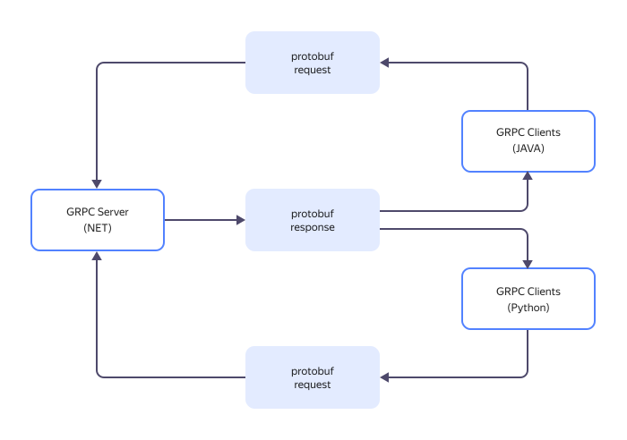
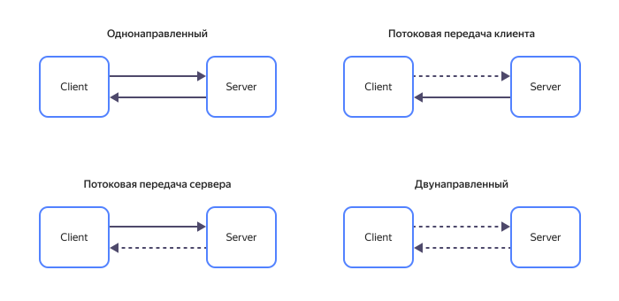
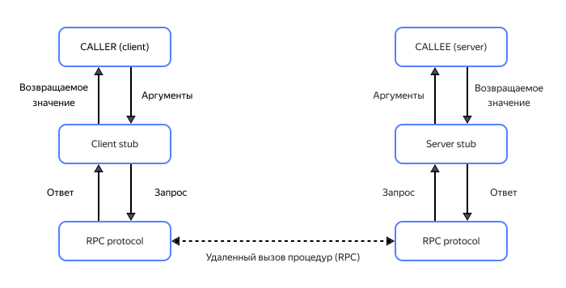

# gRPC

gRPC (Google Remote Procedure Calling) — система удаленного вызова процедур, разработанная компанией Google.

Google как расшифровка литеры `g` — лишь одно из возможных значений. В зависимости от версии gRPC разработчики перебирают разные варианты расшифровок. Например, good для версии 1.1, generous для 1.8, game для 1.25 (с примером перечня можно ознакомиться на [ресурсе](https://grpc.github.io/grpc/core/md_doc_g_stands_for.html)). Перебор вариантов не несет особой смысловой нагрузки и является одной из пасхалок, которые так любит компания.



В этой статье описаны общие принципы gRPC, независимо от конкретной версии.



## Назначение gRPC {#purpose}

Основное назначение — реализация взаимодействия между микросервисными архитектурами при разработке приложений.

При реализации решений через микросервисные механизмы, каждая логически значимая часть приложения представляет собой законченный программный продукт. Микросервисы взаимодействуют друг с другом, являясь, с точки зрения пользователя, единой системой.

Относительная независимость каждой составляющей системы позволяет разрабатывать, масштабировать и модернизировать микросервисы без изменения программного приложения в целом. Это обеспечивает преимущество модульности микросервисной архитектуре по сравнению с монолитными решениями. Кроме того, микросервисы могут быть реализованы в различных программных средах, обеспечивая гибкий подход к разработке.

При таком подходе к проектированию необходим быстрый, простой и надежный механизм обмена данными между всеми составляющими программного решения. Такой механизм взаимодействия и предлагает gRPC.

gRPC представляет собой логическое развитие протокола RPC, являясь полноценным фреймворком — программным каркасом, объединяющим различные компоненты программных решений в единое целое.

gRPC обеспечивает клиент-серверную структуру обмена данными. Открытый программный код фреймворка, несколько режимов обмена информацией между сервисами (как одно-, так и двунаправленные) и простота реализации коммуникационных взаимодействий позволяют обеспечить поддержку фреймворка в большинстве популярных систем разработки, включая NodeJS, C#, Go, Java и JavaScript.

## Основные составляющие gRPC {#main-components}

Фреймворк gRPC включает в себя три основных составляющих:

1. **Стандарт сериализации данных Protocol Buffers (Protobuf)**. Сериализация подразумевает преобразование текстовых данных в бинарные (двоичные), оптимизированные под быстрый обмен короткими сообщениями.
1. **Протокол передачи данных HTTP/2**. Протокол является дальнейшим развитием гипертекстового протокола HTTP и оптимизирован для работы с бинарными данными. Он позволяет разбивать передачи на отдельные небольшие пакеты и обеспечивает одновременную поддержку нескольких запросов, включая двунаправленную передачу информации.
1. **Язык описания интерфейса IDL**. Предназначен для упрощенного описания сервисов удаленного вызова процедур с возможностью автоматической генерации кода для выбранной программной среды.

### Protobuf {#protobuf}

Protobuf или Protocol Buffers — буферный протокол сериализации (бинарного преобразования) структурированных данных.

Преобразование данных в двоичный формат не зависит от программной платформы, что позволяет объединять микросервисы, реализованные на разных языках программирования. В отличие от структурированных данных текстовых форматов, таких как XML или JSON, бинарный формат позволяет эффективно сжимать пакеты сообщений при наличии ограничений на размер пакета (например, в каналах связи с невысокой пропускной способностью).

Удобную сериализацию данных обеспечивает компилятор, который реализует программный код для целевой платформы на основе созданных с помощью кроссплатформенного языка определения интерфейсов (IDL) текстового proto-файла.

### HTTP/2 {#http-2}

Транспортный бинарный протокол HTTP/2 является развитием протокола SPDY, разработанного корпорацией Google.

HTTP/2 не заменяет, а дополняет протокол передачи данных прикладного уровня HTTP 1.1. 

Расширение работы включает:

* способы двоичного кадрирования информации (HTTP 1.1 работает с текстовыми данными);
* обеспечение полного мультиплексирования для распараллеливания запросов;
* возможность работы в полнодуплексном режиме с одновременной отправкой запросов клиента и получением ответов от сервера;
* механизмы потоковой передачи наборов данных как со стороны клиента, так и от сервера;
* приоритизацию сообщений;
* сжатие заголовков передаваемых пакетов данных, уменьшающее трафик в сети.

Все это возможно благодаря бинарной природе протокола HTTP/2 и позволяет микросервисам эффективно обмениваться информацией как в различных симплексных (однонаправленных) режимах, так и используя полноценное дуплексное (двунаправленное) соединение с одновременными приемом и передачей сообщений.

### IDL {#idl}

IDL (Interface Definition Language) — расширение синтаксиса языка Proto Buffers.

IDL в текстовом формате описывает сервисы для удаленного вызова процедур. Синтаксис описания похож на описание классов в языке C++. Сервисы описываются в служебном файле с расширением `proto`.

На основе описаний из `proto`-файла компилятор создает исполняемый код для целевой программной платформы. Код включает описание типизированных объектов, используемых при передаче сообщений.

## Как работает gRPC {#how-it-works}

gRPC обеспечивает обмен информацией между различными источниками и приемниками (микросервисами). Протокол gRPC подразумевает наличие сервера, определяющего правила обмена данными, и возможные ответы на полученное сообщение клиентских сервисов. Клиенты после получения информационных пакетов могут использовать для работы с ними предоставляемые сервером методы.

### Архитектура gRPC {#grpc-architecture}

gRPC, как и большинство распределенных сервисов, организован по принципу клиент-серверной архитектуры. Клиенты посылают на сервер информационные запросы, сервер предоставляет ответы и методы их обработки. При этом программная реализация клиента и сервера не имеет особого значения благодаря кроссплатформенности протокола gRPC.

### Режимы работы gRPC {#workflow}

gRPC предусматривает четыре возможных режима взаимодействия сервера и клиента:

* **Однонаправленное (Unary gRPC)**, когда после каждого запроса клиент ждет ответа от сервера.
* **Потоковая передача сервера (Server streaming gRPC)**, когда в ответ на запрос клиента сервер предоставляет поток сообщений. Для завершения передачи сервер посылает сообщение о состоянии.
* **Потоковая передача клиента (Client streaming gRPC)**, когда сервер принимает поток сообщений от клиента и отвечает одним подтверждающим сообщением.
* **Двунаправленный обмен (Bidirectional streaming gRPC)** с разделением каналов передачи сервера и клиента. В этом случае потоки сообщений одновременно передаются в обоих направлениях.

## Сравнение gRPC с другими решениями {#benchmark}

### Protobuf vs XML, JSON {#protobuf-xml-json}

Преимущества | Недостатки
--- | ---
| **XML и JSON** |
XML и JSON используют структурированный формат данных, удобный для обращения к ним в программном коде. Дополнительным достоинством такого представления информации является возможность анализа этих структур человеком без предварительного декодирования. | Недостатком подобного представления является постоянная необходимость кодирования (сериализации) данных на сервере перед передачей по каналам связи и последующего их декодирования (или десериализации) на клиенте, т.к. физический уровень протоколов обмена понимает только последовательности двоичных данных. Это приводит к увеличению времени передачи, сложности кадрирования информации и повышению вероятности потери отдельных пакетов данных.
| **Protobuf** |
gRPC использует бинарный формат хранения данных Protobuf изначально работает с сериализованными данными, что позволяет эффективно обмениваться информацией по низкоскоростным и слабопроизводительным физическим линиям связи без потерь времени на дополнительные преобразования. | Некоторым недостатком при бинарном представлении данных является невозможность чтения их человеком без использования специализированных средств декодирования, в то время как, например, XML-формат является удобочитаемым в обычном текстовом редакторе.

### gRPC vs REST {#grpc-rest}

**REST (Representative State Transfer или Передача репрезентативного состояния)** — клиент-серверная сетевая архитектура взаимодействия, при которой разработчик предоставляет упрощенный доступ клиентским приложениям пользователя к ресурсам сервера. Как правило доступ осуществляется через обмен данными в формате JSON или XML.

Интерфейс прикладного программирования (Application Programming Interface, API) соответствует технологии REST (является RESTful), если подчиняется определенным требованиям:

* имеет интуитивно понятный внешний вид и предоставляет клиентам доступ к ресурсам серверного приложения;
* имеет многоуровневую архитектуру с разделением функций представления, обработки и управления данными;
* обладает возможностями кеширования (временного хранения) данных приложения;
* сохраняет информацию о состоянии клиентской части только на стороне клиента (сервер при этом информацию о состоянии клиента не хранит);
* разделяет ресурсы серверной и клиентской частей (клиент не обладает полной информацией о серверных ресурсах, ему известны только URL-адреса необходимых компонентов серверного приложения).

Для доступа пользователя к ресурсам каждого из компонентов микросервисной архитектуры используют запросы с предопределенным набором команд HTTP: `GET`, `PUT`, `POST` и `DELETE`. В качестве параметров команды передают URL адреса запрашиваемых ресурсов.

**RPC (удаленный вызов процедур, Remote Procedure Calling)** — механизм, исполняющий процедуры на стороне сервера, а не клиента. Клиент, инициировавший вызов процедуры, в результате исполнения получает готовый результат (ответ) заранее определенного формата.

Сообщения пользователя содержат параметры вызова серверных процедур. RPC интерпретирует пользовательские сообщения и передает их в качестве запросов на сервер. Серверная часть исполняет запрос и возвращает пользователю в ответном сообщении результат его выполнения.

gRPC — подвид механизма RPC, использующий все преимущества как RPC-механизмов, так и механизмов сериализации передаваемых данных.

Для создания своего сервиса на платформе gRPC разработчику нужно:

  1. Определить формат сообщений для обращения к доступным ресурсам сервиса в текстовом `proto`-файле с помощью IDL.
  1. Сгенерировать компилятором на основе `proto`-файла классы доступа для языка программирования, выбранного при разработке клиентского приложения.
  1. Добавить сгенерированные классы в клиентское приложение для использования соответствующих им методов и ресурсов, предоставляемых серверной частью.

Фреймворк gRPC предоставляет в свободном доступе компиляторы для большинства популярных языков программирования, включая NodeJS, C#, Go, Java и JavaScript.

**Характеристика** | **REST** | **gRPC**
--- | --- | ---
Формат сообщений | Структурированный (JSON, XML и другие) | Бинарный (Protobuf)
Производительность | Средняя, данные требуют дополнительной сериализации | Высокая, данные изначально сериализованы
Скорость обмена | Средняя, обмен однонаправленный (запрос-ответ) | Высокая, обмен двунаправленный или стриминговый 
Мультиязыковая поддержка | Средняя, требуются сторонние сервисы для мультиязыковых систем | Высокая, встроенная автоматическая генерация кода для популярных языковых сред
Поддержка браузерами | Работает на всех | Некоторыми браузерами не поддерживается
Сложность реализации | Низкая, сообщения человекочитаемые | Средняя, сообщения бинарные, требуют описания в шаблоне (`proto`-файла)

Недостатки gRPC во многом связаны с тем, что это относительно новая технология. Могут возникнуть проблемы с поддержкой браузерами, отсутствием необходимой документации по API и невозможностью читать сообщения без расшифровки. В то же время REST не может использовать полный набор преимуществ HTTP/2 и обеспечивать настолько же высокую производительность.

REST — хороший вариант почти в любой ситуации, когда не требуется решать специфические задачи. Архитектура не требует особой квалификации разработчика и обладает обширной базой информации по всем возможным проблемам.

gRPC — подходящий выбор для межсерверного взаимодействия, особенно, если ресурсы устройств ограничены (интернет вещей, смартфоны). Мультиязыковая поддержка также делает технологию удобной для использования в архитектуре микросервисов.

## Последовательность настройки gRPC {#how-to-setup}

Примеры описания структуры данных и работы с ними в разных программных средах представлены в [документации разработчика](https://protobuf.dev/getting-started/).

Пошагово разберем последовательность настройки протокола gRPC (по материалам [официального источника](https://protobuf.dev/getting-started/cpptutorial/)).

Для настройки взаимодействия микросервисов через gRPC:

1. Опишите структуру сериализуемых данных в proto-файле.

    Подробно описание синтаксиса `proto`-файла приведено на [странице разработчика](https://protobuf.dev/programming-guides/proto2/).
    Для каждого сообщения, являющегося агрегированным типом данных, указано описание полей. Например, для абонента это текстовые поля `name` и `email`, числовое поле `id` и агрегированная структура `PhoneType`. Каждое поле должно иметь уникальный маркер. Маркер используется для идентификации поля после бинарного преобразования компилятором.

    Каждое поле может иметь дополнительный модификатор:

    * `required` — поле, требующее обязательного заполнения;
    * `repeated` — повторяющееся поле, актуально для режимов потоковой передачи данных;
    * `optional` — необязательное поле.

1. После создания файла с необходимой структурой скомпилируйте его для требуемого языка программирования.

    Необходимые версии компиляторов [представлены](https://protobuf.dev/downloads/) разработчиком фреймворка gRPC.
    
    Компилятор сгенерирует программный код для выбранной среды программирования, включая описанные в `proto`-файле классы-сообщения и простейшие методы доступа к данным, сериализации и десериализации.

    Допускается после компиляции добавлять новые поля в созданную структуру данных без потери совместимости. При парсинге старых записей новые поля игнорируются.

После компиляции все классы и методы gRPC будут доступны в выбранной для работы программной среде наравне с прочими разработанными вами решениями. Использование классов и вызовы методов зависят от конкретного программного окружения. gRPC преобразует вызовы методов в соответствующие бинарные сообщения, передает их на серверную часть, принимает сообщения с результатами вызовов и десериализует полученные данные для дальнейшего использование в разработанном микросервисе.

## Интеграция gRPC с другими технологиями {#integration}

gRPC можно использовать для управления контейнерами и системами хранения данных.

### gRPC и контейнеризация {#containerization}

Контейнер — единый исполняемый файл, включающий в себя как исполняемую программу, так и среду для ее исполнения. Для внешнего наблюдателя контейнер является аналогом «черного ящика», структура которого недоступна, а все взаимодействие ведется через интерфейсы связи.

Последовательность настройки взаимодействия внутри мультиконтейнерной структуры:

1. Создайте или разверните из образа новый контейнер.
1. Включите в структуру контейнера необходимые программные инструменты для работы с gRPC (компиляторы для выбранной программной среды).
1. Откройте порт для обмена gRPC сообщениями (способы открытия портов зависят от программного окружения контейнера).
1. Создайте внутри контейнера proto-файл необходимой структуры, скомпилируйте, включите полученный программный код в код рабочих сервисов.
1. Повторите пункты 1 – 4 для всех контейнеров системы.
1. Запустите контейнеры и проверьте обмен информацией в системе.

### gRPC и системы хранения данных {#data-store}

Системы хранения данных (СХД) — распределенные по существующим физическим серверам хранилища информации. Эти хранилища могут быть как реальными, так и виртуальными программно-аппаратными комплексами. Основа любого хранилища — заранее спроектированная архитектура, позволяющая с минимальными усилиями масштабировать систему при необходимости увеличения объемов хранимой информации.

Последовательность создания СХД с использованием фреймворка gRPC:

1. Разработайте архитектуру СХД, распределите существующие виртуальные и реальные ресурсы на серверные и клиентские мощности.
1. Создайте серверную часть системы на любом языке программирования, который поддерживает gRPC.
1. Настройте клиентские ресурсы. Создайте `proto`-файлы необходимой структуры, скомпилируйте и используйте получившийся программный код для доступа к хранящейся на серверах информации.
1. Запустите СХД и проверьте корректность обработки запросов клиентов.

## Пример использования {#example}

С помощью gRPC вы можете обращаться к большинству ресурсов {{ yandex-cloud }}. Например, создание бакета в [{{ objstorage-full-name }}](../storage/) можно инициировать вызовом метода `BucketService/Create`.

Подробнее о методе см. в [документации](../storage/api-ref/grpc/Bucket/create.md).

## Применение и перспективы развития gRPC {#perspectives}

Благодаря перечисленным выше особенностям, фреймворк gRPC наиболее перспективно использовать при создании работающих без вмешательства пользователей сервисов:

* **Решений в области интернета вещей (IoT)**. Подобные системы требуют низкого энергопотребления, которое обеспечивает продолжительный срок службы источников питания элементов системы (датчиков и исполнительных механизмов). Также для IoT-систем характерна низкая пропускная способность каналов связи, так как передающиеся в системе данные приборов и средств автоматики занимают небольшой объем памяти (килобайты).

* **Систем промышленной автоматизации**. Для таких систем требуется потоковая передача больших объемов информации, поступающих с датчиков. На основе получаемой информации автоматические алгоритмы контролируют текущее состояние машин и механизмов, выдают рекомендации обслуживающему персоналу по профилактическим и предупредительным осмотрам и ремонтам. Благодаря наличию соответствующих стриминговых режимов работы, gRPC-фреймворк позволяет передавать и обрабатывать данные в реальном времени, не дожидаясь подтверждения от получателя.

* **Мультиязыковых систем**. Для решений, построенных на взаимодействии микросервисов, gRPC является идеальной средой обмена информацией. Благодаря особенностям взаимодействия микросервисов в gRPC, разработчик не ограничен использованием одной программной среды разработки и может эффективно использовать преимущества различных решений.

* **Распределенных или серверных архитектур**. В системах, построенных на взаимодействии микросервисов различных производителей, решающую роль играет низкая задержка при передаче сообщений. Легкие решения на основе gRPC позволяют обмениваться информацией внутри подобных систем с максимальной эффективностью.

Кроме того, микросервисная архитектура, основанная на использовании единых правил обмена сообщениями, наиболее актуальна при реализации распределенных облачных решений.

Инфраструктурой для таких решений является облачная платформа {{ yandex-cloud }}. Ознакомьтесь с [возможностями](../overview/) платформы и [основными принципами](../api-design-guide/concepts/general.md) работы API.

Чтобы начать работу с сервисами, войдите в свой аккаунт в {{ yandex-cloud }} или [зарегистрируйтесь]({{ link-console-billing }}/create-account).
