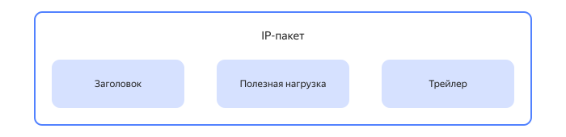
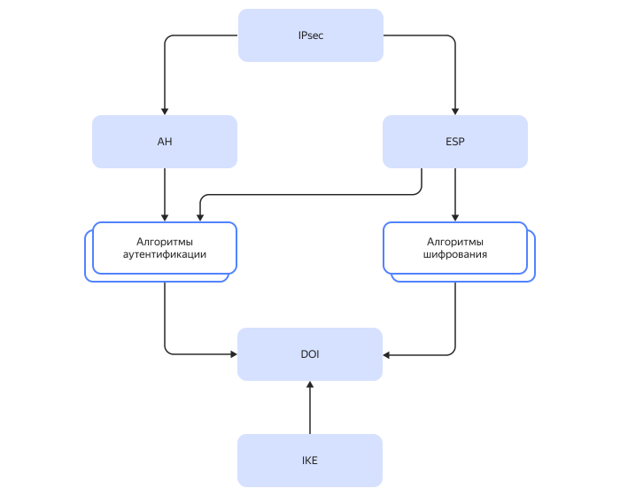
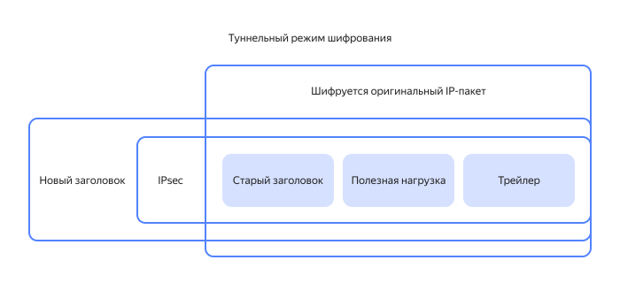
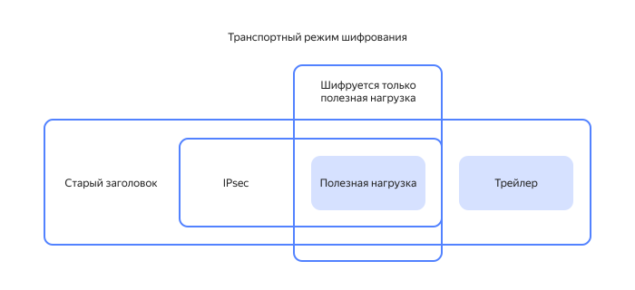

# Обзор IPsec: принципы и применение в сетевой безопасности

_IPsec (Internet Protocol Security)_ — это набор протоколов, которые взаимодействуют друг с другом для обеспечения безопасной передачи IP-пакетов по незащищенным сетям.

_IP-пакет_ — это блок данных, который передается по компьютерной сети. Он имеет определенную структуру и состоит из трех основных компонентов:

1. Заголовок — содержит информацию об адресе отправителя и получателя и типе данных.
1. Полезная нагрузка — информация, которую хочет передать пользователь.
1. Трейлер — дополнительная информация.

Протоколы IPsec используют, чтобы передаваемые данные сохранили:

* **Целостность** — защита данных от потери, изменения, а также дублирования при передаче.
  
* **Аутентичность** — данные будут переданы от надежного источника.
  
* **Конфиденциальность** — зашифрованные данные защищены от несанкционированного просмотра.

## Важность IPsec {#ipsec-importance}

Сетевые соединения по умолчанию не зашифрованы. Например, протоколы сетевого взаимодействия TCP/IP предназначены только для подключения и доставки. При этом передаваемые данные открыты и доступны для просмотра третьими лицами. Именно поэтому для обеспечения безопасной передачи данных необходимо использовать протоколы безопасности IPsec. Они создают своеобразную оболочку вокруг данных, которые отправляются по незащищенным сетям, тем самым обеспечивая безопасность передачи.

## Архитектура IPsec {#ipsec-architecture}

Рассмотрим архитектуру IPsec, чтобы понимать, каким образом работает этот инструмент обеспечения безопасности данных.

### Первый уровень {#first-level}

Здесь расположены [AH](#ipsec-ah) и [ESP](#ipsec-esp) протоколы, которые защищают данные на всех этапах процесса передачи. Именно эти протоколы реализуют основные функции IPsec — аутентификацию и шифрование данных и являются ключевыми элементами IPsec.

#### Протокол AH (Authentifitication Header) {#ipsec-ah}

Протокол AH обеспечивает:

* Аутентификацию — пользователь может убедиться, что действительно взаимодействует с теми, кого он ожидает.
* Целостность передаваемых данных — пользователь может обнаружить изменение данных в процессе передачи.
* Защиту данных от воспроизведения — данные не могут быть воспроизведены в сети злоумышленниками.

Протокол AH создает очень надежную защиту для содержимого IP-пакета, поскольку следит за тем, чтобы в него не было внесено каких-либо изменений. Однако, это же делает его несовместимым с сетевым режимом NAT (Network Address Translation). Такое ограничение связано с тем, что NAT преобразует IP-адреса при передаче IP-пакетов.

Также в протоколе AH не предусмотрены средства защиты конфиденциальности переданных данных — злоумышленники не смогут изменить данные, но при этом могут их прочитать.

#### Протокол ESP (Encapsulating Security Payload) {#ipsec-esp}

Протокол ESP, так же как и AH, обеспечивает аутентификацию и целостность IP-пакета. Однако, помимо это он еще применяется для сохранения конфиденциальности передаваемых данных с помощью шифрования. При этом для ESP необязательно задействование всех этих функций одновременно. Однако, алгоритмы обеспечения конфиденциальности данных необходимо использовать в любом случае.

Обычно протоколы ESP и AH применяют независимо, хотя их совместное применение также возможно.

### Второй уровень {#second-level}

Функции IPsec реализуются с помощью конкретных алгоритмов, расположенных на втором уровне архитектуры.
 
Аутентификация в IPsec реализуется при помощи специальных алгоритмов в протоколах AH и ESP. Так, например, стандартные для IPsec алгоритмы аутентификации [HMAC](https://ru.wikipedia.org/wiki/HMAC) используют общий секретный ключ для участников соединения. Алгоритмы HMAC являются обязательными для протокола AH и факультативными — для ESP. Подробнее о процессе аутентификации читайте в разделе [Аутентификация в IPsec](#ipsec-authentication).

Протокол ESP также поддерживает разные алгоритмы шифрования. Среди них — DES, 3 DES и AES. Это помогает еще больше защитить IP-пакет — чтобы получить доступ к информации, необходимо не только расшифровать данные, но и понять, какие именно алгоритмы применялись для шифрования. Подробнее о шифровании читайте в разделе [Шифрование в IPsec](#ipsec-encryption).

### Третий уровень {#third-level}

Здесь расположен DOI — домен интерпретации. Это элемент, который хранит информацию об алгоритмах и протоколах, которые были применены. Применение DOI обусловлено тем, что протоколы AH и ESP могут поддерживать разные алгоритмы.

### Четвертый уровень — Протокол IKE (Internet Key Exchange) {#ipsec-ike}

Протокол IKE — своего рода фундамент IPsec. Он применяется для создания политики безопасности соединения, благодаря этому отправитель и получатель могут согласовать, с помощью каких алгоритмов будет выполнена аутентификация и шифрование. Также этот протокол обеспечивает генерацию и распределение ключей между участниками защищенного соединения. Подробнее о работе протокола IKE читайте в разделе [Управление ключами в IPsec](#ipsec-key-management).

## Функции IPsec {#ipsec-functions}

Рассмотрим подробнее функции IPsec — [аутентификацию](#ipsec-authentication), [шифрование](#ipsec-encryption) и [управление ключами](#ipsec-key-management), а также способы их реализации.

### Аутентификация в IPsec {#ipsec-authentication}

Аутентификация — это необходимый элемент обеспечения защиты передаваемого IP-паекта.

Она нужна, чтобы пользователь был уверен в подлинности:
*	содержания IP-пакета — исходные данные не изменялись, их целостность не нарушена, они недоступны для повторной передачи.
*	отправителя данных — исходные данные были созданы именно тем, кем заявлено.

Аутентификация выполняется при помощи ключей, [симметричных или асимметричных](#symmetric-and-asymmetric-encryption). Чтобы обеспечить безопасность данных, эти ключи необходимо периодически обновлять у обеих сторон одновременно, это называется _распределением ключей_.

Важно, что IPsec не определяет жестко, каким именно методом должна быть выполнена аутентификация. Участники соединения сами выбирают и согласовывают наиболее удобный для себя вариант. Аутентификация с помощью цифрового сертификата и предварительным обменом ключами — два наиболее распространенных способа. Рассмотрим их подробнее.

#### Предварительный обмен ключами (Pre-Shared Key, PSK) {#psk}

_Предварительный обмен ключами_ — это метод аутентификации, который основан на предварительном распределении ключей между участниками обмена данными. После установления общего ключа, они могут использовать его как для шифрования, так и для расшифровки данных. 

Такой способ аутентификации предполагает использование алгоритма [Диффи-Хеллмана](https://ru.wikipedia.org/wiki/Протокол_Диффи_—_Хеллмана). Он реализует систему открытого распределения ключей, при котором изначально ключа нет ни у отправителя, ни у получателя. Общий закрытый ключ они вычисляют с помощью секретного парамера и обмена сообщениями.

**Плюсы предварительного обмена ключами**:

* Простота — предварительный обмен ключами легко настроить, кроме того, он может использоваться в различных приложениях.
* Безопасность — данные надежно защищены, поскольку ключ знают только отправитель и получатель.
* Быстрота — предварительный обмен ключами быстро шифрует и дешифрует данные, что делает его использование удобным при большом количестве участников связи, а также при необходимости частой замены ключей.

**Минусы предварительного обмена ключами**:

* Ограничения — предварительный обмен ключами предполагает лимиты на длину ключа и количество участников, которые могут использовать его.
* Уязвимость — может быть скомпрометирован, если ключ становится известен третьим лицам.
* Риск утечки — в случае компрометации ключа, под угрозой расшифровывания окажутся все данные, для которых применялся этот ключ.

#### Цифровой сертификат {#digital-certificate}

_Цифровой сертификат_ – это специальный электронный документ, который центр сертификации или удостоверяющий центр выдает пользователю. Он содержит информацию о владельце сертификата, которая нужна для проверки подлинности его личности — открытый ключ. Когда отправитель отправляет данные через IPSec, он должен предоставить свой цифровой сертификат, который будет проверен получателем. 

Последовательность выполнения аутентификации с помощью цифрового сертификата:

1. Отправитель создает цифровой сертификат и подписывает его своим закрытым ключом.
1. Отправитель пересылает IP-пакет вместе со своим цифровым сертификатом через IPSec.
1. Получатель проверяет подлинность цифрового сертификата, а также соответствие открытого ключа из сертификата открытому ключу, которым был подписан IP-пакет.
1. Если проверка прошла успешно, получатель принимает данные и обрабатывает их.

**Преимущества цифрового сертификата**:

* Безопасность — цифровые сертификаты защищены криптографией, благодаря чему они практически неуязвимыми для фальсификации или взлома.
* Удобство использования — при использовании цифровых сертификатов для аутентификации в протоколе безопасности IPsec пользователь может легко и быстро получать доступ к защищенным данным. 

**Недостатки цифрового сертификата**:

* Стоимость — иногда использование цифровых сертификатов требует значительных денежных затрат, что может стать существенным недостатком для малых и средних предприятий.
* Сложность настройки — настройка цифровых сертификатов может потребовать определенных знаний и навыков.

#### Защита от атак MITM {#mitm}

Защита от атак типа MITM (Man-in-the-Middle — человек посередине) является одной из главных задач обеспечения безопасности данных.  При такой атаке злоумышленник встает между участниками связи. Благодаря этому он может перехватить закрытый ключ и получить доступ к передаваемым IP-пакетам. При этом стороны часто даже не подозревают о том, что общаются не напрямую, а их данные перехватываются и изменяются злоумышленниками. 

Аутентификация с помощью цифровых сертификатов позволяет избежать MITM-атак, поскольку обмен закрытыми ключами недоступен третьим лицам.

Распределение ключей методом Диффи-Хеллмана в его оригинальном виде может быть уязвимо для MITM-атак. Поэтому метод Диффи-Хеллмана обычно применяют совместно с дополнительной односторонней или двусторонней аутентификацией. Это помогает обеспечить безопасность передаваемых данных.

В итоге методы аутентификации в IPsec могут быть настроены таким образом, что атаки типа MITM не будут представлять опасности для IP-пакета.

### Шифрование в IPsec {#ipsec-encryption}

Шифрование — одна из важнейших функций IPsec, защищает IP-пакеты от доступа третьих лиц. Оно обеспечивает передаваемым данным:

* **Конфиденциальность** 
  IPsec использует протокол [ESP](#ipsec-esp), чтобы обеспечить конфиденциальность и целостность передаваемых данных. Он инкапсулирует передаваемый IP-пакет с помощью различных алгоритмов шифрования, выбор которых зависит от требований сторон к безопасности.

* **Целостность данных**
 IPsec использует протокол [AH](#ipsec-ah), чтобы обеспечить целостность передаваемых данных. Проверка целостности IP-пакета может быть проведена различными алгоритмами аутентификации, выбор которых зависит от требований сторон к безопасности.

#### Симметричное и асимметричное шифрование в IPsec {#symmetric-and-asymmetric-encryption}

_Симметричное шифрование_ — это метод шифрования данных, при котором участники связи используют один и тот же секретный ключ. Отправитель применяет этот ключ для шифрования IP-пакета, а получатель — для его расшифровки. К плюсам этого способа шифрования можно отнести скорость, а также простоту реализации. К минусам — критичность к надежности канала передачи ключа, а также сложность управления ключами в большой сети.

_Асимметричное шифрование_ — это метод шифрования данных, при котором участники связи используют разные ключи — открытый и закрытый. Отправитель использует открытый ключ для шифрования IP-пакета. Получатель использует закрытый ключ для его расшифровки. Такой тип шифрования более безопасный, так как злоумышленник не сможет расшифровать данные без закрытого ключа. Однако, в этом случае реализация шифрования сложнее, а скорость — ниже, чем у симметричного шифрования.

В IPsec используются оба этих типа шифрования, но обычно для разных целей. Симметричное шифрование обычно применяется для защиты IP пакетов между устройствами, такими как маршрутизаторы и коммутаторы, а асимметричное — для защиты пакетов, передаваемых в интернете.

#### Транспортный и туннельный режимы шифрования {#transport-and-tunnel-encryption}

Протоколы безопасности IPSec могут работать в одном из следующих режимов:

* **Туннельный режим** 
Туннельный режим IPSec используется для создания безопасного соединения WAN и VPN, использующих интернет в качестве среды подключения. В этом режиме протоколы IPSec шифруют заголовок и полезную нагрузку IP-пакеты. Таким образом данные, содержащиеся в этом пакете, инкапсулируются внутри дополнительного пакета, который и будет отправлен.

Как происходит обмен данными, когда туннельный режим определен как режим IPSec:

1. Данные передаются с использованием незащищенного IP-пакета с компьютера в частной сети.
1. Когда пакет поступает на маршрутизатор, он инкапсулирует его, используя протоколы безопасности IPSec.
1. Маршрутизатор пересылает пакет на другой конец соединения.
1. Маршрутизатор, принимающий IP-пакет проверяет его целостность.
1. Пакет расшифровывается.
1. Данные пакета отправляются на компьютер получателя в частной сети.

Таким образом, туннельный режим применяется, когда две частные сети передают данные через публичную незащищенную сеть. Например, при передаче IP-пакета:

* От сервера к серверу;
* От сервера к шлюзу;
* От шлюза к шлюзу.
   
* **Транспортный режим**
Основное отличие транспортного режима от туннельного в том, что в транспортном режиме работы шифруется не весь IP-пакет, а только полезная нагрузка. 

Транспортный режим шифрования используется когда между двумя устройствами уже существует IP-связь, но она небезопасна. Например, при передаче IP-пакета от сервера к клиенту.

Часто сети, не способные поддерживать туннельный режим, успешно работают в транспортном режиме.

### Управление ключами в IPsec {#ipsec-key-management}

Управление ключами — функция IPsec, без которой реализация аутентификации и шифрования не имела бы смысла. Рассмотрим ее подробнее.

#### Протокол установки безопасного соединения {#ike}

Протокол установки безопасного соединения IKE (Internet Key Exchange)применяется для создания ассоциации безопасности IPsec — IPsec SA (Security Association). IPsec SA необходим участникам защищенного соединения для согласования работы. Таким образом, благодаря этому протоколу пользователи могут договориться о том, какие алгоритмы шифрования и аутентификации будут использовать. 

Существует две версии протокола IKE — IKEv1 и IKEv2, рассмотрим их подробнее.

##### IKEv1 {#ike1}

IKEv1 — это один из первых стандартов для обмена ключами, разработанный в 1998 году. Несмотря на то, что он практически не изменялся с того времени, его активно используют до сих пор.

IKEv1 определяет две фазы согласования для создания IPSec SA.

###### Фаза 1 {#phase-1} 

На этом этапе участники обмениваются предложениями о том, какие алгоритмы шифрования и аутентификации будут использовать. Создается защищенный туннель для продолжения согласования в фазе 2. Этот процесс может проходить в двух режимах:

* **Основной режим**
Основной режим более безопасный и гибкий, но медленнее завершает согласование, поскольку в этом режиме отправитель и получатель обмениваются шестью сообщениями:
1. Инициатор предлагает получателю один или несколько вариантов IKE SA, включающих следующие элементы:
    * Алгоритм шифрования — DES, 3DES или AES.
    * Метод аутентификации — предварительное распределение ключей или цифровые сертификаты.
    * Группа Диффи-Хеллмана.
    * Срок службы — время, необходимое туннелю IKE для выполнения первой фазы. Значение по умолчанию равно 24 часам.
1. Получатель отправляет выбранный вариант SA инициатору.
1. Инициатор выполняет обмен Диффи-Хеллмана.
1. Получатель отправляет инициатору свой ключ. На этом этапе создается безопасное соединение, которое обеспечивают алгоритмы, принятые ранее.
1. Инициатор начинает аутентификацию, отправляя свой IP-адрес.
1. Получатель передает соответствующий пакет для аутентификации сеанса.

* **Агрессивный режим**
Агрессивный режим не обеспечивает такой же уровень безопасности и гибкости, как основной режим, из-за тог, что стороны обмениваются информацией до создания защищенного канала. Но при этом он быстрее, потому что инициатор и получатель обмениваются всего тремя сообщениями:
1. Инициатор предлагает варианты IKE SA и выполняет обмен Диффи-Хеллмана и пакет идентификации.
1. Получатель отправляет инициатору выбранный вариант SA,  свой ключ и пакет для аутентификации.
1. Инициатор подтверждает обмен.

###### Фаза 2 {#phase-2}

На этом этапе используется защищенный канал IKE SA, созданный в фазе 1. Целью фазы 2 являются:
* Согласование параметров IPsec SA для создания защищенного соединения.
* Установление IPsec SA.
* Периодическое обновление IPsec SA для большей безопасности.
* (Необязательно) Дополнительный обмен ключами Диффи-Хеллмана.

Вторая фаза может быть реализована только в быстром режиме.

После завершения этой фазы, участники соединения могут передавать IP-пакеты, которые шифруются и расшифровываются с помощью алгоритмов, выбранных для IPsec SA.

##### IKEv2 {#ike2}

IKEv2 был представлен значительно позже, в 2010 году. IKEv2 не содержит 1 и 2 фазу. Согласование IPsec SA происходит за 4 обмена сообщениями:

1-2: Согласование криптографических алгоритмов, и выполнение обмена Диффи-Хеллмана.
3-4: Проверка подлинности предыдущих сообщений, обмен индентификаторами и сертификатами. Устанавливается двунаправленный IKE SA и однонаправленный IPsec SA.

##### Сравнение IKEv1 и IKEv2 {#ike1-ike2}

Как мы уже увидели, обмены ключами IKEv1 и IKEv2 совершенно различны и несовместимы друг с другом. IKEv2 содержит улучшения, которые делают его более отзывчивым и гибким. Так, например, IKEv2 автоматически переподключается после кратковременной потери сигнала и, благодаря протоколу MOBIKE, может легко обрабатывать изменения в сети.

Это и другие основные отличия IKEv2 от IKEv1 представлены в таблице.

#|
|| **Параметр** | **IKEv1** | **IKEv2** ||
|| Пропускная способность |

Больше |

Меньше ||

|| EAP — протокол расширяемой аутентификации |

Не поддерживается |

Поддерживается ||

|| MOBIKE — протокол мобильности и многодомности |

Не поддерживается |

Поддерживается ||

|| NAT-T —обход NAT |

Не поддерживается |

Поддерживается ||

|| Выбор между агрессивным и основным режимом |

Поддерживается |

Не поддерживается ||

|| XAUTH — расширенная аутентификация |

Поддерживается |

Не поддерживается ||
|#

IKEv2 значительно улучшен по сравнению с предшественником. Он имеет расширенный набор параметров и более высокий уровень безопасности. При этом IKEv2 использует более сложный алгоритм шифрования, что замедляет скорость установления соединения и увеличивает нагрузку на процессор. Некоторые устройства могут не поддерживать IKEv2, что может привести к проблемам с подключением.

Оба протокола имеют плюсы и минусы, поэтому при выборе важно учитывать специфику соединения. Если вам нужно установить безопасное соединение быстро и без проблем, то IKEv2 может быть лучшим решением. Однако, если вам нужна поддержка более старых устройств или вы не хотите использовать сложный алгоритм, лучше подойдет IKEv1.

#### Управление жизненным циклом ключей {#key-lifecycle-management}

Протокол IKE применяют для контроля использования ключей. Это помогает избежать ошибок, связанных с их использованием, и тем самым обеспечить безопасность передаваемых данных. 

Основные этапы жизненного цикла ключей:

1.	Генерация — создание новых ключей.
1.	Распределение — обмен ключами между участниками соединения.
1.	Использование — ключи применяют для шифрования IP-пакета отправителем, аутентификации, проверки целостности, а также расшифровки — получателем.
1.	Списание — после использования ключи удаляются из системы.
1.	Повторное использование — необязательный этап, используется при потере или повреждении ключей.

## Преимущества IPsec {#ipsec-advantages}

Использование протоколов безопасности IPsec имеет ряд преимуществ:

* **Сетевой уровень работы**
Большинство других протоколов безопасности функционируют на прикладном уровне сетевого взаимодействия. Основным преимуществом IPSec является то, что он работает на сетевом, а не прикладном уровне. По сути, это означает, что данные шифруются на компьютере-отправителе. Все промежуточные системы, такие как маршрутизаторы, просто пересылают зашифрованную часть пакетов конечному адресату, не расшифровывая данные. Зашифрованные данные расшифровываются только тогда, когда они достигают адресата.

* **Безопасность**
Протоколы AH и ESP обеспечивают высокий уровень безопасности и приватности. И в целом, IPsec — очень гибкая система, которая поддерживает разные алгоритмы шифрования. Это своего рода еще один уровень защиты — чтобы получить доступ к зашифрованным данным, злоумышленникам нужно не только расшифровать данные, но и понять, какими алгоритмы применялись для их шифрования.

* **Универсальность**
Протоколы безопасности IPsec используются для защиты любых типов данных, включая электронную почту, видеоконференции, VoIP и многое другое. IPsec поддерживается многими современными операционными системами, а также рядом роутеров. Также IPsec считается одним из лучших решений для применения в сетях VPN.

## Недостатки и ограничения IPsec {#ipsec-disadvantages}

* **Сложность настройки и управления**
IPSec сложнее, чем альтернативные протоколы безопасности, и его сложнее настроить.

* **Возможность проблем совместимости между различными реализациями IPsec**
Если разработчики ПО не придерживаются стандартов IPSec, это может привести к проблемам с совместимостью. Аналогично, когда вы уже используете протоколы IPSec, подключение к другой сети может быть проблемным из-за ограничений в брандмауэрах.

* **Влияние на производительность сети**
К сожалению, IPSec хорошо известен высокой загрузкой процессора. Для шифрования и дешифрования всех данных, проходящих через сервер, требуется довольно много вычислительной мощности. При небольшом размере пакета данных производительность сети снижается из-за больших накладных расходов, используемых IPSec. Вот почему рекомендуется не использовать IPSec для передачи данных небольшого размера.

## Применение IPsec в различных сферах {#ipsec-application}

IPsec — очень гибкий инструмент для решения задач безопасности. Как мы видели ранее, IPsec поддерживает разные режимы шифрования и аутентификации, что позволяет настраивать его применения в разных сферах. 

### Защита корпоративных сетей и соединений между офисами {#protection-corporate-networks}

IPsec — это мощный инструмент для защиты корпоративных сетей и соединений между офисами. Он позволяет создавать защищенные соединения между компьютерами и серверами, а также защищать соединения между офисами. Если вы хотите защитить свои корпоративные сети и соединения между офисами, IPsec может быть отличным выбором.

Одним из преимуществ IPsec является то, что он может быть настроен на автоматическое подключение к защищенным соединениям. Это означает, что пользователи не должны вручную настраивать свои компьютеры для подключения к защищенным соединениям.

IPsec также может быть использован для защиты соединений между офисами. Например, если два офиса находятся в разных городах, IPsec может быть использован для создания защищенного соединения между ними. Это позволит передавать данные между офисами без риска их перехвата или изменения.

### Обеспечение безопасности в облачных вычислениях и виртуализации {#protection-cloud-computing}

В современном мире облачные вычисления и виртуализация становятся все более популярными. Они позволяют компаниям и частным лицам получать доступ к вычислительным ресурсам и приложениям из любой точки мира, без необходимости иметь собственные серверы и оборудование. Однако, как и в любой другой технологии, в облачных вычислениях и виртуализации существуют риски безопасности.

IPsec может быть использован для защиты трафика между облачными сервисами и клиентами, а также для защиты трафика внутри виртуальных машин.

Для обеспечения безопасности в облачных вычислениях и виртуализации с IPsec необходимо выполнить следующие шаги:

1. Настройка IPsec на облачных сервисах. Это включает в себя настройку правил безопасности для трафика между облачными сервисами и клиентами, а также настройку правил безопасности для трафика внутри виртуальных машин.

1. Настройка IPsec на клиентах. Это включает в себя настройку правил безопасности для трафика между клиентами и облачными сервисами, а также настройку правил безопасности для трафика внутри виртуальных машин.

1. Проверка работы IPsec. После настройки необходимо проверить работу IPsec, чтобы убедиться, что он работает правильно и обеспечивает безопасность данных.

1. Обновление IPsec. IPsec постоянно развивается и обновляется, поэтому необходимо следить за обновлениями и обновлять IPsec на всех устройствах, чтобы обеспечить безопасность данных.

### Защита мобильных и беспроводных сетей {#protection-mobile-and-wireless-networks}

_Мобильные сети_ — это сети, в которых устройства могут перемещаться и подключаться к различным точкам доступа. 

_Беспроводные сети_ — это сети, использующие радиочастоты для передачи данных. 

Мобильные и беспроводные сети имеют свои особенности, которые делают их уязвимыми для атак. Например, мобильные устройства могут быть легко скомпрометированы, если они подключены к ненадежной точке доступа. Беспроводные сети могут быть скомпрометированы путем перехвата трафика или использования специальных атак на уязвимости в протоколе безопасности. Протоколы IPsec помогают избежать уязвимостей такого типа.

Для защиты мобильных и беспроводных сетей протоколы и алгоритмы IPsec могут использоваться в сочетании с другими технологиями, например, WEP (Wired Equivalent Privacy) или WPA (Wi-Fi Protected Access). Эти технологии могут использоваться для шифрования трафика и обеспечения безопасности беспроводных сетей, но они не обеспечивают защиту от атак на протокол безопасности. IPsec может помочь улучшить безопасность мобильных и беспроводных сетей, обеспечивая защиту от различных типов атак, включая атаки на протокол безопасности и атаки на целостность данных.

## Тенденции и будущее IPsec {#trends-and-future-IPsec}

### Развитие новых версий протокола IPsec и улучшение его безопасности {#new-version-ipsec}

С каждым годом он становится все более популярным благодаря своей эффективности и надежности. Однако, с ростом популярности IPsec, появляются новые угрозы и атаки на этот протокол.

Одной из главных угроз безопасности передаваемых данных является пассивный мониторинг трафика и использование криптоаналитических методов для определения ключей шифрования. Для защиты от этих угроз разрабатываются новые версии протокола IPsec.

В первой версии IPsec для шифрования применялся алгоритм DES (Data Encryption Standard). Это достаточно надежный алгоритм, имеющий, однако, ограничение на длину ключа. Для решения этой проблемы была разработана новая версия протокола — IPsec v2. В нем был использован более безопасный алгоритм шифрования 3DES (Triple DES), который позволяет использовать длинные ключи, обеспечивая более надежную защиту данных. При этом 3DES был уязвим для атак на основе подобранного открытого текста, изменяющие значение ключа шифрования. Для защиты от таких атак были разработаны более сложные алгоритмы шифрования — AES (Advanced Encryption Standard) и Blowfish. Эти алгоритмы применяются в новых версиях протокола IPsec — IPsec v3 и v4 соответственно.

### Интеграция IPsec с другими протоколами и технологиями, такими как IPv6 и SDN {#integration-ipsec}

В последнее время IPsec интегрируется с различными новыми технологиями и протоколами, и это связано с тем фактом, что IPsec не является единственным протоколом для обеспечения безопасности передачи данных. Одним из примеров является IPv6, новый протокол, который обеспечивает более высокую пропускную способность и большую масштабируемость по сравнению с IPsec. Интеграция обоих протоколов позволяет улучшить безопасность передачи данных между устройствами, использующими оба протокола.

Другим примером интеграции IPsec являются протоколы SDN. SDN — это технология, которая позволяет программировать сети как программные объекты. IPsec может быть интегрирован с SDN, чтобы обеспечить более гибкую и надежную защиту сети.

Таким образом, интеграция IPsec с новыми протоколами, такими, IPv6, SDN или другими протокольными технологиями обеспечивает более гибкое управление безопасностью, обеспечивая более надежную и эффективную защиту передаваемых данных.

### Расширение применения IPsec в Интернете вещей (IoT) и мобильных сетях пятого поколения (5G) {#ipsec-in-iot-and-5g}

В современном мире Интернет вещей (IoT) и мобильных сетей пятого поколения (5G) становятся все более популярными и важными для различных отраслей промышленности и бизнеса. Однако, с ростом числа устройств, подключенных к интернету, и увеличением объема данных, передаваемых через сети, возникает необходимость в обеспечении безопасности данных. Одним из наиболее эффективных способов защиты данных является использование протокола IPsec.

Одним из ключевых преимуществ использования протокола IPsec в сетях IoT и 5G является обеспечение безопасности данных на сетевом уровне. Это означает, что безопасность данных может быть гарантирована на уровне всей сети, а не на уровне отдельных приложений. IPsec также может быть использован для защиты данных между устройствами IoT и 5G сетей от атак типа MITM.

### IPsec в {{ yandex-cloud}} {#ipsec-in-yandex}

IPsec — один из самых надежных способов защиты данных в сети. {{ yandex-cloud}} предлагает своим клиентам возможность использовать IPsec в своих облачных сервисах. Это позволяет защитить данные, передаваемые через облачные сервисы Yandex, от несанкционированного доступа. Просто [настройте безопасную сетевую конфигурацию c IPSec](../getting-started/individuals/configure-network.md), чтобы защитить свои данные в {{ yandex-cloud}}.

Кроме того, вы можете [создать защищенное соединение](../tutorials/routing/ipsec/ipsec-vpn.md) между облачной инфраструктурой и условным корпоративным дата-центром или [организовать сетевую связность](../tutorials/routing/ipsec/) между облачными и удаленными ресурсами с помощью IPsec.