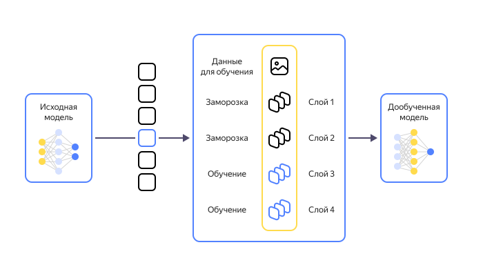

# Модели машинного обучения

_Модели машинного обучения_ — это методы обучения компьютера, позволяющие выявлять какие-либо закономерности и генерировать прогнозы или контент. Основная часть процесса обучения происходит за счет использования вычислительных мощностей и без участия программиста, поэтому серьезно помогает сэкономить время.

Применение машинному обучению сегодня найдется в любом крупном бизнесе. Это может быть подбор рекомендаций для пользователей, анализ предпочтений клиентов для таргетинговой рекламы, прогнозирование доходов и расходов и многое другое. Для выполнения всех этих задач вручную понадобилось бы множество людей и времени.

## Основные типы моделей машинного обучения {#types}

Модели машинного обучения строятся на основе математических методов, решающих определенные типы задач. Можно выделить три основных типа задач:

1. [Регрессия](#regression).
1. [Классификация](#classification).
1. [Кластеризация](#clustering).

### Регрессия {#regression}

Такие модели показывают связь множества переменных — каким будет результат Х, если заданы переменные A, B, C, D и так далее. Например, нам нужно определить стоимость дома. Человек в таком случае будет просто изучать цены других домов, но компьютер можно научить сопоставлять год постройки, площадь, популярность района, цены конкурентов и другие параметры.

Регрессионные модели популярны для прогноза стоимости ценных бумаг, медицинских диагнозов, пробок на дороге, финансовых показателей организаций и примерных цен. Регрессионные алгоритмы встроены даже в Excel.

Регрессию можно описать как линию между разными точками, которая отражает их зависимость. Если линия прямая, то это прямолинейная регрессия, если кривая — полиномиальная. Существуют и другие виды, но они сегодня практически не используются.

### Классификация {#classification}

Классификационные модели похожи на регрессионные, однако прогноз они дают в виде деления по каким-либо заранее заданным признакам. Как в развивающих играх для детей, в которых нужно поместить разные геометрические фигуры в подходящие отверстия.

Это самые популярные модели. Например, с помощью них работают спам-фильтры, автоматическая модерация контента, распознавание языков и рукописного текста. Классификационные модели также могут быть полезны для выявления аномалий, то есть объектов, которые не подходят ни под один заданный критерий.

Наиболее популярные алгоритмы классификационных моделей включают:

* **Наивный Байес (Naive Bayes)** — основан на [теореме Байеса](https://ru.wikipedia.org/wiki/Теорема_Байеса) и используется, когда заданные признаки независимы друг от друга. Например, в задачах классификации текстов и фильтрации спама, когда достаточно сортировки по каким-либо словам.

* **Деревья решений (Decision Trees)** — алгоритм строится в виде дерева, где каждая «ветка» представляет собой условие по одному признаку. Например, для выдачи банком кредита клиент должен подходить сразу по нескольким признакам: кредитная история, размер зарплаты, наличие финансовых обязательств и другое.

* **Машины опорных векторов (Support Vector Machines)** — используется для бинарной классификации, когда между двумя типами признаков проводится вектор, определяющий наибольший зазор. Далее с помощью вспомогательных векторов определяется, каких признаков у объекта больше всего. Такие модели часто используют для классификации животных и растений.

* **К-ближайших соседей (K-Nearest Neighbors)** — содержит в основе [теорему компактности](https://ru.wikipedia.org/wiki/Теория_моделей#Теорема_компактности), то есть объекту присваивается признак, который преобладает у похожих объектов. Таким образом, например, можно классифицировать товары по популярности, а пациентов — по медицинским показателям.

* **AdaBoost** — алгоритм направлен на постепенное усовершенствование классификации. Каждый следующий классификатор строится на основе объектов, которые слабо удовлетворяют предыдущему, то есть стремится повысить точность его предсказаний. На основе AdaBoost работает, например, распознавание лиц.

### Кластеризация {#clustering}

Когда данных много, а признаки, по которым их делить, неизвестны, то машина может попытаться сама их классифицировать. Это используется, например, для сжатия изображений или видео. Чтобы сжать картинку до 32 цветов, машина сама объединит в одну группу такие похожие цвета, как нефритовый, изумрудный и виридиан.

Помимо сжатия, применяется в распознавании объектов на фото, сегментации рынка и разметки новых данных и т.п. С помощью классификации также удобно выявлять аномалии: финансовые махинации, ботов в соцсетях, [зловредный трафик](ddos.md).

В алгоритмах кластеризации часто используются сложные математические формулы, например:

* **Сингулярное разложение** — разложение прямоугольной матрицы объектов, позволяющее привести ее к более удобному каноническому виду.
* **K-средних** — объекты разбиваются по группам (кластерам) в зависимости от их близости к центру группы. Далее рассчитывается среднее арифметическое векторов признаков всех вошедших в эту группу объектов, и распределение происходит заново. Это повторяется до тех пор, пока кластеры не перестанут меняться.
* **DBSCAN** — расположенные на определенной плоскости объекты группируются в зависимости от близости друг к другу, а наиболее далекие от всех помечаются как _выбросы_.

## Фундаментальные модели {#foundation}

Отдельно выделяют фундаментальные (базовые) модели, которые отличаются огромными объемами данных для обучения. Благодаря этому они могут решать практически любые задачи, а если они чего-то не умеют, то их можно научить. На основе базовых моделей работают такие сервисы, как [ChatGPT](https://openai.com/chatgpt), [{{ yagpt-name }}](https://ya.ru/ai/gpt-2), [DALLE-2](https://openai.com/dall-e-2) и другие.

В последние годы развитие подобных моделей достигло беспрецедентно высоких темпов. Генерируемый ими контент иногда практически невозможно отличить от работы человека. Так, в 2023 году конкурс Sony World Photography Awards 2023 [выиграла](https://www.engadget.com/german-artist-refuses-award-after-his-ai-image-wins-prestigious-photography-prize-071322551.html) сгенерированная искусственным интеллектом фотография, а обман раскрылся, только когда победитель сам во всем сознался.

Можно выделить четыре особенности, которые отличают фундаментальные модели:

1. **Обучение на огромном объеме данных.** Объемы загруженных в модель слов могут исчисляться сотнями тысяч миллионов, которые человек не сможет прочитать даже за несколько жизней.

1. **Самостоятельное обучение.** Данные предоставляются без маркировки и модель извлекает из них полезную информацию без помощи программиста.

1. **Непрерывное обучение.** Базовые модели легко адаптируются за счет того, что продолжают учиться даже после запуска в эксплуатацию.

1. **Обобщение.** Большинство фундаментальных моделей созданы для решения общих задач, поэтому параметры их обучения должны быть максимально обобщенными. Однако их всегда можно [дообучить](#fine-tuning) под свои нужды.

## Способы машинного обучения {#ml-algorithms}

Чтобы обучить модель, может использоваться один из трех способов, отличающихся по степени вовлеченности в процесс разработчика:

1. **С учителем (Supervised Learning).**

    Дата-инженер предоставляет модели обработанные данные, по которым она должна обучаться. То есть признаки уже заданы, а модели остается лишь понять, почему тот или иной объект ими обладает. Учитель продолжает исправлять модель до тех пор, пока она не выдаст требуемую точность прогнозов.

    Применимо для большинства задач: линейная и полиномиальная регрессия, деревья решений, k-ближайших соседей, наивный Байес и другие. Однако, чем больше объемы данных, тем менее актуален такой способ обучения, поскольку требует постоянной вовлеченности дата-инженера.

1. **Без учителя (Unsupervised Learning).**

    Модели дают необработанные данные, чтобы она сама выделила в них какие-то закономерности. Алгоритм применяется, когда объемы данных слишком большие, но предполагается, что машина сможет самостоятельно распознать в них паттерны.

    Без учителя работает обучение любых моделей [кластеризации](#clustering), но для большинства других задач метод не подходит.

1. **С подкреплением (Semi-supervised Learning).**

    Машина подстраивается под изменения в динамичной виртуальной среде. Самый простой пример — обучение беспилотных автомобилей. В виртуальной реальности имитируются различные события, вроде неожиданных действий другой машины, выбегания на дорогу ребенка и так далее.

    Примеры алгоритмов:

    * Q-обучение — создается среда, которая за одни результаты штрафует модель, а за другие — дает вознаграждение. Накапливая опыт, машина вырабатывает наиболее эффективную стратегию поведения.
    * Глубокое Q-обучение — компенсирует недостатки Q-обучения за счет добавления нейронной сети для аппроксимации действий, чтобы модель могла подстраиваться под новые среды.
    * Генетический алгоритм — аналогично естественному отбору в природе, случайно подбираются различные комбинации признаков для выявления наиболее эффективного способа решения задач.

## Дообучение {#fine-tuning}

Отдельно стоит выделить дообучение (fine-tuning) моделей нейронной сети — это переобучение существующих слоев модели и добавление новых, необходимых для определенных задач. Например, модель может поверхностно разбираться в медицинских диагнозах, но для конкретного отделения диагностики этого может быть недостаточно. Обычному сотруднику клиники вряд ли под силу создать новую модель, но благодаря возможности дообучения ему это и не потребуется.

Процесс дообучения выглядит примерно так:

1. Необходимо выбрать модель, которая уже была обучена на достаточно большом объеме данных, требующихся для выбранной задачи.
1. Замораживаются слои модели, которые уже приспособлены для решения таких задач.
1. Изменяются слои, в которых недостаточно необходимых данных.
1. Добавляются слои с новыми данными, если это требуется.
1. Происходит процесс дообучения, в результате которого модель получает новые данные и адаптирует свои функции под новые задачи.

## Проблемы обучения моделей искусственного интеллекта {#problems}

Несмотря на впечатляющие результаты моделей машинного обучения, человечество пока не в полной мере научилось справляться с некоторым сложностями в обучении:

1. **Качество данных и предвзятость.** Чем больше объемы данных, тем сложнее исключить из них зашумленные, неполные или необъективные. Также не исключено, что недостоверные данные будут добавлены по злому умыслу. Это может привести к неточным прогнозам модели.

1. **Переобучение.** Если не использовать сложные методы предотвращения переобучения, то есть вероятность, что модель хорошо научится работать с предоставленными примерами, но не выявит достаточно закономерностей, чтобы справляться с новыми.

1. **Недообучение.** При недостаточном объеме данных модели склонны искать простой путь для решения задач. Они могут хорошо работать с тестовой выборкой, но неэффективны при работе с новыми данными.

1. **Объяснимость и интерпретируемость.** Чем сложнее модель, тем более непрозрачными для нас являются ее методы принятия решений. То есть модель может безупречно решать какие-то задачи, но то, как именно она это делает — остается неизвестным.

1. **Вычислительная сложность.** Для нынешних технологий машинное обучение все еще является крайне ресурсозатратным процессом. Вряд ли эта проблема скоро решится, поскольку вместе с растущим мощностями усложняются и технологии машинного обучения.

## Машинное обучение в {{ yandex-cloud }} {#ml-yc}

Опробовать технологии машинного обучения можно на платформе {{ yandex-cloud }}, которая предлагает следующие инструменты:

* [{{ foundation-models-full-name }}](/services/foundation-models/) предоставляет API лингвистической генеративной модели, которую вы можете использовать для развития бизнеса. Подробнее см. в [документации](../foundation-models/).
* [Управление](../managed-clickhouse/operations/ml-models.md) моделями машинного обучения в [{{ mch-full-name }}](/services/managed-clickhouse/).
* [{{ speechkit-full-name }}](/services/speechkit/) — технологии синтеза и распознавания речи, позволяющие распознавать речь в режиме реального времени, озвучивать аудиокниги и создавать собственные голоса для бизнеса. Подробнее см. в [документации](../speechkit/).
* [{{ translate-full-name }}](/services/translate/) — продвинутые алгоритмы перевода для интеграции в ваши проекты. Поддерживается технология добучения моделей. Подробнее см. в [документации](../translate/).
* [{{ speechsense-full-name }}](/services/speechsense/) — сервис для организации аналитики контактных центров, использующий технологии {{ speechkit-name }} и {{ yagpt-name }}. Подробнее см. в [документации](../speechsense/).
* [{{ vision-full-name }}](/services/vision/) — распознавание любого текста на изображениях с помощью моделей машинного обучения. Подробнее см. в [документации](../vision/).
* [{{ ml-platform-full-name }}](/services/datasphere/) — полноценный инструмент для разработки и эксплуатации собственных и дообучения фундаментальных моделей. Примеры моделей, которые можно обучить в {{ ml-platform-name }}, и руководства по их созданию:
    * [Классификация изображений на видеокадрах](../datasphere/tutorials/video-recognition.md).
    * [Анализ обсуждения наиболее популярных акций по расписанию](../datasphere/tutorials/regular-launch.md).
    * [Развертывание сервиса обнаружения объектов на изображениях](../datasphere/tutorials/node-from-docker.md).
