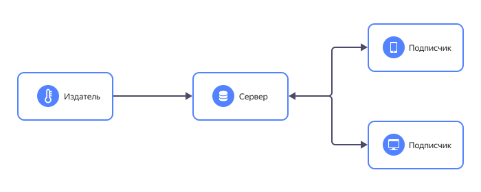

# MQTT-сервер

MQTT-сервер — это центр агрегации, обработки и пересылки данных между узлами сети, который выступает посредником во время взаимодействия устройств интернета вещей (IoT) друг с другом.

## Роль MQTT-сервера {#mqtt-server}

Интернет вещей объединяет множество устройств и датчиков в единую сеть, где они взаимодействуют автоматически без участия человека. Чаще всего коммуникация осуществляется через протокол MQTT. Устройства интернета вещей выступают в качестве клиентов — издателей и подписчиков, взаимодействующих с сервером напрямую. В такой сети сервер MQTT играет главную роль: он сортирует поступающие к нему сообщения и контролирует их дальнейшую отправку адресатам.

## Протокол MQTT {#mqtt-protocol}

MQTT — это протокол обмена данными между издателями и подписчиками, который разработали в 1999 году специально для интернета вещей. В основе MQTT лежит идея пересылки небольших сообщений, например показаний датчиков, между устройствами. При создании протокола MQTT главным образом учитывались такие ограничения промышленных сетей, как низкая пропускная способность и нестабильность связи.

Основные особенности протокола MQTT:
  * легкость, компактность, большая пропускная способность для снижения энергозатрат;
  * асинхронность для обслуживания большого количества устройств;
  * изолированность клиентов для простоты масштабирования сети;
  * устойчивость для работы в условиях нестабильной связи;
  * поддержка нескольких уровней качества обслуживания для приоритизации сообщений.

Протокол MQTT применяется в следующих сферах:
  * мониторинг оборудования, сред и конструкций в промышленных системах;
  * биллинг мобильных операторов и провайдеров;
  * построение сетей взаимодействия умных устройств.

## Структура сети интернета вещей {#iot-net}

В сети интернета вещей представлено два основных вида участников: клиенты и серверы.

Клиенты — это издатели, которые публикуют данные MQTT, например рассылают текущие параметры окружающей среды, и подписчики, которые эти данные используют. В частности, в роли подписчика выступает увлажнитель воздуха в системе умного дома: датчик влажности публикует свои показатели, а увлажнитель на их основе регулирует интенсивность своей работы.

Все клиенты подключаются к серверу — центральному узлу агрегации, обработки, сортировки и пересылки сообщений MQTT. Таким образом, клиенты не зависят друг от друга и не знают о существовании друг друга.

Подобная архитектура сети обеспечивает плавную интеграцию новых устройств и безболезненное изъятие устройств, которые больше не нужны. Если какое-то устройство потеряет связь с сервером, сбоев в сети не возникнет: в большинстве случаев сообщение MQTT будет доставлено, как только связь восстановится.

В сети может быть несколько серверов, а значит, один клиент может взаимодействовать со множеством серверов, а один сервер — со множеством клиентов. Так в MQTT реализуются любые виды подписки: «один к одному», «один ко многим», «многие к одному».

## Особенности коммуникации MQTT {#mqtt-communication}

Когда издателю нужно сделать публикацию, он формирует сообщение MQTT, которое имеет заголовок с темой — топиком. Сообщение пересылается серверу MQTT, и тот сортирует все поступающие данные, формируя своеобразную иерархию тем. Одновременно сервер распространяет сообщения среди подписчиков.

Если издатель отправляет сообщение с топиком, на который никто не подписан, оно может быть сохранено — и когда подписчик появится, он сразу же получит актуальные данные по нужной ему теме.

Один клиент может быть и издателем, и подписчиком — то есть не только публиковать данные MQTT, но и принимать их.

Передаваемые сообщения отличаются по степени важности, которую определяет флаг уровня [QoS](qos.md) (англ. Quality of Service — качество обслуживания) в его структуре. Протокол MQTT поддерживает 3 уровня QoS:

  * QoS 0 — доставка сообщения осуществляется не более одного раза. При неудачном исходе сообщение теряется.
  * QoS 1 — доставка сообщения осуществляется не менее одного раза. Отправка повторяется до тех пор, пока не будет получено подтверждение от адресата.
  * QoS 2 — доставка сообщения осуществляется только один раз. Если на линии связи MQTT возникают проблемы, доставка задерживается. Однако адресат в любом случае получит сообщение, когда связь восстановится.

## Преимущества использования MQTT-сервера {#advantages}

MQTT-сервер выполняет в сети обмена данными все основные функции ядра коммуникации:
  * обработка сообщений MQTT — прием, фильтрация, сортировка, буферизация, пересылка, контроль доставки;
  * ведение журнала сеансов подключения;
  * аутентификация и авторизация клиентов;
  * интеграция с серверными системами;
  * защита от сбоев.

Применение MQTT-серверов в структуре сети интернета вещей дает ее пользователям важные преимущества:
  * устранение уязвимых и небезопасных клиентских подключений;
  * простое масштабирование до тысяч устройств;
  * управление состояниями клиентских подключений, отслеживание их учетных данных и сертификатов безопасности;
  * снижение нагрузки на сеть без ущерба для безопасности;
  * надежное резервирование ресурсов сети на случай сбоя.

MQTT-серверы реализуются в виде программ с проприетарным или открытым исходным кодом, которые могут работать как локально (на физическом компьютере), так и в облаке (на облачном сервере).

Все больше компаний переносят свою IT-инфраструктуру в облако. В случае сетей промышленных устройств и датчиков или интернета вещей облако позволяет достаточно просто организовать взаимодействие физически разнесенных устройств — встроенных систем, датчиков и мобильных приложений.

## Облачный MQTT-сервер от {{ yandex-cloud }} {#mqtt-server-yc}

[{{ iot-short-name }}](/services/iot-core) — это сервис интернета вещей для двустороннего обмена сообщениями между устройствами по протоколу MQTT.

Сервис предлагает две модели управления ресурсами. В первой модели устройства объединяются в реестры и взаимодействуют с другими ресурсами облака через MQTT-сервер. Во второй — сервис предоставляет услугу виртуального брокера, внутри которого устройства могут обмениваться сообщениями друг с другом или с другими ресурсами облака. Модели могут использоваться совместно или по отдельности, что обеспечивает гибкий подход к решению задач.

С {{ iot-short-name }} можно автоматически балансировать и масштабировать сеть. Данные защищены по всем точкам подключения, и обмен сообщениями MQTT происходит только после аутентификации. Поддерживается два уровня качества обслуживания: QoS 0 и QoS 1.

[Подробная документация](../iot-core/) и [доступные тарифы](../iot-core/pricing.md) помогают быстро приступить к работе. [Создайте свой первый реестр]({{ link-console-main }}/link/iot-core/) и протестируйте сервис {{ iot-short-name }} уже сейчас.

### Статьи и видео по теме {#see-also}

  * [История успеха FESCOM](/cases/fescom)
  * [Статья про интернет вещей](/blog/posts/2019/11/iot-core-scale) в блоге Yandex Cloud
  * [Видео](https://www.youtube.com/watch?v=fLWTSQ0a8NM) об использовании MQTT-сервера {{ yandex-cloud }} для панелей Weintek

