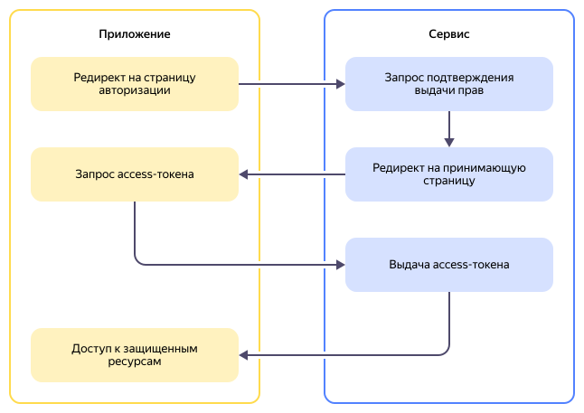
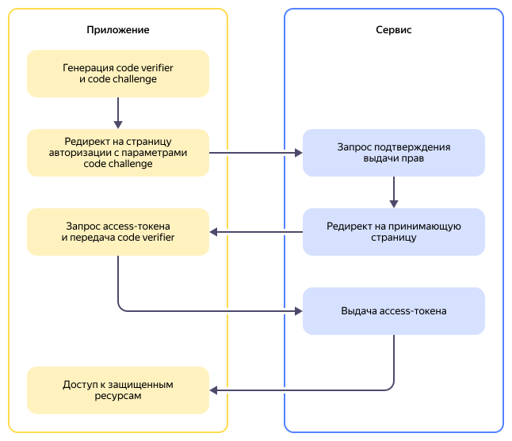

# Proof Key for Code Exchange (PKCE)

_Proof Key for Code Exchange (Ключ подтверждения для обмена кодами, PKCE)_ — это дополнительная защита для протокола [OAuth 2.0](#oauth-safety), которая предотвращает перехват авторизационных кодов. PKCE особенно важен для мобильных приложений и одностраничных веб-приложений, где невозможно безопасно хранить секретные ключи.

Механизм PKCE был разработан в 2015 году и описан в стандарте [RFC 7636](https://datatracker.ietf.org/doc/html/rfc7636). Его создание было вызвано растущей популярностью мобильных приложений и необходимостью защитить их от атак, связанных с перехватом кодов авторизации.

## OAuth 2.0 и проблема безопасности {#oauth-safety}

Чтобы понять назначение PKCE, рассмотрим принцип работы протокола [OAuth 2.0](*popup-1) и его уязвимости.



С помощью OAuth 2.0 пользователь может разрешить приложению получить доступ к его данным в другом сервисе без передачи пароля. Например, вы можете дать приложению для планирования встреч право читать ваш Яндекс Календарь, не сообщая ему свой пароль от сервиса.

Для этого приложению нужно получить от сервера авторизации (например, Яндекс ID) временный авторизационный код, а затем обменять его на _access-токен_. При обычном обмене приложение подтверждает свою подлинность с помощью _client secret_ — секретного ключа, известного только ему и серверу авторизации. Однако это работает только для серверных клиентов, которые способны надежно хранить секреты. Публичные клиенты лишены такой возможности:

* **Мобильные приложения** — секрет можно извлечь через декомпиляцию.
* **Одностраничные приложения** — весь JavaScript-код виден в браузере.

В таких случаях использование client secret невозможно. Без дополнительной защиты злоумышленник может перехватить авторизационный код и обменять его на access-токен. Именно эту проблему и решает PKCE.

## Принцип работы PKCE {#how-work}

PKCE дополняет процесс авторизации следующим образом:



1. Приложение генерирует _code verifier_ (верификатор кода) — криптографически случайную строку длиной от 43 до 128 символов. Эта строка уникальна для каждого запроса авторизации и не покидает приложение до момента обмена на токен.
1. На основе code verifier приложение генерирует _code challenge_ (вызов кода). Существует два метода генерации:

   * **plain** — code challenge = code verifier. Используется в редких случаях, когда клиент не поддерживает криптографический алгоритм [SHA256](https://ru.wikipedia.org/wiki/SHA-2).
   * **S256** — code challenge создается путем хеширования code verifier с помощью криптографического алгоритма [SHA-256](https://ru.wikipedia.org/wiki/SHA-2) и кодирования результата в формат [Base64URL](https://datatracker.ietf.org/doc/html/rfc4648#section-5).

1. Приложение перенаправляет пользователя на сервер авторизации, добавляя в запрос code challenge и метод его создания.

   

   ```text
   https://oauth.yandex.ru/authorize?
     response_type=code&
     client_id=0a1b2c3d4e5f6a7b8c9********&
     redirect_uri=https://example.com/auth/callback&
     code_challenge=E9Melhoa2OwvFrEMTJguCHa********&
     code_challenge_method=S256
   ```

   

1. Сервер авторизации сохраняет code challenge и связывает его с выданным кодом авторизации.
1. После успешной авторизации пользователя сервер перенаправляет его обратно в приложение вместе с кодом авторизации.
1. Приложение отправляет прямой HTTPS-запрос обмена кода на токен, добавляя в него исходный code verifier. Верификатор не может быть перехвачен, так как не попадает в браузер и не передается в URL.
1. Сервер авторизации выполняет проверку: применяет к полученному code verifier указанный метод и сравнивает результат с сохраненным code challenge. Если значения совпадают, сервер выдает access-токен. Если нет — запрос отклоняется.

При таком подходе, даже если злоумышленник перехватит код авторизации, он не сможет обменять его на токен, потому что не знает code verifier, который хранится только в памяти процесса приложения.

## Преимущества {#advantages}

Преимущества использования механизма:

* **Безопасность для публичных клиентов**. PKCE позволяет мобильным и одностраничным приложениям безопасно использовать OAuth 2.0 без необходимости хранить секретные ключи.
* **Простота внедрения**. Механизм не требует сложной инфраструктуры — достаточно добавить генерацию случайной строки и вычисление хеша.
* **Стандартизированность**. PKCE описан в RFC 7636 и поддерживается всеми современными провайдерами OAuth 2.0, включая Google, Microsoft, Яндекс и другие.
* **Обратная совместимость**. Серверы авторизации, поддерживающие PKCE, обычно позволяют использовать его опционально, что не нарушает работу существующих приложений.
* **Защита от различных атак**. PKCE защищает не только от перехвата кода, но и от атак с подменой приложения.

## Ограничения {#limitations}

Несмотря на свою простоту и эффективность, PKCE имеет ряд ограничений и уязвимостей:

* **Не заменяет другие меры безопасности**. PKCE гарантирует, что токен получит тот, кто его запрашивал, но не легитимизирует самого клиента. Необходимо использовать [HTTPS](ssl-certificate.md), правильно валидировать URL обратного вызова и применять другие меры безопасности.
* **Допускает использование небезопасного метода plain**. Серверы должны отклонять такие запросы, если это возможно.
* **Требует корректной реализации**. Если code verifier генерируется предсказуемым образом, защита становится бесполезной. Важно использовать криптографически стойкий генератор случайных чисел.
* **Добавляет сложность**. Хотя механизм PKCE относительно прост, он все же добавляет дополнительные шаги в поток авторизации, чем может усложнить отладку и поддержку, а также повысить расходы.

## Распространенность и поддержка {#support}

PKCE широко поддерживается и рекомендуется современными провайдерами авторизации, а для публичных клиентов может быть даже обязательной частью процесса авторизации.

Большинство современных библиотек и SDK для работы с OAuth 2.0 также автоматически используют PKCE, если сервер его поддерживает. Например:

* **AppAuth** (iOS, Android) — автоматически применяет PKCE.
* **MSAL** (Microsoft Authentication Library) — использует PKCE по умолчанию.
* **oidc-client-js** (JavaScript) — поддерживает PKCE для одностраничных приложений.

## Рекомендации по использованию {#recommendations}

Хотя PKCE разрабатывался для публичных клиентов, его использование в серверных приложениях при правильной реализации добавляет дополнительный уровень защиты. При внедрении механизма учитывайте следующие рекомендации:

1. **Используйте только метод S256**. Метод plain существует только для поддержки совместимости, в RFC не рекомендуется использовать его без нужды.
1. **Генерируйте криптографически стойкий code verifier**. Используйте встроенные криптографические библиотеки вашего языка программирования.
1. **Храните code verifier безопасно**. В мобильных приложениях используйте защищенное хранилище, в веб-приложениях — память браузера, а не локальную.
1. **Не используйте один code verifier повторно**. Code verifier должен быть уникальным и генерироваться для каждого запроса авторизации.
1. **Используйте дополнительные меры защиты**. PKCE не гарантирует полную защиту, в дополнение к нему требуется как минимум надежная проверка подлинности клиента.

#### Полезные ссылки {#see-also}

* [{#T}](sso.md)
* [{#T}](jwt.md)
* [{#T}](ssl-certificate.md)
* [RFC 7636: Proof Key for Code Exchange](https://datatracker.ietf.org/doc/html/rfc7636)

[*popup-1]: [_OAuth 2.0_](https://ru.wikipedia.org/wiki/OAuth) — стандарт для предоставления доступа к ресурсам от имени владельца. Расширенная версия OAuth 2.0 (OpenID Connect) используется как протокол для единого входа ([SSO](sso.md)).
