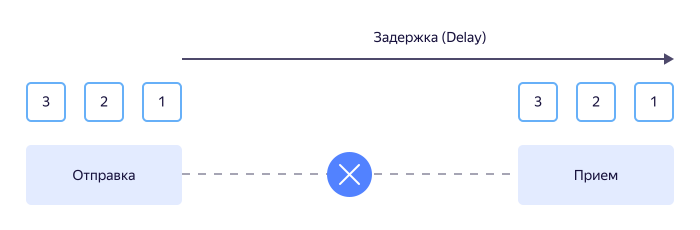
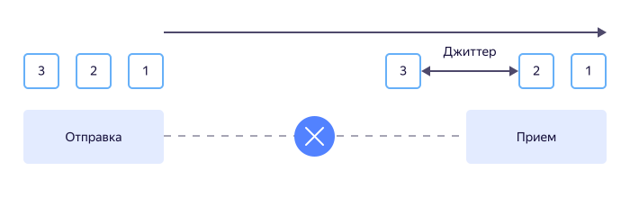
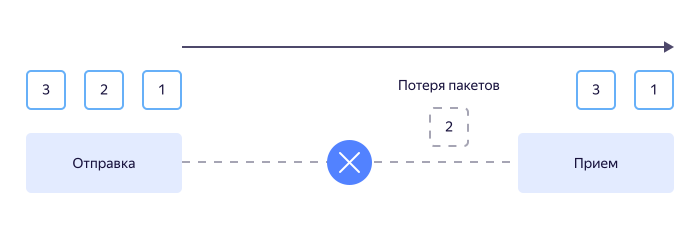
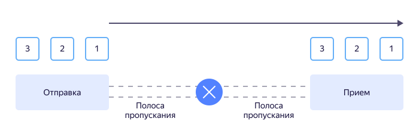

# QoS

QoS (Quality of Service, или «качество услуги») — набор технологических решений для оптимизации сетевого трафика с помощью назначаемых приоритетов передачи информации.

Данные с более высоким приоритетом (например, IP-телефония) передаются в первую очередь с минимальными задержками. Данные с низким приоритетом (например, содержимое файлов), помещаются в очередь и передаются по мере освобождения канала связи. Приоритеты являются динамическими и могут изменяться.

## Для чего необходим QoS {#purpose}

Если у поставщика услуги сетевого трафика ограничены ресурсы инфосети или нестабильное качество связи, то необходим QoS.

Если правильно настроить QoS, то даже с ограниченными возможностями сетевого оборудования и физических каналов связи можно повысить качество передачи информации.

## Показатели качества QoS {#quality-indicators}

Качество QoS определяют задержка, джиттер, потери пакетов и полоса пропускания.

1. Задержка — время от момента начала передачи данных до момента их получения.

   

   Чем меньше время задержки, тем выше качество. Особенно этот показатель важен при потоковой передаче информации, например, для услуги IP-телефонии или стриминговых сервисов (онлайн-вещание в режиме реального времени).

   Иногда в качестве параметра задержки используют время от начала передачи данных до приема ответа об их получении («время туда-обратно» или Round Trip Time, RTT). Этот параметр, например, измеряется при работе известной команды `ping`.

   Задержка зависит от:
   * длины линии связи;
   * количества промежуточных маршрутизаторов;
   * скорости работы сетевого оборудования (времени обработки пакетов данных);
   * настроек сетевого оборудования;
   * времени ожидания пакетов информации в очереди на передачу.

   Последние два параметра (настройки сетевого оборудования и время ожидания в очереди) напрямую относятся к QoS.

1. Джиттер — время между двумя последовательными пакетами данных.

   

   Также, как и задержка, чем меньше джиттер, тем лучше. В случае большого значения джиттера возможно «выпадение» пакетов данных, когда данные не успевают записываться в буферную память приемного устройства. В этом случае, например, при использовании услуги IP-телефонии, мы получим ухудшение качества, выраженное в «проглатывании» части букв или даже отдельных слов при разговоре.

1. Потери пакетов — количество пакетов данных, не дошедших до получателя (в процентах).

   

   Причины потерь могут быть разными, например, большое значение джиттера или плохое качество сигнала в сети.

   Если вам нужно передать файлы без искажения содержимого, то это критичный показатель. Сетевой протокол будет снова и снова передавать потерянные данные, а значит общее время задержки возрастет.

1. Полоса пропускания (или ширина канала связи) — объем передаваемых данных за единицу времени (в байтах в секунду).

   

   Чем шире полоса пропускания, тем выше качество связи. Уменьшение ширины канала приводит к ухудшению показателей качества, связанных со временем передачи сигнала (задержки и джиттера).

   Современное оборудование и сетевое программное обеспечение позволяют регулировать полосу пропускания для отдельных пользователей и устройств.

## Модели QoS {#models}

Существуют три модели обеспечения требуемых показателей качества QoS:

| Best Effort | IntServ | DiffServ |
| ----------- | ------- | -------- |
| **Принцип работы** |
| («мы сделали все, от нас зависящее») — пакеты данных никак не категоризируются, приоритеты не назначаются, все данные равны при передаче. | («интегрированная услуга») — резервирование ресурсов для каждого потока данных от источника до получателя. | («дифференцируемая услуга») — каждый сетевой узел (маршрутизатор) самостоятельно определяет приоритеты пакетов данных (дифференцирует их важность). |
| **Реализация** |
| <ul><li>Настройки QoS нет. Пакеты информации передаются в порядке поступления.</li><li>Необходимый уровень обслуживания обеспечивается высокопроизводительным сетевым оборудованием и каналами связи с широкой полосой пропускания.</li></ul> | Ресурсы сетевого оборудования и каналов связи резервируются для каждого информационного пакета до начала передачи данных. | <ul><li>Весь входящий трафик подразделяется на классы для специфической обработки пакетов каждого класса на сетевом узле.</li><li>Одинаковая настройка классов информации на всех маршрутизаторах.</li><li>Единая в пределах сети маркировка классов пакетов в их заголовках.</li></ul> |
| **Преимущества** |
| <ul><li>Нет никаких гарантий обеспечения показателей качества.</li><li>Низкие требования к качеству сервиса (например, сервис только для хранения и обмена файлами).</li><li>Экономия на квалификации обслуживающего сервис персонала.</li><li>Дополнительные затраты на оборудование и каналы связи.</li></ul> | <ul><li>Гарантированно обеспечивается высокое качество обслуживания.</li><li>С увеличением количества узлов сети растет непроизводительный расход системных ресурсов.</li></ul> | <ul><li>Уровень QoS зависит от класса пакета.</li><li>Гибкая настройка сервиса под любую задачу и любое качество связи.</li></ul> |

В сложных распределенных сетях модель DiffServ на данный момент является единственно возможной для обеспечения приемлемого качества сервиса.

## Как работает QoS {#how-it-works}

QoS при работе по модели DiffServ маркирует пакеты данных специальными метками. Метки записываются в определенные поля заголовков пакетов. Выбор поля для маркировки зависит от сетевого протокола.

Работа QoS возможна только при наличии в сети управляемых маршрутизаторов с определенными встроенными функциями:
1. Маршрутизатор получает входящий пакет.
1. Функция **Классификатор (Classifier)** дифференцирует пакет в зависимости от назначенного (и прописанного в метке) класса обслуживания.
1. Функция **Измерение (Metering)** анализирует количество входящих пакетов (трафик) разных классов.
1. Функция **Окрашивание (Coloring)** помечает входящий пакет в зависимости от того, сколько информации данного класса поступило в маршрутизатор (от «зеленого» уровня, когда информация в рамках ограничений, до «красного», если выявлен избыток информации этого класса).
1. Функция **Полицейский (Policer)** управляет пакетами: при ограничении ширины канала и низком классе пакета удаляет «красные» пакеты из очереди, перемаркировывает их или разрешает передачу.
1. Функция **Ожидание (Queuing)** помещает пакеты в очереди на отправку. Для каждого класса создается отдельная очередь.
1. Функция **Шейпер (формирователь, Shaper)** формирует очередь, соответствующую заданному размеру исходящего трафика.
1. Функция **Планировщик (Scheduler)** передает сформированные очереди пакетов на отправку.
1. Маршрутизатор отправляет сформированный трафик.

## QoS в Yandex Cloud {#cloud-qos}

Упрощенные модели (классы качества обслуживания) QoS с предопределенным набором функций используются операторами сетевых услуг при предоставлении доступа к различным сервисам.

Например, сервис [{{ iot-full-name }}](../iot-core/) поддерживает следующие классы качества обслуживания для [протокола MQTT](mqtt-server.md#mqtt-protocol):
* QoS 0: At most once. Протокол отправляет сообщения в топик один раз, гарантий доставки нет. Обеспечивается высокая скорость обмена информацией. Класс качества используется, если объем информации в топике избыточен (например, периодический опрос состояния устройств).
* QoS 1: At least once. Протокол обеспечивает гарантированную доставку сообщения. Обеспечивается высокая надежность передачи информации за счет ее дублирования. Класс качества подходит для работы с сигнализаторами аварийных режимов работы, когда критична минимальная задержка получения информации.

Сервис {{ iot-full-name }} — MQTT-сервер, расположенный в защищенном облаке от {{ yandex-cloud }}. Сервис предназначен для организации каналов связи между устройствами пользователя и сетевыми ресурсами (например, при создании систем умного дома).

Чтобы начать работу с сервисом, войдите в свой аккаунт в {{ yandex-cloud }} или [зарегистрируйтесь]({{ link-console-billing }}/create-account).
