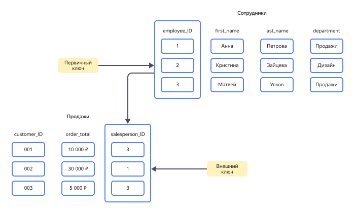

# Реляционные базы данных

Прежде чем определять понятие реляционных баз данных, нужно разобраться с понятием самих данных. В информационном пространстве под данными подразумевают факты и идеи, зафиксированные в формализованном виде — таком, который позволяет хранить, передавать и обрабатывать их. Совокупность данных формирует _базу данных_ — массив, в котором собраны и организованы по некоторому принципу данные из какой-либо области знаний.

Принцип построения базы данных определяется ее моделью. Наиболее известны иерархическая, сетевая, объектная и _реляционная_ модели. Последняя — самая популярная, и именно о ней пойдет речь в этой статье.

## Реляционная модель {#relational-model}

Реляционную модель предложил британский математик [Эдгар Кодд]( https://ru.wikipedia.org/wiki/Кодд,_Эдгар ) на рубеже шестидесятых и семидесятых годов XX в. Она основывается на теории множеств и представляет все данные в привычной, строгой и логичной форме обыкновенных таблиц. Такие таблицы в математике именуют _отношением_ (англ. _relation_ — отсюда и название модели). Кодд сформулировал единые для любой реляционной базы данных законы и заложил основы построения запросов для работы с данными.

_Реляционная база данных_ — это составленная по реляционной модели база данных, в которой данные, занесенные в таблицы, имеют изначально заданные отношения. Сами таблицы в такой базе данных также соотносятся друг с другом строго определенным образом. Реляционные базы данных используют целый комплекс инструментов, которые обеспечивают целостность данных, т. е. их точность, полноту и единообразие.

Для взаимодействия с любой реляционной базой данных используется SQL (Structured Query Language) — язык структурированных запросов. Это основа интерфейса систем управления базами данных. Он стандартизирован с 1986 года и поддерживается всеми известными ядрами реляционных баз данных. SQL позволяет работать со строками таблиц (например, удалять, добавлять или изменять их), а также извлекать нужные блоки информации и производить транзакции.

**Транзакция** — это комплекс последовательных операций с применением операторов SQL, имеющих определенную цель. Все транзакции должны отвечать четырем требованиям ACID:

* **Атомарность** (англ. _atomicity_) — транзакция является неделимым блоком и выполняется или полностью, или никак.
* **Согласованность** (англ. _consistency_) — завершенная транзакция сохраняет согласованность базы данных.
* **Изолированность** (англ. _isolation_) — параллельные транзакции не могут влиять друг на друга.
* **Устойчивость** (англ. _durability_) — никакой сбой в системе не может влиять на результат завершенной транзакции.

## Структура реляционной базы данных {#structure}

Данные в реляционной базе данных формируют отношения — двумерные таблицы с информацией о сущностях, т. е. объектах. Строка такой таблицы называется кортежем. Кортежи содержат множество атрибутов одной сущности, категории которых задаются в столбцах.

Например, возьмем базу данных отдела кадров на предприятии. В ее строки заносятся сведения о сотрудниках — у них могут быть следующие атрибуты:

* дата рождения;
* фамилия;
* имя;
* отчество;
* должность;
* структурное подразделение;
* номер пропуска. 

Для каждого атрибута выделен строго определенный столбец, а каждый столбец может содержать только один тип (или категорию) атрибутов. 

Каждая из строк определяет только одну-единственную сущность — сотрудника — и содержит уникальный набор его атрибутов. 

Таким образом, строки в базе данных не повторяются. Чтобы гарантировать уникальность каждой строки, для нее задается _первичный ключ_, своего рода идентификатор, который также используется, когда на кортеж нужно сослаться из другой таблицы, при этом не приводя полного набора атрибутов сущности. Тогда первичный ключ становится _внешним ключом_. Именно ключи обеспечивают целостность и согласованность данных и отношений.

Допустим, кроме таблицы работников из отдела кадров, у нас есть таблица заказчиков из отдела маркетинга. У каждого заказчика тоже есть свои атрибуты, в том числе идентификатор — первичный ключ. Если нам нужно учесть объем продукции, отгруженный каждым из работников каждому заказчику, мы можем связать данные из двух этих таблиц в третьей — используя их первичные ключи, которые в новой таблице будут выступать в качестве внешних ключей.

Первичный ключ позволяет обращаться к кортежам базы данных независимо от того, где физически они расположены, на каком месте, в какой таблице и в каком порядке. Ключи позволяют сортировать, фильтровать, извлекать, обрабатывать и возвращать данные в таблицы без лишних операций: если та или иная сущность встречается в базе данных множество раз, достаточно изменить ее атрибуты в одной таблице (по первичному ключу) — и они обновятся везде, где встречается этот ключ. Кроме того, ключи не позволяют ссылаться на несуществующие данные — а это гарантирует целостность всей базы данных.

## Основные характеристики реляционных баз данных {#parameters}

| Признак | Пояснение |
| ------------- | ------------------------------------------- |
| **Множество сущностей** | Объекты со строго определенным набором атрибутов, с помощью которых они связываются между собой, формируют понятную и простую для восприятия структуру. |
| **Табличный формат** | Такой формат гарантирует высокий уровень структурированности с жесткими логическими взаимосвязями, минимальный уровень избыточности данных, их согласованность и целостность. |
|**Язык SQL** | SQL является стандартизированным средством общения пользователя с базой данных. Он очень формальный, что делает его удобным и простым в изучении. SQL гарантирует точный результат даже при сложном многоуровневом запросе. |
|**Масштабирование по вертикали** | Реляционные базы данных хорошо масштабируются по вертикали. Но это значит, что по мере накопления информации в какой-то момент ее обработка потребует больших аппаратных ресурсов и финансовых затрат. |
|**Масштабирование по горизонтали** | Горизонтальное масштабирование, подразумевающее распределение таблиц данных по множеству серверов, является слабой стороной реляционных баз данных. С разрастанием системы появляются задержки в обновлении данных. В какие-то моменты нарушается принцип целостности данных, что может негативно отразиться на пользовательском опыте. |
|**Наличие требований к параметрам данных** | Реляционные базы данных умеют работать только со структурированными данными. Но современный цифровой мир полон неструктурированных данных (например, фото и видео), к которым нельзя применять принципы реляционной модели. |

## Применение реляционных баз данных {#application}

Реляционные базы данных — самые распространенные базы данных в мире. Компании самого разного размера и профиля используют их для обслуживания своих информационных систем. Такой подход удобен, чтобы:

* отслеживать торговые транзакции в интернете;
* обрабатывать критически важные данные банковских клиентов;
* хранить и обслуживать картотеки на промышленных предприятиях;
* вести учет в медицине и образовании.

То есть реляционные базы данных применимы везде, где важнейшим приоритетом является целостность и безопасность данных и где встречаются высокоструктурированные данные, соответствующие строгой, предсказуемой и предопределенной схеме.

## Что предлагает {{ yandex-cloud }} {#our-offer}

В инфраструктуре {{ yandex-cloud }} существует распределенная отказоустойчивая реляционная база данных с открытым исходным кодом [{{ ydb-short-name }}]( https://ydb.tech/ru ). Эта база данных может обрабатывать миллионы транзакций в секунду и петабайты данных. Она легко масштабируется по горизонтали простым добавлением серверов. В случае сбоев происходит автоматическое восстановление. {{ ydb-short-name }} спроектирована для работы в разных зонах доступности и обеспечивает работоспособность даже в случае выхода из строя одной из них.

Специально для управления {{ ydb-short-name }} создан сервис [{{ ydb-full-name }}](../../services/ydb). Он поддерживает бессерверные вычисления, сочетает высокую доступность и горизонтальную масштабируемость с поддержкой строгой консистентности и распределенных высокопроизводительных ACID-транзакций, которые могут задействовать записи из разных страниц. Для запросов используется диалект SQL — YQL. Таблицы могут быть организованы в виде директорий по аналогии с файловой системой.

Инженеры поддержки {{ yandex-cloud }} помогают обеспечить бесперебойную работу клиентской базы данных даже в самых сложных и неопределенных условиях. Развернуть базу данных можно в любой инфраструктуре, включая публичные облака и собственные вычислительные среды.

Для сервиса действует [соглашение об уровне обслуживания]( https://yandex.ru/legal/cloud_sla/ ). Уровень обслуживания сервиса определен в документе [Уровень обслуживания {{ ydb-full-name }}]( https://yandex.ru/legal/cloud_sla_ydb/ ).

Чтобы начать пользоваться {{ ydb-short-name }}, выберите подходящий режим и [создайте свою базу данных]({{ link-console-main }}/link/ydb/).

## Интересное по теме {#interesting}

* Записи вебинаров:
    * [Когда и как мигрировать на {{ ydb-short-name }}](https://yandex.cloud/ru/events/767)
    * [Управляемый сервис {{ ydb-short-name }}: настройка, применение, мониторинг](https://yandex.cloud/ru/events/597)
* История успеха [Как Авто.ру провел экзамен по ПДД с помощью serverless-технологий](https://yandex.cloud/ru/cases/autoru)
* Новость в блоге [Распределенная СУБД {{ ydb-short-name }} выходит в open source](../../blog/posts/2022/04/ydb-available-in-open-source)