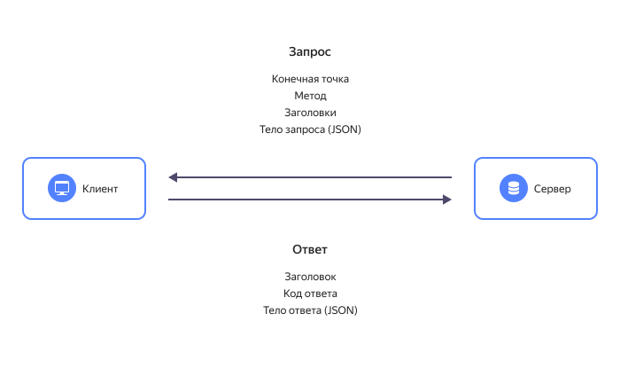

# REST API: для чего нужен и как работает

API (Application Programming Interface) — язык, на котором приложения общаются между собой. С помощью API одно приложение может использовать возможности другого приложения. Например, интернет-магазин может вызывать банковские сервисы для оплаты покупок.

Описание правил такого языка называется _спецификацией_, а порции данных, которыми обмениваются приложения — _сообщениями_. Сообщения обычно идут парами _запрос-ответ_. Например, интернет-магазин отправляет _запрос_ банковскому приложению, передавая ему реквизиты свои и покупателя, а также сумму для оплаты. А банковское приложение возвращает _ответ_, в котором сообщается, прошла ли оплата успешно. Ответ может быть более развернутым — например, чтобы покупатель видел движение своего заказа, интернет-магазин периодически отправляет _запросы_ в службу доставки, в _ответах_ получает данные о текущем статусе и местоположении заказа и передает эти сведения покупателю.

Свои API есть у большинства современных приложений и сервисов. Благодаря API вы можете из мобильного приложения вызвать такси или заказать доставку еды, а ваша корпоративная CRM-система может сохранить данные о новом клиенте в облачной СУБД {{ yandex-cloud }} и отправить ему email с подтверждением заказа.

## Чем хорош REST API {#advantages}

В отличие от естественных разговорных языков, которые зарождались и развивались стихийно, стандарты взаимодействия приложений с самого начала строго регулируются, и это существенно облегчает жизнь разработчикам.

Одним из таких общепринятых стандартов является REST, что расшифровывается как Representational State Transfer — передача репрезентативного состояния.

REST API — это не один конкретный протокол взаимодействия, а архитектурный стиль. Он описывает, как разработчику следует спроектировать интерфейс для взаимодействия своего приложения с другими. Если продолжить аналогию с естественным языком, то REST API описывает грамматику. [Принципы и ограничения REST API](https://www.ics.uci.edu/~fielding/pubs/dissertation/rest_arch_style.htm) были определены в 2000 году Роем Филдингом, одним из создателей протокола HTTP. Говорят, что если интерфейс взаимодействия приложения соответствует принципам REST API, он является _RESTful_.

Для доступа клиентских приложений к данным, хранящимся на сервере, в REST API используются такие методы как `POST`, `GET`, `PUT`, `PATCH` и `DELETE`. При этом обмен сообщениями осуществляется обычно по протоколу HTTP(S).

Главная особенность REST API — обмен сообщениями без сохранения состояния. Каждое сообщение самодостаточное и содержит всю информацию, необходимую для его обработки. Сервер не хранит результаты предыдущих сессий с клиентскими приложениями. Это обеспечивает гибкость и масштабируемость серверной части, позволяет поддерживать асинхронные взаимодействия и реализовывать алгоритмы обработки любой сложности. Кроме того, такой формат взаимодействия является универсальным — он не зависит от технологий, используемых на клиенте и на сервере, и не привязывает разработчиков к определенному провайдеру.  

Из-за того, что приходится каждый раз заново передавать все данные для обработки запроса, объем сообщений увеличивается. Чтобы сохранить при этом высокую скорость обмена, данные передаются в максимально сжатом формате. Чаще всего REST API использует формат JSON, более лаконичный чем XML.

## Как это работает {#how-it-works}

Клиент отправляет запрос на сервер. Сервер аутентифицирует клиента и проверяет его права, затем обрабатывает запрос и возвращает ответ клиенту.

## Методы {#methods}

Как правило, для взаимодействия между клиентом и сервером достаточно пяти методов:

* `GET` — получение информации об объекте (ресурсе).
* `POST` — создание нового объекта (ресурса).
* `PUT` — полная замена объекта (ресурса) на обновленную версию.
* `PATCH` — частичное изменение объекта (ресурса).
* `DELETE` — удаление информации об объекте (ресурсе).

Реже используются методы `HEAD` (для получения заголовка объекта или ресурса) и `OPTIONS` (возвращает список доступных методов).

Допустим, ваш интернет-магазин работает со сторонней службой доставки и обращается к ее серверу с помощью методов REST API.  
  * Чтобы передать в службу доставки информацию о новом заказе, отправляется запрос с методом `POST`.
  * Когда служба доставки соберет все необходимые товары, передаст курьеру, обозначит примерное время доставки и обновит статус заказа — данные на сервер отправятся методом `PUT`.
  * Если служба доставки позволяет отслеживать маршрут движения курьера с заказом на карте, то координаты заказа обновляются методом `PATCH`.
  * Если покупатель хочет проверить текущий статус заказа в личном кабинете, интернет-магазин отправляет на сервер службы доставки запрос `GET`.
  * Если покупатель передумал сразу после отправки заказа, он может отменить его, отправив запрос `DELETE` — в этом случае в базе данных не сохранится никакой информации о несостоявшейся покупке. Но если интернет-магазин хочет хранить историю заказов, даже отмененных, он будет использовать метод `POST`.

## Структура запроса {#query}

Запрос REST API от клиента к серверу всегда состоит из следующих элементов:

* Конечная точка (endpoint) — адрес, по которому отправляется запрос.

  Один и тот же объект (ресурс) может иметь несколько конечных точек.
  Например, чтобы отправить запрос на сервер службы доставки Best Delivery, может использоваться конечная точка `best-delivery.com/orders`. Чтобы посмотреть список заказов, можно использовать конечную точку `best-delivery.com/orders/list`, а чтобы разместить новый заказ — `best-delivery.com/orders/create`.

* Параметры — делятся на параметры пути и параметры запроса.

  Например, в запросе `best-delivery.com/orders/{userId}/list` `{userId}` — это параметр пути. Вместо `{userId}` нужно подставить идентификатор конкретного пользователя, тогда запрос вернет список заказов этого пользователя.
  В запросе `best-delivery.com/orders/list?orderId=123456` `orderId` — это параметр запроса. Такой запрос вернет информацию о конкретном заказе.
  В одном запросе может быть несколько параметров пути и несколько параметров запроса. Параметры запроса соединяются между собой символом &. Например, запрос `best-delivery.com/orders/shop/{shopId}/users/{userId}/list?top=10&sortDate=DESC` вернет список заказов в магазине `{shopId}` для пользователя `{userId}`, причем список будет содержать только 10 последних заказов, т.к. он отсортирован по убыванию даты заказа.

* Заголовки (headers) — в заголовках определяется формат передаваемых данных, спецификация и версия протокола обмена и другая информация, необходимая для корректной обработки запроса.

  Если для выполнения запроса требуется аутентификация, в заголовке передаются сведения о пользователе — логин, токен и т.п. Заголовки не отображаются в пути запроса.

* Тело запроса (body) — данные для обработки, как правило в формате JSON.

  Например, запрос для службы доставки может содержать номер заказа, адрес, телефон для связи и интервал доставки, примерно так:
  `{“orderId”:123456, “address”:”119021, Москва, ул. Льва Толстого, 16”, “phone”:”+74957397000”, “time_interval”:”9:00-11:00”}`.

## Структура ответа {#answer}

После выполнения REST API запроса сервер вернет клиентскому приложению ответ. Он включает код ответа, заголовки и тело ответа.
* Как и в запросе, заголовки в ответе также определяют формат передаваемых данных, спецификацию и версию протокола обмена, и другие сведения, которые помогут клиентскому приложению правильно прочитать и понять ответ.
* Тело ответа — это информация, которую запрашивал клиент. Ответ тоже чаще всего передается в формате JSON. Но тело ответа может быть и пустым.
* Код ответа — это признак успешности выполнения запроса. Для унификации используются стандартные коды ответа. Они представляют собой трехзначные числа. Ответы, начинающиеся с цифры 1, обозначаются 1xx, и т.п.

Ответы вида 1хх — информационные.

Ответы вида 2хх говорят об успешном выполнении запроса. Например:
> 200 – ОК. Если клиентом были запрошены какие-либо данные, то они находятся в заголовке или теле сообщения.
> 201 – OK. Создан новый ресурс.

Ответы вида 3xx обозначают перенаправление или необходимость уточнения. Например:
> 300 — на отправленный запрос есть несколько вариантов ответа. Чтобы получить нужный вариант, клиент должен уточнить запрос.
> 301 — запрашиваемый адрес перемещен.
> 307 — запрашиваемый адрес временно перемещен.

Ответы вида 4хх говорят о том, что при выполнении запроса возникла ошибка, и это ошибка на стороне клиента. Например:
> 400 – Bad Request. Запрос некорректный.
> 401 – Unauthorized. Запрос требует аутентификации пользователя.
> 403 – Forbidden. Доступ к сервису запрещен.
> 404 – Not found. Ресурс не найден.

Ответы вида 5хх говорят об ошибке на стороне сервера. Например:
> 503 — сервис недоступен.
> 504 — таймаут (превышено допустимое время обработки запроса).

## Описание API {#api-description}

Как уже говорилось выше, REST API — это архитектурный подход, а не конкретный протокол. Каждое приложение или сервис может иметь свой API, разработанный в соответствии со стандартами и лучшими отраслевыми практиками. Такая свобода обеспечивает большую гибкость и широту возможностей. Но чтобы сторонние разработчики могли воспользоваться разнообразными возможностями вашего сервиса, API должен быть хорошо задокументирован.

Отраслевым стандартом описания REST API является спецификация документирования [OpenAPI](https://swagger.io/docs/specification/about/) (ранее она называлась Swagger). В настоящее время используется версия OpenAPI Specification 3.0, а также немного устаревшая, но еще актуальная версия 2.0.

## Альтернативы и применение REST API {#alternatives}

REST API — самый популярный сегодня стандарт взаимодействия приложений, хотя не первый и не единственный.

Первым широко распространенным стандартом стал SOAP (Simple Object Access Protocol). Но SOAP-сообщения довольно громоздки (как минимум потому, что используют формат XML, а не более лаконичный JSON), что стало особенно неудобно с распространением мобильного интернета. SOAP изначально предназначался для описания вызова удаленных процедур — RPC (Remote Procedure Call), когда клиентское приложение выполняет функцию или процедуру на сервере, а сервер отправляет результат обратно клиенту.

Современная реализация этого подхода — gRPC, на ней реализованы [API сервисов {{ yandex-cloud }}](../overview/api.md). С их помощью вы можете создавать приложения и сервисы, использующие ресурсы {{ yandex-cloud }}.
