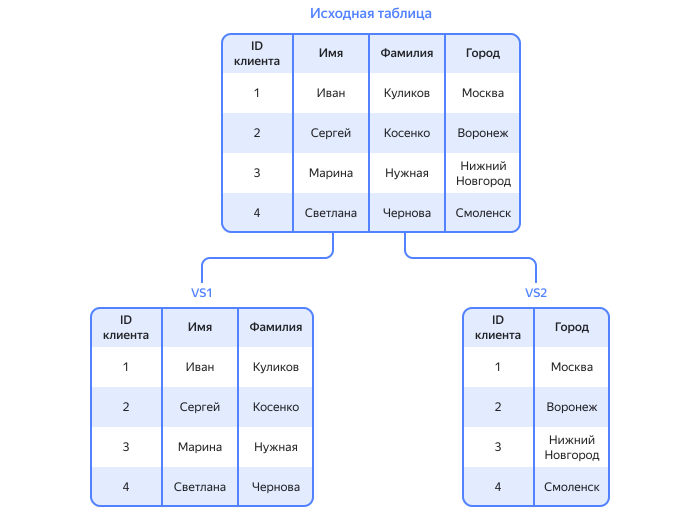
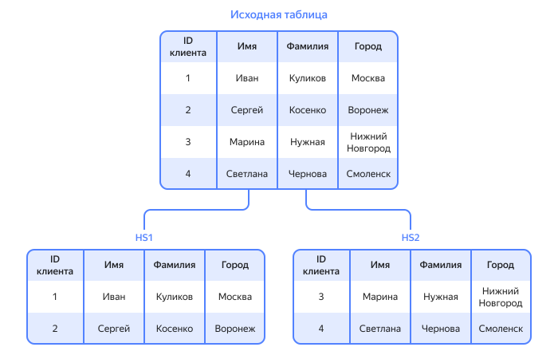

# Шардирование

_Шардирование или шардинг_ — это принцип проектирования [базы данных](relational-databases.md), при котором данные разбиваются на части и размещаются на разных шардах. Каждый шард представляет собой отдельный узел внутри [кластера](cluster.md), который может состоять из одной или нескольких реплик. Реплики — это [серверы](cloud-server.md), на которых дублируются данные в рамках шарда.

Шардирование используется, если система требует все больше ресурсов, но вертикальное масштабирование кластера не может быть использовано из-за физических пределов.

Популярные приложения и сайты рано или поздно должны масштабироваться, чтобы ускорить доступ к данным и увеличить трафик. Например, соцсеть набрала миллионы пользователей, и одного сервера ей уже недостаточно. Чтобы распределить данные на несколько серверов и обеспечить им безопасность и целостность, нужна база данных с соответствующей архитектурой — шардированная база данных.

Иногда понятие шардирования путают с репликацией и партицированием, но на самом деле это разные направления масштабирования, которые могут быть реализованы в пределах одной базы данных. В таблице ниже приведены их основные различия.

Область сравнения | Шардирование | Партицирование | Репликация
------------------|--------------|----------------|-----------
Основная функция | Ускорение обработки | Повышение производительности | Повышение стабильности
Метод | Разбиение по объему | Разбиение по функциональности | Копирование между серверами
Распределение | Физическое | Потоковое | По ведущим и ведомым серверам

## Виды шардирования {#types}

Выделяют два вида шардирования:

* **Вертикальное**

    Такое шардирование предполагает разделение данных по столбцам. В этом случае каждый шард содержит часть столбцов массива и все связанные с ними строки данных. Вертикальное шардирование может быть полезно, когда некоторые столбцы используются чаще, а другие — реже. Это вид шардирования может использоваться в пределах одного сервера путем обновления оборудования.
    
    Например, у интернет-магазина накопился большой массив данных о товарах и покупателях. Чтобы увеличить производительность, можно разделить его на два шарда, один из которых вмещает записи о клиентах, а другой — о товарах. При выполнении запросов будут загружаться только необходимые столбцы.

* **Горизонтальное**

    Этот вид подразумевает разделение хранилища на сгруппированные по каким-либо критериям строки. В этом случае каждый шард содержит одинаковые столбцы, но разные строки данных. Горизонтальное шардирование позволяет распределить нагрузку на запись и чтение данных между различными серверами, за каждый из которых отвечает отдельная машина.

    Например, социальная сеть содержит базу данных пользователей. Чтобы ослабить нагрузку на сервер, разработчики горизонтально делят ее по шардам, используя хеш-функцию для определения, в какой шард отправить каждую запись. В результате пользователи будут равномерно распределены по серверам.

## Преимущества шардирования {#advantages}

Если база данных разрослась так сильно, что ее нельзя отмасштабировать, просто повысив вычислительные мощности, то на помощь приходит шардирование. Какие проблемы можно решить:

1. **Преодолеть технические ограничения.** Набирающие популярность продукты в итоге сталкиваются с потолком возможностей оборудования, и данные могут быть разделены по разным машинам, чтобы обеспечить возможность роста.

1. **Повысить надежность.** Если шарды базы данных физически находятся на разных серверах, то отказ одного из них не означает прекращение работы остальных. То есть вместо полного прекращения доступа к сайту или приложению может перестать работать лишь какая-то его часть.

1. **Ускорить доступ к данным.** Продукты с большой монолитной базой данных обычно не отличаются производительностью, так как запросы к ним конкурируют друг с другом. Шардирование помогает распределить нагрузку, увеличить объемы и скорость обработки данных.

## Недостатки шардирования {#disadvantages}

Хотя без шардирования иногда никак не обойтись, у такой архитектуры базы данных есть и существенные недостатки, из-за которых в некоторых случаях использовать его не рекомендуется. Основные из них включают:

1. **Сложность реализации.** Ошибки при шардировании могут стоить части данных или привести к повреждению хранилища. Также при разделении возникает риск того, что команда разработчиков будет работать менее эффективно. Вместо единой точки входа им придется управлять данными из нескольких сегментов.

1. **Несбалансированность данных.** Иногда бывает трудно предугадать, как будут накапливаться данные, и какой-то сервер может оказаться более загруженным, чем остальные. Например, какая-то часть пользователей соцсети стала гораздо популярнее всех остальных, а связанные с ними данные концентрируются на одном сервере. Для решения приходится прибегать к повторному сегментированию, но это приводит к простою серверов.

1. **Потеря производительности при сложных запросах.** Запрос одновременно к нескольким шардам будет иметь повышенную задержку. Для получения данных нужно будет обратиться к нескольким сегментам одновременно, что гораздо медленнее, чем получить данные из одной таблицы.

## Методы шардинга {#methods}

Существует несколько основных методов шардирования данных. Поскольку все они имеют свои особенности, выбор конкретного зависит от требований продукта. Рассмотрим самые распространенные:

* Хешированное — данные разбиваются на шарды на основе хеш-функции, которая принимает входные данные и возвращает хеш-значение. Это значение определяет, в какой шард будет помещена каждая запись данных. Метод позволяет достичь высокой производительности и отсутствия единой точки отказа, однако усложняет поиск данных.

* Диапазонное — данные разбиваются на шарды на основе диапазона значений. Значения могут присваиваться с помощью ключей (ключевое шардирование) и других атрибутов. Метод прост в реализации и позволяет быстрее находить информацию, чем при хешировании, однако может привести к несбалансированности базы.

* Круговое — шарды упорядочиваются в виде кольца и каждый из них ответственен за определенный диапазон значений. Запросы на данные маршрутизируются в соответствии с позицией шарда в кольце. Запросы распределяются равномерно, но при добавлении и удалении шардов требуется перераспределение данных.

* Динамическое — позволяет автоматически масштабировать хранилище в зависимости от текущей производительности и объема данных. Высокая гибкость такого хранилища требует надежную систему мониторинга и балансировки нагрузки, а также хорошо продуманную архитектуру базы данных.

## Применение шардирования в различных областях {#usage}

Необходимость шардинга возникает во всех сферах, где используются большие объемы данных. Будь то интернет-магазин, стриминговый сервис или социальная сеть.

1. **Шардирование разных баз данных.** В некоторых базах предусмотрено автоматическое шардирование — в основном это NoSQL-системы вроде MongoDB и Apache Cassandra. Если такой функции не предусмотрено, то можно организовать шардирование вручную. Например:

   * Логистическая компания AliExpress Order Management System использует базу данных PostgreSQL, в которой нет встроенных функций шардинга. Команда разработчиков вручную организовала масштабирование, распределив товары по шардам на основе их хеш-функций.

   * Социальная сеть Twitter использует базу данных со встроенным шардированием — Apache Cassandra. С помощью масштабирования серверы оперативно справляются с огромным объемом текстовых и медиа-сообщений.

1. **Шардирование веб-приложений.** Приложения с большим количеством пользователей и трафика также распределяют нагрузку между серверами. Например, онлайн-платформа для потокового воспроизведения видео Netflix разработала стратегию шардирования данных в поисковой системе Elasticsearch, которая обеспечила ей низкую задержку поиска. Компания также использует шардированные базы данных Apache Kafka, Apache Cassandra, Zookeeper, EvCache и другие.

1. **Шардирование в аналитике данных.** Шардинг также может помочь в ускорении аналитических операций, позволяя проводить их равномерно на нескольких серверах. Например:
   * Сервис аналитики Look for sale [с помощью шардирования](/cases/lookforsale) анализирует данные по миллионам артикулов товаров, помогая бизнесу принимать стратегические решения.

   * LinkedIn обрабатывает миллиарды записей пользовательских данных и предоставляет бизнес-аналитику своим пользователям.

   * Сервис такси Uber обрабатывает огромные объемы данных о поездках и водителях для анализа и оптимизации своих услуг.

## Шардирование в {{ yandex-cloud }} {#sharding-yc}

{{ yandex-cloud }} предлагает следующие инструменты для шардирования данных и работы с шардами:

1. [{{ ydb-name }}](/services/ydb/) — распределенная отказоустойчивая СУБД, поддерживающая автоматическое шардирование. Подробнее см. в [документации](../ydb/).

1. Сервисы для работы с кластерами серверов разных СУБД со встроенным шардированием.

   * [{{ mmg-name }}](/services/managed-mongodb/). Подробнее см. в [документации](../managed-mongodb/).

   * [{{ mrd-name }}](/services/managed-redis/). Подробнее см. в [документации](../managed-redis/).

   * [{{ mch-name }}](/services/managed-clickhouse/). Подробнее см. в [документации](../managed-clickhouse/).

   * [{{ mgp-name }}](/services/managed-greenplum/). Подробнее см. в [документации](../managed-greenplum/).


