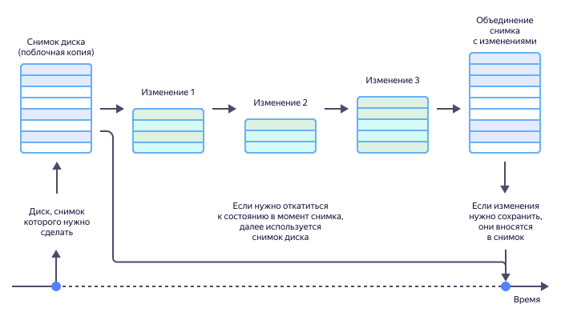

# Снапшот

_Снапшот_ (от англ. _snapshot_ — «моментальный снимок») — это полный снимок текущего состояния виртуальной машины, который позволяет в любой момент вернуть систему к сохраненной конфигурации.

## Когда используют снапшот {#snapshot-using}

Цифровой мир полон данных и очень изменчив. И когда в виртуальной среде планируется что-то масштабное, например, обновление и тестирование приложений, всегда есть риск повредить систему. Технология снапшотов позволяет быть уверенным, что если что-то пойдет не так, в любой момент можно вернуться в исходное состояние, когда работоспособность системы еще не была нарушена. Причем этот возврат будет быстрым и безболезненным с точки зрения производительности.

Таким образом, создание снапшотов — это способ исключить негативные последствия экспериментов с конфигурацией системы и обновлением программ. Особенно их ценят в сообществе разработчиков и тестировщиков. Снапшоты сохраняют не только общее состояние виртуальной машины, но и все данные на ее дисках, в памяти и регистрах процессоров. Также можно создавать снимки отдельных частей системы.

После того как снимок сделан, текущий журнал состояний закрывается. Все, что будет происходить дальше, будет записано в следующий файл. Чтобы вернуть конфигурацию системы на момент снимка, достаточно откатить изменения из нового журнала, то есть просто удалить его. Но если становится понятно, что накопленные изменения полезны и их нужно сохранить, достаточно объединить их с существующим снимком.

В процессе работы можно создавать множество снимков. Например, вы можете сохранить состояние системы в самом начале работы, а затем внести изменения и сделать еще один снимок. Если после этого вернуться к исходному состоянию, внести другие изменения и добавить еще один снимок, образуется ветвление — два снимка состояний, возникших в результате разных изменений одного исходного. По такому принципу образуются деревья снапшотов, которые позволяют легко ориентироваться в версиях системы, быстро переключаться между ними и удалять ненужные.

Файлы снапшотов обычно хранятся максимально близко к системе — в одной папке с виртуальными дисками, для которых они создаются. Это гарантирует быстрое восстановление состояния машины.

## Почему не резервная копия? {#backup}

Резервное копирование — это способ защитить данные от уничтожения или повреждения, а также сохранить их на будущее. Резервные копии обычно размещают на отдельных носителях или в удаленных хранилищах, что позволяет сберечь данные, если физическое устройство с оригиналами по какой-то причине выйдет из строя.

### Чем отличается резервная копия от снапшота {#backup-vs-snapshot}

| | **Резервная копия** | **Снапшот** |
| --- | --------------- | ----------- |
| Назначение и объект хранения | Хранение и восстановление данных. | Хранение и восстановление состояния системы. |
| Время копирования | Длительный процесс. Во время копирования состояние системы может поменяться несколько раз. Поэтому резервная копия не позволяет вернуть систему к тому исходному состоянию, которое было на момент запуска копирования. | Мгновенный процесс. Снапшот фактически «замораживает» конфигурацию системы на момент съемки. |
| Пространство для хранения | Хранилище или носитель большого объема. Дублируются все данные, которые нужно защитить от потери. Это не страшно, когда дело касается небольшого объема данных. Однако если необходимо зарезервировать целый сервер, потребуется еще один такой же сервер, а это уже совершенно иные затраты. | Относительно небольшой объем дискового пространства. Сохраняется лишь журнал записей — файл в специальном формате. Хранение снапшотов требует намного меньше места, а значит это экономически выгоднее. |
| Уровень безопасности | Данные могут быть изменены. Файлы, хранящиеся в резервной копии, доступны так же, как и оригинальные файлы. | Данные изменить нельзя. Записи в файле снапшота доступны только для чтения. |

Выбор технологии резервирования зависит от стоящей задачи. Если нужно быстро и на короткое время сохранить состояние системы, чтобы обеспечить возможность восстановления, используется технология снапшотов. Если же нужно защитить и сохранить на длительный срок важные данные, их резервную копию переносят на отдельный носитель или в облако.

## Рекомендации по работе со снапшотами {#shapshot-recommendation}

### Частота формирования и удаления снимков

Если виртуальная машина активно используется и совершает очень большое число операций, размер и количество файлов с изменениями будут постоянно расти, и системе придется обрабатывать все больший объем информации. Это приведет к замедлению всей инфраструктуры.

Поэтому не стоит делать снапшоты слишком часто и долго хранить их. Проанализировав внесенные изменения, нужно сразу принять решение — вернуться в исходное состояние или сохранить изменения, — а затем удалить файл снимка. Рекомендуется одновременно хранить не более трех снапшотов — причем срок хранения лучше ограничить тремя днями.

### Совмещение снапшотов и резервного копирования

Снапшоты можно использовать совместно с резервным копированием. Так как резервное копирование выполняется последовательно и занимает долгое время, параллельно в некоторых копируемых файлах могут произойти изменения. Если эти файлы уже были записаны в резервное хранилище, изменения туда не попадут, а значит, потеряются при восстановлении данных из копии.

В этой ситуации лучше сначала сформировать снапшот, а затем создавать резервную копию на его основе. Когда она будет готова, все изменения, произошедшие в системе во время копирования данных, можно применить к снапшоту и удалить его. Тогда на новом носителе вы получите полное исходное состояние системы вместе со всеми данными.

## Снапшоты в {{ compute-full-name }} {#snapshot-in-cloud}

[{{ compute-full-name }}](../compute/) — это сервис масштабируемых вычислительных мощностей для размещения, тестирования и прототипирования проектов. Он позволяет создавать виртуальные машины и подключать к ним диски. А там, где есть диски с данными, должна поддерживаться и [технология снапшотов](../compute/concepts/snapshot.md).

Снапшоты в сервисе {{ compute-name }} могут применяться в следующих целях:
* перенос данных с одного диска на другой — например, на диск в другой зоне доступности;
* создание резервной копии диска перед проведением операций, которые могут повредить данные;
* версионирование диска путем регулярного создания его снимков.

Работа со снимками подробно описана в [документации {{ compute-full-name }}](../compute/), поэтому вы сможете быстро внедрить эту технологию в свою повседневную практику.

#### Видео по теме {see-also}

* [{{ compute-name }}: анонсы](https://www.youtube.com/watch?v=HAH1ylEusvQ).
* [Возможности {{ yandex-cloud }}](https://www.youtube.com/watch?v=79IZ97Hj4jw).
* [Разбор {{ compute-name }}](https://www.youtube.com/watch?v=W1r7bBoDtZ8).
* [Кто отвечает за безопасность данных в облаке — разбираем на примерах](https://www.youtube.com/watch?v=TJvqHCi-lYQ).
