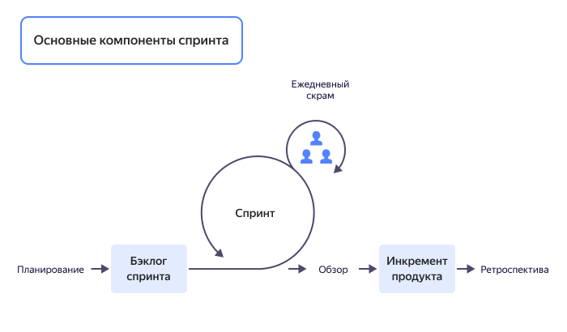

# Спринты

[*ключ_инкремент]: Инкремент продукта – это работоспособная часть продукта, готовая для тестирования.

Спринт — это основной элемент [Scrum-методологии](/blog/posts/2023/02/scrum-or-kanban#chto-takoe-scrum) для управления проектами. Использование этого метода предполагает фокусирование на коротких итерациях и частых выпусках [инкремента продукта](*ключ_инкремент).  

По данным отчета [ScrumTreck](https://agilesurvey.ru/report22) за 2022 год 82% компаний в России и 87% — во всем мире используют Scrum-метод в той или иной степени. Такой высокий показатель говорит о том, что он действительно эффективный, и его использование позволяет оптимизировать процессы работы. Изначально Scrum применялся в компаниях, которые производят программное обеспечение. Сейчас этот метод управления широко применяют для решения любых задач, в том числе производства, образования, строительства и т.д.

## Что такое спринты {#what-are-sprints}

Спринты — это регулярные ограниченные промежутки времени, в течении которых команда выполняет заданный объем работы в рамках большого проекта.  Спринт позволяет сделать работу над проектом более гибкой, прозрачной и удобной как для заказчика, так и для команды разработчиков.  

Длина и объем задач спринта определяются заранее и не могут быть изменены в процессе. Как правило, длина спринта равна четырем неделям. Но бывают варианты и короче — спринты длиной в одну-две недели. Сразу после окончания одного спринта начинается следующий.

### Цель спринта {#sprint-goal}

Цель спринта — получить инкремент продукта за одну итерацию. Инкремент приближает владельца продукта и команду разработчиков к итоговому видению результатов. Благодаря инкрементам разработчики имеют быструю обратную связь, могут изменять проект в процессе работы, и в итоге сделать более качественный продукт.

### Спринты как альтернатива классическому методу {#sprints-are-alternative}

Спринт-метод обладает рядом преимуществ по сравнению с классическим методом управления проектами. 

#### Недостатки классического метода {#classical-method-disadvantages}

Классический метод управления предполагает каскадное решение задач. При таком методе необходимо:  
* иметь детальный план проекта;  
* четко понимать каким должен быть итоговый продукт;   
* предусмотреть все сложности, с которыми могут столкнуться разработчики.  

Классический каскадный метод управления проектом не предполагает внесения изменений в план. Конечный продукт заказчик видит только после окончания всех работ. Провести тестирование продукта, получить обратную связь, обнаружить недостатки можно только после выпуска продукта.  

При таком методе разработчики скованы жесткими рамками плана, а заказчик рискует оказаться в ситуации, когда все сделано "согласно плану", но не соответствует его ожиданиям.  

#### Преимущества использования спринтов {#sprints-advantages}

Scrum является альтернативой классическому методу. Разделение большой задачи на ограниченные во времени спринты имеет ряд преимуществ:  

* **Более эффективное планирование и управление проектом.**   
Спланировать и проконтролировать работу на коротком промежутке времени намного легче, чем планировать всю работу целиком.  

* **Более точная оценка времени и ресурсов.**  
Спринт позволяет совершать меньше ошибок при оценке сложности работы.  

* **Улучшение коммуникации в команде проекта.**   
Работа со спринтами предполагает тесное командное взаимодействие. Каждый участник команды видит не только свою часть работы, но и всю работу целиком. Это увеличивает вовлеченность в работу, настраивает на взаимную поддержку и совместное преодоление сложностей, которые неизбежно возникают при решении задач.  

* **Повышение гибкости и адаптивности проекта.**  
В итоге каждого спринта владелец продукта получает возможность ознакомиться с инкрементом и скорректировать дальнейшую работу над продуктом. Таким образом, разбивая большой проект на спринты, команда получает обратную связь и может вносить изменения в демоверсию продукта на протяжении всего процесса работы.  

### Основные компоненты спринта {#sprint-components}

Спринт включает 4 основных этапа. Каждый из них является обязательным и необходимым для достижения целей как текущего спринта, так и всего проекта в целом.

#### Планирование спринта {#sprint-planning}  

Очередная итерация всегда начинается с планирования. Планирование спринта — это встреча, на которой команда сообща ставит цели и задачи на предстоящий спринт. Кроме того, при планировании спринта обсуждается вопрос сложности работы. Трудоемкость оценивается в условных единицах Story Points. Правильная оценка трудоемкости позволяет более точно спланировать задачи. 

На этом этапе обязательно участие не только команды разработчиков, но и заказчика. Именно их взаимодействие решает два основных вопроса при планировании спринта:  

   * Что нужно сделать?  
   * Как это сделать?  

Завершается совещание созданием [бэклога](backlog.md) спринта.  

Для спринта длиной в один месяц встреча не должна занимать более 8 часов.  

#### Ежедневный Scrum {#daily-scrum}

Команда собирается на ежедневные совещания на протяжении всего спринта. На таких встречах:  
   * Обсуждают текущий ход работы. 
   * Выявляют блокеры, а так же пути их преодоления.  
   * Корректируют план работы в рамках спринта.  

Каждый из участников команды должен ответить на вопрос:  
   * Что было сделано вчера?
   * Что планируется сделать сегодня?
   * С какими сложностями столкнулись и как их можно решить?

Ежедневный Scrum длится не более 15 минут.  

#### Обзор спринта {#sprint-review}  

Обзор спринта проводят, когда итерация подходит к концу. На этой встрече команда презентует инкремент продукта заказчику и другим участникам команды. Участники обзора решают, насколько удалось выполнить задачи спринта и каких доработок требует инкремент продукта. Обратная связь позволяет точнее понять, чего хочет заказчик.  

Для спринта длиной в один месяц обзор не должен занимать более 4 часов.

#### Ретроспектива спринта {#sprint-retrospective}  

Ретроспектива спринта - заключительный этап итерации. На этом совещании подводятся итоги спринта, анализируются успехи и неудачи. Команда определяет области, требующие улучшения в следующей итерации.  

Для спринта длиной в один месяц ретроспектива не должна занимать более 3 часов.  

## Где используют спринты {#using-sprints}

Несмотря на то что спринты были придуманы для улучшения процесса разработки ПО, их использование давно вышло за рамки сферы IT.  Спринты применяют для решения задач в самых разнообразных областях. Среди них:  
* финансы; 
* розничные продажи; 
* тяжелая промышленность; 
* телекоммуникации;
* энергетика;
* образование.  

Проект [eduScrum](https://eduscrum.com.ru)  — пример того, как можно адапритовать спринты для образовательного процесса. Этот проект был создан Вилли Вейнандсом — учителем химии в одной из Нидерландских школ. Благодаря использованию спринтов, обучение стало более гибким и интересным, школьники более мотивированными и вовлеченными в занятия. В процессе обучения они узнают свои сильные и слабые стороны, открывают в себе новые таланты. Ученики, работающие в Scrum командах, изучают программный материал на несколько недель быстрее, чем школьники, обучающиеся по традиционной системе. При этом их успеваемость  аналогична или на 10% выше.

## Как организовать работу со спринтами {#yandex-tracker-sprints}

Внедрить спринт в работу очень просто с помощью [{{ tracker-full-name }}](https://tracker.yandex.ru/). Благодаря этому сервису использовать спринт будет просто и удобно. Воспользуйтесь [пошаговой инструкцией](../tracker/manager/create-agile-sprint.md), что бы создать и настроить спринт.