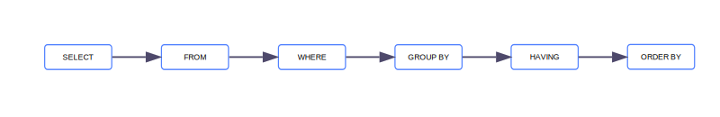

# SQL

_SQL (Structured Query Language)_ — стандартизированный язык работы с [реляционными базами данных](./relational-databases.md). С его помощью можно искать информацию, организовывать, модифицировать, поддерживать ее надежность посредством [транзакций](#tranzaction) и многое другое. Благодаря гибкости SQL находит применение как в огромных корпоративных системах, так и в небольших интернет-магазинах.

Основные компоненты:

* **DDL (Data Definition Language)** — определяет структуру БД: создает, изменяет или удаляет ее компоненты.
* **DML (Data Manipulation Language)** — работает с данными в таблицах: добавляет, изменяет, удаляет и извлекает их.
* **DCL (Data Control Language)** — обеспечивает безопасность: предоставляет или отзывает права на работу с БД.

## История развития {#history}

SQL был изобретен в начале 1970-х годов, и до 1996 года его стандартизация обеспечивалась силами Национального института стандартов и технологий (NIST). Далее производители начали расширять функциональность SQL каждый под себя, и появились разные, часто несовместимые между собой диалекты.

В стандарте SQL-92 определяли четыре уровня соответствия реализации: 

* Базовый (_entry_);
* Переходный (_transitional_);
* Промежуточный (_intermediate_);
* Полный (_full_).

С введением стандарта SQL:1999 он приобрел модульную структуру. Остался только один уровень совместимости — Core, что означало поддержку основной части стандарта.

Во второй половине 2000-х годов зародилось движение NoSQL. _NoSQL_ — тип СУБД, которые не используют традиционную схему формата данных. Такие системы позволяют обрабатывать и хранить большие объемы полуструктурированных и неструктурированных данных. Оно было вызвано не столько отказом от языка SQL, сколько отрицанием реляционной модели и принципов строгой согласованности. Например, так работают базы данных в сервисах [{{ mmg-full-name }}](/services/storedoc/) и [{{ mrd-full-name }}](/services/managed-redis/).

В 2010-е годы ряд СУБД отнес себя к категории NewSQL, в которой при сохранении свойств масштабируемости NoSQL-систем была реализована в том числе поддержка SQL. Эта поддержка распространилась не только на СУБД, но и на экосистемы [Hadoop](https://ru.wikipedia.org/wiki/Hadoop), а также на связующее программное обеспечение.

## Типы данных {#data-types}

SQL предлагает более 30 типов данных и возможность добавления пользовательских. Выбор неправильного типа может замедлить БД в два раза, а также увеличить ее размер.

Основные типы:

| Категория | Тип | Примеры |
| --- | --- | --- |
| Числовые | `INT` — целые числа<br>`DECIMAL` — числа с фиксированной точностью | Возраст, количество<br>Цена, вес товара |
| Строковые | `CHAR` — строка с фиксированной длиной<br>`VARCHAR` — строка с изменяемой длиной | Имя, фамилия<br>Адрес, описание |
| Дата и время | `DATE` — даты в формате «год-месяц-день»<br>`DATETIME` или `TIMESTAMP` — конкретное время с датой | 2024-03-15<br>2024-03-15 14:30:15 |
| Логические | `BOOLEAN` — значения истинности (`TRUE` или `FALSE`) | Флаг «активен/неактивен» |
| Двоичные | `BLOB` — бинарные данные | Изображения или файлы |

## Структура запросов {#requests-structure}

Эффективность выполнения запросов зависит от правильности их структуры. Ее нарушение приводит к синтаксическим ошибкам. Базовый запрос состоит из нескольких ключевых компонентов:



  * команда (например, `SELECT`, `INSERT`) — действие с данными;
  * указание таблицы (`FROM`) — источник данных;
  * условия (`WHERE`) — фильтр выборки данных;
  * дополнительные параметры (`ORDER BY`) — ограничение или упорядочивание результата.

В большинстве случаев рекомендуется писать команды строчными буквами и избегать лишних пробелов или переносов, чтобы код было легче читать. Также важно правильно использовать кавычки: одинарные кавычки (`'`) — для строковых значений, обратные (`\``) — для идентификаторов.

## Операторы {#operators}

_Операторы_ — специальные ключевые слова, которые выполняют определенные действия с данными или структурой базы данных. Обычно команды не учитывают регистр, но к нему могут быть чувствительны названия таблиц и полей в определенных БД, например в Linux.

Основные операторы:

* `CREATE` — формирование новых таблиц;

  

  `CREATE TABLE employees (id INT PRIMARY KEY, name VARCHAR(40), position VARCHAR(30))` — формирование таблицы сотрудников с идентификатором, именем и должностью.

  

* `INSERT` — дополнение таблицы новыми данными;

  

  `INSERT INTO employees (id, name, position) VALUES ('1', 'Алексей', 'рабочий')` — внесение нового сотрудника в таблицу.

  

* `SELECT` — извлечение данных из одной или нескольких таблиц;
  
  

  `SELECT * FROM employees` — просмотр списка всех сотрудников.

  

* `UPDATE` — корректировка уже имеющихся данных в таблице;

  

  `UPDATE employees SET position = 'менеджер' WHERE id = 1` — смена должность сотрудника.

  

* `DELETE` — исключение строк из таблицы;

  

  `DELETE FROM employees WHERE id = 1` — исключение сотрудника из таблицы.

  

* `ALTER` — модификация существующих компонентов БД;

  

  `ALTER TABLE employees ADD COLUMN salary DECIMAL(10, 2)` — добавление в таблицу столбца с зарплатами сотрудников.

  

* `DROP` — удаление компонентов БД;

  

  `DROP TABLE employees` — полное удаление таблицы.

  

* `GRANT` — выдача доступа к изменению данных;

  

  `GRANT SELECT, INSERT ON employees TO user1` — выдача пользователю прав на выполнение операций `SELECT` и `INSERT` в таблице.

  

* `REVOKE` — отзыв ранее выданного доступа;

  

  `REVOKE INSERT ON employees FROM user1` — отзыв у пользователя права на выполнение операции `INSERT` в таблице.

  

* `WHERE` — условие выборки данных для запроса.

  

  `SELECT * FROM employees WHERE id = 2` — получение конкретной строки из таблицы.

  

В процессе администрирования таблиц важно поддерживать согласованность информации и связей между данными. Например, нельзя удалить запись, на которую ссылается другая таблица, без предварительного изменения или удаления ссылки.

## Объединение данных {#join}

Объединение требуется для анализа и обработки информации в базе данных. Оно позволяет получать более полную картину, выполнять сложные вычисления и делать выводы.

Основные методы:

* **Объединение таблиц** — процесс соединения данных из нескольких таблиц в один результат.
* **Группировка данных** — объединение строк с совпадающими значениями внутри одной таблицы для совместной обработки.
* **Агрегирование** — вычисление обобщенных показателей по группам или всему массиву данных.

Оператор | Функция
------------|-----------
**Объединение таблиц** |
`INNER JOIN` | Возвращает только те строки, у которых есть совпадение в объединяемых таблицах
`LEFT JOIN` | Возвращает все строки из левой^1^ таблицы и совпадающие — из правой^1^; несовпадающие заменяются на `NULL`
`RIGHT JOIN` | Возвращает все строки из правой таблицы и совпадающие — из левой; несовпадающие строки в левой заменяются на `NULL`
`FULL JOIN` | Возвращает совокупность всех строк из обеих таблиц, заполняя `NULL` там, где совпадений нет
**Группировка данных** |
`GROUP BY` | Объединяет строки с одинаковыми значениями в указанном столбце или столбцах
**Агрегирование** |
`COUNT()`^2^ | Считает количество строк, соответствующих условию или всей таблице
`SUM()` | Вычисляет сумму числовых значений указанного столбца
`AVG()` | Определяет среднее арифметическое число в столбце
`MIN()` | Находит строку с минимальным значением
`MAX()` | Находит строку с максимальным значением

^1^ Левая и правая таблицы — это таблицы, названия которых указаны слева и справа от оператора `JOIN`.
^2^ Агрегатные функции всегда требуют обязательных скобок с аргументом внутри. Обычно в них помещают имя столбца или выражение, по которому вычисляется агрегатная величина. Пустые скобки вызывают синтаксическую ошибку.

Кроме того, можно выполнять _подзапросы_ или _вложенные запросы_, которые встраиваются внутрь основного SQL-запроса. Они выполняются в первую очередь и возвращают результат, который затем используется основным запросом для дальнейшей обработки. Подходят для фильтрации, агрегации и создания временных наборов данных.



* `SELECT ... WHERE id IN (SELECT id FROM table2)` — фильтрует данные по результатам вложенного запроса.
* `SELECT * FROM table1 WHERE value > (SELECT AVG(value) FROM table1)` — сравнивает значение с результатом подзапроса для фильтрации.



## Транзакции {#transaction}

_Транзакция_ — это группа последовательных операций, которые выполняются как единая задача. Это гарантирует, что все действия в ней либо успешно выполнятся вместе, либо не выполнятся вовсе, что важно для сохранения корректности данных. Транзакции используются, когда критично избежать частичного изменения информации.

К транзакциям применяются четыре требования ACID:

* **Атомарность** (_atomicity_) — транзакция выполняется неделимым блоком: полностью или никак.
* **Согласованность** (_consistency_) — завершенная транзакция сохраняет согласованность данных в базе.
* **Изолированность** (_isolation_) — параллельные транзакции не влияют друг на друга.
* **Устойчивость** (_durability_) — никакой сбой в системе не может повлиять на результат завершенной транзакции.

Существуют команды для явного начала транзакции (`BEGIN TRANSACTION` или `START TRANSACTION`), ее фиксации (`COMMIT`) и отмены (`ROLLBACK`). Управление транзакциями позволяет избежать потери или противоречия данных. Это гарантирует корректное взаимодействие с базой в многопользовательской среде. Правильное управление транзакциями облегчает диагностику и восстановление после сбоев.



```sql
BEGIN TRANSACTION;

-- Создание записи о заказе
INSERT INTO Orders (OrderID, CustomerID, OrderDate, Total)
VALUES (1001, 12345, '2023-05-24 10:00:00', 100);

-- Обновление количества товаров на складе
UPDATE Inventory
SET Quantity = Quantity - 1
WHERE ProductID = 101;

COMMIT;
```



## Оптимизация запросов {#optimization}

Оптимизация помогает снизить нагрузку на сервер и ускорить получение данных. Таким образом улучшается работа приложений и экономятся ресурсы системы. Основные принципы:

* Минимизация объема извлекаемых данных — выбирайте только необходимые столбцы и строки, чтобы снизить нагрузку на систему.
* Эффективность условий фильтрации — правильно формулируйте условия для уменьшения количества обрабатываемых строк.
* Применение соединений и подзапросов — выбирайте тип соединения и структуру запроса, обеспечивающие наилучшую производительность.
* Оптимизация группировок и сортировок — применяйте агрегатные функции и дополнительные параметры только к необходимым столбцам и индексам.
* Избегание излишних вычислений и преобразований — переносите сложные вычисления в предварительную обработку или используйте вычисляемые поля.
* Использование индексов — ускорьте поиск нужных строк без полного сканирования таблицы.

### Индексы {#index}

_Индексы_ — особые структуры данных, которые помогают организовать значения одного или нескольких столбцов в определенном порядке для быстрого поиска нужных записей.

| Индекс | Описание работы | Синтаксис |
| --- | --- | --- |
| Одностолбцовый | Ускоряет поиск и сортировку по выбранному столбцу. | `INDEX` |
| Составной | Индекс по нескольким столбцам эффективен при фильтрации по их комбинации. | `INDEX` |
| Уникальный | Помимо ускорения поиска, гарантирует уникальность значений в столбце или столбцах. | `UNIQUE INDEX` |
| Полнотекстовый | Обеспечивает быстрый поиск по текстовым данным и строкам. | `FULLTEXT INDEX` |
| Кластерный | Физически сортирует данные таблицы по индексу, что ускоряет диапазонные запросы. | `CLUSTERED INDEX` |



`CREATE INDEX idx_price ON products(price); SELECT * FROM products WHERE price > 1000` — эта операция индексирует товары с ценой выше 1 000. В результате поиск таких товаров в БД ускорится, так как остальные строки не будут учитываться в запросе.



## SQL в {{ yandex-cloud }} {#sql-yc}

В инфраструктуре {{ yandex-cloud }} существует множество сервисов, при работе с которыми используется SQL:

  * [{{ websql-full-name }}](/services/websql/) — сервис для работы с публично доступными БД.
  
    Подробнее см. в [документации {{ websql-name }}](../websql/).

  * [{{ dataproc-full-name }}](/services/data-proc/) — платформа для обработки больших данных (например, Apache Spark, Hadoop).

    Подробнее см. в [документации {{ dataproc-name }}](../data-proc/).

  * [{{ datalens-full-name }}](/services/datalens/) — инструмент для визуализации данных и бизнес-аналитики.
    
    Подробнее см. в [документации {{ datalens-name }}](../datalens/).

  * [{{ yds-full-name }}](/services/data-streams/) — сервис для обработки потоковых данных.

    Подробнее см. в [документации {{ yds-name }}](../data-streams/).

  * [{{ data-transfer-full-name }}](/services/data-transfer/) — инструмент для переноса данных между системами и сервисами. SQL-запросы могут применяться для настройки.

    Подробнее см. в [документации {{ data-transfer-name }}](../data-transfer/).

  * [{{ mch-full-name }}](/services/managed-clickhouse/) — fully managed аналитическая база данных для быстрой обработки больших объемов данных.

    Подробнее см. в [документации {{ mch-short-name }}](../managed-clickhouse/).

  * [{{ mmy-name }}](/services/managed-mysql/) — управляемая база данных MySQL.

    Подробнее см. в [документации {{ mmy-short-name }}](../managed-mysql/).

  * [{{ mpg-name }}](/services/managed-postgresql/) — управляемая база данных PostgreSQL.

    Подробнее см. в [документации {{ mpg-short-name }}](../managed-postgresql/).

  * [{{ ydb-full-name }}](/services/ydb/) — распределенная современная база данных, предназначенная для масштабируемых приложений и хранения данных с высокой доступностью.

    Подробнее см. в [документации {{ ydb-name }}](../ydb/).

## Интересное по теме {#interesting}

* Образование:
    * [Самоучитель SQL](https://practicum.yandex.ru/blog/samouchitel-sql/)
    * [Как построить простой дашборд в {{ datalens-full-name }}: пошаговое руководство на примере](https://dzen.ru/a/ZnE5eUI9w0LPgTAr)
* Практика:
    * [Выбор базы данных в {{ yandex-cloud }}](https://dzen.ru/a/Y1krZmRd7Xkqexbp)
    * [YQL — уникальный диалект SQL для работы с {{ ydb-short-name }}](https://ydb.tech/docs/ru/yql/reference/)