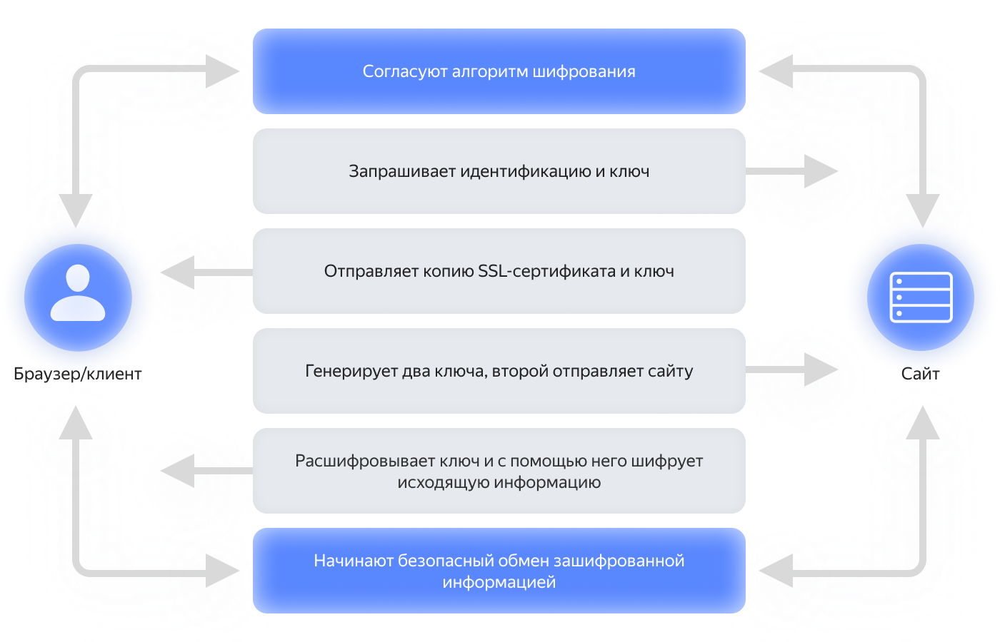

# Зачем нужны SSL-сертификаты

SSL-сертификат (Secure Socket Layer) — это электронный паспорт веб-ресурса, который содержит информацию о нем и шифрует обмен данными с его посетителем. Соединение по криптографическому протоколу происходит таким образом, что передаваемые данные невозможно перехватить и прочитать.

В современных веб-клиентах наличие у ресурса SSL-сертификата можно проверить в адресной строке — он отображается в виде замочка слева от ссылки. Если его нет, то браузер предупреждает пользователя, что соединение небезопасно, и свои данные на этом ресурсе лучше не раскрывать. Также наличие сертификата видно по адресу ресурса: безопасные сайты имеют протокол передачи данных [HTTPS](https://ru.wikipedia.org/wiki/HTTPS) (HyperText Transfer Protocol Secure), а небезопасные — [HTTP](https://ru.wikipedia.org/wiki/HTTP) (HyperText Transfer Protocol).

## История и развитие криптографической защиты данных {#history-versions}

Первые попытки шифровать сетевые сокеты предпринимались еще в 1993 году. Компания Netscape Communications тогда создала первую версию SSL-протокола, но так и не опубликовала свою разработку в силу многих ее недостатков. В 1995 году появилась усовершенствованная версия SSL, которой быстро заинтересовались передовые на тот момент компании, однако и она не обеспечивала должный уровень защиты.

Еще через год была выпущена версия 3.0, которая послужила основной для создания первой версии TLS-протокола (Transport Layer Security) в 1999 году. Сегодня в интернете можно встретить оба названия, хотя на деле обычно имеется в виду одно и то же. TLS — это усовершенствованная версия SSL-сертификата, которая выполняет те же функции, но имеет ряд преимуществ, включая более надежные алгоритмы шифрования и их ускоренную передачу.

Хотя стандарты защиты постоянно меняются, не все сайты успевают адаптироваться к этим изменениям. По [данным](https://www.ssllabs.com/ssl-pulse/) на май 2022 года, TLS версии 1.3 поддерживался примерно половиной сайтов. Рассмотрим статистику поддержки версий протоколов:

Версия протокола | Поддержка веб-ресурсами | Безопасность
-----------------|-------------------|-------------
SSL 2.0 | 0,3% | Небезопасно
SSL 3.0 | 2,5% | Есть существенные проблемы в безопасности
TLS 1.0 | 37,1% | Не поддерживается новыми версиями браузеров
TLS 1.1 | 40,6% | Не поддерживается новыми версиями браузеров
TLS 1.2 | 99,7% | Зависит от шифрования и средств защиты браузера
TLS 1.3 | 54,2% | Безопасный

## Принцип работы SSL-сертификатов {#work}

Хотя SSL-сертификаты и не мешают взламывать веб-ресурсы, они не дают киберпреступникам получить доступ к данным во время сеанса. После получения сертификата у сайта появляются два ключа шифрования: открытый, который он передает веб-клиенту, и закрытый, который используется для расшифровки получаемой от него информации. Процесс передачи информации выглядит следующим образом:

1. Браузер и сервер согласуют алгоритм шифрования для соединения.
1. Браузер идентифицирует сервер через его сертификат и запрашивает открытый ключ.
1. В случае успеха он генерирует два симметричных ключа: один для себя, а другой он отправляет на сайт.
1. Полученный ключ сайт расшифровывает с помощью своего закрытого ключа.
1. Поскольку и браузер, и сайт теперь имеют симметричные ключи, они начинают безопасный обмен зашифрованной информацией. На практике этот процесс занимает доли секунды.

Помимо ключей шифрования, в SSL-сертификат входят данные о сайте:

* Домены и поддомены, на которых он действует.
* Человек, организация или устройство, владеющее сертификатом.
* Информация о центре сертификации и его цифровая подпись.
* Дата получения и окончание срока действия сертификата.

## Преимущества SSL-сертификатов {#advantages}

Без SSL-сертификата невозможно заниматься большинством видов деятельности в интернете. Его отсутствие настолько же ограничивает свободу действий, как отсутствие паспорта в реальной жизни. Например:

* Теряется доверие веб-клиентов и пользователей.
* Все платежные системы и сервисы отказываются сотрудничать с незащищенными ресурсами.
* Ресурсы без сертификации имеют пониженный рейтинг для поисковых систем.
* Во многих странах действуют законы о защите персональных данных, за несоблюдение которых грозят большие штрафы.
* Многие центры сертификации дают пользователям гарантии, что если защиту все же взломают, то они получат возмещение.

Среди недостатков можно отметить стоимость, трудности получения и обновления. По принятым в 2020 году стандартам, сертификаты не могут выдаваться на срок более года, но тенденции в развитии технологий говорят, что в будущем он может еще сократиться. Крупным организациям со множеством ресурсов это причиняет больше всего неудобств, потому что им сложнее контролировать актуальность сертификатов. Последствия просрочки ощутили на себе следующие компании:

* Стриминговый сервис Spotify в 2020 году из-за просроченного сертификата отключился всего на час, но вызвал бурю негодования в соцсетях.
* Производитель телекоммуникационного оборудования Ericsson на некоторое время оставил без сотовой связи 32 миллиона человек.
* Социальная сеть для деловых контактов LinkedIn допустила просрочку сертификата, из-за чего все сокращенные ссылки на ее страницы стали недоступны. Это нанесло вред также всем клиентам и партнерам LinkedIn, которые когда-либо делились контентом с нее.
* Time Warner в 2017 году просрочила сертификат своего почтового сервера, но дала пользователям необдуманный совет: отключить SSL для своей почты. Это могло повлечь утечку данных пользователей.

## Виды SSL-сертификатов {#types}

SSL-сертификаты различаются по уровню валидации, стоимости, скорости получения и зоне охвата. Оптимальный выбор зависит от специфики сайта:

* **EV (Extended Validation)** — с расширенной проверкой.

  Наличие такой лицензии подтверждает, что владелец имеет исключительные права на ресурс, соблюдает все законы и платит налоги. Обычно такие сертификаты получают сайты, деятельность которых завязана на онлайн-платежах, например банки. Это самый дорогой тип сертификата, а все проверки для его получения занимают более недели. Однако, если раньше наличие EV-сертификата подтверждалось зеленой адресной строкой, то сегодня большинство браузеров отказались от такой визуализации, поэтому многие ставят под сомнение его полезность.

* **OV (Organization Validation)** — подтверждает существование организации.

  Для получения сертификата организация предоставляет все документы, доказывающие ее юридическое и физическое существование. OV-сертификаты приобретает большинство коммерческих организаций, а доверие к ним почти такое же, как к EV, потому что визуально их не отличить на большинстве устройств и браузеров. На получение уходит несколько дней.

* **DV (Domain Validation)** — подтверждает владельца домена.

  Это самый дешевый, а иногда и бесплатный тип валидации с минимальной защитой, для которого владельцу сайта достаточно по телефону или с помощью электронного письма подтвердить, что он принадлежит ему. Для защиты коммерческих данных такой способ не подходит, но обычным информационным сайтам и блогам большего не надо. Тем более физическому лицу варианты EV и OV все равно недоступны.

* **Самоподписанные сертификаты** — владелец сайта сам издает и подписывает себе сертификат.

  Защитить передачу данных можно и без помощи сторонних организаций, однако этот вид сертификатов имеет серьезный недостаток — браузер сразу сообщает пользователям, что он ненадежный, а может даже заблокировать доступ к сайту. Это вряд ли привлечет новых посетителей. Однако если сайтом пользуются только внутри организации, то этот способ защитить данные может оказаться самым простым.

Для тех, кому требуется установить SSL-сертификат на поддомены или на несколько серверов, есть еще два вида:

* **Wildcard Certificate** — действует также на поддомены ресурса.

  Этот особый вид лицензии используется в том случае, если владельцу нужно защитить не только основной сайт, но и его поддомены. Например, _site.com_, _support.site.com_, _contact.site.com_ и так далее. Защитить сайт со множеством поддоменов одним Wildcard-сертификатом намного дешевле и быстрее, чем покупать отдельный для каждого.

* **SAN (Subject Alternative Name)** — защищают несколько независимых доменных имен.

  Обычно мультидоменная защита выгодна крупным компаниям, которые имеют несколько продуктов на отдельных сайтах. Например, _old-site.net_, _site.com_, _new-site.org_. По умолчанию такие сертификаты защищают только домены верхнего уровня, а поддомены приходится указывать отдельно. К ним относятся также сертификаты унифицированных коммуникаций (UCC), которые разработала компания Microsoft® для своих серверов, но сегодня они доступны всем желающим.

## Почему SSL-сертификат не гарантирует безопасность {#secure}

Наличие сертификата вовсе не означает, что сайту можно доверить свои данные. Мошенники тоже могут пройти сертификацию, и пока их ресурс не внесут в списки фишинговых сайтов браузеры и антивирусные программы, они могут успеть обмануть какое-то количество пользователей. Чтобы защититься от них, стоит обращать внимание не только на замочек возле адреса:

1. Если ресурс принадлежит коммерческой организации, то он не может иметь валидацию вида Domain Validation. Нажав на замочек, можно проверить тип сертификата и сведения об организации.

1. Если сайт вызывает подозрения, то можно ознакомиться с его политикой конфиденциальности. Добросовестные организации не будут использовать в ней расплывчатые формулировки.

1. Проверяйте, что название ресурса написано правильно. Фишинговые сайты могут полностью скопировать интерфейс знакомого вам ресурса, но им придется изменить хотя бы один символ в названии домена. Например, _yandax_ вместо _yandex_.

1. Если вы не уверены в безопасности ресурса, то не стоит регистрироваться на нем и тем более оплачивать какие-то покупки.

### Взлом SSL-сертификатов {#hacking}

Протоколы TLS и SSL имеют множество мер защиты, однако все еще не могут гарантировать полную безопасность. Чем ниже версия протокола, тем больше уязвимостей. Например:

* Атака повторных переговоров — злоумышленник перехватывает https-соединение и вставляет свои собственные запросы в начало диалога клиента с веб-сервером. Работает против SSL 3.0 и всех версий TLS.

* Атака понижения версии — злоумышленник заставляет активировать соединение по версии протокола SSL 2.0, которую проще взломать.

* BEAST-атака — с помощью Java-апплета злоумышленник может нарушить политику [правила ограничения домена](https://ru.wikipedia.org/wiki/Правило_ограничения_домена), то есть перенаправить важные данные на другой домен. К BEAST-атаке уязвимы старые версии некоторых браузеров и операционных систем.

* CRIME и BREACH-атаки — позволяют злоумышленнику получить и расшифровать куки пользователя, такие как данные аутентификации, электронный адрес и другое. Атаки вида CRIME в значительной степени подавляются, но от их разновидности BREACH крайне трудно защититься. Однако, чтобы она сработала, злоумышленнику надо заставить пользователя перейти по вредоносной ссылке.

## Будущее SSL-сертификатов {#future}

Рынок SSL-сертификатов непрерывно растет и к 2030 году ожидается, что он достигнет $6,8 млрд по сравнению с $2,5 млрд в 2022 году. Это связано с тем, что все больше организаций и правительственных компаний выходят в интернет, а центры сертификации придумывают новые предложения. Тенденции развития сферы включают:

* **Автоматизация.** В больших компаниях количество SSL-сертификатов иногда [достигает](https://venafi.com/blog/are-you-concerned-about-tls-certificate-security-risks-more-your-cio/) десятков тысяч, поэтому ожидается появление новых автоматизированных решений.

* **Сертификаты подтвержденной марки (VMC).** Набирают популярность недавно появившиеся сертификаты, которые подтверждают подлинность электронных писем. Злоумышленники часто пытаются замаскироваться под представителей известных компаний, поэтому технология имеет большой потенциал.

* **Сертификаты подписания документов.** Бумажная волокита уходит в прошлое и все больше документов подписываются в цифровом виде, поэтому SSL-сертификаты будут развиваться и в этом направлении.

* **Бесплатные сертификаты.** По состоянию на 2022 год, 42,6% всех сайтов пользуются бесплатным сертификатами от Let's Encrypt. Это решение часто используют даже крупные компании, которые экономят на защите своих доменов, но на главном сайте используют более надежный сертификат.

## Как приобрести SSL-сертификат для своего сайта {#setup}

Защитить данные с помощью криптографического протокола можно инструментом [{{ certificate-manager-full-name }}](../certificate-manager/index.yaml). Он предоставляет TLS-сертификаты вида Domain Validation от **Let's Encrypt** и полностью автоматизирует работу с ними. Если вам нужен сертификат вида Organization Validation или Extended Validation, то можно воспользоваться сторонним сервисом, а потом привязать его к {{ certificate-manager-name }}. Для получения пользовательского сертификата от Let's Encrypt нужно:

1. Указать список доменов, которые необходимо защитить.

1. Выбрать тип проверки прав на домен: `HTTP` или `DNS`.

1. Подтвердить свое владение доменами.

1. Обновлять сертификат вручную не требуется. Каждые 90 дней {{ certificate-manager-name }} будет проводить процедуру самостоятельно.

Пользоваться {{ certificate-manager-name }} и TLS-сертификатом Let's Encrypt можно бесплатно.

## Интеграция {{ certificate-manager-name }} с другими сервисами {{ yandex-cloud }} {#cm-yc}

* **[{{ objstorage-full-name }}](#os).** {{ certificate-manager-name }} позволяет использовать протокол HTTPS для бакетов статического сайта. Обновление сертификата в них также происходит автоматически.

* **[{{ api-gw-full-name }}](#api-gw).** Если вы используете собственный домен для работы с API, то {{ certificate-manager-name }} обеспечит TLS-соединение для всех микросервисов, входящих в ваш продукт.