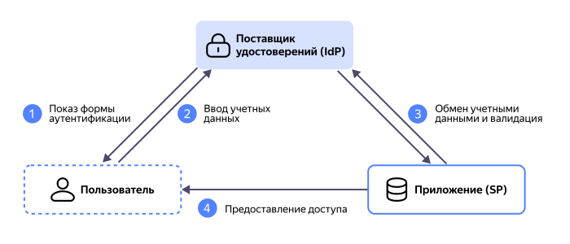

# Технология единого входа (SSO)

_Технология единого входа_ (Single Sign-On) — способ аутентификации, при котором пользователь использует одну учетную запись во множестве сервисов. Например, в банковском приложении, площадке для инвестиций и сервисах партнеров банка. SSO избавляет пользователя от необходимости создания множества учетных записей и ввода учетных данных в каждом новом сервисе. Это упрощает доступ к приложениям, повышает безопасность и централизует управление учетными записями.

SSO была разработана в 1980-х годах, когда начали появляться корпоративные сети. Одними из первых решений стали протокол Kerberos и [IBM RACF](https://www.ibm.com/products/resource-access-control-facility?ysclid=megryyk2d5254953060) (Resource Access Control Facility). В 1990-х системы стали усложняться, и компания Microsoft представила миру Active Directory. Эти технологии до сих пор широко используются в корпоративной среде, однако для бизнес-приложений придумано немало и других [решений](#protocols).

## Принцип работы {#how-work}

Технология единого входа состоит из трех основных компонентов:

* Пользователь.
* Поставщик удостоверений (IdP, Identity Provider) — центральный сервер, который проверяет данные пользователей и выдает им токены доступа. Например, Яндекс ID, Тинькофф ID, VK ID и многие другие.
* Приложение или поставщик услуг (SP, Service Provider) — веб-приложение, у которого пользователь запрашивает доступ.



Опуская нюансы, связанные с выбором [протокола](#protocols), компоненты взаимодействуют друг с другом следующим образом:

1. Пользователь запрашивает аутентификацию у приложения.
1. Приложение перенаправляет запрос поставщику удостоверений.
1. Поставщик удостоверений просит пользователя ввести учетные данные и подтверждает его личность.
1. Поставщик удостоверений генерирует токен (или утверждение в случае [SAML](#protocols)), содержащий учетные данные пользователя, права доступа и другую информацию. Полученный набор данных работает на всех приложениях, связанных с поставщиком удостоверений. Это своего рода билет, дающий право использовать функциональность всех приложений, связанных с поставщиком удостоверений. Пример токена:

   ```json
   {
     "id_token": "ehg39jgh********",
     "access_token": "t1.9euelZqV********",
     "refresh_token": "1//04T..."
   }
   ```

1. Пользователь передает токен приложению. При каждом новом входе сервис обращается к поставщику удостоверений для проверки валидности токена. Если токен валиден, пользователь получает доступ. Пользователь может использовать сервис до тех пор, пока не истечет срок действия токена или он сам не закончит сессию.

### Протоколы SSO {#protocols}

Для более подробного описания принципа работы технологии единого входа необходимо уточнить, по какому протоколу она работает. Рассмотрим основные из них:

* **OpenID Connect** — расширенный протокол [OAuth 2.0](#oauth), который подтверждает личность пользователя, передавая токен с именем, почтой и другими данными. Так работают всем знакомые кнопки вроде **Войти через Яндекс ID**. Используется в большинстве современных приложений, поддерживающих Single Sign-On.
* **SAML** (Security Assertion Markup Language) — вместо токена данные передаются в виде XML-документа, который называется [_утверждением_](https://ru.wikipedia.org/wiki/Утверждение_(программирование)) (assertion). Используется в основном крупными компаниями для обеспечения единого доступа к ресурсам. Например, по протоколу SAML работает [федерация удостоверений](../organization/concepts/add-federation.md) в {{ yandex-cloud }}.

Аспект | SAML | OpenID Connect
-------|------|---------------
Назначение | Корпоративные системы | Приложения
Формат данных | XML | JSON
Пример использования | Получение доступа к сервисам {{ yandex-cloud }} через федерацию удостоверений | Подключение к маркетплейсу через Яндекс ID

Совместно с SAML и OpenID Connect для входа могут использоваться мобильное устройство, биометрия, смарт-карты и другие способы подтверждения личности, образуя систему _многофакторной аутентификации_.

### OAuth 2.0 {#oauth}

В качестве компонента SSO-системы также может использоваться стандартный фреймворк OAuth 2.0. Его некорректно называть полноценным протоколом SSO, как OpenID Connect, поскольку он не аутентифицирует пользователя, а только предоставляет доступ к ресурсам от имени владельца. Так работает, например, доступ по ссылке к документам в облачном хранилище. Близкой аналогией будет ключ от комнаты (OAuth 2.0) и паспорт (OpenID Connect).

Рассмотрим различия с OpenID Connect подробнее:

Аспект | OAuth 2.0 | OpenID Connect
-------|-----------|---------------
Назначение | Делегированный доступ | Авторизация
Вид токенов | Access-токен, позволяющий обращаться к ресурсам от имени владельца | ID-токен, идентифицирующий личность пользователя
Совместимость | Более гибкий, но требует дополнительной настройки для каждого провайдера | Стандартизирован, поэтому проще интегрируется в совместимые системы
Пример использования | Приложение получает доступ к вашему Яндекс Календарю, чтобы создавать события | Приложение получает ваши учетные данные, чтобы вы могли использовать его функции

## Преимущества SSO {#advantages}

Преимущества аутентификации с использованием Single Sign-On для пользователя очевидны: меньше путаницы с паролями, быстрый доступ к сервисам, вход через знакомые платформы. Однако серьезную выгоду могут извлечь и организации:

* Все учетные данные хранятся в одном месте. В случае увольнения сотрудника можно отключить его учетную запись в поставщике удостоверений, и он потеряет доступ ко всем системам разом.
* Повышается безопасность. Сотрудники могут использовать более сложные пароли и многофакторную аутентификацию.
* Снижаются затраты на поддержку. Пользователи реже сталкиваются с проблемами входа и обращаются за помощью.
* Повышается соответствие стандартам безопасности, таким как [GDPR](https://ru.wikipedia.org/wiki/Общий_регламент_по_защите_данных) и [HIPAA](https://ru.wikipedia.org/wiki/HIPAA). SSO предоставляет подробный мониторинг входа и выхода из систем.
* Повышается гибкость интеграции. SSO позволяет быстро подключать новые приложения и сервисы, что упрощает масштабирование.

## Недостатки и риски SSO {#disadvantages}

Технология единого входа также сопряжена с определенными недостатками и рисками. Подробно разберем проблемы, с которыми вы можете столкнуться при интеграции SSO:

1. **Проблемы безопасности**

   Получив доступ к аккаунту пользователя, злоумышленник получает доступ ко всем сервисам, в которых он был аутентифицирован. Чтобы снизить риски, нужно использовать надежное шифрование токенов, обучать сотрудников методам защиты от фишинга и внедрять многофакторную аутентификацию.

1. **Технические сложности**

   Внедрение SSO требует тщательной настройки IdP и подключенных сервисов, что невозможно без квалифицированных специалистов.

   Также важно учесть, что разные приложения могут быть совместимы с разными протоколами SSO или даже не поддерживать ни один из них. Это может вылиться в огромные затраты на доработку этих приложений.

1. **Проблемы с конфиденциальностью**

   Поставщик удостоверений должен быть хорошо защищен, потому что содержит учетные и часто личные данные всех пользователей. Также утечки возможны при передаче данных между компонентами SSO.

   Если организация использует стороннего поставщика удостоверений, стоит понимать, что пользовательские данные и сведения об активности будут храниться у третьей стороны.

1. **Единая точка отказа**

   Если IdP выходит из строя, пользователи теряют доступ ко всем приложениям разом. То же самое происходит с одним пользователем, если он забудет пароль или столкнется с другими трудностями при входе. Чтобы не нарушить бизнес-процессы, каждую проблему необходимо решать максимально быстро.

## Различия с менеджером паролей {#pass-manager-diff}

Single Sign-On иногда путают с Same Sign-On (одинаковый вход), который предполагает использование менеджера паролей. Однако менеджер паролей только запоминает учетные данные при каждой регистрации в новом приложении, а вводить их придется каждый раз заново. То есть это просто удобное хранилище, не связанное с приложениями напрямую.

Single Sign-On подразумевает доверительные отношения между поставщиком удостоверений и приложениями. Процедуру регистрации достаточно пройти только один раз — это обеспечит доступ ко всем приложениям, зарегистрированным в сервисе единого входа.

## SSO в {{ yandex-cloud }} {#sso-yc}

Сервис [{{ org-full-name }}](../organization/) с помощью технологии единого входа может выступать в двух ролях:

* Поставщик услуг (Service Provider) — [федерации удостоверений](../organization/concepts/add-federation.md) предоставляют доступ к ресурсам {{ yandex-cloud }} пользователям, зарегистрированным в корпоративных системах. Для аутентификации используется протокол SAML 2.0.
* Поставщик удостоверений (Identity Provider) — {{ org-name }} предоставляет доступ к внешним сервисам через [SAML-приложения](../organization/concepts/applications.md#saml) и [OIDC-приложения](../organization/concepts/applications.md#oidc).

Подробнее см. в [документации {{ org-name }}](../organization/concepts/add-federation.md).
