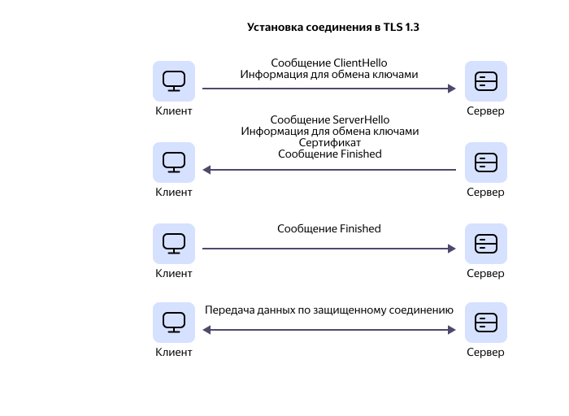

# Введение в TLS: обзор принципов и основных характеристик

_TLS (Transport Layer Security)_ — криптографический протокол, который часто применяется для обеспечения безопасной передачи данных на транспортном уровне. Этот протокол в первую очередь предназначен для обеспечения защищенной связи между двумя или более веб-приложениями. Подробнее о применении TLS читайте в разделе [Применение TLS в различных сферах](#application).

Первая версия протокола (TLS 1.0) была продолжением протокола [SSL](ssl-certificate.md) 3.0 (Secure Sockets Layer). Однако название протокола было изменено, чтобы подчеркнуть, что TLS не связан с компанией Netscape Communications, разработавшей SSL. Из-за этого термины TLS и SSL иногда используются как взаимозаменяемые. При этом нужно отметить, что в 2015 году протокол SSL был признан устаревшим.

## Основные функции TLS {#functions}

Три основные функции TLS, которые помогают обеспечить сохранность передаваемых данных:

* [Шифрование](#encryption): скрывает данные, передаваемые от третьих лиц.
* [Аутентификация](#authentication): позволяет убедиться, что стороны, обменивающиеся информацией, действительно те, за кого они себя выдают.
* [Целостность](#integrity): гарантирует, что данные не были потеряны, повреждены, подделаны или сфальсифицированы.

Технически вы не обязаны использовать все три компонента, и можете принять сертификат без проверки его подлинности. Но вы должны понимать, что такое выборочное использование протокола увеличивает риски компрометации данных. На практике безопасное веб-приложение использует все три службы.

### Шифрование в TLS {#encryption}

Протокол TLS применяет как симметричное, так и ассиметричное шифрование данных. Это вызвано особенностями каждого из этих типов шифрования.

_Симметричное шифрование_ предполагает наличие одного секретного ключа. Этот ключ нужен отправителю, чтобы зашифровать передаваемые данные, и получателю, чтобы их расшифровать. Применение одного ключа и для шифрования, и для дешифровки данных делает этот способ наиболее простым. Однако в таком случае процедура обмена ключами может быть небезопасной.

_Асимметричное шифрование_ предполагает наличие не одного ключа, а пары — открытого и закрытого, которые связаны между собой математически. Отправитель использует открытый ключ для шифрования передаваемых данных, а получатель расшифровывает полученные данные с помощью закрытого ключа. Этот способ шифрования более безопасный, но требует больше времени и ресурсов.

Использование обоих типов шифрования помогает протоколу TLS держать баланс между скоростью работы и безопасностью. Асимметричное шифрование используется на начальном этапе соединения для обмена ключами и аутентификации, а симметричное — для шифрования непосредственно сообщений.

### Аутентификация в TLS {#authentication}

Выполнение проверки подлинности сторон позволяет протоколу TLS гарантировать безопасность взаимодействия. Подлинность сторон подтверждается наличием действующего сертификата, выданного CA (Certificate Authority — доверенный центр сертификации). Сертификат может запросить как клиент у сервера, так и сервер у клиента в случае необходимости. Данный механизм защищает передаваемые данные от MITM-атак (Man-in-the-Middle — человек посередине), когда третья сторона вмешивается в соединение двух участников и перехватывает закрытые ключи. Таким образом злоумышленник может получить передаваемые данные, часто оставаясь незамеченным для обеих сторон.

### Целостность данных в TLS {#integrity}

TLS гарантирует защиту передаваемых данных от потери, изменения или дублирования. Для этого применяются функции хеширования, вычисляющие контрольный хеш данных и присоединяющие его к основному сообщению. Сравнение отправленной и полученной хеш-суммы данных позволяет убедиться в том, что информация пришла в исходном виде.

## Этапы установки безопасного соединения {#stages}

Для обеспечения безопасного соединения протокол TLS использует механизм установления связи клиент-сервер. Основные этапы этого процесса:

1. Обмен возможностями шифрования. На этом этапе клиент и сервер согласуют наиболее надежный алгоритм шифрования, который они оба могут использовать.
1. Аутентификация. На этом этапе сервер отправляет клиенту свой цифровой сертификат. Клиент проверяет его и убеждается в подлинности сервера.
1. Обмен сеансовыми ключами. Во время этого процесса клиент и сервер должны согласовать ключ, которым будут шифровать последующие сообщения. Также это позволяет убедиться, что обмен данными действительно осуществляется между ними, а не кем-то, пытающимся перехватить информацию.

## Недостатки и уязвимости TLS {#disadvantages}

Любой протокол безопасности, в том числе и TLS, имеет некоторые недостатки и уязвимости, обусловленные особенностями реализации. Рассмотрим наиболее существенные минусы TLS:

* **Снижение скорости**: использование протокола TLS требует дополнительного времени и ресурсов, что может замедлить работу сайта или приложения.

* **Уязвимости**: применение TLS (как и любого другого протокола) не гарантирует 100% безопасности, поскольку у любой технологии со временем могут быть обнаружены свои уязвимости. Например, [устаревшие версии протокола TLS](#outdated-versions) уязвимы для некоторых форм кибератак, в том числе MITM. Рекомендуется использовать наиболее защищенную версию протокола — TLS 1.3.

* **Небезопасное шифрование**: при использовании протокола TLS стороны могут сами решать, какую форму шифрования использовать для обмена данными. Большинство стандартов шифрования, поддерживаемых TLS, чрезвычайно надежны. Однако TLS может позволить неправильно настроенному серверу или устаревшему программному обеспечению выбрать метод шифрования, который не соответствует уровню защиты, требуемому для современных угроз.

* **Совместимость**: большинство современных веб-приложений и сервисов поддерживают [актуальные версии TLS](#actual-versions). Однако проблемы совместимости могут возникнуть при работе с устаревшими версиями протокола.

* **Стоимость**: внедрение протокола TLS сопряжено с определенными затратами. Сумма, которую необходимо заплатить, зависит от количества доменов и поддоменов, а также от проверки личности.

## Преимущества использования TLS {#advantages}

По сравнению с другими протоколами безопасности, TLS имеет ряд преимуществ, которые делают его более предпочтительным для корпоративного использования:

* Безопасность встроена непосредственно в приложения, а значит не нужно использовать дополнительное программное или аппаратное обеспечение.
* Обеспечивается сквозное шифрование между взаимодействующими устройствами.
* Есть возможность контролировать, какими данными могут обмениваться стороны в ходе сеанса шифрования.
* Протокол TLS поддерживает NAT (преобразование сетевых адресов), поскольку работает на транспортном уровне.
* В TLS встроены функции журналирования и аудита.

В целом, преимущества использования TLS намного перевешивают недостатки. Если пользователь вашего сайта видит замок в адресной строке, это придает ему уверенности при выполнении транзакций, вводе данных или просмотре веб-страниц.

## Эволюция TLS {#evolution}

#|
|| **Версия протокола TLS** | 
**Год выпуска** | 
**Основные характеристики** | 
**Доля сайтов, поддерживающих версию протокола** (по данным [SSL Labs](https://www.ssllabs.com/ssl-pulse/) за октябрь 2023г.) ||
|| TLS 1.0 | 
1999 | 
* Основан на SSL 3.0.
* Соединение может быть понижено до SSL 3.0. 
* Поддерживает только устаревшие и небезопасные алгоритмы. | 
29,8% ||
|| TLS 1.1 | 
2006 | 
* Поддерживает аутентифицированное шифрование.
* Поддерживает только устаревшие и небезопасные алгоритмы. | 
32,1% ||
|| TLS 1.2 | 
2008 | 
* Поддерживает более безопасные алгоритмы.
* Позволяет серверу выбирать шифр, который поддерживаются обеими сторонами.
* Поддерживает аутентифицированное шифрование с дополнительными режимами передачи данных.
* Позволяет использовать расширенные наборы шифров.
* Полное рукопожатие включает два цикла обмена данными.| 
99,9% ||
|| TLS 1.3 | 
2018 | 
* Применяет генерацию уникального ключа сеанса для каждого пользователя, чтобы защитить ключи от использования для расшифровки данных прошлых или будущих сеансов.
* Использует только простые и надежные наборы шифров, которые не имеют уязвимостей.
* Заменяет процесс обмена ключами RSA методом [Диффи-Хеллмана](https://ru.wikipedia.org/wiki/Протокол_Диффи_—_Хеллмана).
* Шифрование и аутентификация реализованы в едином цикле.
* Использует меньший набор упрощенных шифров.
* Предполагает более быстрое рукопожатие.
* Всегда требует цифровые подписи.| 
65,5% ||
|#

### Устаревшие версии — TLS 1.0 и TLS 1.1 {#outdated-versions}

Версии 1.0 и 1.1 были официально признаны IETF (Internet Engineering Task Force — организация по стандартизации интернета) устаревшими в марте 2021 года после того, как было обнаружено, что в них имеется несколько критических уязвимостей к таким атакам, как:

* **Атака повторных переговоров**
  Одна из версий MITM-атаки более низкого уровня. Злоумышленник перехватывает https-соединение и вставляет свои собственные запросы в начало диалога клиента с веб-сервером.

* **BEAST**
  Аналогична атакам MITM. Уязвимость к такой атаке была обнаружена еще в 2002 году. С помощью Java-апплета злоумышленник может нарушить политику [правила ограничения домена](https://ru.wikipedia.org/wiki/Правило_ограничения_домена), то есть перенаправить данные на другой домен и таким образом узнать номера кредитных карт, пароли и другую конфиденциальную информацию. К BEAST-атаке уязвимы старые версии некоторых браузеров и операционных систем.

* **POODLE**
  Дополнение Oracle к устаревшему шифрованию с пониженным рейтингом было объявлено как недостаток безопасности в 2014 году. Атака POODLE может использоваться для взлома протоколов безопасности транспортного уровня. Для этого злоумышленник принудительно понижает версию TLS-соединения до более уязвимого протокола SSL 3.0.

* **ROBOT**
  Эта атака использует уязвимость в шифровании RSA. Во время установления связи RSA между клиентом и сервером злоумышленник отправляет серию сообщений об обмене ключами клиента с неправильным заполнением. На основе ответов сервера определяется, уязвим ли сервер. Если это так, трафик может быть записан и расшифрован с помощью закрытого ключа сервера.

* **SWEET 32**
  Используя уязвимости в алгоритмах блочного шифрования, злоумышленник использует JavaScript для бомбардировки сервера миллионами запросов, создавая коллизию (два блока шифрования с одинаковым ключом). Это позволяет ему расшифровать передаваемые данные.

* **LUCKY 13**
  Атака Lucky13 использует специфические аспекты системы шифрования данных TLS — режим работы цепочки блоков шифрования и схемы MAC-then-Encrypt. Эта атака позволяет полностью восстановить открытый текст для OpenSSL, по времени, затраченному на обработку сообщений TLS.

* **CRIME и BREACH**
  Атаки CRIME и BREACH позволяют злоумышленнику получить и расшифровать cookie-файлы пользователя, такие как данные аутентификации, электронный адрес и другое. Атаки вида CRIME в значительной степени подавляются, но от их разновидности BREACH крайне трудно защититься. Однако, чтобы она сработала, злоумышленнику надо заставить пользователя перейти по вредоносной ссылке.

### Актуальные версии — TLS 1.2 и TLS 1.3 {#actual-versions}

Наиболее актуальными дополнениями к семейству TLS в настоящее время принято считать версии 1.2 и 1.3. В этих версиях учтены недостатки и уязвимости предшественников, так что они обеспечивают большую безопасность передаваемых данных. Основные преимущества актуальных версий указаны в таблице выше.

Самые лучшие показатели безопасности и скорости работы в настоящее время у протокола TLS версии 1.3. Однако самой популярной версией остается TLS 1.2. Это может быть вызвано следующими причинами:

* TLS 1.2 была выпущена на 10 лет раньше, чем TLS 1.3. Необходимо время для перехода с более привычной версии на новую.
* Иногда применение TLS 1.2 предпочтительнее, потому что TLS 1.3 скрывает данные не только от злоумышленников, но и от служб безопасности и организаций, пытающихся перехватить вредоносное ПО и вредоносные атаки.
* TLS 1.2 содержит некоторые удобства, недоступные в TLS 1.3 (например, более простой мониторинг на наличие вредоносных программ).

## Применение TLS в различных сферах {#application}

### Защита сетевых протоколов {#network-protocols-protection}

TLS-протокол используется для защиты сетевых протоколов, которые применяются для обмена данными в интернете:

* _HTTP (HyperText Transfer Protocol)_ — протокол, предназначенный для создания соединения между браузером и сервером. Использовать этот протокол небезопасно, поскольку передаваемые данные не защищены. Шифрование HTTP-трафика с использованием TLS — это один из основных способов его защиты от перехвата и незаконного доступа. Зашифрованный трафик называется HTTPS-трафиком.
  Определить, поддерживает ли веб-сайт шифрование, можно по тому, как начинается URL-адрес веб-страницы:

  * `https: //` — данные шифруются;
  * `http: //` — данные не шифруются.

  Кроме того, большинство браузеров при использовании HTTPS-протокола отображают значок замка в левой части адресной строки. Подробнее о значках, используемых для обозначения безопасности соединения в Яндекс Браузере читайте в [справке](https://yandex.ru/support/browser/security/protect-panel.html#icons).

  Использование HTTP поверх TLS — это стандарт безопасной передачи данных для всех интернет-ресурсов, связанных с покупками и хранением персональных данных пользователей. Кроме того, многие браузеры блокируют незащищенные сайты, тем самым защищая пользователя от компрометации передаваемых данных.

* _FTP (File Transfer Protocol)_ — протокол, используемый для обмена информацией между компьютерами. Применение протокола TLS позволяет обеспечить для такого обмена безопасное соединение. Также использование TLS делает FTP-соединение устойчивее к таким атакам, как [DDoS](ddos.md) и отказ в обслуживании (DoS).

* _SMTP (Simple Mail Transfer Protocol)_ — этот протокол применяют для отправки сообщений электронной почты от отправителя к серверу получателя. Протокол TLS шифрует передаваемые сообщения и, таким образом, защищает их от перехвата или изменения. Для организаций или компаний это может быть особенно важно, поскольку позволяет предотвратить кибератаки на электронную почту, а также связанное с ней мошенничество.

* _POP3 (Post Office Protocol)_ и _IMAP (Internet Message Access Protocol)_ — протоколы, используемые для получения электронной почты. Применение TLS в этих протоколах гарантирует, что только авторизованный пользователь может получить доступ к своей почте и защищает данные от злоумышленников.

### Защита мобильных приложений {#mobile-applications-protection} 

Также TLS может обеспечить защиту мобильных приложений, шифруя данные и проверяя подлинность серверов. Использование этого протокола поможет обезопасить важные данные, такие как пароли, номера кредитных карт или другую личную информацию. При этом не стоит забывать и о других мерах безопасности — использование сложных паролей, двухфакторная аутентификация и регулярное обновление программного обеспечения.

### Использования TLS в Интернете вещей {#iot-protection}

Интернет вещей (IoT) — это быстро растущий сегмент интернета, который включает в себя множество устройств и систем, взаимодействующих друг с другом. К ним относятся домашние камеры наблюдения, телевизионные приставки, термостаты, кухонная техника, медицинские приборы и многие другие устройства, подключенные к интернету. Некоторые из таких устройств могут содержать личную информацию или конфиденциальные данные, которые важно защитить злоумышленников.

Применение протокола TLS может обеспечить безопасный обмен данными в IoT. Одно из главных преимуществ TLS — способность защищать данные от перехвата и манипулирования, а также обеспечивать аутентификацию устройств.

### Будущее TLS — интеграция с новыми технологиями {#new-technologies}

Протокол TLS продолжает развиваться и адаптироваться к новым технологиям и угрозам. В будущем TLS может быть интегрирован с новыми технологиями для улучшения безопасности и функциональности. Например, интеграция TLS с квантовыми вычислениями может помочь защитить от потенциальных атак на основе квантовых компьютеров, которые в будущем могут стать угрозой для существующих систем шифрования. Также возможно объединение TLS с технологией блокчейн, что позволит создать децентрализованную систему безопасности для обмена данными. Это может обеспечить более высокий уровень безопасности и доверия между различными устройствами и системами.

## TLS в {{ yandex-cloud }} {#yandex-cloud-tls}

{{ yandex-cloud}} предлагает сервис для получения, обновления и добавления собственных TLS-сертификатов — [{{ certificate-manager-full-name }}](https://yandex.cloud/ru/services/certificate-manager). [Создайте первый сертификат](../certificate-manager/quickstart/index.md), чтобы использовать TLS в своих облачных сервисах:

* **{{ objstorage-full-name }}**

  {{ objstorage-name }} поддерживает защищенную передачу данных между клиентом и сервисом по протоколу TLS всех версий. Однако, чтобы надежно защитить взаимодействие с сервисом, используйте протокол TLS версии 1.2 и выше. Подробнее в документации [{{ objstorage-name }}](../storage/concepts/tls.md).

* **{{ alb-full-name }}**

  Балансировщики {{ alb-name }} могут терминировать TLS-соединения: отправлять клиентам сертификаты, дешифровать входящий трафик для отправки бэкендам и шифровать ответы бэкендов для отправки клиентам. Для этого просто [настройте балансировщик](../application-load-balancer/tutorials/tls-termination/index.md).

* **{{ speechkit-full-name }}**

  При работе с {{ sk-hybrid-name }} вы можете настроить терминирование TLS-соединения, чтобы безопасно передавать данные для синтеза и распознавания речи по публичной сети. Подробнее в [инструкции](../speechkit-hybrid/operations/tls-proxy.md).
