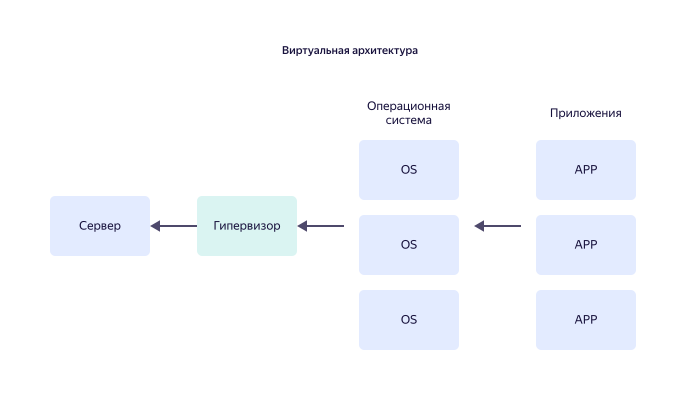

# Виртуальная машина

Виртуальная машина (ВМ) — компьютерная система, эмулирующая возможности каких-либо вычислительных комплексов _гостевых платформ_ (guest) на аппаратно-программном обеспечении _хост-платформы_ (host).

Эмуляция может касаться как возможностей аппаратно-программного комплекса в целом, включая порты ввода-вывода, так и отдельных его частей: операционной системы или вычислительной среды для работы определенной задачи.

## Что такое виртуальная машина (ВМ) {#vm}

Упрощенно, ВМ — это программа, которая имитирует работу другой программы («компьютер внутри компьютера» или «машина внутри машины»). Поскольку имитируемая машина вне среды хост-платформы не существует, она получила название «виртуальной».

### Назначение ВМ {#purpose}

#### Классификация и сферы применения ВМ {#classification}

Все комплексы виртуализации можно условно разделить на виртуализацию системы и виртуализацию процесса.

В первом случае с помощью виртуальной машины эмулируются отдельные операционные системы, хранилища данных, серверные устройства или даже целые компьютерные сети. Особенностью таких виртуальных машин является то, что извне их практически невозможно отличить от реальных устройств или систем.

Во втором случае виртуальная машина необходима для правильной работы определенного приложения. Например, разработанные на языке программирования Java приложения в большинстве случаев требуют для запуска предварительно установленной Java Virtual Machine (JVM) — среды исполнения программного [кода Java](https://ru.wikipedia.org/wiki/Байт-код_Java)(https://en.wikipedia.org/wiki/Java_bytecode). Правильно настроенные виртуальные машины, подобные JVM, запускаются автоматически при запуске программ определенного типа (например, Java-утилит) и не требуют дополнительного вмешательства пользователя.

#### Возможности и ограничения ВМ {#scope}

Основные достоинства ВМ:
1. Возможности ВМ не зависят от возможностей хост-платформы, а определяются исключительно возможностями виртуальной гостевой системы. Например, ВМ с операционной системой Microsoft Windows позволяет запускать совместимые с ней программы на компьютерах от Apple.
1. ВМ могут эмулировать устаревшие аппаратно-программные комплексы. Это позволяет избежать необходимости дорогостоящей технической поддержки оборудования, снятого с производства.
1. На одной многозадачной серверной хост-системе одновременно могут быть запущены несколько виртуальных машин для работы разных сервисов.
1. ВМ легко архивировать, переносить и перенастраивать. Физически виртуальная машина обычно представляет собой единый файл-образ, который можно сохранить на любой доступный носитель цифровой информации.

Недостатки ВМ:
1. Каждая виртуальная машина потребляет ресурсы хост-платформы. Несколько виртуальных машин, запущенных на одном сервере, могут привести к снижению производительности сервера в целом. Отсюда и повышенные требования к выбору хост-устройств.
1. Производительность ВМ всегда ниже, чем производительность реальной машины с теми же характеристиками. Это связано с необходимостью хост-машины дополнительно расходовать ресурсы на поддержание работы среды виртуализации.

Поэтому типовое использование ВМ — предоставление мультисервисных услуг клиентским устройствам при оптимальной загрузке серверного оборудования. Например, на одном правильно выбранном по мощности сервере одновременно могут работать виртуальный почтовый сервер, хранилище данных, СУБД и «песочница» — виртуальная система для безопасного тестирования стороннего программного обеспечения.

Это позволяет экономить финансовые средства на закупке оборудования, постройке специальных серверных помещений, а также потреблении электроэнергии.

### Как работает ВМ {#how-it-works}

#### Структура ВМ {#structure}

Виртуальные машины настраивают с помощью [гипервизоров](virtualization.md#kak-rabotaet-virtualizaciya).

Упрощенное сравнение традиционной аппаратно-программной архитектуры и виртуального комплекса:

Гипервизор отвечает не только за создание, но и за управление виртуальными машинами: запуск и остановку ВМ, распределение доступа к аппаратным и программным ресурсам хоста, архивирование и быстрое развертывание ВМ. Кроме организации доступа клиентов к виртуальным машинам, гипервизор выполняет функции защиты хоста от отклонений в режимах работы на самих ВМ (по аналогии с прокси-сервером для доступа к ресурсам компьютерной сети).

#### Настройка ВМ {#setup}

Конкретные рекомендации по настройке виртуальных машин зависят от используемого аппаратного и программного обеспечения хоста, типа и производителя гипервизора и выбираются на этапе планирования структуры виртуальной системы.

К общим рекомендациям можно отнести следующие:
* Заранее выберите и настройте подсистему хранения данных.

Планирование состава подсистемы хранения включает выбор контроллеров жестких дисков, выбор типов и характеристик дисков, таких как тип интерфейса, объем, время чтения и записи, а также тип RAID-массива, оптимальный по соотношению «скорость работы / общее дисковое пространство / надежность».
* Выделите больше ресурсов для работы ВМ.

Выделение памяти «с запасом», а также разрешение ВМ отключать память при отсутствии необходимости использования ускоряет работу всех виртуальных машин хоста.
* Уменьшите количество фоновых программ.

Использование хост-системы в качестве физического серверного устройства наряду с предоставлением ресурсов виртуальным машинам негативно сказывается на производительности аппаратно-программного комплекса в целом. Даже простое отключение сканирования хост-системы антивирусом в режиме реального времени может дать значительный прирост производительности.
* Используйте различные инструменты мониторинга и сбора метрик для управления производительностью виртуальных машин.

Эти меры позволят эффективно планировать выделяемые виртуальным машинам ресурсы и своевременно выявлять ВМ, имеющие регулярные проблемы с производительностью.

Настройка и оптимизация работы виртуальных машин — трудоемкий процесс, зачастую требующий привлечения сторонних специалистов.

### Виртуальные машины от {{ yandex-cloud }} {#vm-yc}

Одним из вариантов быстрого доступа к виртуальным ресурсам являются облачные вычисления — доступ через интернет к высокопроизводительным хост-системам, расположенным в современных защищенных дата-центрах по всему миру.

Очевидное преимущество облачной ВМ — это удобство настройки и работы с ней, благодаря использованию упрощенного интуитивно-понятного интерфейса.

Примером подобных хост-систем является сервис {{ compute-full-name }} — облачная платформа, использующая инфраструктуру и уникальные технологии Яндекса.

Сервис позволяет создавать виртуальные машины и отказоустойчивые группы виртуальных машин в инфраструктуре {{ yandex-cloud }}, защищенной в соответствии с Федеральным законом Российской Федерации «О персональных данных» №152-ФЗ.

Виртуальные машины {{ compute-full-name }} поддерживают работу со снимками дисков пользователя для быстрого развертывания системы. Кроме того, в [Yandex Cloud Marketplace](https://cloud.yandex.ru/marketplace?categories=os)(https://cloud.yandex.com/marketplace?categories=os) доступны для приобретения диски с образами самых распространенных OC семейства Linux.

Работа сервиса регулируется [соглашением об уровне обслуживания](https://yandex.ru/legal/cloud_sla/)(https://yandex.com/legal/cloud_sla/).

Подключитесь к [сервису](https://cloud.yandex.ru/services/compute)(https://cloud.yandex.com/services/compute) и познакомьтесь с его основными возможностями и тарифами.
