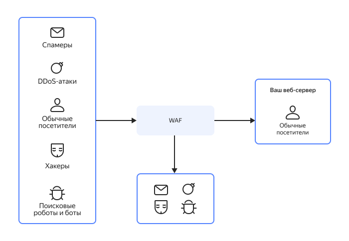
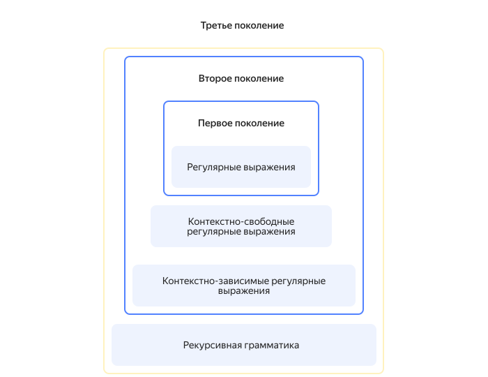

# Введение в WAF (Web Application Firewall)

Web application firewall (WAF) — совокупность средств обнаружения и предотвращения попыток нанести вред или захватить конфиденциальную информацию веб-приложений. Файрвол выступает своего рода посредником между пользователем и приложением, проверяя входящий и исходящий трафик на потенциальный вред. В случае обнаружения опасности WAF может попытаться извлечь вредоносный код или полностью заблокировать запрос.

Современные файрволы веб-приложений состоят из программных мониторов, фильтров, сгруппированных по типам атак правил и алгоритмов машинного обучения.

## История развития {#history}

Первые версии WAF появились в конце 1990-х годов, когда участились атаки на веб-серверы, однако они были далеки от того, что стоит за этим понятием сегодня. Можно выделить три поколения файрволов веб-приложений:

1. Первое поколение работало с только с регулярными выражениями, которые описывали потенциально вредоносный и безопасный трафик. В случае появления неизвестной угрозы приходилось вручную добавлять ее в список. Порой списки доходили до нескольких тысяч регулярных выражений, и проверка по ним трафика сильно нагружала сеть и часто приводила к ложным срабатываниям.

1. В попытках обойти недостатки первого поколения, на следующем этапе, списки регулярных выражений стали разделять на парсеры или токены, которые отвечали за определенные типы атак. Это ускорило работу файрволов, но они по-прежнему требовали постоянного ручного обновления и продолжали ошибочно блокировать безопасный трафик.

1. В третьем поколении технологии WAF эволюционировали за счет машинного обучения. Файрволы стали работать с рекурсивными регулярными выражениями, самостоятельно составляя базу сигнатур. Это значительно облегчило работу специалистов по безопасности, а также уменьшило количество ложных срабатываний и отрицаний.

## Принцип работы WAF {#how-work}

Файрвол веб-приложений отличается от обычного тем, что работает на прикладном уровне [модели OSI](https://ru.wikipedia.org/wiki/Сетевая_модель_OSI) (7-м), в то время как обычный защищает сетевой и транспортный уровни (3-й и 4-й). Используются три основных подхода к обеспечению безопасности:

1. Белый список — файрвол формирует список безопасных моделей поведения, а остальные блокирует.

1. Черный список — файрвол блокирует трафик на основе актуальных сигнатур против известных видов атак, а остальной пропускает.

1. Гибридный — файрвол ориентируется на список как разрешенных, так и запрещенных моделей.

Основываться только на сигнатурах в обеспечении безопасности — малоэффективно, поэтому продвинутые WAF используют правила, позволяющие распознать атаки, даже если злоумышленник не попал в списки сигнатур. Это решение пришло на рынок с развитием искусственного интеллекта и машинного обучения, поскольку вручную писать такие правила — крайне трудоемкая задача.

### Возможности WAF {#features}

Можно выделить несколько основных возможностей большинства WAF:

* мониторинг трафика на SQL-инъекции, сетевые атаки, выявление ботов, автоматического сканирования и других вредоносных активностей;

* фильтрация запросов, которые могут содержать вредоносный код;

* распознавание новых, неизвестных типов угроз путем анализа действий пользователей;

* маршрутизация пользовательского трафика через DNS для уменьшения задержек;

* визуализация полученных данных с помощью отчетов и логов.

Чтобы повысить уровень безопасности, WAF также можно использовать вместе с системой обнаружения вторжений (IDS), системой предотвращения вторжений (IPS) или системой управления информационной безопасностью (ISMS).

## Преимущества использования WAF {#advantages}

Среди преимуществ использования файрвола веб-приложений можно выделить:

* **Защита от известных и неизвестных уязвимостей.** Сигнатуры сетевых атак представляют собой фрагменты их кода.  Однако злоумышленник может модернизировать атаку, и простой антивирус ее не распознает. WAF с помощью машинного обучения может обнаружить и незнакомые виды атак.

* **Минимизация рисков.** Защита WAF глубже анализирует веб-протоколы, чем системы предотвращения вторжений, а также ликвидирует угрозы в отличие от систем обнаружения вторжений. По [данным опроса](https://safe.cnews.ru/news/line/2023-07-25_bez_zashchity_web-prilozhenij) директоров по информационной безопасности, WAF и NGFW (Next-generation firewall) оказались наиболее эффективными решениями против DDoS-атак.

* **Простая настройка и интеграция.** Обычно WAF не требует глубоких знаний в области веб-безопасности. Многие файрволы имеют простой интерфейс и справиться с ними не сложнее, чем с антивирусом.

* **Централизованное администрирование.** Один WAF можно установить на множество своих продуктов и управлять его политиками из единого центра.

## Недостатки и ограничения WAF {#disadvantages}

В то же время файрволы веб-приложений не являются панацеей и имеют ряд недостатков:

* **Ложные срабатывания.** Чем больше ответственности возложить на этот инструмент, тем чаще он будет ошибаться. В некоторых случаях требуется тонкая настройка, иначе файрвол постоянно будет блокировать лишние запросы.

* **Неэффективность против некоторых видов атак.** Файрволы веб-приложений ориентированы на аномальное поведение, и опытный хакер может маскировать атаки так, чтобы нарушать логику работы приложения и не выдавать себя.

* **Постоянное обновление.** Технологии атак идут в ногу с рынком защитных средств, поэтому, несмотря на возможность самостоятельного обучения, WAF все еще нуждаются в частом пополнении баз сигнатур и обновлении правил.

## Виды WAF {#types}

WAF могут быть аппаратными, программными и облачными. Каждый вид имеет свои особенности, а выбор зависит от возможностей и стратегии компании:

* **Программные.**

    Такие WAF представляют собой дополнительный софт и встраиваются в уже существующую инфраструктуру, расширяя ее возможности. Программные файрволы могут оказаться лучшим решением для небольших компаний, но они не обладают способностями к эффективной масштабируемости и меньше поддерживаются со стороны поставщика.

* **Аппаратные.**

    Это специальные физические устройства, которые устанавливаются локально и выполняют роль сетевого шлюза между интернетом и сервером компании. Они более надежны, чем программные, но сложнее настраиваются и дороже стоят. Если у компании нет своих технических специалистов, то платить также придется за установку и настройку. Также оборудование имеет свойство устаревать и выходить из строя, что тоже требует средств.

* **Облачные.**

    Сегодня все больше компаний смотрят в сторону облачного решения, поскольку оно имеет ряд преимуществ:

    * провайдер сам отвечает за настройку и обновление ПО;
    * в случае проблемы с одной виртуальной машиной, сервер не будет простаивать, поскольку трафик перенаправляется на другую;
    * файрвол эффективнее использует машинное обучение и работает со всеми типами уязвимостей за счет данных по всем клиентам провайдера;
    * как правило, облачный провайдер предоставляет клиентам широкую техническую поддержку.

## Примеры использования WAF {#cases}

Чаще всего WAF можно увидеть в интернет-магазинах, онлайн-платежах и любом другом интернет-бизнесе, который не хочет столкнуться со взломом. Однако этим применимость технологии не ограничивается. Рассмотрим несколько примеров из разных областей:

* **Электронная коммерция.** Китайская компания SHOPYY предоставляет малому бизнесу площадку для продажи, но с ростом клиентской базы все чаще случались сбои в работе сайта. Внедренный облачный WAF за месяц [заблокировал](https://www.datamation.com/security/5-web-application-firewall-case-studies/) более 4 миллионов кибертак, а также снизил среднее время загрузки страницы на 72%.

* **Розничная торговля.** Производитель офисной техники Steelcase создала глобальную сеть дистрибуции и столкнулась с необходимостью внедрить общую защиту на все свои домены. С помощью WAF им удалось внедрить единую защиту с упрощенным управлением для всех своих платформ.

* **Технологии.** IT-компания NTT TechnoCross ежедневно сталкивалась с кибератаками, но вместо найма дополнительных специалистов по безопасности они решили обратиться к облачной защите. Организации удалось снизить операционную нагрузку, сэкономить и защитить свой сайт от угроз.

* **Страхование.** Ведущая нидерландская страховая компания Aevitae использует в работе локальную инфраструктуру и облачные сервисы. Им требовалось найти решение проблем безопасности, которое обеспечило бы сквозную видимость данных. Компании удалось быстро внедрить гибкий и масштабируемый WAF.

## Тенденции и будущее WAF {#trends}

Технологии машинного обучения теперь есть и у злоумышленников, поэтому в будущем системам безопасности придется столкнуться с новыми вызовами. Работа над модернизацией файрволов веб-приложений ведется по следующим основным направлениям:

* активное взаимодействие с технологиями машинного обучения и искусственного интеллекта;

* защита от уязвимостей нулевых дней, то есть тех, которые еще неизвестны разработчикам;

* интеграция с другими системами безопасности;

* улучшение гибкости и автоматизации;

* анализ поведения пользователей для борьбы с социальной инженерией и фишингом;

* улучшение точности анализа, направленное на снижение количества ложных срабатываний.

## Продукты WAF от {{ yandex-cloud }} {#waf-yc}

{{ yandex-cloud }} предлагает пять продуктов для защиты ваших веб-приложений:

1. [WAF в {{ sws-full-name }}](../smartwebsecurity/concepts/waf.md) — межсетевой экран, предоставляющий набор базовых правил [OWASP Core Rule Set](https://coreruleset.org/) для защиты веб-приложений. 
1. [Вебмониторэкс API Security](/marketplace/products/webmonitorx/node) — решение для защиты веб‑приложений и API от хакерских атак и автоматического поиска уязвимостей.
1. [SolidWall WAF](/marketplace/products/solidsoft/solidwall-waf) — самый мощный файрвол от {{ yandex-cloud }}, который контролирует процесс работы приложений и выявляет уязвимости бизнес-логики.
1. [Nemesida AI MLC](/marketplace/products/pentestit/nwaf-mlc) — ВМ для построения поведенческих моделей и выявления прочих аномалий.
1. [Nemesida WAF WEB](/marketplace/products/pentestit/nwaf-api-lk-st) — ВМ для настройки взаимодействия компонентов между собой, визуализации информации об атаках и управления обучением модуля Nemesida AI.

Образы виртуальных машин можно использовать самостоятельно либо воспользоваться услугой [Managed WAF](../security/standard/app-security.md#use-waf) от {{ yandex-cloud }}.

Подробнее о том, какой продукт выбрать для защиты, читайте в статье [Защита от DDoS-атак и WAF в {{ yandex-cloud }}](/solutions/anti-ddos).
