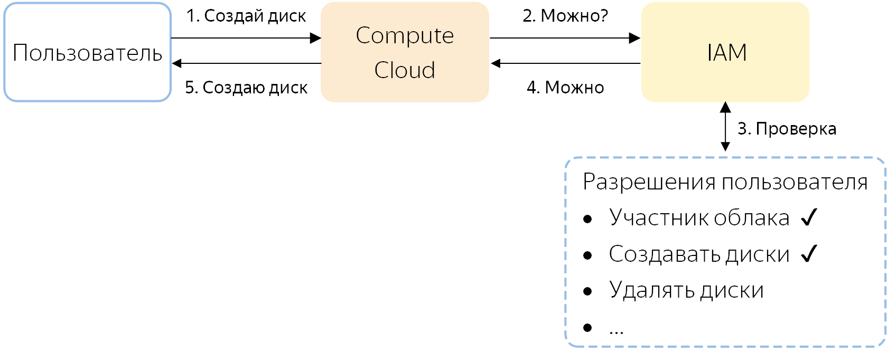
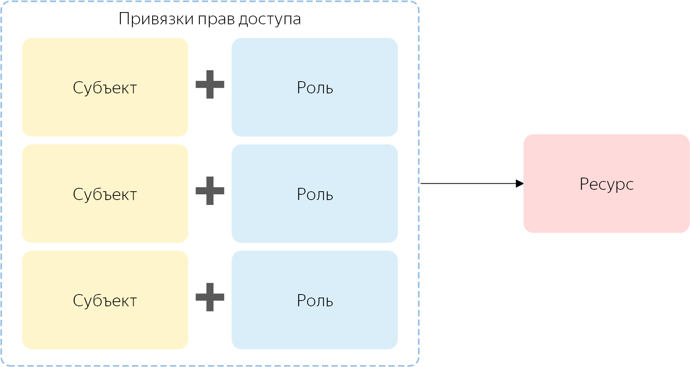

# Как устроено управление доступом в {{ yandex-cloud }}

На этой странице можно узнать, как управлять доступом к ресурсам, и как {{ iam-short-name }} проверяет права доступа к ним.

## Как проверяются права доступа? {#access-verifying}

Все операции в {{ yandex-cloud }} предварительно отправляются на проверку в {{ iam-short-name }}, например:

1. Пользователь просит сервис {{ compute-name }} создать новый диск в каталоге <q>default</q>.
1. Сервис спрашивает {{ iam-short-name }}, можно ли этому пользователю создать диск в этом каталоге.
1. {{ iam-short-name }} проверяет, что пользователь — участник облака с каталогом <q>default</q> и имеет необходимые разрешения для создания диска в этом каталоге.
1. Если какого-то из разрешений у пользователя нет, операция не будет выполнена, и {{ yandex-cloud }} сообщит об ошибке.
    Если все разрешения имеются, то {{ iam-short-name }} сообщает об этом сервису.
1. Сервис создает новый диск.

## Как вы управляете доступом? {#how-do-i-perform-access-management}

Управление доступом в {{ yandex-cloud }} построено на политике [Role Based Access Control](https://en.wikipedia.org/wiki/Role-based_access_control) (RBAC). Чтобы предоставить доступ к ресурсу, вы указываете, кому и какие [роли](roles.md) назначены на ресурс.

Чтобы назначить роль, вы [выбираете ресурс](#resource), [выбираете роль](#role) и [описываете субъект](#subject), которому назначается роль. Таким образом вы [привязываете права доступа](#access-bindings) к ресурсу.

Вы также можете назначить роль на родительский ресурс, от которого [наследуются права доступа](#inheritance), например назначить роль на каталог или облако.



Изменение прав доступа обычно занимает до 5 секунд. Если после назначения роли все еще нет доступа, попробуйте выполнить операцию еще раз.

Например, вам разрешили создавать каталоги в облаке и вы уже создали один каталог, но не смогли создать второй. Это произошло потому, что еще не обновились права доступа на том сервере, где выполнялась вторая операция по созданию каталога. Попробуйте создать каталог еще раз.



### Ресурсы, на которые можно назначать роли {#resource}

Сейчас вы можете назначать роли [на облако](../../../resource-manager/operations/cloud/set-access-bindings.md), [каталог](../../../resource-manager/operations/folder/set-access-bindings.md) и другие ресурсы из [списка](resources-with-access-control.md).

Если вам необходимо предоставить доступ к ресурсу, которого нет в списке, например к [виртуальной машине](../../../glossary/vm.md), назначьте роль на родительский ресурс, от которого [наследуются](#inheritance) права доступа. У виртуальных машин права доступа наследуются от каталога.

### Роль {#role}

Назначать роли на ресурс могут пользователи с ролью [администратора](roles.md#admin) на этот ресурс, а также владельцы облака, которому принадлежит ресурс.

Каждая роль состоит из набора разрешений, описывающих допустимые операции с ресурсом. Пользователь может назначить роли только с теми разрешениями, которые имеются у него самого. Например, чтобы назначить роль [владельца облака](roles.md#owner), пользователь должен сам обладать этой ролью, а роли администратора для этого недостаточно.

О том, какие есть роли и какие разрешения в них входят, читайте в разделе [{#T}](roles.md).

### Субъект, которому назначается роль {#subject}

Роли назначаются субъектам. Есть четыре типа субъектов:

* `userAccount` — [аккаунт на Яндексе](../index.md#passport), добавленный в {{ yandex-cloud }}.
* `serviceAccount` — [сервисный аккаунт](../users/service-accounts.md), созданный в {{ yandex-cloud }}.

    
* `federatedUser` — аккаунт пользователя  [федерации удостоверений](../../../organization/concepts/add-federation.md), например из Active Directory.

* `group` — группа пользователей, созданная в [{{ org-full-name }}](../../../organization/).

* `system` — [системная группа](system-group.md).

### Привязка прав доступа {#access-bindings}

Роли на ресурс назначаются в виде списка связей _роль-субъект_. Такие связи называются — _привязки прав доступа_ (access bindings). Вы можете добавлять и удалять эти связи, таким образом контролируя права доступа к ресурсу.

Одна привязка — одно назначение роли субъекту. Чтобы назначить пользователю несколько ролей на ресурс, задайте отдельную привязку для каждой из ролей.

### Наследование прав доступа {#inheritance}

Если у ресурса есть дочерние ресурсы, то все разрешения от родительского ресурса будут унаследованы дочерними ресурсами. Например, если вы назначите пользователю роль на каталог, в котором лежит виртуальная машина, то все разрешения этой роли будут действовать и для виртуальной машины.

Если на дочерний ресурс тоже назначены роли, то список разрешений на этот ресурс будет объединен со списком разрешений на родительский ресурс. Нельзя ограничить список разрешений, унаследованных от родительского ресурса.

### Имперсонация {#impersonation}

_Имперсонацией_ называется выполнение пользователем действий с ресурсами облака от имени сервисного аккаунта, которому назначены необходимые права. Имперсонация чаще всего применяется, чтобы временно расширить права пользователя, не прибегая к генерации статических учетных данных.

Например, когда у пользователя нет прав на просмотр каталога, но на какое-то время они ему оказались нужны. Для этого администратор может [назначить](../../operations/sa/set-access-bindings.md#impersonation) сервисному аккаунту роль на просмотр каталога, а пользователю назначить специальную роль `iam.serviceAccounts.tokenCreator`. В результате пользователь сможет от имени сервисного аккаунта просматривать ресурсы в каталоге или получить IAM-токен сервисного аккаунта. Пользователь не сможет изменить права доступа или удалить сервисный аккаунт. 

В нужный момент администратор может отозвать роль.

### Ограничения управления доступом в консоли управления {#console-restrictions}

В консоли управления [назначение ролей](../../operations/roles/grant.md) работает с ограничениями:

* Пользователям с аккаунтом на Яндексе и федеративным аккаунтом можно назначать роли только на облако или каталог.
* Вы не можете назначить роли сразу нескольким субъектам, как в API или CLI. В консоли управления вы сначала выбираете субъект (пользователя или сервисный аккаунт), а затем назначаете ему роли.

#### См. также {#see-also}

Вы можете найти подробную информацию об управлении доступом для конкретного сервиса {{ yandex-cloud }} в разделе <q>Управление доступом</q> в документации соответствующего сервиса.

Пошаговые инструкции и примеры:

* [{#T}](../../operations/roles/grant.md)
* [{#T}](../../operations/roles/revoke.md)
* [{#T}](../../operations/sa/assign-role-for-sa.md)
* [{#T}](../../operations/sa/set-access-bindings.md)
* [{#T}](../../../resource-manager/operations/cloud/set-access-bindings.md)
* [{#T}](../../../resource-manager/operations/folder/set-access-bindings.md)
