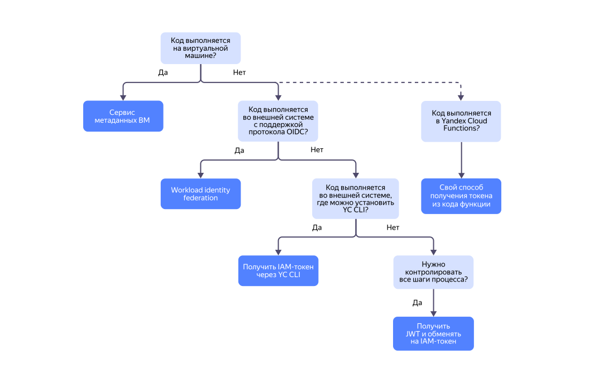

# Получение IAM-токена для сервисного аккаунта

## Выбрать способ получения IAM-токена {#choose-method}

Есть несколько способов получить [IAM-токен](../../concepts/authorization/iam-token.md) для [сервисного аккаунта](../../concepts/users/service-accounts.md):



* [С помощью сервиса метаданных ВМ](../../../compute/operations/vm-connect/auth-inside-vm.md) — предпочтительный способ при работе на виртуальной машине [{{ compute-full-name }}](../../../compute/).
* [С помощью федерации сервисных аккаунтов](../../concepts/workload-identity.md) — если вы хотите аутентифицироваться в API {{ yandex-cloud }} при запросе из внешней системы, совместимой с протоколом [OpenID Connect](https://openid.net/developers/how-connect-works/) (OIDC). Например, интеграция с GitHub, [{{ mgl-full-name }}](../../../managed-gitlab/) или пользовательской инсталляцией {{ k8s }}.
* [С помощью CLI](#via-cli) — самый простой способ, если внешняя система несовместима с протоколом OIDC, но позволяет установить CLI.
* [С помощью JSON Web Token](#via-jwt) — если вы хотите контролировать все этапы процесса формирования IAM-токенов.
* [С помощью функции](../../../functions/operations/function-sa.md) — для получения IAM-токена из кода функции [{{ sf-name }}](../../../functions/).



## Получить IAM-токен с помощью CLI {#via-cli}



Теперь вы можете получить IAM-токен для сервисного аккаунта:


```
yc iam create-token
```






Вы можете использовать созданный профиль для выполнения операций через CLI от имени сервисного аккаунта.



## Получить IAM-токен с помощью JWT {#via-jwt}

Чтобы получить IAM-токен, создайте [JSON Web Token](https://tools.ietf.org/html/rfc7519) (JWT) и обменяйте его на IAM-токен.

### Перед началом работы {#before-you-begin}

1. [Узнайте идентификатор сервисного аккаунта](../sa/get-id.md).
1. [Создайте авторизованные ключи](../authentication/manage-authorized-keys.md#create-authorized-key), которые необходимы при создании JWT. Сохраните идентификатор открытого ключа.

### 1. Создать JWT {#jwt-create}

Сформируйте JWT вручную по инструкции или воспользуйтесь библиотекой для вашего языка.



На [jwt.io](https://jwt.io) можно посмотреть список библиотек и попробовать сгенерировать токен вручную.





- Инструкция {#instruction}

  Сгенерируйте части, из которых состоит JWT:
  * `header` — заголовки JWT в формате Base64Url.
  * `payload` — JWT Claims Set в формате Base64Url.
  * `signature` — подпись, которая создается на основе частей header и payload.

  Чтобы создать JWT, соедините все части, используя точку как разделитель:

  ```
  header.payload.signature
  ```

  **1.1. Формирование header**

  Header JWT для сервисного аккаунта должен содержать поля:
  * `typ` — тип токена, значение всегда `JWT`.
  * `alg` — алгоритм шифрования. Поддерживается только алгоритм [PS256](https://tools.ietf.org/html/rfc7518#section-3.5).
  * `kid` — идентификатор открытого ключа, полученный при [создании авторизованных ключей](../authentication/manage-authorized-keys.md#create-authorized-key). Ключ должен принадлежать сервисному аккаунту, для которого запрашивается IAM-токен.

  Пример:

  ```
  {
    "typ": "JWT",
    "alg": "PS256",
    "kid": "lfkoe35hsk58********"
  }
  ```

  Сохраните результат в кодировке Base64Url.

  **1.2. Формирование payload**

  Payload JWT для сервисного аккаунта должен содержать поля:
  * `iss` — идентификатор сервисного аккаунта, чьим ключом подписывается JWT.
  * `aud` — ссылка, по которой будет запрашиваться IAM-токен: `https://iam.{{ api-host }}/iam/v1/tokens`.
  * `iat` — время выписки токена JWT в формате [Unix timestamp](https://en.wikipedia.org/wiki/Unix_time).
  * `exp` — время окончания действия токена JWT в формате Unix timestamp. Время окончания действия не должно превышать время выписки больше чем на час, то есть `exp - iat ≤ 3600`.

  Пример:

  ```
  {
    "iss": "ajepg0mjt06s********",
    "aud": "https://iam.{{ api-host }}/iam/v1/tokens",
    "iat": 1516239022,
    "exp": 1516240822
  }
  ```

  Сохраните результат в кодировке Base64Url.

  **1.3. Формирование signature**

  Создайте подпись с помощью закрытого ключа, полученного при [создании авторизованных ключей](../authentication/manage-authorized-keys.md#create-authorized-key). Для подписи используйте строку из header и payload, разделенных точкой (`.`):

  ```
  header.payload
  ```

  Поддерживается только алгоритм [PS256](https://tools.ietf.org/html/rfc7518#section-3.5).

  Сохраните результат в кодировке Base64Url.

  Если вы генерируете токен с помощью [jwt.io](https://jwt.io), обратите внимание, что в значении ключа вместо `\n` должны быть подставлены переносы строки.

- Python {#python}

  

  Пример создания JWT с использованием [PyJWT](https://github.com/jpadilla/pyjwt/):
  - Проверено для версии Python 3.13.0 и PyJWT версии 2.10.0.
  - Необходимые данные читаются из JSON-файла, полученного при создании авторизованного ключа.

  Установите модуль `PyJWT` и модуль `cryptography` для работы с алгоритмом `PS256`:
  
  ```bash
  pip3 install PyJWT
  pip3 install cryptography
  ```

  
  ```python
  import time
  import jwt
  import json

  key_path = '<JSON-файл_c_ключами>'

  # Чтение закрытого ключа из JSON-файла
  with open(key_path, 'r') as f:
    obj = f.read() 
    obj = json.loads(obj)
    private_key = obj['private_key']
    key_id = obj['id']
    service_account_id = obj['service_account_id']

  sa_key = {
      "id": key_id,
      "service_account_id": service_account_id,
      "private_key": private_key
  }

  def create_jwt():
      now = int(time.time())
      payload = {
              'aud': 'https://iam.api.cloud.yandex.net/iam/v1/tokens',
              'iss': service_account_id,
              'iat': now,
              'exp': now + 3600
          }

      # Формирование JWT.
      encoded_token = jwt.encode(
          payload,
          private_key,
          algorithm='PS256',
          headers={'kid': key_id}
      )

      print(encoded_token)

      return encoded_token

  create_jwt()
  ```


- Java {#java}

  

  Пример создания JWT с использованием библиотек [JJWT](https://github.com/jwtk/jjwt), [Bouncy Castle](https://github.com/bcgit/bc-java) и [Jackson Databind](https://github.com/FasterXML/jackson-databind):
  - Проверено для Java 21 и JJWT 0.12.5.
  - Необходимые данные читаются из JSON-файла, полученного при создании авторизованного ключа.

  ```java
  package com.mycompany.java.jwt;

  import com.fasterxml.jackson.databind.ObjectMapper;
  import com.fasterxml.jackson.annotation.JsonIgnoreProperties;
  import io.jsonwebtoken.Jwts;
  import io.jsonwebtoken.SignatureAlgorithm;
  import org.bouncycastle.util.io.pem.PemObject;
  import org.bouncycastle.util.io.pem.PemReader;

  import java.io.StringReader;
  import java.nio.file.Files;
  import java.nio.file.Paths;
  import java.security.KeyFactory;
  import java.security.PrivateKey;
  import java.security.spec.PKCS8EncodedKeySpec;
  import java.time.Instant;
  import java.util.Date;

  public class JavaJwt {

      @JsonIgnoreProperties(ignoreUnknown = true)
      public static class KeyInfo {

          public String id;
          public String service_account_id;
          public String private_key;
      }

      public static void main(String[] args) throws Exception {

          String content = new String(Files.readAllBytes(Paths.get("<JSON-файл_c_ключами>")));
          KeyInfo keyInfo = (new ObjectMapper()).readValue(content, KeyInfo.class);

          String privateKeyString = keyInfo.private_key;
          String serviceAccountId = keyInfo.service_account_id;
          String keyId = keyInfo.id;

          PemObject privateKeyPem;
          try (PemReader reader = new PemReader(new StringReader(privateKeyString))) {
              privateKeyPem = reader.readPemObject();
          }

          KeyFactory keyFactory = KeyFactory.getInstance("RSA");
          PrivateKey privateKey = keyFactory.generatePrivate(new PKCS8EncodedKeySpec(privateKeyPem.getContent()));

          Instant now = Instant.now();

          // Формирование JWT.
          String encodedToken = Jwts.builder()
                  .setHeaderParam("kid", keyId)
                  .setIssuer(serviceAccountId)
                  .setAudience("https://iam.{{ api-host }}/iam/v1/tokens")
                  .setIssuedAt(Date.from(now))
                  .setExpiration(Date.from(now.plusSeconds(3600)))
                  .signWith(privateKey, SignatureAlgorithm.PS256)
                  .compact();
          System.out.println(encodedToken);
      }
  }
  ```

- C# {#csharp}

  

  Пример создания JWT с использованием [jose-jwt](https://www.nuget.org/packages/jose-jwt/):
  - Проверено для версии пакета jose-jwt 5.0.0.

  **Net Framework / Net Core**:

    Проверено для версий Net Framework 4.8.1 и Net Core 3.1.

    ```c#
    using System;
    using System.Collections.Generic;
    using System.IO;
    using System.Security.Cryptography;
    using Jose;
    using Org.BouncyCastle.Crypto.Parameters;
    using Org.BouncyCastle.OpenSsl;
    using Org.BouncyCastle.Security;
    
    namespace ConsoleApp
    {
        class Program
        {
            static void Main(string[] args)
            {
                var serviceAccountId = "<идентификатор_сервисного_аккаунта>";
                var keyId = "<идентификатор_открытого_ключа>";
                var now = DateTimeOffset.UtcNow.ToUnixTimeSeconds();
    
                var headers = new Dictionary<string, object>()
                {
                    { "kid", keyId }
                };
    
                var payload = new Dictionary<string, object>()
                {
                    { "aud", "https://iam.{{ api-host }}/iam/v1/tokens" },
                    { "iss", serviceAccountId },
                    { "iat", now },
                    { "exp", now + 3600 }
                };
    
                RsaPrivateCrtKeyParameters privateKeyParams;
                using (var pemStream = File.OpenText("<файл_закрытого_ключа>"))
                {
                    privateKeyParams = new PemReader(pemStream).ReadObject() as RsaPrivateCrtKeyParameters;
                }
    
                using (var rsa = RSA.Create())
                {
                    rsa.ImportParameters(DotNetUtilities.ToRSAParameters(privateKeyParams));
                    string encodedToken = Jose.JWT.Encode(payload, rsa, JwsAlgorithm.PS256, headers);
                }
            }
        }
    }
    ```

  **.NET 5.0+**:
    
    Проверено для NET 5.0, NET 6.0, NET 7.0, NET 8.0.

    ```c#
    using System;
    using System.Collections.Generic;
    using System.IO;
    using System.Security.Cryptography;
    using Jose;

    namespace ConsoleApp
    {
        class Program
        {
            static void Main(string[] args)
            {
                var serviceAccountId = "<идентификатор_сервисного_аккаунта>";
                var keyId = "<идентификатор_открытого_ключа>";
                var now = DateTimeOffset.UtcNow.ToUnixTimeSeconds();

                var headers = new Dictionary<string, object>()
                {
                    { "kid", keyId }
                };

                var payload = new Dictionary<string, object>()
                {
                    { "aud", "https://iam.{{ api-host }}/iam/v1/tokens" },
                    { "iss", serviceAccountId },
                    { "iat", now },
                    { "exp", now + 3600 }
                };

                using (var rsa = RSA.Create())
                {
                    rsa.ImportFromPem(File.ReadAllText("<файл_закрытого_ключа>").ToCharArray());
                    string encodedToken = Jose.JWT.Encode(payload, rsa, JwsAlgorithm.PS256, headers);
                }
            }
        }
    }
    ```

- Go {#go}

  

  Пример создания JWT с использованием [golang-jwt](https://github.com/golang-jwt/jwt):
  - Проверено для версии Go 1.23.1 и golang-jwt версии v5.
  - Закрытый ключ читается из JSON-файла, полученного при создании авторизованного ключа.

  Установите необходимые пакеты:

  ```
  install jwt v5
  go get -u github.com/golang-jwt/jwt/v5
  ```

    
  ```go
  package main  
  
  import (
  	"crypto/rsa"
  	"encoding/json"
  	"log"
  	"os"
  	"time"
  
  	"github.com/golang-jwt/jwt/v5"
  )
  
  func main() {
    // Получение токена
  	token := signedToken()
    // Сохранение токена в файл
  	err := os.WriteFile("jwt_token.txt", []byte(token), 0644)
  	if err != nil {
  	  log.Fatal(err)
  	}
  	// Вывод токена в консоль
  	fmt.Println("Here is token:")
  	fmt.Println(token)
  }
  
  const (
    keyID            = "<идентификатор_открытого_ключа>"
    serviceAccountID = "<идентификатор_сервисного_аккаунта>"
    keyFile          = "<JSON-файл_c_ключами>"
  )
  
  // Формирование JWT.
  func signedToken() string {
  	claims := jwt.RegisteredClaims{
  	 	Issuer:    serviceAccountID,
  	 	ExpiresAt: jwt.NewNumericDate(time.Now().UTC().Add(1 * time.Hour)),
  	 	IssuedAt:  jwt.NewNumericDate(time.Now().UTC()),
  	 	NotBefore: jwt.NewNumericDate(time.Now().UTC()),
  	 	Audience:  []string{"https://iam.{{ api-host }}/iam/v1/tokens"},
  	}
  	token := jwt.NewWithClaims(jwt.SigningMethodPS256, claims)
  	token.Header["kid"] = keyID
  
  	privateKey := loadPrivateKey()
  	signed, err := token.SignedString(privateKey)
  	if err != nil {
  		panic(err)
  	}

  	return signed
  }
  
  func loadPrivateKey() *rsa.PrivateKey {
    keyData := readPrivateKey()

    rsaPrivateKey, err := jwt.ParseRSAPrivateKeyFromPEM([]byte(keyData.PrivateKey))
    if err != nil {
      panic(err)
    }
    return rsaPrivateKey
	}

  func readPrivateKey() *iamkey.Key {
    data, err := os.ReadFile(keyFile)
    if err != nil {
      panic(err)
    }

    var keyData *iamkey.Key
    if err := json.Unmarshal(data, &keyData); err != nil {
      panic(err)
    }

    return keyData
  }
  ```


- Node.js {#node}

  

  Пример создания JWT с использованием [node-jose](https://github.com/cisco/node-jose):
  - Проверено для Node.js v20.12.1 и node-jose 2.2.0.
  - Необходимые данные читаются из JSON-файла, полученного при создании авторизованного ключа.

  
  ```js
  const serviceAccountJson = require('<JSON-файл_c_ключами>')
  const jose = require('node-jose');

  const {
      id: accessKeyId,
      service_account_id: serviceAccountId,
      private_key: privateKey
  } = serviceAccountJson

  const createJWT = () =>
  {
      const now = Math.floor(new Date().getTime() / 1000)
      const payload = {
          iss: serviceAccountId,
          iat: now,
          exp: now + 3600,
          aud: "https://iam.api.cloud.yandex.net/iam/v1/tokens"
      
      return jose.JWK.asKey(privateKey, 'pem', { kid: accessKeyId, alg: 'PS256' })
          .then(function (result)
          {
              return jose.JWS.createSign({ format: 'compact' }, result)
                  .update(JSON.stringify(payload))
                  .final();
          });
  }
  ```

  

- PHP {#php}

  

  Пример создания JWT с использованием [PHP JWT Framework](https://github.com/web-token/jwt-framework):
  - Проверено для PHP v8.3.4 и web-token/jwt-framework v3.3.5.
  - Проверено для PHP v7.4.33 и web-token/jwt-framework v2.2.11.
  - Необходимые данные читаются из JSON-файла, полученного при создании авторизованного ключа.


  ```php
  require 'vendor/autoload.php';
  
  use Jose\Component\Core\AlgorithmManager;
  use Jose\Component\KeyManagement\JWKFactory;
  use Jose\Component\Signature\Algorithm\PS256;
  use Jose\Component\Signature\JWSBuilder;
  use Jose\Component\Signature\Serializer\CompactSerializer;
  
  // Чтение данных из файла
  $keyData = json_decode(file_get_contents("<JSON-файл_c_ключами>"), true);
  $privateKeyPem = $keyData['private_key'];
  $keyId = $keyData['id'];
  $serviceAccountId = $keyData['service_account_id'];
  
  // Необходимо удалить заголовок/метаданные из закрытого ключа
  if (strpos($privateKeyPem, "PLEASE DO NOT REMOVE THIS LINE!") === 0) {
      $privateKeyPem = substr($privateKeyPem, strpos($privateKeyPem, "\n") + 1);
  }
  
  $jwk = JWKFactory::createFromKey(
      $privateKeyPem, 
      null, 
      [
          'alg' => 'PS256',
          'use' => 'sig',
          'kid' => $keyId,
      ]
  );
  
  $algorithmManager = new AlgorithmManager([new PS256()]);
  $jwsBuilder = new JWSBuilder($algorithmManager);
  
  $payload = json_encode([
      'iss' => $serviceAccountId,
      'aud' => "https://iam.{{ api-host }}/iam/v1/tokens",
      'iat' => time(),
      'nbf' => time(),
      'exp' => time() + 3600,
  ]);
  
  $jws = $jwsBuilder
      ->create()
      ->withPayload($payload)
      ->addSignature($jwk, ['alg' => 'PS256', 'typ'=>'JWT', 'kid' => $keyId])
      ->build();
  
  
  $serializer = new CompactSerializer();
  $token = $serializer->serialize($jws, 0); 
  
  // Сохранение токена в файл
  file_put_contents('jwt_token.txt', $token);
  // Вывод токена в консоль
  echo "JWT Token: " . $token . PHP_EOL;
  ```

- C++ {#cpp}

  

  Пример создания JWT с использованием [jwt-cpp](https://github.com/Thalhammer/jwt-cpp):
  - Проверено для C++ 14 и jwt-cpp 0.7.0.
  - Необходимые данные читаются из JSON-файла, полученного при создании авторизованного ключа.

  ```cpp
  #include <chrono>
  #include <fstream>
  #include <iterator>
  
  #include "jwt-cpp/jwt.h"
  
  int main()
  {
      std::ifstream key_file("<JSON-файл_c_ключами>");
      std::string content((std::istreambuf_iterator<char>(key_file)),
          (std::istreambuf_iterator<char>()));
  
      picojson::value v;
      std::string err = picojson::parse(v, content);
      auto privateKey = v.get("private_key").to_str();
      auto serviceAccountId = v.get("service_account_id").to_str();
      auto keyId = v.get("id").to_str();
  
      auto now = std::chrono::system_clock::now();
      auto expires_at = now + std::chrono::hours(1);
      picojson::array audience_array;
      audience_array.push_back(picojson::value("https://iam.{{ api-host }}/iam/v1/tokens"));
      auto algorithm = jwt::algorithm::ps256(
          "",
          privateKey);
  
      // Формирование JWT.
      auto encoded_token = jwt::create()
          .set_key_id(keyId)
          .set_issuer(serviceAccountId)
          .set_audience(audience_array)
          .set_issued_at(now)
          .set_expires_at(expires_at)
          .sign(algorithm);
  
      std::cout << encoded_token;
  }
  ```

- Ruby {#ruby}

  

  Пример создания JWT с использованием [ruby-jwt](https://github.com/jwt/ruby-jwt):
  - Проверено для версии Ruby 3.2.3 и jwt версии jwt 2.8.1.
  - Необходимые данные читаются из JSON-файла, полученного при создании авторизованного ключа.

  Установите пакет jwt:

  ```
  gem install jwt
  ```

  ```ruby
  
  require 'jwt'
  require 'json'
  require 'time'
  
  KEY_FILE = '<JSON-файл_c_ключами>'
  KEY_DATA = JSON.parse(File.read(KEY_FILE))
  KEY_ID = KEY_DATA['id']
  SERVICE_ACCOUNT_ID = KEY_DATA['service_account_id']
  
  def load_private_key
    OpenSSL::PKey::RSA.new(KEY_DATA['private_key'])
  rescue IOError, JSON::ParserError, OpenSSL::PKey::RSAError => e
    raise "Failed to load or parse private key: #{e.message}"
  end
  
  def signed_token
    payload = {
      iss: SERVICE_ACCOUNT_ID,
      exp: Time.now.to_i + 3600,
      iat: Time.now.to_i,
      nbf: Time.now.to_i,
      aud: "https://iam.{{ api-host }}/iam/v1/tokens"
    }
  
    header = {
      kid: KEY_ID
    }
  
    private_key = load_private_key
  
    JWT.encode(payload, private_key, 'PS256', header)
  end
  
  # Main execution
  begin
    token = signed_token
    File.write('jwt_token.txt', token)
    # Or, alternatively, print the token to the console
    # puts "Here is the token:"
    # puts token
  rescue => e
    puts "An error occurred: #{e.message}"
  end
  ```




### 2. Обменять JWT на IAM-токен {#get-iam-token}

Когда вы обмениваете JWT на IAM-токен, необходимо соблюсти условия:
* Указанные в JWT сервисный аккаунт и ключ существуют (не удалены).
* Ключ принадлежит сервисному аккаунту.
* Подпись верна.



- API {#api}

  Чтобы получить IAM-токен, воспользуйтесь методом REST API [create](../../api-ref/IamToken/create.md) для ресурса [IamToken](../../api-ref/IamToken/index.md) или вызовом gRPC API [IamTokenService/CreateForServiceAccount](../../api-ref/grpc/IamToken/createForServiceAccount.md).

  Пример запроса с помощью cURL для метода REST API `create`:

  ```curl
  curl \
      --request POST \
      --header 'Content-Type: application/json' \
      --data '{"jwt": "<JWT-токен>"}' \
      https://iam.{{ api-host }}/iam/v1/tokens
  ```

  Где `<JWT-токен>` — токен в формате JWT, полученный на предыдущем шаге.

- Python {#python}

  Для того чтобы обменять JWT на IAM-токен, вы можете использовать [YC SDK](../../../overview/sdk/overview.md) для Python.
  1. Установите {{ yandex-cloud }} SDK для Python: 

      ```bash
      pip install yandexcloud
      ```

  1. Обменяйте JWT на IAM-токен:

      ```go
      import yandexcloud

      from yandex.cloud.iam.v1.iam_token_service_pb2 import (CreateIamTokenRequest)
      from yandex.cloud.iam.v1.iam_token_service_pb2_grpc import IamTokenServiceStub

      key_path = '<JSON-файл_c_ключами>'

      # Чтение закрытого ключа из JSON-файла
      with open(key_path, 'r') as f:
        obj = f.read() 
        obj = json.loads(obj)
        private_key = obj['private_key']
        key_id = obj['id']
        service_account_id = obj['service_account_id']

      sa_key = {
          "id": key_id,
          "service_account_id": service_account_id,
          "private_key": private_key
      }

      def create_iam_token():
        jwt = create_jwt()
        
        sdk = yandexcloud.SDK(service_account_key=sa_key)
        iam_service = sdk.client(IamTokenServiceStub)
        iam_token = iam_service.Create(
            CreateIamTokenRequest(jwt=jwt)
        )
        
        print("Your iam token:")
        print(iam_token.iam_token)

        return iam_token.iam_token
      ```

- Go {#go}

  Для того чтобы обменять JWT на IAM-токен, вы можете использовать [YC SDK](../../../overview/sdk/overview.md) для Go.
  1. Установите {{ yandex-cloud }} SDK для Go: 

      ```bash
      go get github.com/yandex-cloud/go-sdk
      ```

  1. Обменяйте JWT на IAM-токен:

      ```go
      import (
        "context"
        
        "github.com/yandex-cloud/go-genproto/yandex/cloud/iam/v1"
        ycsdk "github.com/yandex-cloud/go-sdk"
      )

      func getIAMToken() string {
        authKey := readPrivateKey()
        ctx := context.Background()

        credentials, err := ycsdk.ServiceAccountKey(authKey)
        if err != nil {
          panic(err)
        }

        sdk, err := ycsdk.Build(ctx, ycsdk.Config{
          Credentials: credentials,
        })
        if err != nil {
          panic(err)
        }

        iamRequest := &iam.CreateIamTokenRequest{
          Identity: &iam.CreateIamTokenRequest_Jwt{Jwt: signedToken()},
        }

        newKey,err := sdk.IAM().IamToken().Create(ctx,iamRequest)
        if err != nil {
          panic(err)
        }

        fmt.Println("Your iam token:")
        fmt.Println(newKey.IamToken)
        return newKey.IamToken
      }
      ```

- Node.js {#node}

  Для того чтобы обменять JWT на IAM-токен, вы можете использовать [YC SDK](../../../overview/sdk/overview.md) для Node.js.
  1. Установите {{ yandex-cloud }} SDK для Node.js: 

      ```bash
      npm install @yandex-cloud/nodejs-sdk
      ```

  1. Обменяйте JWT на IAM-токен:

      ```js
      const serviceAccountJson = require('<JSON-файл_c_ключами>')
      const {
          serviceClients, Session, cloudApi, waitForOperation, decodeMessage,
      } = require('@yandex-cloud/nodejs-sdk');

      const {
          id: accessKeyId,
          service_account_id: serviceAccountId,
          private_key: privateKey
      } = serviceAccountJson

      const {
          iam: {
              iam_token_service: {
                  CreateIamTokenRequest,
              }
          }
      } = cloudApi;

      async function createIamToken()
      {
          const session = new Session({
              serviceAccountJson: {
                  accessKeyId,
                  serviceAccountId,
                  privateKey,
              }
          })
          const tokenClient = session.client(serviceClients.IamTokenServiceClient)
          const jwt = await createJWT()
          const tokenRequest = CreateIamTokenRequest.fromPartial({ jwt })
          const { iamToken } = await tokenClient.create(tokenRequest)

          console.log("Your iam token:")
          console.log(iamToken)

          return iamToken
      }

      createIamToken()
      ```






#### Что дальше {#what-is-next}

* [{#T}](../sa/set-access-bindings.md).
* [{#T}](../sa/assign-role-for-sa.md).
* [{#T}](./revoke-iam-token.md).
