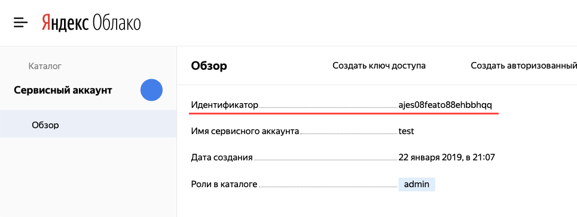

# Получение идентификатора сервисного аккаунта

Если у вас еще нет сервисного аккаунта, [создайте его](create.md).



- Консоль управления

  1. Перейдите в каталог, которому принадлежит сервисный аккаунт.
  1. Выберите вкладку **Сервисные аккаунты**.
  1. Выберите сервисный аккаунт и нажмите на строку с его именем.
  1. Идентификатор сервисного аккаунта смотрите в разделе **Обзор**:

      

- CLI

  

  Если вы знаете имя сервисного аккаунта, получите его идентификатор с помощью команды `get`:

  ```
  $ yc iam service-account get my-robot

  id: aje6o61dvog2h6g9a33s
  ...
  ```

  Если вы не знаете имя сервисного аккаунта, получите список сервисных аккаунтов в каталоге по умолчанию:

  ```
  $ yc iam service-account list
  +----------------------+------------------+-------------------------------+
  |          ID          |       NAME       |          DESCRIPTION          |
  +----------------------+------------------+-------------------------------+
  | aje6o61dvog2h6g9a33s | my-robot         |                               |
  | aje9sda1ufvqcmfksd3f | blabla           | bla bla bla is my description |
  +----------------------+------------------+-------------------------------+
  ```

- API

  1. [Узнайте идентификатор каталога](../../../resource-manager/operations/folder/get-id.md), в котором был создан сервисный аккаунт.
  1. Получите информацию о сервисных аккаунтах в каталоге с помощью метода [list](../../api-ref/ServiceAccount/list.md):

      ```bash
      $ export FOLDER_ID=b1gvmob95yysaplct532
      $ export IAM_TOKEN=CggaATEVAgA...
      $ curl -H "Authorization: Bearer ${IAM_TOKEN}" \
          "https://iam.api.cloud.yandex.net/iam/v1/serviceAccounts?folderId=${FOLDER_ID}"

      {
       "serviceAccounts": [
        {
         "id": "ajebqtreob2dpblin8pe",
         "folderId": "b1gvmob95yysaplct532",
         "createdAt": "2018-10-18T13:42:40Z",
         "name": "my-robot",
         "description": "my description"
        }
       ]
      }
      ```


