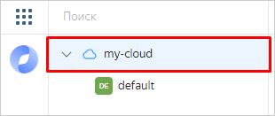

# Как начать работать с сервисными аккаунтами

Сервис {{ iam-short-name }} позволяет вам создавать [_сервисные аккаунты_](concepts/users/service-accounts.md) — дополнительные аккаунты, с помощью которых программы могут выполнять операции в {{ yandex-cloud }}. Сервисные аккаунты бесплатны и позволяют гибко управлять доступами ваших программ. Подробнее в разделе [{#T}](concepts/users/service-accounts.md).

Эта инструкция для [владельцев облака](../resource-manager/concepts/resources-hierarchy.md#owner) и пользователей с ролью [администратора](./roles-reference.md#admin) на облако или каталог. Пользователи с ролью [`editor`](./roles-reference.md#editor) тоже могут создавать сервисные аккаунты, но не могут назначать роли, поэтому не смогут разрешить сервисному аккаунту выполнение операций в {{ yandex-cloud }}.

Проверка наличия необходимых ролей описана в разделе [Перед началом работы](#before-you-begin).

Вы научитесь:

* [Создавать сервисные аккаунты и назначать им роли](#create-sa).
* [Выполнять операции в CLI](#run-operation-from-sa).
* [Удалять сервисные аккаунты](#delete-sa).

## Перед началом работы {#before-you-begin}

1. Войдите в [консоль управления]({{ link-console-main }}). Если вы еще не зарегистрированы, перейдите в консоль управления и следуйте инструкциям.
1. Убедитесь, что у вас есть нужные [роли](./concepts/access-control/roles.md):

    1. В консоли управления в списке слева выберите нужное облако. Пример:

        

    1. Перейдите на вкладку **{{ ui-key.yacloud.common.resource-acl.label_access-bindings }}**.
    1. В строке поиска введите свою учетную запись.
    1. Проверьте, что для вашей учетной записи указаны роли:

        * владельца (`organization-manager.organizations.owner`) или администратора (`organization-manager.admin`) организации;
        * владельца (`resource-manager.clouds.owner`) или администратора (`admin`) облака.


1. На странице [**{{ ui-key.yacloud.component.navigation-menu.label_billing }}**]({{ link-console-billing }}) убедитесь, что у вас подключен [платежный аккаунт](../billing/concepts/billing-account.md) и он находится в статусе `ACTIVE` или `TRIAL_ACTIVE`. Если платежного аккаунта нет, [создайте его](../billing/quickstart/index.md#create_billing_account).


## Создайте сервисный аккаунт {#create-sa}

Чтобы создать сервисный аккаунт и назначить ему роли:





Использовать созданный вами сервисный аккаунт могут и другие пользователи. Для этого [назначьте](operations/sa/set-access-bindings.md#assign-role-to-sa) им необходимые [роли](./security/index.md#service-roles) на этот аккаунт.



## Настройте CLI для работы от имени сервисного аккаунта {#run-operation-from-sa}

От имени сервисного аккаунта вы можете выполнять операции через интерфейс командной строки {{ yandex-cloud }} (CLI), API и другие инструменты, которые поддерживают аутентификацию с сервисным аккаунтом.



Теперь вы можете выполнять операции от имени сервисного аккаунта, например посмотреть список каталогов, доступных этому аккаунту:

```bash
yc resource-manager folder list
```

## Удалите сервисный аккаунт {#delete-sa}

Если сервисный аккаунт больше не нужен, удалите его:



## Что дальше {#what-is-next}

* [Пошаговые инструкции](operations/index.md) помогут вам решить конкретные задачи, возникающие при использовании {{ iam-name }}.
* [Подробнее про сервисные аккаунты](concepts/users/service-accounts.md) написано в концепциях.
* Посмотрите [рекомендации по безопасному использованию сервисных аккаунтов](best-practices/using-iam-securely.md#use-sa).
