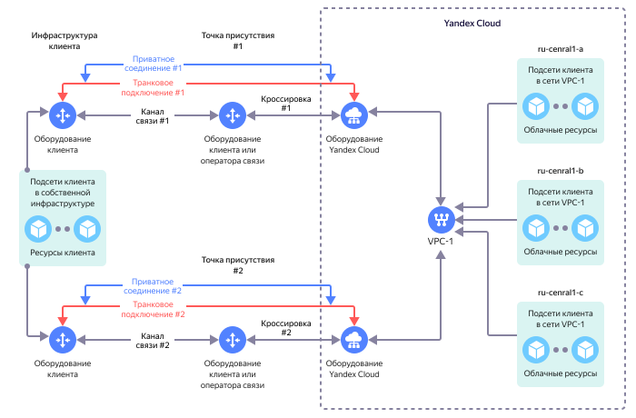

# Обзор {{ interconnect-name }}

Услуга {{ interconnect-name }} предназначена для организации сетевой IP-связности между ресурсами в инфраструктуре клиента и облачными ресурсами в {{ yandex-cloud }}.

Пример организации сетевой IP-связности в рамках услуги {{ interconnect-name }}:

В этом примере у клиента есть следующие ресурсы:

* Собственная инфраструктура (on-prem), в которой развернуты клиентские ресурсы, например выделенные серверы.
* Облачная инфраструктура в {{ yandex-cloud }}, в которой развернуты облачные ресурсы, например виртуальные машины.

Задача: обеспечить IP-взаимодействие между ресурсами в собственной инфраструктуре и облачными ресурсами в {{ yandex-cloud }}.

Для решения такой задачи может потребоваться:

* Организация [транкового подключения](./trunk.md).
* В [транковом подключении](./trunk.md) организуется [приватное соединение](./priv-con.md).
* В [приватном соединении](./priv-con.md) настраивается [стыковая подсеть](./priv-con.md#priv-address) и организуется [BGP-связность](./priv-con.md#bgp-peering). Без организации BGP-связности услуга {{ interconnect-name }} не предоставляется.
* Со стороны виртуальной сети {{ yandex-cloud }} с помощью протокола BGP [анонсируются префиксы облачных подсетей](./priv-con.md#prc-announce).
* Со стороны инфраструктуры клиента с помощью протокола BGP анонсируются префиксы подсетей с клиентскими ресурсами.

После выполнения описанных действий между ресурсами в вашей инфраструктуре и облачными ресурсами в {{ yandex-cloud }} должна возникнуть IP-связность, и они смогут обмениваться IP-трафиком между собой.



Подробные инструкции для подключения и управления услугой {{ interconnect-name }} находятся в разделе [Практические руководства](../tutorials/).



## Разграничение ответственности {#scopes}

Услуга {{ interconnect-name }} предоставляется {{ yandex-cloud }} при участии других сторон, у каждой из которых есть своя зона ответственности:
* [Точки присутствия](./pops.md):
  * Предоставляют клиенту услуги по организации и коммутации `кроссировок` (оптические пары волокон) между оборудованием клиента (оператора связи) и оборудованием {{ yandex-cloud }}.
  * Предоставляют клиенту услуги по размещению клиентского оборудования на точке присутствия.
* `Операторы связи`:
  * Предоставляют клиенту услуги по организации каналов связи между инфраструктурой клиента и оборудованием {{ yandex-cloud }} на точках присутствия.
  * Предоставляют клиенту услуги по организации IP-сервисов при подключении к {{ interconnect-name }}.



Услуги, которые предоставляются точками присутствия или операторами связи, не входят [в стоимость {{ interconnect-name }}](../pricing.md).



{{ yandex-cloud }} **не предоставляет клиенту услуги** [точек присутствия](./pops.md) или `операторов связи`, в том числе, такие как:
* Организация и коммутация кроссировок на точках присутствия.
* Организации каналов связи на точках присутствия.
* Размещение оборудования на точках присутствия.

