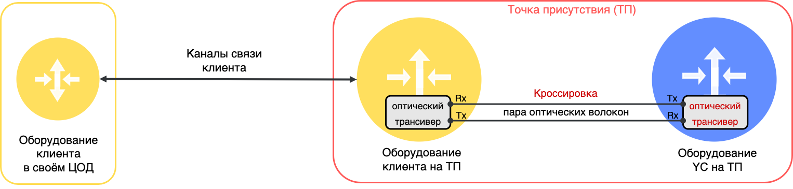
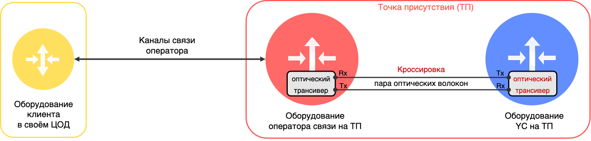

# Физический стык с {{ yandex-cloud }} (L1)

## Прямой физический стык {{ yandex-cloud }} {#direct-link}

Прямой физический стык — канал связи между клиентским оборудованием и оборудованием {{ yandex-cloud }} на точке присутствия, включая физические порты и оптические трансиверы на клиентском оборудовании и на оборудовании {{ yandex-cloud }}. Прямой стык работает на первом уровне модели OSI.

Оборудование клиента расположено на точке присутствия и подключается к оборудованию {{ yandex-cloud }} напрямую через оптическую кроссировку в пределах точки присутствия. Оптическая кроссировка подключается в оптические трансиверы со стороны оборудования клиента и со стороны оборудования {{ yandex-cloud }}. Для организации физических подключений используются только дуплексные (двухволоконные) оптические трансиверы, где передатчик трансивера с одной стороны (TX) подключается к приемнику трансивера (RX) с другой стороны с помощью оптического волокна. Пара таких оптических волокон образуют оптическую кроссировку.



Одноволоконные трансиверы для физических подключений не используются.



## Стык через оператора связи {#operator-link}

У клиента нет собственного оборудования на точке присутствия. Для подключения к {{ yandex-cloud }} клиент привлекает оператора связи, имеющего оборудование на нужной точке присутствия. Оптическая кроссировка подключается в оптические трансиверы со стороны оборудования оператора связи и оборудования {{ yandex-cloud }}.

Оператор связи организует подключение оборудования клиента в ЦОД к оборудованию оператора связи на точке присутствия по своим каналам связи, предварительно согласовав схему подключения с клиентом.