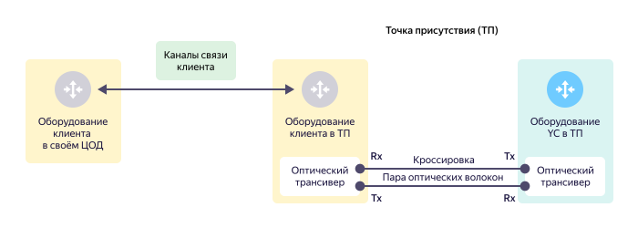
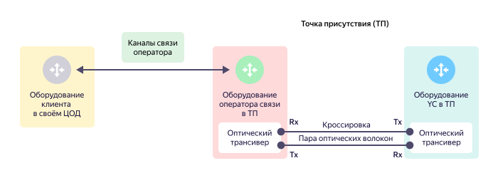

# Физический стык с {{ yandex-cloud }} (L1)

## Прямой физический стык {{ yandex-cloud }} {#direct-link}

Прямой физический стык — это канал связи между клиентским оборудованием и оборудованием {{ yandex-cloud }} в [точке присутствия](points-of-presence.md). В состав прямого стыка входят физические порты и оптические трансиверы на клиентском оборудовании и на оборудовании {{ yandex-cloud }}. Прямой стык работает на первом уровне [модели OSI](https://ru.wikipedia.org/wiki/Сетевая_модель_OSI)(https://en.wikipedia.org/wiki/OSI_model).

Оборудование клиента расположено в точке присутствия и подключается к оборудованию {{ yandex-cloud }} напрямую через оптическую кроссировку в пределах точки присутствия. Оптическая кроссировка подключается в оптические трансиверы со стороны оборудования клиента и со стороны оборудования {{ yandex-cloud }}. Для организации физических подключений используются только дуплексные (двухволоконные) оптические трансиверы. Передатчик (Tx) трансивера с одной стороны подключается с помощью оптического волокна к приемнику (Rx) трансивера с другой стороны. Пара таких оптических волокон образуют оптическую кроссировку.



Одноволоконные трансиверы для физических подключений не используются.



## Стык через оператора связи {#operator-link}

Если у клиента нет собственного оборудования в точке присутствия, для подключения к {{ yandex-cloud }} клиент привлекает оператора связи, имеющего оборудование в нужной точке присутствия. 

Оптическая кроссировка подключается в оптические трансиверы со стороны оборудования оператора связи и со стороны оборудования {{ yandex-cloud }}.

Оператор связи согласовывает схему подключения с клиентом и подключает оборудование клиента в ЦОД к своему оборудованию в точке присутствия. Для подключения оператор использует собственные каналы связи.
