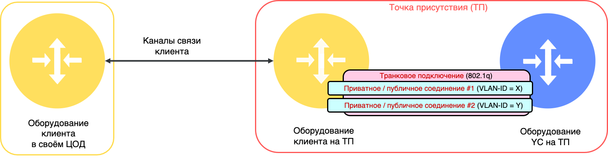
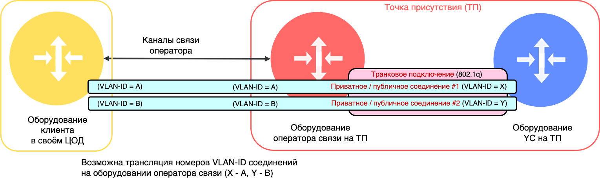
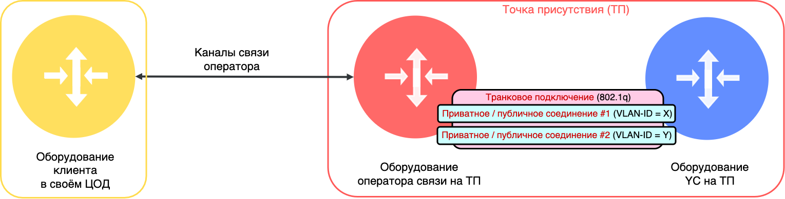

# Транковое подключение (L2)

Транковое подключение – способ мультиплексирования трафика на втором уровне модели OSI. Использует технологию тегирования Ethernet-фреймов по стандарту IEEE 802.1Q. Мультиплексирование позволяет передавать в одном [прямом физическом стыке](l1-physical.md) трафик нескольких логических потоков данных. В качестве разделителя логических потоков используется 802.1Q-тег (VLAN Identifier / VLAN-ID). Размерность VLAN-ID составляет 12 бит, то есть VLAN-ID может принимать значение от 0 до 4095.



В {{ yandex-cloud }} разрешается использовать значение VLAN-ID только в диапазоне от 2 до 4000 включительно.



На уровне транкового подключения со стороны сетевого оборудования {{ yandex-cloud }} применяется ограничение скорости передачи данных в битах в секунду и в пакетах в секунду как по направлению из облака, так и по направлению в облако в соответствии с выбранным [пакетом трафика](../manual.md#bandwidth). Для этого используются механизм RateLimit (Policing). При превышении скорости передачи в битах/с или пакетах/с данные могут быть отброшены. Это может приводить к ситуациям, когда равномерно передаваемый трафик будет передаваться с более высокой скоростью, чем трафик передаваемый резкими всплесками.

## Транк через прямой физический стык (оборудование клиента) {#trunk-over-direct-link}

Транковое подключение организуется поверх прямого физического стыка между оборудованием клиента на точке присутствия и оборудованием {{ yandex-cloud }}. 

## Транк через оператора связи с L2-транзитом до клиентского оборудования {#trunk-over-operator}

* У клиента нет собственного оборудования на точке присутствия. 
* Транковое подключение организуется на точке присутствия с привлечением оператора связи, который обеспечивает L2-транзит. 
* Транковое подключение организуется между оборудованием клиента в ЦОД и оборудованием {{ yandex-cloud }}. 
* При подключении клиентского оборудования оператор использует собственные каналы связи. В случае необходимости изменения номеров VLAN-ID соединений (трансляция номеров VLAN-ID) на L2-транзите оператор связи должен согласовать с клиентом схему трансляции для корректной конфигурации оборудования клиента в своём ЦОД.

## Транк через прямой физический стык (оборудование оператора связи) {#trunk-over-operator-2}

* У клиента нет собственного оборудования на точке присутствия. 
* Транковое подключение организуется на точке присутствия с привлечением оператора связи. 
* Транковое подключение организуется между оборудованием оператора связи на точке присутствия и оборудованием {{ yandex-cloud }}. 
* Связность между оборудованием оператора связи на точке присутствия и оборудованием клиента в своём ЦОД обеспечивается на третьем уровне взаимодействия. Такой вариант может быть использован, если клиент не желает обеспечивать BGP-связность с оборудованием {{ yandex-cloud }} на своём оборудовании и поручает эту задачу оператору связи.