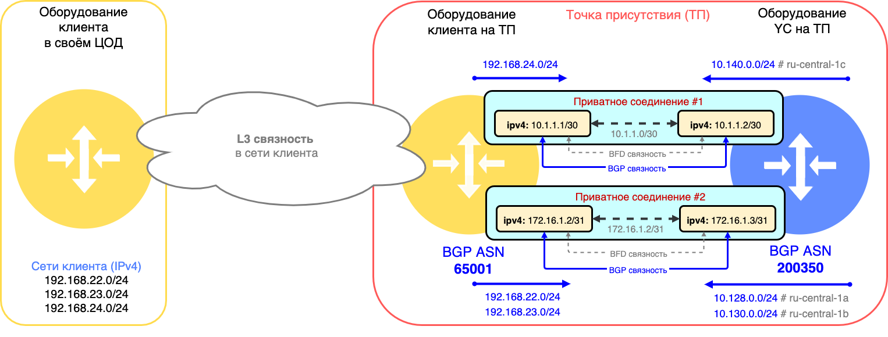
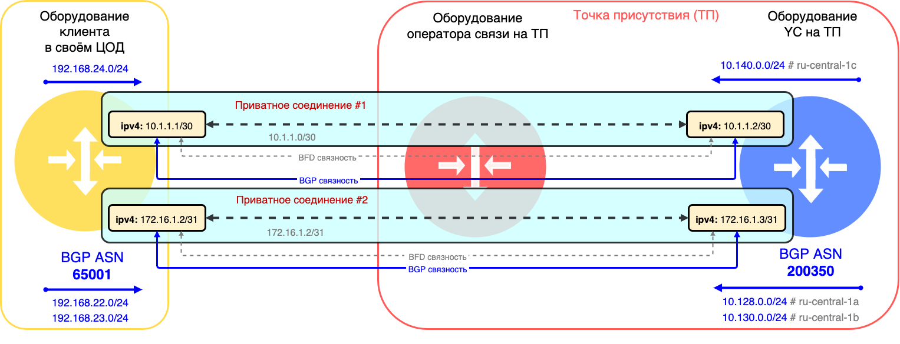
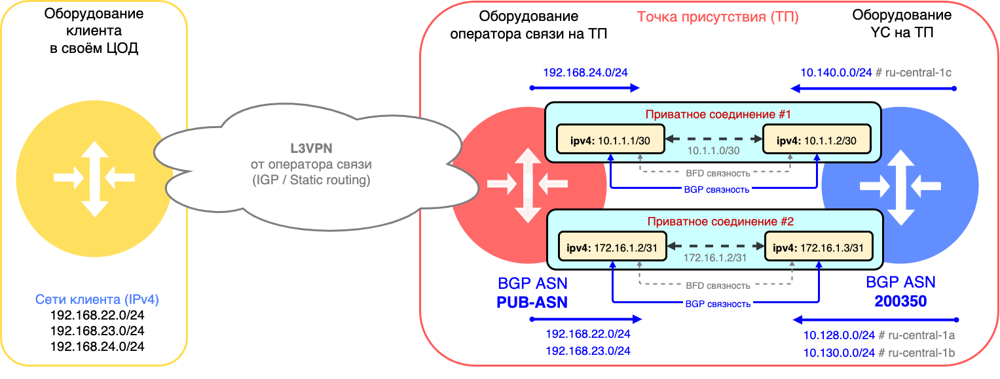

# IP- и BGP-связность (L3)

На третьем уровне модели OSI внутри VLAN возникают IP-соединения. В зависимости от типа используемых IP-адресов (приватных или публичных) возникают приватные или публичные соединения.



При организации [приватного](#private-connection) или [публичного](#public-connection) соединения используются только IPv4-адреса. IPv6-адреса сейчас не поддерживаются.



## Приватное соединение {#private-connection}

Приватное соединение — один из потоков данных, передающийся через транковое подключение и тегированный определенным значением VLAN-ID. Для передачи трафика на третьем уровне модели OSI с помощью протокола IPv4 используются приватные IPv4-адреса, которые не маршрутизируются в интернет. Набор подсетей, из которых выделяются такие приватные адреса, описан в документе [RFC-1918](https://datatracker.ietf.org/doc/html/rfc1918). При организации приватных соединений используются подсети размером /30 или /31. 

## Публичное соединение {#public-connection}

Публичное соединение - один из потоков данных, передаваемых через транковое подключение и тегируемый определенным значением VLAN-ID. Для передачи трафика на третьем уровне модели OSI с помощью протокола IPv4 используются публичные IPv4-адреса из [адресного пула](../../vpc/concepts/ips.md), которые маршрутизируются в Интернет. При организации публичных соединений используется подсеть размером /31. Публичное соединение обычно используется для организации прямого взаимодействия с сервисами, перечисленными ниже.

Используются публичные IPv4-адреса которые могут маршрутизироваться в сервисы {{ yandex-cloud }}, например:

* [{{ api-gw-full-name }}](../../api-gateway)
* [{{ sf-full-name }}](../../functions)
* [{{ container-registry-full-name }}](../../container-registry)
* [{{ objstorage-full-name }}](../../storage)

Помимо этого, необходимо использовать технологию трансляции адресов (NAT) на стороне клиента. Возможны два варианта реализации NAT:

* NAT-трансляция выполняется на стороне оборудования клиента от IPv4-адреса в стыковой (point-to-point) подсети для публичного соединения размером /31.
* NAT-трансляция выполняется на клиентском оборудовании (сервере, МСЭ или другом), которое не используется для организации стыка (pont-to-point) для публичного соединения. В этом случае, клиенту выделяется дополнительная публичная IPv4-подсеть размером /30. Клиентское оборудование должно будет анонсировать данную подсеть по протоколу BGP в сторону {{ yandex-cloud }} через стыковую (point-to-point) подсеть для публичного соединения.

## BGP-связность {#bgp-connectivity}

BGP-связность возникает внутри каждого приватного или публичного соединения между клиентским оборудованием и оборудованием {{ yandex-cloud }} на ТП для обмена информацией о сетях (префиксах) между сторонами. После обмена этой маршрутной информацией стороны могут передавать IPv4 трафик между сетями, о которых они рассказали друг другу — это целевое состояние сервиса {{ interconnect-name }}.



При превышении [лимита](limits.md#interconnect-limits) количества полученных префиксов BGP-сессия будет разорвана на 30 минут. 

Рекомендуем настроить [алертинг](../../monitoring/operations/alert/create-alert.md) на [метрику](user-metrics.md) `ipv4_announces_received_by_cloud_num` и установить пороги срабатывания, чтобы не допустить разрыва BGP-сессии при внезапном превышении числа префиксов.



Для настройки BGP связности с каждой из сторон нужно указать номер автономной системы (BGP ASN). Значение BGP ASN для {{ yandex-cloud }} постоянно и всегда равно 200350. На клиентском оборудовании можно настроить публичный номер BGP ASN (если он есть) или использовать любой номер из диапазона приватных BGP ASN номеров: 64512 – 65534.



Значение BGP ASN со стороны {{ yandex-cloud }} постоянно — 200350. Это 4х байтовое значение BGP ASN. По умолчанию на сетевом оборудовании используется 2х байтовые значения BGP ASN. При настройке BGP-взаимодействия на клиентском оборудовании необходимо явно разрешить использование 4х байтовых BGP ASN.



Иногда у клиента нет возможности подключить свой маршрутизатор напрямую к оборудованию {{ yandex-cloud }}. Для решения этой задачи он может использовать другие промежуточные устройства (коммутаторы). Для быстрого обнаружения отказов на таких составных каналах связи может использоваться протокол BFD, который нужно применять совместно с протоколом BGP для улучшения сходимости (времени реакции сети на изменения).

### L3- и BGP-связность через прямой физический стык {#l3-bgp-connectivity-over-direct-link}

L3-связность и BGP-связность организуется между оборудованием клиента на ТП и оборудованием {{ yandex-cloud }}. При организации IPv4-связности могут использоваться IPv4 подсети размером /30 или /31. В данном случае клиент самостоятельно обеспечивает L3-связность от своего оборудования в ЦОД до собственного оборудования на ТП. Все анонсы маршрутов по протоколу BGP со стороны клиента попадают во все зоны доступости {{ yandex-cloud }}.

### L3- и BGP-связность через оператора связи {#l3-bgp-connectivity-over-operator-link}

При отсутствии собственного оборудования на ТП, клиент привлекает оператора связи (или партнёра) для обеспечения L1- и L2-связности от оборудования {{ yandex-cloud }} до оборудования в своём ЦОД (см. PHY2, PHY3, TRN2). При этом L3- и BGP-связность организуется между оборудованием в его ЦОД и оборудованием {{ yandex-cloud }} на ТП.

### L3 и BGP + L3VPN от оператора связи {#l3-bgp-l3vpn-connectivity-over-operator-link}

При нежелании клиента обеспечивать BGP взаимодействия самостоятельно или отсутствии у клиента технической возможности для этого, есть возможность делегировать организацию BGP взаимодействия на сторону оператора связи (партнёра).
В данном случае оператор связи (партнёр) подключает клиентское оборудование в ЦОД клиента к своему оборудованию на ТП с помомощью сервиса L3VPN, в рамках которого обеспечивается L3-связность с помощью одного из IGP протоколов динамической маршрутизации или статической маршрутизации.

Вся L3- и BGP-связность с {{ yandex-cloud }} организуется между оборудованием оператора связи (партнёра) и оборудованием {{ yandex-cloud }} на ТП. Данное соединение также становится частью клиентского L3VPN с помощью которого и достигается прямая связность между оборудованием клиента в его ЦОД и {{ yandex-cloud }}.

С помощью сервиса L3VPN оператор связи (партнёр) потенциально может обеспечить L3-связность через одно физическое соеднение из ЦОД клиента в {{ yandex-cloud }} через две и более ТП. Такой вариант можно рассматривать при миграции клиента с других площадок в {{ yandex-cloud }}.
