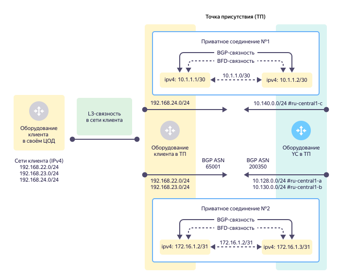
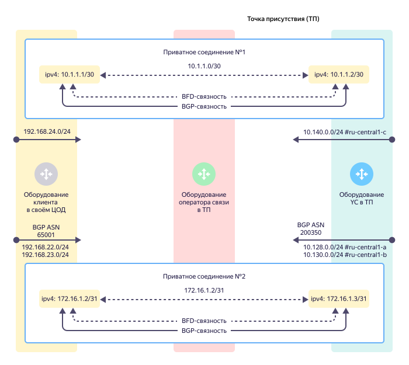
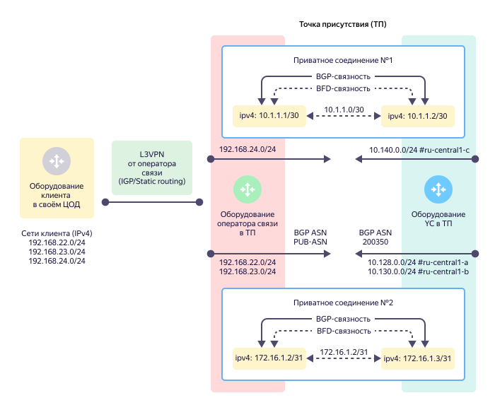

# IP- и BGP-связность (L3)

Третий уровень [модели OSI](https://ru.wikipedia.org/wiki/Сетевая_модель_OSI)(https://en.wikipedia.org/wiki/OSI_model) определяет IP-соединения внутри VLAN. IP-соединения подразделяются на [приватные](#private-connection) или [публичные](#public-connection) в зависимости от типа используемых IP-адресов (приватных или публичных).



При организации приватных или публичных соединений используются только IPv4-адреса. IPv6-адреса не поддерживаются.



## Приватное соединение {#private-connection}

Приватное соединение — это тип соединения с использованием приватных IPv4-адресов, которые не маршрутизируются в интернет. Набор подсетей, из которых выделяются приватные адреса, описан в спецификации [RFC 1918](https://datatracker.ietf.org/doc/html/rfc1918). При организации приватных соединений используются подсети размером `/30` или `/31`. Потоки данных приватного соединения передаются через [транковое подключение](l2-trunk.md) и тегируются определенным значением VLAN ID.

## Публичное соединение {#public-connection}

Публичное соединение — это тип соединения с использованием публичных IPv4-адресов из [адресного пула](../../vpc/concepts/ips.md), которые маршрутизируются в интернет. При организации публичных соединений используется подсеть размером `/31`. Потоки данных публичного соединения передаются через транковое подключение и тегируются определенным значением VLAN ID.

Публичное соединение обычно используется для организации прямого взаимодействия с сервисами {{ yandex-cloud }}, например:
* [{{ api-gw-name }}](../../api-gateway/).
* [{{ sf-name }}](../../functions/).
* [{{ container-registry-name }}](../../container-registry/).
* [{{ objstorage-name }}](../../storage/).

Для публичного соединения необходимо использовать технологию трансляции сетевых адресов [NAT](https://ru.wikipedia.org/wiki/NAT)(https://en.wikipedia.org/wiki/Network_address_translation) на стороне клиента. Возможные варианты реализации NAT:
* NAT-трансляция выполняется на стороне оборудования клиента от IPv4-адреса в стыковой (point-to-point) подсети для публичного соединения размером `/31`.
* NAT-трансляция выполняется на клиентском оборудовании, которое не используется для организации стыка (point-to-point) для публичного соединения, например сервере или межсетевом экране. В этом случае клиенту выделяется дополнительная публичная IPv4-подсеть размером `/30`. Клиентское оборудование должно будет анонсировать данную подсеть по протоколу BGP в сторону {{ yandex-cloud }} через стыковую (point-to-point) подсеть для публичного соединения.

## BGP-связность {#bgp-connectivity}

BGP-связность возникает внутри каждого приватного или публичного соединения между клиентским оборудованием и оборудованием {{ yandex-cloud }} в [точке присутствия](points-of-presence.md) для обмена информацией о сетях (префиксах) между сторонами. После обмена этой маршрутной информацией стороны могут передавать IPv4-трафик между сетями, о которых они сообщили друг другу, — это целевое состояние сервиса {{ interconnect-name }}.



Если [лимит](limits.md#interconnect-limits) полученных префиксов будет превышен, BGP-сессия будет разорвана на 30 минут. Рекомендуем настроить [алертинг](../../monitoring/operations/alert/create-alert.md) на [метрику](user-metrics.md) `ipv4_announces_received_by_cloud_num` и установить пороги срабатывания, чтобы не допустить разрыв BGP-сессии при внезапном превышении числа префиксов.



Для настройки BGP-связности с каждой из сторон нужно указать номер автономной системы (BGP ASN). Значение BGP ASN для {{ yandex-cloud }} постоянно и всегда равно `200350`. На клиентском оборудовании можно настроить публичный номер BGP ASN (если он есть) или использовать любой номер из диапазона приватных номеров BGP ASN: `64512` — `65534`.



Размер значения BGP ASN со стороны {{ yandex-cloud }} (`200350`) составляет 4 байта. По умолчанию на сетевом оборудовании используется значения BGP ASN размером 2 байта. При настройке BGP-взаимодействия на клиентском оборудовании необходимо явно разрешить использование BGP ASN размером 4 байта.



Если возможность подключить свой маршрутизатор напрямую к оборудованию {{ yandex-cloud }} отсутствует, используйте промежуточные устройства (коммутаторы). Для быстрого обнаружения отказов на промежуточных устройствах используйте протокол BFD. Для улучшения сходимости (времени реакции сети на изменения) также используйте протокол BGP.

### L3- и BGP-связность через прямой физический стык {#l3-bgp-connectivity-over-direct-link}

L3-связность и BGP-связность организуется между оборудованием клиента в точке присутствия и оборудованием {{ yandex-cloud }}. При организации IPv4-связности могут использоваться IPv4-подсети размером `/30` или `/31`. В данном случае клиент самостоятельно обеспечивает L3-связность от своего оборудования в ЦОД до собственного оборудования в точке присутствия. Все анонсы маршрутов по протоколу BGP со стороны клиента попадают во все [зоны доступности](../../overview/concepts/geo-scope.md) {{ yandex-cloud }}.

### L3- и BGP-связность через оператора связи {#l3-bgp-connectivity-over-operator-link}

При отсутствии собственного оборудования в точке присутствия клиент привлекает оператора связи для обеспечения L1- и L2-связности от оборудования {{ yandex-cloud }} до оборудования в своем ЦОД (см. PHY2, PHY3, TRN2). При этом L3- и BGP-связность организуется между оборудованием в его ЦОД и оборудованием {{ yandex-cloud }} в точке присутствия.

### L3 и BGP + L3VPN от оператора связи {#l3-bgp-l3vpn-connectivity-over-operator-link}

Если клиент не хочет обеспечивать BGP-взаимодействие самостоятельно или такая техническая возможность отсутствует, есть возможность делегировать организацию BGP-взаимодействия на сторону оператора связи. Тогда оператор связи подключает клиентское оборудование в ЦОД клиента к своему оборудованию в точке присутствия с помощью сервиса L3VPN, который обеспечивает L3-связность с использованием статической маршрутизации или одного из IGP-протоколов динамической маршрутизации.

Вся L3- и BGP-связность с {{ yandex-cloud }} организуется между оборудованием оператора связи и оборудованием {{ yandex-cloud }} в точке присутствия. Данное соединение также становится частью клиентского L3VPN с помощью которого и достигается прямая связность между оборудованием клиента в его ЦОД и {{ yandex-cloud }}.

С помощью сервиса L3VPN оператор связи потенциально может обеспечить L3-связность через одно физическое соединение из ЦОД клиента в {{ yandex-cloud }} через две и более точки присутствия. Такой вариант можно рассматривать при миграции клиента с других площадок в {{ yandex-cloud }}.
