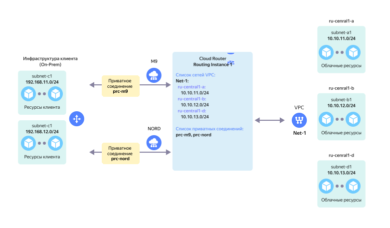

# Приватное соединение

Приватное соединение (private connection) — это логическое соединение вашей On-Prem инфраструктуры с виртуальной сетью в облаке. Точкой назначения приватного соединения в облачной сети является [Routing Instance](../../cloud-router/concepts/routing-instance.md).

Пример использования двух приватных соединений для организации отказоустойчивой IP-связности:



Организация нескольких приватных соединений в одну облачную сеть на одной [точке присутствия](./pops.md) не допускается. Для целей резервирования допускается организация нескольких приватных соединений в одной облачной сети на разных [точках присутствия](./pops.md), но не более одного такого приватного соединения на точке присутствия.



Основными компонентами приватного соединения являются: 
* [Стыковая подсеть](#priv-address)
* [BGP-связность](#bgp-peering)

Далее уже через настроенную BGP-связность выполняется обмен маршрутами между облачной сетью и On-Prem инфраструктурой, после чего между On-Prem и ресурсами в облачной сети можно передавать трафик.

Приватное соединение организуется внутри [транка](./trunk.md). В транке может быть несколько приватных соединений в разные облачные сети.

Приватное соединение настраивается внутри [транка](./trunk.md) и имеет свой уникальный идентификатор — **VLAN-ID**. 

Максимальный размер IP MTU для приватного соединения — **8910 байт**. Изменение IP MTU со стороны оборудования {{ yandex-cloud }} не допускается.

## Стыковая подсеть {#priv-address}

Для организации приватного соединения необходима **стыковая подсеть**. Эта point-to-point подсеть используется для организации IP-связности между оборудованием {{ yandex-cloud }} и оборудованием клиента или оператора связи.

Стыковая подсеть может быть размером `/30` или `/31`. Использовать подсети других размеров нельзя.

В стыковой подсети можно использовать следующие диапазоны адресов:

* `10.0.0.0/8`
* `172.16.0.0/12`
* `192.168.0.0/16`
* `169.254.0.0/16`

Использовать IP-адресацию в других диапазонах нельзя.



При организации приватного соединения используются только IPv4-адреса.
В настоящее время использование IPv6-адресов не допускается.





## Топологии приватных соединений {#priv-top}

Поддерживаются следующие варианты организации приватных соединений:

* [Приватное соединение через прямое клиентское подключение](#prc-direct-link).
* [Приватное соединение через подключение оператора связи (L2-транзит)](#prc-sp-l2).
* [Приватное соединение через подключение оператора связи (L3VPN)](#prc-sp-l3vpn).

### Приватное соединение через прямое клиентское подключение {#prc-direct-link}

L3-связность и BGP-связность организуется между оборудованием клиента в точке присутствия и оборудованием {{ yandex-cloud }}. При этом:

* Вы самостоятельно обеспечиваете L3-связность от оборудования в своем ЦОД до собственного оборудования в точке присутствия.
* BGP-взаимодействие организуется между вашим оборудованием в точке присутствия и оборудованием {{ yandex-cloud }}.
* Все анонсы маршрутов по протоколу BGP от вашего оборудования в точке присутствия попадают во все [зоны доступности](../../overview/concepts/geo-scope.md) {{ yandex-cloud }}.

### Приватное соединение через подключение оператора связи (L2-транзит) {#prc-sp-l2}

У вас нет собственного оборудования в точке присутствия и вы используете услуги оператора связи, который организует связность между оборудованием {{ yandex-cloud }} и вашим оборудованием. При этом:
* L2 связность организуется оператором связи между оборудованием оператора связи в точке присутствия и оборудованием {{ yandex-cloud }}.
* L3- и BGP-связность организуется между вашим оборудованием в своем ЦОД и оборудованием {{ yandex-cloud }} в точке присутствия.
* Все анонсы маршрутов по протоколу BGP от вашего оборудования в своем ЦОД попадают во все [зоны доступности](../../overview/concepts/geo-scope.md) {{ yandex-cloud }}.

### Приватное соединение через подключение оператора связи (L3VPN) {#prc-sp-l3vpn}

У вас нет собственного оборудования в точке присутствия и вы используете услуги оператора связи, который организует для связность между оборудованием {{ yandex-cloud }} и вашим оборудованием. У вас нет технической возможности организовать BGP-связность с оборудованием {{ yandex-cloud }} самостоятельно. При этом:

* L2-связность организуется оператором связи между оборудованием оператора связи в точке присутствия и оборудованием {{ yandex-cloud }}.
* L3- и BGP-связность с {{ yandex-cloud }} организуется между оборудованием оператора связи и оборудованием {{ yandex-cloud }} в точке присутствия. Данное соединение также становится частью клиентского L3VPN, с помощью которого и достигается прямая связность между вашим оборудованием в его ЦОД и {{ yandex-cloud }}.
* Все анонсы маршрутов по протоколу BGP от оборудования оператора связи в точке присутствия попадают во все [зоны доступности](../../overview/concepts/geo-scope.md) {{ yandex-cloud }}.
* Оператор связи в рамках оказания услуги L3VPN может использовать как статическую маршрутизацию, так и протоколы динамической маршрутизации.

## Примеры использования {#examples}

* [{#T}](../tutorials/partner-trunk-priv-add.md)
* [{#T}](../tutorials/trunk-priv-add.md)
* [{#T}](../tutorials/priv-add.md)
* [{#T}](../tutorials/priv-del.md)
* [{#T}](../tutorials/cic-with-ngfw.md)
