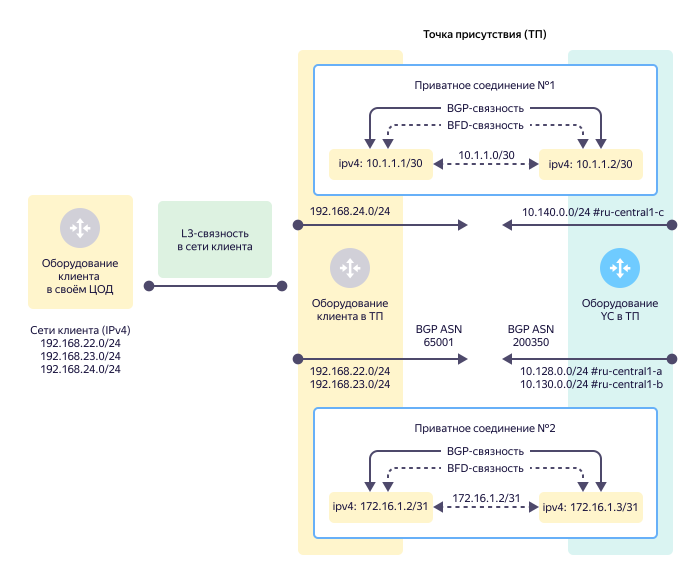
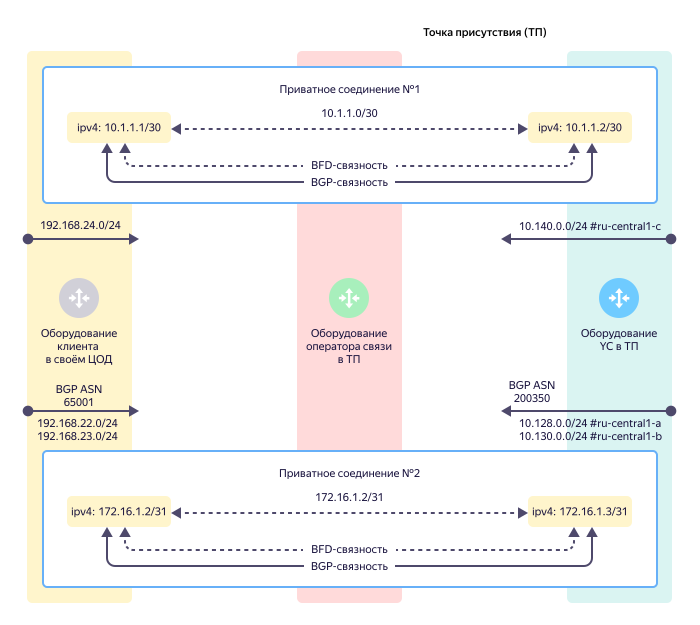
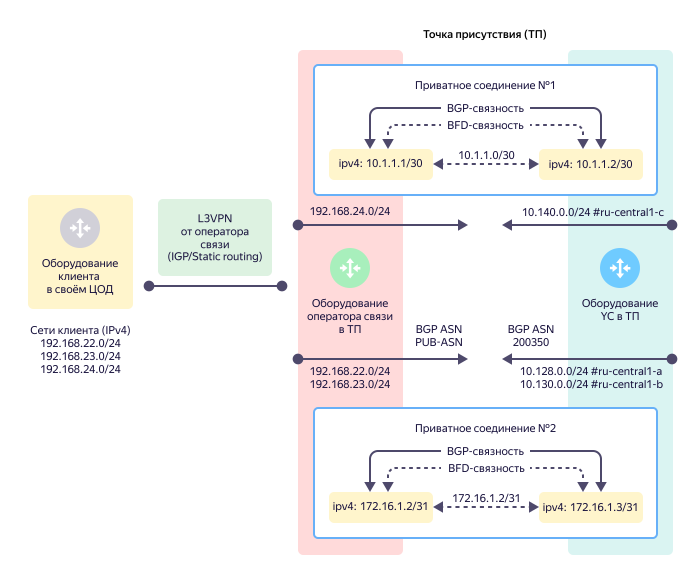

# Приватное соединение

Приватное соединение (private connection) — это логическое соединение с вашей облачной [сетью](../../vpc/concepts/network.md#network). Организуется внутри [транка](./trunk.md). В транке может быть несколько приватных соединений в разные облачные сети.



Организация нескольких приватных соединений в одну облачную сеть на одной [точке присутствия](./pops.md) не допускается. Для целей резервирования допускается организация нескольких приватных соединений в одной облачной сети на разных [точках присутствия](./pops.md), но не более одного такого приватного соединения на точке присутствия.


 
Приватное соединение настраивается внутри [транка](./trunk.md) и имеет свой уникальный идентификатор — **VLAN-ID**. 

## Стыковая подсеть {#priv-address}

Для организации приватного соединения необходима **стыковая подсеть**. Эта point-to-point подсеть используется для организации IP-связности между оборудованием {{ yandex-cloud }} и оборудованием клиента или оператора связи.

Стыковая подсеть может быть размером `/30` или `/31`. Использовать подсети других размеров нельзя.

В стыковой подсети можно использовать следующие диапазоны адресов:

* `10.0.0.0/8`
* `172.16.0.0/12`
* `192.168.0.0/16`
* `169.254.0.0/16`

Использовать IP-адресацию в других диапазонах нельзя.



При организации приватного соединения используются только IPv4-адреса.
В настоящее время использование IPv6-адресов не допускается.







## Топологии приватных соединений {#priv-top}

Поддерживаются следующие варианты организации приватных соединений:

* [Приватное соединение через прямое клиентское подключение](#prc-direct-link).
* [Приватное соединение через подключение оператора связи (L2-транзит)](#prc-sp-l2).
* [Приватное соединение через подключение оператора связи (L3VPN)](#prc-sp-l3vpn).

### Приватное соединение через прямое клиентское подключение {#prc-direct-link}





L3-связность и BGP-связность организуется между оборудованием клиента в точке присутствия и оборудованием {{ yandex-cloud }}. При этом:

* Вы самостоятельно обеспечиваете L3-связность от оборудования в своем ЦОД до собственного оборудования в точке присутствия.
* BGP-взаимодействие организуется между вашим оборудованием в точке присутствия и оборудованием {{ yandex-cloud }}.
* Все анонсы маршрутов по протоколу BGP от вашего оборудования в точке присутствия попадают во все [зоны доступности](../../overview/concepts/geo-scope.md) {{ yandex-cloud }}.

### Приватное соедиение через подключение оператора связи (L2-транзит) {#prc-sp-l2}





У вас нет собственного оборудования в точке присутствия и вы используете услуги оператора связи, который организует связность между оборудованием {{ yandex-cloud }} и вашим оборудованием. При этом:
* L2 связность организуется оператором связи между оборудованием оператора связи в точке присутствия и оборудованием {{ yandex-cloud }}.
* L3- и BGP-связность организуется между вашим оборудованием в своем ЦОД и оборудованием {{ yandex-cloud }} в точке присутствия.
* Все анонсы маршрутов по протоколу BGP от вашего оборудования в своем ЦОД попадают во все [зоны доступности](../../overview/concepts/geo-scope.md) {{ yandex-cloud }}.

### Приватное соединение через подключение оператора связи (L3VPN) {#prc-sp-l3vpn}





У вас нет собственного оборудования в точке присутствия и вы используете услуги оператора связи, который организует для связность между оборудованием {{ yandex-cloud }} и вашим оборудованием. У вас нет технической возможности организовать BGP-связность с оборудованием {{ yandex-cloud }} самостоятельно. При этом:

* L2-связность организуется оператором связи между оборудованием оператора связи в точке присутствия и оборудованием {{ yandex-cloud }}.
* L3- и BGP-связность с {{ yandex-cloud }} организуется между оборудованием оператора связи и оборудованием {{ yandex-cloud }} в точке присутствия. Данное соединение также становится частью клиентского L3VPN с помощью которого и достигается прямая связность между вашим оборудованием в его ЦОД и {{ yandex-cloud }}.
* Все анонсы маршрутов по протоколу BGP от оборудования оператора связи в точке присутствия попадают во все [зоны доступности](../../overview/concepts/geo-scope.md) {{ yandex-cloud }}.
* Оператор связи в рамках оказания услуги L3VPN может использовать как статическую маршрутизацию, так и протоколы динамической маршрутизации.


## Анонсы облачных подсетей и взаимодействие с {{ vpc-short-name }} {#prc-announce}

Чтобы подключить одну или несколько облачных подсетей к приватному соединению, необходимо знать:
* идентификатор виртуальной сети `vpc_net_id`, которую нужно подключить к транковому соединению;
* cписок анонсируемых IPv4-префиксов [подсетей](../../vpc/concepts/network.md#subnet) в виртуальной сети с распределением их по [зонам доступности](../../overview/concepts/geo-scope.md). Как правило, префиксы соответствуют подсетям, уже настроенным в облаке. В таком случае, анонсируемые префиксы и фактические диапазоны адресов подсетей совпадают.

Новые подсети, которые будут созданы в виртуальной сети позднее, не будут анонсироваться в приватное соединение {{ interconnect-name }} автоматически. 

Для добавления новой подсети в уже существующее приватное соединение необходимо создать обращение в [техническую поддержку]({{ link-console-support }}) с запросом о добавлении нового анонса в соответствующее приватное соединение {{ interconnect-name }}.



При использовании балансировщиков нагрузки {{ yandex-cloud }}: 
* [{{ network-load-balancer-short-name }}](../../network-load-balancer/) (NLB)
* [{{ alb-name }}](../../application-load-balancer/) (ALB)

адреса их обработчиков анонсируются в виде IPv4-префиксов с длиной `/32`.

Таким образом, можно использовать балансировщики нагрузки для распределения трафика, поступающего через {{ interconnect-name }} от вашей инфраструктуры, между облачными ресурсами в разных [зонах доступности](../../overview/concepts/geo-scope.md) {{ yandex-cloud }}.



Ваше оборудование анонсирует IPv4-префиксы из вашей инфраструктуры по протоколу BGP в сторону оборудования {{ yandex-cloud }}. Эти префиксы попадают в подсети {{ vpc-short-name }} с помощью редистрибуции маршрутной информации на оборудовании {{ yandex-cloud }}.

После получения клиентских префиксов оборудованием {{ yandex-cloud }} они становятся доступны для всех виртуальных машин и внутренних балансировщиков нагрузки в подсетях {{ vpc-short-name }}.

Для обеспечения IP-связности между ресурсами в облаке и ресурсами в вашей инфраструктуре никаких изменений в таблицах маршрутизации виртуальных машин не требуется.

### Агрегированные префиксы (агрегаты) {#agg-subnets}

Для автоматического анонсирования в {{ interconnect-name }} новых подсетей можно использовать **агрегированные префиксы** подсетей (агрегаты). Использование агрегатов позволяет настроить анонсы префиксов один раз и в дальнейшем просто добавлять новые подсети в уже существующую {{ vpc-short-name }}, без обращений в техническую поддержку.

> Например, при организации приватного соединения можно указать анонсы агрегированных IPv4-префиксов вида:
>
> ```
> {{ region-id }}-a [10.128.0.0/16]
> {{ region-id }}-b [10.130.0.0/16]
> {{ region-id }}-c [10.140.0.0/16]
> ```
>
> Если позже создать в этой сети в зоне `{{ region-id }}-a` подсеть с префиксом `10.128.15.0/24`, она автоматически будет доступна через {{ interconnect-name }}, поскольку подсеть `10.128.15.0/24` принадлежит уже анонсированному ранее адресному пространству `10.128.0.0/16`.

