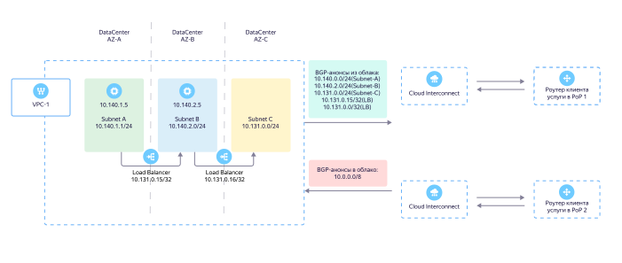

# Маршрутизация

При подключении вашей инфраструктуры через {{ interconnect-full-name }} вам потребуется настроить маршрутизацию трафика к облачным ресурсам или в интернет. На странице рассказано, как управлять трафиком {{ interconnect-name }} с помощью возможностей {{ yandex-cloud }}.

Пример организации соединения с помощью {{ interconnect-name }}:



## Как {{ interconnect-name }} взаимодействует с {{ vpc-name }} {#interconnect-to-vpc}

В заявке на подключение {{ interconnect-name }} вы указываете префиксы подсетей VPC. Эти префиксы анонсируются инфраструктурой {{ yandex-cloud }} по протоколу BGP в сторону вашего оборудования, принимающего BGP-сессии. На схеме это оборудование обозначено как «Роутер клиента».

При использовании балансировщиков из сервисов [{{ network-load-balancer-full-name }}](../../network-load-balancer/) и [{{ alb-full-name }}](../../application-load-balancer/), адреса их обработчиков анонсируются в виде IPv4-префиксов с длиной `/32`. Так вы можете использовать балансировщики для распределения трафика, поступающего через {{ interconnect-name }} от ваших сетей, между зонами доступности {{ yandex-cloud }}.

IPv4-префиксы, которые передает ваше оборудование по протоколу BGP в сторону {{ yandex-cloud }}, попадают в подсети VPC с помощью механизма редистрибуции маршрутной информации. После этого они становятся доступны всем виртуальным машинам и внутренним балансировщикам нагрузки в границах VPC. Для доступа облачных ресурсов к вашей корпоративной инфраструктуре никаких изменений в таблицах маршрутизации на ВМ не требуется.

## Как {{ interconnect-name }} взаимодействует со статическими маршрутами {#interconnect-and-static-routes}

Выбор маршрута к внешним ресурсам (IPv4-префиксам) из {{ yandex-cloud }} происходит только по длине его префикса. Префикс с длиной `/8` означает самый низкий приоритет маршрута, `/32` — самый высокий приоритет. 



Не используйте в одной виртуальной сети VPC статические маршруты с префиксами, повторяющими префиксы, анонсируемые вашим оборудованием в сторону {{ interconnect-name }}. Это приведет к ассиметричной маршрутизации трафика.



Если вам нужно направить часть трафика VPC через статический маршрут, а часть — в сторону {{ interconnect-name }}, используйте уникальные, не пересекающиеся IPv4-префиксы и планируйте адресное пространство ваших проектов более гранулярно.

На схеме можно увидеть пример реализации этого подхода.

* IPv4-префикс `10.0.0.0/8` — короткий суммарный префикс всех сетей вашей инфраструктуры. Анонсируется по протоклу BGP в сторону {{ vpc-short-name }} {{ yandex-cloud }} через {{ yandex-cloud }}.
* Маршрут с IPv4-префиксом `10.20.0.0/24` и next-hop `10.128.0.5` (где `10.128.0.5` — это IP-адрес виртуальной машины с VPN-шлюзом в {{ yandex-cloud }}) представлен статическим маршрутом в сторону VPN-шлюза.

При такой настройке маршрутизации весь трафик будет направляться через {{ interconnect-name }}, за исключением трафика из подсети `10.20.0.0/24`, который будет отправляться в VPN-тоннель через VPN-шлюз на стороне {{ yandex-cloud }}.

## Как резервировать соединения {{ interconnect-name }} с помощью VPN {#interconnect-vpn-failover}

Для защиты соединения {{ interconnect-name }} от сбоев можно анонсировать короткий суммарный IPv4-префикс от вашей инфраструктуры в сторону ВМ с VPN-шлюзом на стороне {{ yandex-cloud }}. Такой префикс будет автоматически получать больший приоритет в VPC и трафик будет направляться через {{ interconnect-name }}. Более длинный префикс через VPN-шлюз начнет использоваться при отказе BGP-сессии. Отказ вызовет удаление суммарного IPv4-префикса `10.0.0.0/8` из таблиц маршрутизации как со стороны VPC {{ yandex-cloud }}, так и со стороны роутера клиента.

На схеме можно увидеть пример реализации этого подхода.

* Префиксы `10.0.0.0/25` и `10.0.128.0/25` — длинные префиксы подсети из вашего дата-центра, анонсируются по протоколу BGP в сторону {{ yandex-cloud }}.
* Маршрут с префиксом `10.20.0.0/24` и  next-hop `10.128.0.5` (где `10.128.0.5` — это IP-адрес виртуальной машины с VPN-шлюзом) использует статический маршрут через IPSec-шлюз.

При такой настройке маршрутизации весь трафик направляется через работающее соединение {{ interconnect-name }}. При отказе соединения через {{ interconnect-name }} произойдет разрыв его BGP-сессии и маршруты `10.0.0.0/25` и `10.0.128.0/25` будут удалены из таблиц маршрутизации. Это приведет к перенаправлению всего трафика на VPN-шлюз через оставшийся рабочий маршрут `10.20.0.0/24`.

## Как организовать приватный доступ в интернет без использования {{ yandex-cloud }} {#private-access-to-the-internet}

Для связи ваших облачных ресурсов с интернетом через {{ interconnect-name }} необходимо настроить на вашем оборудовании анонс маршрута `0.0.0.0/0` по протоколу BGP в сторону {{ yandex-cloud }}. Таким образом, трафик из виртуальной сети, подключенной к {{ interconnect-name }} будет безусловно маршрутизироваться к вашему оборудованию. На своей стороне вы сможете настроить правила фильтрации трафика перед отправкой его в интернет через ваш собственный NAT, не используя инфраструктуру {{ yandex-cloud }}.

## Как {{ interconnect-name }} взаимодействует с NAT на подсеть {#interconnect-and-egress-nat}

{{ interconnect-name }} допускает включение функции [NAT в интернет](../../vpc/operations/enable-nat.md), если по протоколу BGP в направлении {{ yandex-cloud }} не анонсируется маршрут по умолчанию — `0.0.0.0/0`. Если такой маршрут анонсируется:

* Сработает функция `enable-nat`. Произойдет трансляция внутреннего IPv4-адреса ВМ в публичный IPv4-адрес на стороне {{ yandex-cloud }}.
* Трафик будет направлен на ваше оборудование (на схеме — «Роутер клиента»), анонсировавшее маршрут `0.0.0.0/0` по протоколу BGP. На ваше оборудование начнет поступать трафик с публичных адресов виртуальных машин.



Не используйте NAT в интернет на стороне {{ yandex-cloud }} одновременно с анонсом маршрута `0.0.0.0/0` со своего оборудования.



## Как можно управлять IPv4-маршрутами {{ interconnect-name }} {#interconnect-routes}

Для управления IPv4-маршрутами можно использовать длину префикса. Например, можно анонсировать по протоколу BGP одной из точек присутствия (POP-1) длинные префиксы `10.0.0.0/25` и `10.0.128.0/25`, а на вторую (POP-2) — короткий суммарный префикс `10.0.0.0/24`. 

Соединение через точку присутствия POP-1 будет приоритетнее, чем через точку присутствия POP-2. Трафик из {{ yandex-cloud }} в инфраструктуру клиента будет направляться через точку присутствия POP-1. 

Чтобы направить трафик в {{ yandex-cloud }} через точку присутствия POP-2, настройте на вашем маршрутизаторе BGP-политику для повышения приоритета нужных IPv4-префиксов с помощью атрибута BGP Local Preference.

Сейчас управлять трафиком, который направляется из {{ yandex-cloud }} в инфраструктуру клиента, можно только длиной префикса. Текущая реализация протоколов управления {{ yandex-cloud }} поддерживает не все атрибуты протокола BGP для управления трафиком, а также не учитывает значение атрибута BGP AS-PATH (длину пути) в выборе кратчайшего маршрута. По той же причине не получится использовать механизм BGP AS-PATH prepend для управления трафиком.

## Как утилизировать оба канала {{ interconnect-name }} в отказоустойчивой схеме {#interconnect-fault-tolerance}

Для распределения нагрузки между несколькими каналами {{ interconnect-name }} можно анонсировать один и тот же IPv4-префикс, например, `10.0.0.0/8`, в каждое из соединений {{ interconnect-name }} в каждой из точек присутствия. {{ yandex-cloud }} поддерживает ECMP-балансировку и будет распределять трафик между соединениями внутри каждой точки присутствия.

Обратите внимание, что такой режим балансировки может привести к ассиметричности прохождения трафика. Из-за этого трафик может поступить в {{ yandex-cloud }} через точку присутствия POP-1, а ответ будет получен через точку присутствия POP-2. Ассиметрия корректно обрабатывается и допустима в {{ yandex-cloud }}, но может быть недопустима для отдельных типов оборудования на стороне клиента, например, для межсетевых экранов. 

Чтобы разрешить асимметричное движение трафика со стороны {{ yandex-cloud }}, отключите механизм [RPF](https://en.wikipedia.org/wiki/Reverse-path_forwarding). Это позволит вам использовать все активные соединения {{ interconnect-name }} с резервированным подключением через две или более точки присутствия.

## Как {{ interconnect-name }} взаимодействует с группами безопасности {#interconnect-and-security-groups}

Группы безопасности не могут быть назначены на ресурсы вне {{ yandex-cloud }}, поэтому корректным способом фильтрации трафика будет использование IPv4-префиксов, а не ссылок на другие группы безопасности.

Например, анонсируйте по BGP в сторону {{ yandex-cloud }} IPv4-префикс `10.0.0.0/8` — короткий суммарный префикс всех сетей вашего дата-центра. Затем назначьте на ваши ресурсы в облаке группу безопасности, с правилами, открывающими доступ из вашего дата-центра к веб-приложению через порт `443`. Также правила группы разрешает вашим ресурсам из облака обращаться к ресурсам в вашем дата-центре по любым портам.

```
ingress {
      protocol       = "TCP"
      port           = 443
      description    = "Allow ingress from Interconnect to web server"
      v4_cidr_blocks = ["10.0.0.0/8"]
    }
      egress {
      protocol       = "ANY"
      description    = "We allow any egress traffic for stage, since we block prod on ingress"
      v4_cidr_blocks = ["10.0.0.0/8"]
    }
```

Вы также можете использовать более точные правила, открывая доступ к конкретным адресам или подсетям и портам:

```
ingress {
      protocol       = "TCP"
      port           = 443
      description    = "Allow ingress from Interconnect to web server"
      v4_cidr_blocks = ["10.20.0.5/32"]
    }
      egress {
      protocol       = "TCP"
      port           = 3389
      description    = "Allow RDP to Interconnect server"
      v4_cidr_blocks = ["10.20.0.20/32"]
    }
```


