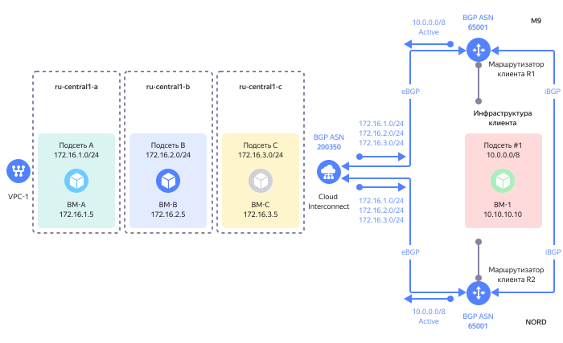
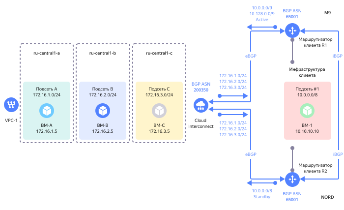
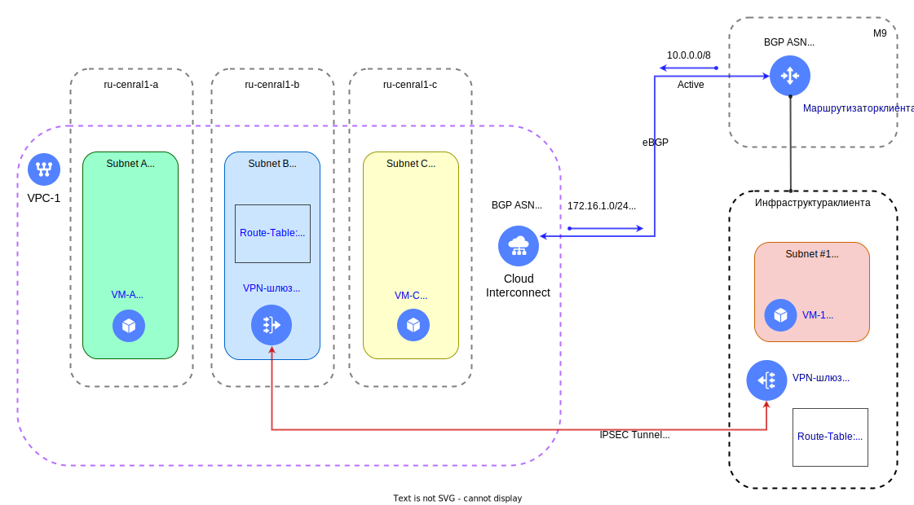
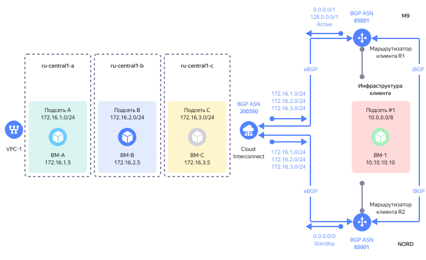

# Маршрутизация

При подключении инфраструктуры клиента через {{ interconnect-full-name }} обычно требуется настроить маршрутизацию трафика между ресурсами в облаке и ресурсами в инфраструктуре клиента.

**Маршрутизация** - это набор инструментов для управления движением трафика в {{ yandex-cloud }}.

## Общие рекомендации по маршрутизации в {{ interconnect-name }} {#cic-routing}

* Тщательно планируйте распределение IP-адресации до развёртывания облачных ресурсов. Адресация IP-подсетей в {{ yandex-cloud }} не должна пересекаться с адресацией IP-подсетей в инфраструктуре клиента.
* Всегда организовывайте два канала подключения через две [точки присутствия](pops.md).
* Используйте на клиентских маршрутизаторах одинаковый номер [BGP ASN](priv-con.md#bgp-asn). Разные значения [BGP ASN](priv-con.md#bgp-asn) на разных клиентских маршрутизаторах не дадут работать механизмам отказоустойчивости.
* Каждый клиентский маршрутизатор, который устанавливает [BGP-связность](priv-con.md#bgp-peering) с оборудованием {{ yandex-cloud }} по протоколу **eBGP**, должен также устанавливать BGP-связность с другими клиентскими маршрутизаторами по протоколу **iBGP**.  
* Используйте на клиентских маршрутизаторах префиксы разной длины для BGP-анонсов, чтобы распределять исходящий трафик из облачных подсетей по каналам связи: 
    * длина префикса `/8` (короткий префикс) соответствует самому низкому приоритету маршрута.
    * длина префикса `/32` (длинный префикс) соответствует самому высокому приоритету маршрута.
* Для выбора канала связи для исходящего трафика из инфраструктуры клиента в направлении облачных сетей на клиентском маршрутизаторе можно использовать, например, стандартный BGP-атрибут `Local Preference`.
* Допускается совместное использование {{ interconnect-name }} и [NAT-шлюза](../../vpc/operations/create-nat-gateway.md), если клиентские маршрутизаторы не анонсируют маршрут "по умолчанию" `0.0.0.0/0` по протоколу BGP в направлении {{ yandex-cloud }}. В случае анонса маршрута по умолчанию `0.0.0.0/0` по протоколу BGP со стороны клиентских маршрутизаторов в направлении {{ yandex-cloud }}, использование [NAT-шлюза](../../vpc/operations/create-nat-gateway.md) не допускается!
* В настоящее время в {{ yandex-cloud }} отсутствует возможность по распределению исходящего трафика из облачных подсетей в направлении инфраструктуры клиента на основе механизмов [BGP AS-Path Prepend](https://linkmeup.gitbook.io/sdsm/8.-bgp-i-ip-sla/2.-bgp/4.-balansirovka-nagruzki/2.-as-path-prepend) или [BGP community](https://linkmeup.gitbook.io/sdsm/8.1.-ibgp/3.-atributy-bgp/4.-community/0.-teoriya).

## Равномерное распределение трафика (Active-Active) {#cic-routing-aa}

Ниже представлен пример схемы с равномерным распределением трафика через два приватных соединения, организованных через две точки присутствия.

Префикс из инфраструктуры клиента `10.0.0.0/8` анонсируется по протоколу BGP клиентскими маршрутизаторами через две точки присутствия в направлении {{ yandex-cloud }}. {{ yandex-cloud }} будет делать ECMP-балансировку и распределять трафик между точками присутствия.
 


Следует обратить внимание, что такой режим балансировки может приводить к асимметричности в прохождении трафика. Например, запрос из инфраструктуры клиента к облачным ресурсам может поступить через точку присутствия `M9`, а ответ на этот запрос будет отправлен через точку присутствия `NORD`.

Асимметрия трафика допускается и корректно обрабатывается на оборудовании {{ yandex-cloud }}, но может быть недопустима для отдельных типов оборудования в инфраструктуре клиента, например, для межсетевых экранов.

Для разрешения асимметричной передачи трафика со стороны {{ yandex-cloud }} необходимо отключить механизм [RPF](https://en.wikipedia.org/wiki/Reverse-path_forwarding) на сетевых элементах, обрабатыващих трафик в инфраструктуре клиента. Это позволит использовать все активные соединения {{ interconnect-name }} с резервированным подключением через две или более точки присутствия.


## Приоритизация трафика по направлению (Active-Standby) {#cic-routing-as}

Ниже представлен пример схемы с приоритизацией трафика через два приватных соединения, организованных через две точки присутствия.

Короткий префикс из инфраструктуры клиента `10.0.0.0/8` анонсируется по протоколу BGP клиентским маршрутизатором через точку присутствия `NORD` в направлении {{ yandex-cloud }}.

Два длинных (более специфичных) префикса из инфраструктуры клиента `10.0.0.0/9` и `10.128.0.0/9` анонсируются по протоколу BGP клиентским маршрутизатором через точку присутствия `M9` в направлении {{ yandex-cloud }}.



Анонсы через точку присутствия `M9` будут восприниматься в {{ yandex-cloud }} как более специфичные (приоритетные).

Таким образом, для всего трафика из облачных подсетей `172.16.1.0/24, 172.16.2.0/24 и 172.16.3.0/24` в направлении инфраструктуры клиента будет выбираться приватное подключение в направлении точки присутствия `M9`. В случае отказа данного подключения трафик будет автоматически переключен на приватное подключение в направлении точки присутствия `NORD`.


## Резервирование трафика через VPN-шлюз {#cic-routing-vpn}

При невозможности организовать два физических канала через две точки присутствия для отказоустойчивого подключения клиентской инфраструктуры к {{ yandex-cloud }}, можно защитить {{ interconnect-name }} соединение от сбоев с помощью VPN-шлюза.


Два длинных префикса из инфраструктуры клиента `10.0.0.0/9` и `10.128.0.0/9` анонсируются по протоколу BGP клиентским маршрутизатором через точку присутствия `M9` в направлении {{ yandex-cloud }}.

Резервное подключение из {{ yandex-cloud }} в инфраструктуру клиента организуется с помощью развёртывания VPN-шлюза с поддержкой технологии IPSEC в зоне доступности `{{ region-id }}-b` и настройкой статической маршрутизации в облачной сети (VPC).

Для каждой из подсетей с облачными ресурсами во всех трёх зонах доступности используется одна таблица маршрутизации со статическим маршрутом (префиксом) `10.0.0.0/8 via 172.16.2.10`. Поскольку данный маршрут (префикс) является более коротким `/8` по сравнению с анонсируемыми по BGP более длинными `/9` префиксами он будет проигрывать пока работает {{ interconnect-name }} соединение.

В случае отказа {{ interconnect-name }} соединения, более длинные `/9` префиксы будут удалены из облачной сети и весь трафик в инфраструктуру клиента будет автоматически маршрутизироваться по более короткому `/8` префиксу через статический маршрут в направлении VPN-шлюза.


## Приоритет статического маршрута {#cic-routing-static}

В случае необходимости организовать передачу трафика из облачной сети для отдельного префикса через VPN-шлюз, а для всего остального трафика использовать {{ interconnect-name }} соединение, то можно воспользоваться следующей схемой: 



Короткий префикс из инфраструктуры клиента `10.0.0.0/8` анонсируется по протоколу BGP клиентским маршрутизатором через точку присутствия `M9` в направлении {{ yandex-cloud }}.

Длинный префикс из инфраструктуры клиента `10.10.10.0/24` с помощью статической таблицы маршрутизации облачной сети настраивается для передачи трафика в направлении VPN-шлюза с IP-адресом `172.16.2.10`, развёрнутого в зоне доступности `{{ region-id }}-b`.

Таким образом, весь трафик из облачной сети в направлении инфраструктуры клиента `10.0.0.0/8` будет передаваться через {{ interconnect-name }} соединение, а трафик в подсеть `10.10.10.0/24` будет передаваться через VPN-шлюз.


## Равномерное распределение трафика для маршрута 0.0.0.0/0 {#cic-routing-default-aa}

В отдельных случаях, например, для связи облачных ресурсов с интернет через инфраструктуру клиента, необходимо настроить на клиентских маршрутизаторах анонс маршрута `0.0.0.0/0` по протоколу BGP в направлении {{ yandex-cloud }}.


На схеме представлен вариант, когда трафик из облачных подсетей, подключенных к {{ interconnect-name }}, будет безусловно маршрутизироваться в направлении маршрутизаторов клиента через обе точки присутствия.



[Группы безопасности](../../vpc/concepts/security-groups.md) не могут быть назначены на ресурсы вне {{ yandex-cloud }}, поэтому корректным способом фильтрации трафика будет использование IPv4-префиксов, а не ссылок на другие группы безопасности.
В данном случае, клиент имеет возможность настроить на клиентских маршрутизаторах правила фильтрации трафика перед отправкой его в интернет через собственный NAT-шлюз, не используя при этом инфраструктуру {{ yandex-cloud }}.


## Приоритизация трафика по направлению для маршрута 0.0.0.0/0 {#cic-routing-default-as}

Ниже представлен пример схемы с приоритизацией трафика через два приватных соединения, организованных через две точки присутствия.

Маршрут по умолчанию из инфраструктуры клиента `0.0.0.0/0` анонсируется по протоколу BGP клиентским маршрутизатором через точку присутствия `NORD` в направлении {{ yandex-cloud }}.

Два длинных (более специфичных) префикса из инфраструктуры клиента `0.0.0.0/1` и `128.0.0.0/1` анонсируются по протоколу BGP клиентским маршрутизатором через точку присутствия `M9` в направлении {{ yandex-cloud }}.




Анонсы через точку присутствия `M9` будут восприниматься в {{ yandex-cloud }} как более специфичные (приоритетные).

Таким образом, для всего трафика из облачных подсетей будет выбираться приватное соединение в направлении точки присутствия `M9`. В случае отказа данного соединения трафик будет автоматически перемаршрутизирован через приватное соединение в направлении точки присутствия `NORD`.


## Взаимодействие с группами безопасности {#cic-sg}

[Группы безопасности](../../vpc/concepts/security-groups.md) используются для защиты облачных ресурсов {{ yandex-cloud }} и не могут быть использованы для фильтрации трафика вне {{ yandex-cloud }}.

Правила в группах безопасности должны настраиваться для префиксов, которые анонсируют клиентские маршрутизаторы в направлении {{ yandex-cloud }}.
Например, для разрешения доступа из инфраструктуры клиента к веб приложению (порт 443), развёрнутому в {{ yandex-cloud }}, группа безопасности должна быть настроена следующим образом:
```
ingress {
      protocol       = "TCP"
      port           = 443
      description    = "Allow ingress traffic from Interconnect to Web server"
      v4_cidr_blocks = ["172.16.1.5/32"]
    }
egress {
      protocol       = "ANY"
      description    = "We allow any egress traffic"
      v4_cidr_blocks = ["10.0.0.0/8"]
    }
```

`Egress` правило группы безопасности разрешает всем облачным ресурсам обращаться к ресурсам в инфраструктуре клиента по любым портам без ограничений.

При необходимости можно использовать более гранулярные правила, открывая доступ только к отдельным IP-адресам или подсетям и портам:

```
ingress {
      protocol       = "TCP"
      port           = 443
      description    = "Allow ingress traffic from Interconnect to Web server"
      v4_cidr_blocks = ["172.16.1.5/32"]
    }
egress {
      protocol       = "TCP"
      port           = 3389
      description    = "Allow RDP traffic to server behind Interconnect"
      v4_cidr_blocks = ["10.10.10.10/32"]
    }
```


