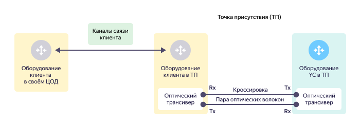
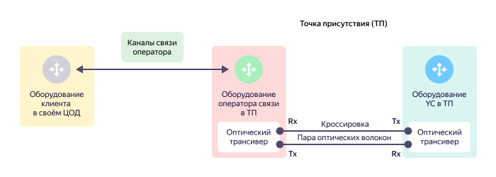
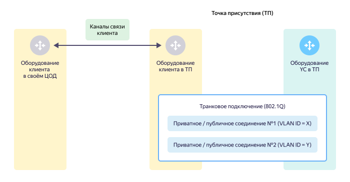
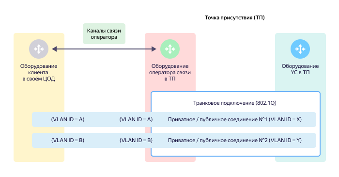
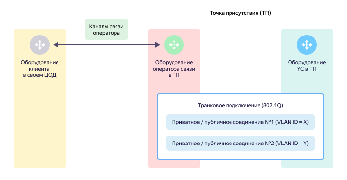

# Транковое подключение (транк) 

Основные функции транкового подключения (транка):

* Обеспечить [физическое подключение](#links) внешнего оборудования к оборудованию {{ yandex-cloud }} в [точке присутствия](./pops.md).
* Обеспечить [мультиплексирование трафика](#mux) приватных и публичных соединений с помощью технологии **Ethernet 802.1Q**. 



В [точке присуствия](./pops.md) для клиента может быть организован только один транк. Для обеспечения отказоустойчивости допускается организация нескольких транков — по одному в каждой [точке присутствия](./pops.md).



## Параметры физических портов на оборудовании {{ yandex-cloud }} {#phy-port}

По умолчанию физические порты на оборудовании {{ yandex-cloud }} имеют следующие настройки:

* Автосогласование скорости передачи на физических портах не поддерживается. На вашем оборудовании необходимо явно задавать скорость передачи и отключить автосогласование.
* Режим работы физического порта на оборудовании {{ yandex-cloud }} всегда транковый с тегированием 802.1Q. Подключение в режиме порта доступа (без тегирования) не поддерживается.
* Размер MTU по умолчанию поддерживает передачу jumbo frames.



При необходимости, несколько физических портов могут быть объединены в один агрегированный канал (Bundle) с помощью [протокола LACP](https://en.wikipedia.org/wiki/Link_aggregation#Link_Aggregation_Control_Protocol) в режиме `Active`.

[Технология MC-LAG](https://en.wikipedia.org/wiki/Multi-chassis_link_aggregation_group) для агрегированных каналов на оборудовании {{ yandex-cloud }} не поддерживается.



## Топологии физических подключений {#links}

На оборудовании {{ yandex-cloud }} поддерживаются следующие варианты организации физических подключений:

* [Прямое клиентское подключение](#direct-link) — подключение вашего собственного оборудования в ТП напрямую к оборудованию {{ yandex-cloud }}.
* [Подключение через оператора связи](#sp-link) — у вас нет собственного оборудования в ТП и вы используете услуги оператора связи, который организует для вас подключение к оборудованию {{ yandex-cloud }}.
* [Подключение через партнера](#partner-link) - у вас нет собственного оборудования в ТП и вы используете услуги компании партнера {{ yandex-cloud }}, который организует для вас подключение к оборудованию {{ yandex-cloud }}.

### Прямое клиентское подключение {#direct-link}
Подключение собственного оборудования в [точке присутствия](./pops.md) напрямую к оборудованию {{ yandex-cloud }}.

Транковое подключение в данном варианте будет состоять из следующих компонентов:

* Физический порт на вашем оборудовании.
* Оптический трансивер, подключенный в физический порт на вашем оборудовании.
* Физический порт, зарезервированный на оборудовании {{ yandex-cloud }}.
* Оптический трансивер, подключенный в физический порт на оборудовании {{ yandex-cloud }}.
* Кросссировка, которая подключается к оптическому трансиверу в порту на вашем оборудовании с одной стороны и к оптическому трансиверу на оборудовании {{ yandex-cloud }} с другой стороны. 

Схематично такое подключение может выглядеть следующим образом:

Оборудование клиента расположено в [точке присутствия](./pops.md) и подключается к оборудованию {{ yandex-cloud }} напрямую через оптическую кроссировку, проложенную в границах точки присутствия.

Передатчик (Tx) трансивера со стороны оборудования {{ yandex-cloud }} подключается с помощью оптического волокна к приемнику (Rx) трансивера на стороне оборудования клиента. Передатчик (Tx) трансивера на стороне оборудования клиента подключается с помощью оптического волокна к приемнику (Rx) трансивера на стороне оборудования {{ yandex-cloud }}. Пара этих оптических волокон образуют оптическую кроссировку.

### Подключение через оператора связи {#sp-link}

Если у клиента нет собственного оборудования в нужной [точке присутствия](./pops.md), то для подключения к оборудованию {{ yandex-cloud }} клиент привлекает оператора связи, у которого есть оборудование в нужной точке присутствия. 

Схематично такое подключение может выглядеть следующим образом:

Транковое подключение в данном варианте будет состоять из следующих компонентов:

* Физический порт на оборудовании оператора связи.
* Оптический трансивер, подключенный в физический порт на оборудовании оператора связи.
* Физический порт, зарезервированный на оборудовании {{ yandex-cloud }}.
* Оптический трансивер, подключенный в физический порт на оборудовании {{ yandex-cloud }}.
* Кросссировка, которая подключается к оптическому трансиверу в порту на оборудовании оператора связи с одной стороны и к оптическому трансиверу на оборудовании {{ yandex-cloud }} с другой стороны.



Оператор связи обязан организовать подключение оборудования клиента к своему оборудованию в нужной ТП и обеспечить транзит трафика между оборудованием клиента и оборудованием {{ yandex-cloud }}.



### Партнерское транковое подключение {#partner-link}

Использование **партнерского транкового подключения** упрощает подключение к {{ yandex-cloud }} за счет:
* Сокращения времени подключения услуги CIC.
* Снижения эксплуатационных затрат на организацию кроссировок.

Через партнерские транковые подключения можно организовывать как [приватные](./priv-con.md), так и [публичные](./pub-con.md) соединения.



* Для организации **приватного соединения** через партнерское транковое подключение необходимо следовать [инструкции](../operations/partner-trunk-priv-add.md).
* Для организации **публичного соединения** через партнерское транковое подключение необходимо следовать [инструкции](../operations/partner-trunk-pub-add.md).



## Мультиплексирование соединений (802.1Q) {#mux}

### VLAN-ID {#vlan-id}

Возможность одновременной передачи разных типов трафика (мультиплексирование) обеспечивается технологией **Ethernet 802.1Q**. Для каждого приватного или публичного соединения в транке выделяется свой уникальный идентификатор **VLAN-ID**.



При организации приватных или публичных соединений разрешается использовать значения VLAN-ID только в диапазоне от `2` до `4000` включительно.



### Варианты мультиплексирования соединений {#mux-options}

В одном транке можно комбинировать соединения разных типов:

* Одно [приватное соединение](./priv-con.md).
* Одно [публичное соединение](./pub-con.md).
* Несколько приватных и/или публичных соединений.

Возможны следующие варианты (схемы) организации мультиплексирования:

* [Прямое подключение на точке присутствия](#mux-direct).
* [Подключение через оператора связи (L2-транзит)](#mux-sp-L2).
* [Подключение через оператора связи (L3VPN)](#mux-sp-L3).

#### Прямое подключение на точке присутствия {#mux-direct}

В данном варианте 802.1Q транк организуется через прямое физическое подключение между оборудованием клиента в [точке присутствия](./pops.md) и оборудованием {{ yandex-cloud }}.

#### Подключение через оператора связи (L2-транзит) {#mux-sp-L2}

В данном варианте у клиента нет собственного оборудования в точке присутствия. При этом:

* Транковое 802.1Q подключение организуется в точке присутствия с привлечением оператора связи, который обеспечивает L2-транзит.
* Транковое 802.1Q подключение организуется между оборудованием клиента и оборудованием {{ yandex-cloud }}.
* При подключении клиентского оборудования оператор использует собственные каналы связи. В случае необходимости изменения номеров VLAN-ID соединений (трансляция VLAN-ID) на своем оборудовании, оператор связи должен согласовать с клиентом схему такой трансляции для согласованной работы оборудования оператора связи и оборудования клиента.

#### Подключение через оператора связи (L3VPN) {#mux-sp-L3}

В данном варианте у клиента нет собственного оборудования в точке присутствия. При этом:

* Транковое 802.1Q подключение организуется в точке присутствия с привлечением оператора связи.
* Транковое 802.1Q подключение организуется между оборудованием оператора связи в точке присутствия и оборудованием {{ yandex-cloud }}.
* Связность между оборудованием оператора связи в точке присутствия и оборудованием клиента обеспечивается организацией для клиента услуги L3VPN. Данный вариант обычно используется, когда у клиента нет технической возможности обеспечить BGP-связность с оборудованием {{ yandex-cloud }} своими силами и эту задачу оператор связи решает для клиента в рамках оказания клиенту услуги L3VPN.

## Емкость подключения {#policer}

На уровне транкового подключения оборудование {{ yandex-cloud }} применяет ограничение скорости приема и передачи данных от внешнего оборудования в битах/с и пакетах/с в соответствии с выбранной клиентом [емкостью подключения](../pricing.md). 

Для ограничения скоростей приема и передачи данных на оборудовании {{ yandex-cloud }} используется механизм **RateLimit (Policing)**. При превышении скорости передачи в битах/с или пакетах/с данные могут быть отброшены. Это может приводить к ситуациям, когда равномерно передаваемый трафик будет передаваться с более высокой скоростью, чем трафик, передаваемый резкими всплесками.
