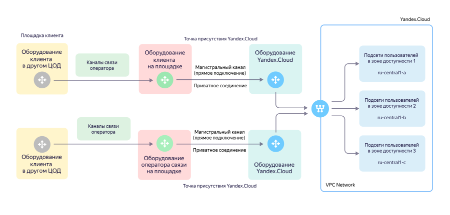

# Подключение услуги {{ interconnect-full-name }}

{{ interconnect-full-name }} позволяет установить приватное выделенное соединение между вашей локальной сетевой инфраструктурой и {{ yandex-cloud }}. 

Чтобы подключить {{ interconnect-full-name }}:
1. [Выберите тип трансивера](#transceiver-type).
1. [Выберите точки присутствия](#points-of-presence).
1. [Настройте транковое подключение](#trunk-connection-config).
1. [Настройте приватное соединение](#private-connection-config).
1. [Подключите облачные сети через приватное соединение](#vpc-networks).
1. [Выберите скорость подключения и желаемый пакет трафика](#bandwidth).
1. [Закажите кроссировку в точках присутствия](#cross-connect).

## Выберите тип трансивера {#transceiver-type}

Выберите тип трансивера для [транкового подключения](concepts/index.md#trunk-link) к оборудованию {{ yandex-cloud }}.

Для организации магистрального канала ваше оборудование подключается к оборудованию {{ yandex-cloud }} с помощью оптических трансиверов со следующими параметрами:



Укажите выбранный тип трансивера в заявке на подключение услуги. Учитывайте возможности вашего оборудования, а также расстояние между вашим оборудованием и [точкой присутствия](concepts/points-of-presence.md).

## Выберите точки присутствия {#points-of-presence}

Выберите одну или несколько _точек присутствия_ (point of presence, POP), к которым вы хотите организовать транковое подключение. Рекомендуем выбрать хотя бы две точки: это позволит обеспечить географическую отказоустойчивость и резервирование услуги. Каждая из точек присутствия обеспечивает доступ к вашим облачным ресурсам в любой из [зон доступности](../overview/concepts/geo-scope.md) {{ yandex-cloud }}.



Точки присутствия и их обозначения:



## Настройте транковое подключение {#trunk-connection-config}

Настройте на вашем оборудовании параметры транкового подключения:
* Скорость передачи на порту оборудования клиента — вручную, в соответствии с типом трансивера. Автосогласование не поддерживается.
* Параметры порта:
  * Режим работы — транковый.
  * Стандарт — IEEE 802.1Q.
  * Идентификатор VLAN (VLAN ID) — от `2` до `4000`. Native VLAN не поддерживается.
* (опционально) Размер MTU — 8910 байт. Этот размер выбран для передачи jumbo-кадров.

В рамках одной точки присутствия можно использовать следующие возможности:
* Агрегация каналов с помощью [протокола LACP](https://en.wikipedia.org/wiki/Link_aggregation#Link_Aggregation_Control_Protocol) в режиме `Active`.
* Стекирование коммутаторов на стороне клиента при условии, что коммутаторы будут объединены в единое логическое устройство (стек).

## Настройте приватное соединение {#private-connection-config}

Чтобы настроить [приватное соединение](concepts/index.md#private-connection):
1. Настройте IP-связность между клиентским устройством и оборудованием {{ yandex-cloud }}.
1. Настройте BGP-связность для обмена IPv4-префиксами (подсетями), которые анонсируются в рамках BGP-сессии как со стороны оборудования {{ yandex-cloud }}, так и со стороны клиентского устройства.



Несколько облачных сетей в рамках одного приватного соединения могут располагаться в разных облаках. Так можно в рамках одного приватного соединения обеспечить сетевое взаимодействие с несколькими облаками и сетями в них (VPC peering).



### Параметры приватного соединения {#interconnect-params}

Для настройки приватного соединения сообщите вашему менеджеру или архитектору следующую информацию:
* `cloud_id` — [идентификатор облака](../resource-manager/operations/cloud/get-id.md), к которому подключается услуга {{ interconnect-name }}. Чтобы узнать идентификатор облака, выберите в [консоли управления]({{ link-console-main }}) в списке слева нужное облако. Также идентификатор облака можно узнать с помощью [команды](../cli/cli-ref/managed-services/resource-manager/cloud/list.md) `yc resource-manager cloud list` CLI {{ yandex-cloud }}.
* `folder_id` — идентификатор каталога, в который будут экспортироваться [метрики](concepts/user-metrics.md) услуги {{ interconnect-name }}. См. раздел [{#T}](../resource-manager/operations/folder/get-id.md).
* `vlan_id` — идентификатор VLAN для приватного подключения. Допустимые значения — от `2` до `4000`. Порт должен быть настроен в режиме 802.1q trunk с тегированием VLAN. VLAN-тег используется для идентификации логического приватного соединения в рамках транкового подключения.
* IPv4-подсеть для BGP-пиринга — IPv4-подсеть из диапазонов, определенных в спецификации [RFC 1918](https://datatracker.ietf.org/doc/html/rfc1918), для организации BGP-взаимодействия между клиентским устройством и пограничным маршрутизатором {{ yandex-cloud }}. Подсеть может быть размером `/30` или `/31`. В подсети нужно выделить два адреса для установления BGP-сессии между сторонами: один — для оборудования {{ yandex-cloud }}, другой — для клиентского устройства (см. следующие параметры).
* IPv4-адрес на стороне {{ yandex-cloud }} — IPv4-адрес из подсети для BGP-пиринга на стороне маршрутизатора {{ yandex-cloud }}.
* IPv4-адрес на стороне клиента — IPv4-адрес из подсети для BGP-пиринга на стороне клиентского устройства.
* BGP ASN — номер автономной системы удаленного соседа. При настройке BGP-взаимодействия на клиентском маршрутизаторе используйте значение BGP ASN {{ yandex-cloud }} — `200350`. В качестве BGP ASN со стороны клиентского оборудования можно использовать свой публичный BGP ASN (при наличии) или любой удобный номер из диапазона приватных номеров BGP ASN (`64512` – `65534`) и настроить его как свой собственный на вашем маршрутизаторе.
* (опционально) BGP MD5 password — пароль для MD5-авторизации BGP-сессии. Используется для повышения уровня защиты BGP-соединения. Рекомендуем использовать сложную случайную строку из 20 и более символов латинскими буквами, цифрами и специальными символами.

## Подключите облачные сети через приватное соединение {#vpc-networks}

Чтобы подключить одну или несколько сетей к приватному соединению, укажите следующую информацию:
* `network_id` — идентификатор виртуальной сети, которую нужно подключить к {{ interconnect-name }}. 
  Чтобы узнать идентификатор сети, выберите в [консоли управления]({{ link-console-main }}) сервис **{{ vpc-name }}** и перейдите на вкладку  **Облачные сети**. Также идентификатор сети можно узнать с помощью [команды](../cli/cli-ref/managed-services/vpc/network/list.md) `yc vpc network list` CLI {{ yandex-cloud }}.
* Список анонсируемых IPv4-префиксов с указанием зоны доступности. Укажите префиксы, которые нужно анонсировать из указанной сети в сторону вашей инфраструктуры. Обычно префиксы соответствуют подсетям, настроенным в вашем облаке. В таком случае анонсируемые IPv4-префиксы и фактические диапазоны адресов подсети совпадают. 

Новые подсети не анонсируются автоматически. Если вы захотите добавить новую подсеть в приватное соединение, обратитесь в [техническую поддержку](link-console-support) с запросом о добавлении нового анонса в сервисе {{ interconnect-name }}. 



Адреса внутренних балансировщиков нагрузки анонсируются в виде маршрутов с длиной префикса `/32`.



Также можно анонсировать _агрегированные префиксы_ — это позволит вам настроить приватное соединение один раз и в дальнейшем добавлять новые подсети в уже существующую сеть автоматически, без обращения в техническую поддержку.

  > Например, при организации приватного подключения вы запросили анонс агрегированных IPv4-префиксов вида:
  >
  > ```
  > {{ region-id }}-a [10.128.0.0/16]
  > {{ region-id }}-b [10.130.0.0/16]
  > {{ region-id }}-c [10.140.0.0/16]
  > ```
  >
  > Если позже вы создадите в данной сети в зоне `{{ region-id }}-a` подсеть с префиксом `10.128.15.0/24`, она автоматически будет доступна через {{ interconnect-name }}, поскольку подсеть `10.128.15.0/24` принадлежит уже анонсированному адресному пространству `10.128.0.0/16`.

## Выберите скорость подключения и желаемый пакет трафика {#bandwidth}

Желаемый пакет трафика — это единица тарификации сервиса {{ interconnect-name }}, которая равна объему трафика, передаваемому с указанной скоростью в течение месяца. 

> Например, если вы выбрали скорость 100 Мбит/с, то ваш пакет трафика составит 30 ТБ. Это объем, который можно передать за месяц при 100% утилизации канала с пропускной способностью 100 Мбит/c.

## Закажите кроссировку в точках присутствия {#cross-connect}

Порядок заказа оптической кроссировки отличается в зависимости от конкретной точки присутствия:



- M9

  1. Заполните [шаблон согласительного письма для M9](https://storage.yandexcloud.net/doc-files/interconnect-agreement-M9-example.docx). Укажите информацию о стойке с вашим оборудованием и параметры соединения. Напишите в [техническую поддержку]({{ link-console-support }}) или вашему менеджеру о желании подключить услугу {{ interconnect-name }} самостоятельно. 
  1. В ответ мы пришлем подписанное согласительное письмо с номером порта, выделенного для вашего подключения на стороне {{ yandex-cloud }}.
  1. Перешлите подписанное письмо по адресу [sekretar@mmts9.ru](mailto:sekretar@mmts9.ru) c темой <q>Согласительное письмо от <Название вашей компании> — {{ yandex-cloud }}</q>.
  1. Закажите кроссировку у вашего оператора связи или у технической поддержки, приложив согласительное письмо.
  1. После этого оператор или сотрудники площадки смогут начать прокладку кроссировки и ее подключение к выделенному порту в оборудовании {{ yandex-cloud }}.

- OST

  1. Заполните [шаблон согласительного письма для OST](https://storage.yandexcloud.net/doc-files/interconnect-agreement-Ost-example.docx). Укажите информацию о стойке с вашим оборудованием и параметры соединения. Напишите в [техническую поддержку]({{ link-console-support }}) или вашему менеджеру о желании подключить услугу {{ interconnect-name }} самостоятельно. 
  1. В ответ мы пришлем подписанное согласительное письмо с номером порта, выделенного для вашего подключения на стороне {{ yandex-cloud }}.
  1. Закажите кроссировку у вашего оператора связи или у технической поддержки, приложив согласительное письмо.
  1. После этого оператор или сотрудники площадки смогут начать прокладку кроссировки и ее подключение в выделенный порт в оборудовании {{ yandex-cloud }}.

- NORD

  1. Заполните [шаблон согласительного письма для NORD](https://storage.yandexcloud.net/doc-files/interconnect-agreement-Nord-example.docx). Укажите информацию о стойке с вашим оборудованием и параметры соединения. Напишите в [техническую поддержку]({{ link-console-support }}) или вашему менеджеру о желании подключить услугу {{ interconnect-name }} самостоятельно. 
  1. В ответ мы пришлем подписанное согласительное письмо с номером порта, выделенного для вашего подключения на стороне {{ yandex-cloud }}.
  1. Закажите кроссировку у вашего оператора связи или у технической поддержки, приложив согласительное письмо.
  1. После этого оператор или сотрудники площадки смогут начать прокладку кроссировки и ее подключение к выделенному порту в оборудовании {{ yandex-cloud }}.

- STD

  1. Получите от вашего менеджера или архитектора номер порта и координаты стойки {{ yandex-cloud }}.
  1. Сообщите данную информацию вашему оператору или самостоятельно закажите кроссировку силами сотрудников точки присутствия до выделенного порта на оборудовании {{ yandex-cloud }}.
  1. После этого оператор или сотрудники площадки смогут начать прокладку кроссировки и ее подключение в выделенный порт в оборудовании {{ yandex-cloud }}.

  

  Согласительное письмо для площадки **STD** не требуется. Оператор, прокладывающий кроссировку, и {{ yandex-cloud }} взаимодействуют напрямую.

  

