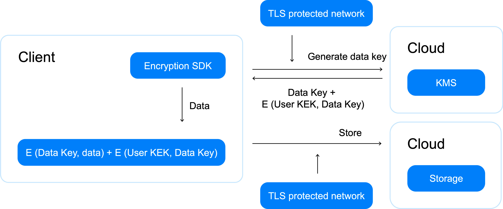

# Шифрование по схеме envelope encryption

У шифрования методом [encrypt](../api-ref/SymmetricCrypto/encrypt) есть ограничение на максимальный размер данных для шифрования (32 КБ). Рост объема данных вызывает ряд проблем:
* Повышение нагрузки на {{ kms-short-name }}, вызванное операциями шифрования и расшифрования.
* Понижение эффективности шифрования и расшифрования методами encrypt и decrypt с ростом объема данных для шифрования. 

    Время выполнения encrypt и decrypt операций включает в себя передачу данных от клиента к {{ kms-short-name }} и обратно. С ростом объема шифруемых данных растет время на их передачу и нагрузка на сеть.

Шифрование по схеме envelope encryption осуществляется в основном на стороне клиента и помогает избежать перечисленные выше проблемы.

## Описание процесса шифрования {#encrypt}

В отличие от шифрования <q>напрямую</q>, когда ключ {{ kms-short-name }} выступает в роли ключа шифрования данных, в схеме участвуют ключи двух типов: 
* Ключ шифрования данных (data encryption key, DEK).
* Ключ шифрования ключа (key encryption key, KEK).

Шифрование происходит следующим образом:
1. Клиент генерирует ключ шифрования данных (DEK) и локально шифрует им данные.
    
    Для формирования ключа с высокой энтропией рекомендуется использовать метод [generateDataKey](../api-ref/SymmetricCrypto/generateDataKey). Он генерирует ключ на основе алгоритма Fortuna, агрегирующий энтропию с различных источников (RDSEED и RDRAND, /dev/urandom, энтропия с хостов).
1. Клиент выполняет [encrypt](../api-ref/SymmetricCrypto/encrypt.md)-запрос к {{ kms-short-name }} на шифрование DEK.
1. Клиент получает зашифрованный DEK. 
    
    Ключ {{ kms-short-name }}, которым выполняется шифрование DEK, выступает в данной схеме в роли ключа шифрования ключа (KEK).
1. Незашифрованный DEK уничтожается клиентом.
1. Зашифрованный DEK сохраняется клиентом рядом с шифртекстом.

При шифровании по схеме envelope encryption для локального шифрования вы можете использовать более широкий набор алгоритмов, а также шифровать данные несколькими DEK, например, для возможности произвольного доступа к шифртексту.

## Описание процесса расшифрования {#decrypt}

Расшифрование происходит следующим образом:
1. Клиент читает зашифрованный DEK, сохраненный рядом с зашифрованными данными.
1. Клиент выполняет [decrypt](../api-ref/SymmetricCrypto/decrypt)-запрос к {{ kms-short-name }} на расшифрование DEK.
1. Клиент получает расшифрованный DEK.
1. Зашифрованные данные локально расшифровываются с помощью DEK.
1. DEK уничтожается.

## Особенности реализации схемы envelope encryption {#specify}

Шифрование по схеме envelope encryption перекладывает часть ответственности за безопасное шифрование данных на клиента. При реализации данной схемы важно:
* Использовать безопасные алгоритмы для локального шифрования.
* Не сохранять ключ шифрования данных (DEK) в открытом виде.
    
    
    
    Открытый DEK должен расшифровываться только на время шифрования или расшифрования данных и уничтожаться сразу после этого.
    
    
    
* Использовать разные DEK для разных данных.
* Генерировать новые DEK при повторном шифровании данных.

Чтобы избежать ошибок, для шифрования на стороне клиента рекомендуется использовать [AWS Encryption SDK](../tutorials/encrypt/aws-encryption-sdk.md) или [Google Tink](../tutorials/encrypt/google-tink.md).

## Примеры использования {#examples}

* [{#T}](../tutorials/encrypt/aws-encryption-sdk.md)
* [{#T}](../tutorials/encrypt/google-tink.md)
* [{#T}](../tutorials/kms-k8s.md)