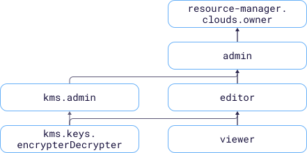

# Управление доступом в {{ kms-name }}

В этом разделе вы узнаете:
* [на какие ресурсы можно назначить роль](#resources);
* [какие роли действуют в сервисе](#roles-list);
* [какие роли необходимы](#choosing-roles) для того или иного действия.



Назначать роли на ресурс могут пользователи, у которых на этот ресурс есть роль `kms.admin` или одна из следующих ролей:



## На какие ресурсы можно назначить роль {#resources}



В [консоли управления]({{ link-console-main }}), через {{ yandex-cloud }} [CLI](../../cli/cli-ref/managed-services/kms/index.md), [API](../api-ref/authentication.md) или [{{ TF }}]({{ tf-provider-link }}) роль можно назначить на отдельные ресурсы сервиса:



## Какие роли действуют в сервисе {#roles-list}

Управлять доступом к ключам {{ kms-short-name }} можно как с помощью сервисных, так и с помощью примитивных ролей.



### Сервисные роли {#service-roles}

Сервисные роли обеспечивают более гранулярный, учитывающий специфику сервиса, контроль над ключами {{ kms-short-name }}: предполагают строгое разделение субъектов на администраторов ключей (роль `kms.admin`) и пользователей (роль `kms.keys.encrypterDecrypter`).

Пользователи, у которых отсутствует роль `resource-manager.clouds.owner` или роль `admin`, не могут назначать роли через консоль управления.

#### kms.keys.encrypter {#kms-keys-encrypter}



#### kms.keys.decrypter {#kms-keys-decrypter}



#### kms.keys.encrypterDecrypter {#kms-keys-encrypterDecrypter}



#### kms.asymmetricEncryptionKeys.publicKeyViewer {#kms-asymmetricEncryptionKeys-publicKeyViewer}



#### kms.asymmetricSignatureKeys.publicKeyViewer {#kms-asymmetricSignatureKeys-publicKeyViewer}



#### kms.asymmetricSignatureKeys.signer {#kms-asymmetricSignatureKeys-signer}



#### kms.asymmetricEncryptionKeys.decrypter {#kms-asymmetricEncryptionKeys-decrypter}



#### kms.auditor {#kms-auditor}



#### kms.viewer {#kms-viewer}



#### kms.editor {#kms-editor}



#### kms.admin {#kms-admin}



### Примитивные роли {#primitive-roles}





## Какие роли мне необходимы {#choosing-roles}

**Пример разграничения доступа к ключам**

С ролями рекомендуется работать следующим образом:
1. Владелец (роль `resource-manager.clouds.owner`) или администратор (роль `admin`) облака назначает роль `kms.admin` администратору {{ kms-short-name }}. 
1. Администратор {{ kms-short-name }} создает необходимое количество ключей и назначает (с помощью CLI или API) роли для их использования: субъекты, представляющие разные команды, получают роли `kms.keys.encrypter`, `kms.keys.decrypter`, `kms.asymmetricEncryptionKeys.publicKeyViewer`, `kms.asymmetricEncryptionKeys.decrypter` и `kms.editor` на ключи и каталоги.

Хорошей практикой является хранение ключей {{ kms-short-name }} в выделенном каталоге, отдельно от других ресурсов {{ yandex-cloud }}.

Действие | Методы | Необходимые роли
----- | ----- | -----
**{{ kms-short-name }}** | | 
Получение информации о ключах и версиях | `get`, `listVersions` | `kms.viewer` на ключ на каталог
Операции [симметричного шифрования и расшифрования](../api-ref/SymmetricCrypto/) | `encrypt`, `decrypt`, `reEncrypt`, `generateDataKey` | `kms.keys.encrypterDecrypter` на ключ (шифрование и расшифрование), `kms.keys.encrypter` на ключ (только шифрование), `kms.keys.decrypter` на ключ (только расшифрование)
Получение списка ключей в каталоге | `list` | `kms.auditor` на каталог
Получение открытого ключа асимметричной ключевой пары шифрования | | `kms.asymmetricEncryptionKeys.publicKeyViewer` на ключ
Расшифрование с помощью закрытого ключа асимметричной ключевой пары шифрования | | `kms.asymmetricEncryptionKeys.decrypter` на ключ
[Создание](../operations/key.md#create) и [изменение](../operations/key.md#update) ключа | `create`, `update` | `kms.editor` на каталог
[Ротация ключа](../operations/key.md#rotate) | `rotate` | `kms.editor` на ключ
[Смена основной версии](../operations/version.md#make-primary) | `setPrimaryVersion` | `kms.admin` на ключ
[Удаление ключей](../operations/key.md#delete) и [удаление версий](../operations/version.md#delete)| `delete`, `scheduleVersionDestruction`, `cancelVersionDestruction` | `kms.admin` на ключ
[Назначение роли](../../iam/operations/roles/grant.md), [отзыв роли](../../iam/operations/roles/revoke.md) | `setAccessBindings`, `updateAccessBindings` | `kms.admin` на ключ
Просмотр назначенных ролей на ключ | `listAccessBindings` | `kms.auditor` на ключ

#### Что дальше {#what-is-next}

* [Безопасное использование {{ yandex-cloud }}](../../iam/best-practices/using-iam-securely.md)
* [Как назначить роль](../../iam/operations/roles/grant.md).
* [Как отозвать роль](../../iam/operations/roles/revoke.md).
* [Подробнее об управлении доступом в {{ yandex-cloud }}](../../iam/concepts/access-control/index.md).
* [Подробнее о наследовании ролей](../../resource-manager/concepts/resources-hierarchy.md#access-rights-inheritance).
