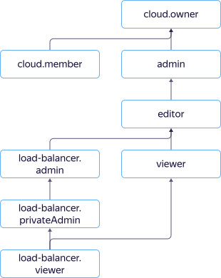

# Управление доступом

В этом разделе вы узнаете:
* [на какие ресурсы можно назначить роль](#resources);
* [какие роли действуют в сервисе](#roles-list);
* [какие роли необходимы](#choosing-roles) для того или иного действия.



## На какие ресурсы можно назначить роль {#resources}



## Какие роли действуют в сервисе {#roles-list}

На диаграмме показано, какие роли есть в сервисе и как они наследуют разрешения друг друга. Например, в `editor` входят все разрешения `viewer`. После диаграммы дано описание каждой роли.

Роли, действующие в сервисе:

* Сервисные роли:
    * 
    * 
* Примитивные роли:
    * 
    * 
    * 

## Какие роли мне необходимы {#choosing-roles}

В таблице ниже перечислено, какие роли нужны для выполнения указанного действия. Вы всегда можете назначить роль, которая дает более широкие разрешения, нежели указанная. Например, назначить `editor` вместо `viewer`.

Действие | Методы | Необходимые роли
----- | ----- | -----
**Просмотр информации** | |
Просмотр информации о любом ресурсе | `get`, `list`, `listOperations` | `viewer` на этот ресурс
**Управление балансировщиками** | |
[Создание балансировщиков в каталоге](../operations/load-balancer-create.md) | `create` | `editor` на каталог и на указанные целевые группы
Изменение и [удаление балансировщиков](../operations/load-balancer-delete.md) | `update`, `delete` | `editor` на балансировщик и на указанные целевые группы
[Присоединение](../operations/target-group-attach.md) и [отсоединение целевых групп](../operations/target-group-detach.md) | `attachTargetGroup`, `detachTargetGroup` | `editor` на балансировщик и на указанные целевые группы
[Получение состояний целевых групп](../operations/check-resource-health.md) | `getTargetStates` | `viewer` на балансировщик и на указанные целевые группы
[Добавление](../operations/listener-add.md), [удаление](../operations/listener-remove.md) обработчиков | `addListener`, `removeListener` | `editor` на балансировщик
[Остановка](../operations/load-balancer-stop.md) и [запуск](../operations/load-balancer-start.md) балансировщика | `stop`, `start` | `editor` на балансировщик
**Управление целевыми группами** | |
[Создание целевых групп в каталоге](../operations/target-group-create.md) | `create` | `editor` на каталог и на указанные подсети
Изменение и [удаление целевых групп](../operations/target-group-delete.md) | `update`, `delete` | `editor` на целевую группу, балансировщик и на указанные подсети
Добавление и удаление ресурсов в целевой группе | `addTargets`, `removeTargets` | `editor` на целевую группу, балансировщик и на указанные подсети
**Управление доступом к ресурсам** | |
[Назначение роли](../../iam/operations/roles/grant.md), [отзыв роли](../../iam/operations/roles/revoke.md) и просмотр назначенных ролей на ресурс | `setAccessBindings`, `updateAccessBindings`, `listAccessBindings` | `admin` на этот ресурс

#### Что дальше {what-is-next}

* [Как назначить роль](../../iam/operations/roles/grant.md).
* [Как отозвать роль](../../iam/operations/roles/revoke.md).
* [Подробнее об управлении доступом в Яндекс.Облаке](../../iam/concepts/access-control/index.md).
* [Подробнее о наследовании ролей](../../resource-manager/concepts/resources-hierarchy.md#access-rights-inheritance).
