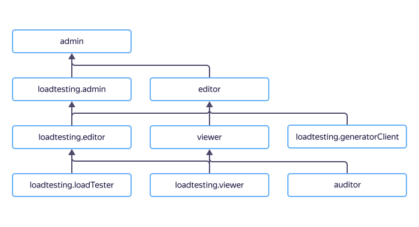

# Управление доступом в {{ load-testing-name }}

Для управления правами доступа в {{ load-testing-name }} используются [роли](../../iam/concepts/access-control/roles.md).

В этом разделе вы узнаете:
* [на какие ресурсы можно назначить роль](#resources);
* [какие роли действуют в сервисе](#roles-list);
* [какие роли необходимы](#required-roles) для того или иного действия.





## На какие ресурсы можно назначить роль {#resources}



## Какие роли действуют в сервисе {#roles-list}



### Сервисные роли {#service-roles}

#### loadtesting.viewer {#loadtesting-viewer}



#### loadtesting.editor {#loadtesting-editor}



#### loadtesting.admin {#loadtesting-admin}



#### loadtesting.loadTester {#loadtesting-loadtester}



#### loadtesting.generatorClient {#loadtesting-generatorclient}



#### loadtesting.externalAgent {#loadtesting-externalagent}



### Примитивные роли {#primitive-roles}



#### Что дальше {#next}

* [Как назначить роль](../../iam/operations/roles/grant.md).
* [Как отозвать роль](../../iam/operations/roles/revoke.md).
* [Подробнее об управлении доступом в {{ yandex-cloud }}](../../iam/concepts/access-control/index.md).
* [Подробнее о наследовании ролей](../../resource-manager/concepts/resources-hierarchy.md#access-rights-inheritance).
