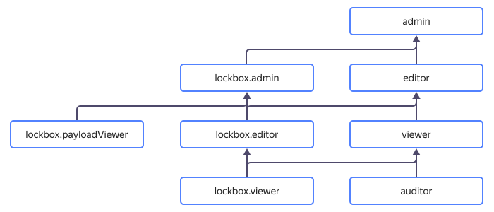

# Управление доступом в {{ lockbox-name }}

В этом разделе вы узнаете:
* [на какие ресурсы можно назначить роль](#resources);
* [какие роли действуют в сервисе](#roles-list);
* [какие роли необходимы](#choosing-roles) для того или иного действия.



## На какие ресурсы можно назначить роль {#resources}

Роль можно назначить на [облако](../../resource-manager/concepts/resources-hierarchy.md#cloud), [каталог](../../resource-manager/concepts/resources-hierarchy.md#folder) или секрет. Эти роли будут действовать и на вложенные ресурсы.



 
## Какие роли действуют в сервисе {#roles-list}

Управлять доступом к секретам можно как с помощью сервисных, так и с помощью примитивных ролей. 

### Сервисные роли {#service-roles}

#### lockbox.auditor {#lockbox-auditor}



#### lockbox.viewer {#lockbox-viewer}



#### lockbox.editor {#lockbox-editor}



#### lockbox.admin {#lockbox-admin}



#### lockbox.payloadViewer {#lockbox-payloadViewer}



### Примитивные роли {#primitive-roles}



## Какие роли мне необходимы {#choosing-roles}

В таблице ниже перечислено, какие роли нужны для выполнения указанного действия. Вы всегда можете назначить роль, которая дает более широкие разрешения, нежели указанная. Например, назначить `editor` вместо `viewer`.

Действие | `{{ roles-lockbox-admin }}` | `{{ roles-lockbox-editor }}` | `{{ roles-lockbox-viewer }}` | `{{ roles-lockbox-payloadviewer }}` | `kms.keys.encrypterDecrypter`
----- | ----- | ----- | ----- | ----- | ----- 
Создание и удаление секретов                |  |  | - | - | -
Изменение метаданных секрета                |  |  | - | - | -
Чтение метаданных секрета                   |  |  |  | - | -
Изменение содержимого версии секрета        |  |  | - | - | -
Чтение содержимого версии секрета           |  | - |- |  | -
Управление доступом к секрету               |  | - | - | - | -
Операции шифрования и расшифровки секрета   | - | - | - | - | 

#### Что дальше {#what-is-next}

* [Безопасное использование {{ yandex-cloud }}](../../iam/best-practices/using-iam-securely.md)
* [Как назначить роль](../../iam/operations/roles/grant.md).
* [Как отозвать роль](../../iam/operations/roles/revoke.md).
* [Подробнее об управлении доступом в {{ yandex-cloud }}](../../iam/concepts/access-control/index.md).
* [Подробнее о наследовании ролей](../../resource-manager/concepts/resources-hierarchy.md#access-rights-inheritance).
* [Управление доступом в {{ kms-full-name }}](../../kms/security/index.md)
