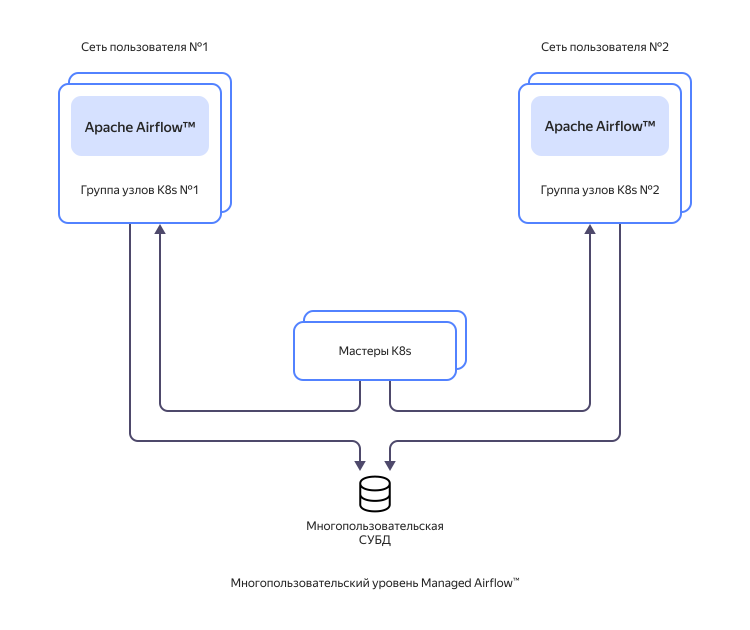
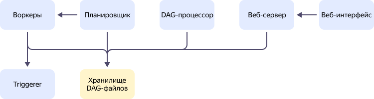
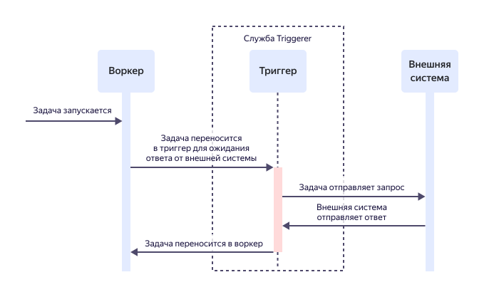

# Взаимосвязь ресурсов в {{ maf-name }}

Сервис {{ maf-name }} помогает разворачивать и поддерживать [кластеры](../../glossary/cluster.md) серверов [{{ AF }}](https://airflow.apache.org/) в инфраструктуре {{ yandex-cloud }}.

## Об {{ AF }} {#about-the-service}

{{ AF }} — это платформа с открытым исходным кодом для создания, планирования и мониторинга пакетно ориентированных _воркфлоу_. Воркфлоу определяет взаимосвязь задач и последовательность их выполнения и представлен в виде направленного ациклического графа — DAG (Directed Acyclic Graph). Направленные ациклические графы в {{ AF }} можно применять для автоматизации и запуска по расписанию любых процессов, например [обработки данных в {{ SPRK }}](../tutorials/data-processing-automation.md).

В {{ AF }} используется подход <q>Workflows as code</q>. Он подразумевает, что каждый воркфлоу реализуется с помощью скрипта на Python 3. Файл с таким скриптом называется _DAG-файлом_. В нем описываются задачи, расписание их запуска и зависимости между ними. Такой подход позволяет хранить воркфлоу в [системе контроля версий](../../glossary/vcs.md), запускать тесты и подключать нужные технологии для воркфлоу.

{{ AF }} не применяется для потоковой и непрерывной обработки данных. Если она нужна, можно создать решение на основе сервиса [{{ mkf-full-name }}](../../managed-kafka/index.yaml).

Более подробная информация приведена в документации [{{ AF }}](https://airflow.apache.org/docs/apache-airflow/stable/#).

## Архитектура {{ maf-name }} {#architecture}

Архитектура сервиса {{ maf-name }} представлена на схеме:

Каждый [кластер {{ AF }}](#cluster) запускается в отдельной группе узлов {{ k8s }}, которая включает в себя необходимую сетевую инфраструктуру: виртуальную сеть, группу безопасности и сервисный аккаунт. Группы узлов изолированы друг от друга как средствами виртуальных сетей, так и средствами самого {{ k8s }}. Группы узлов управляются общим {{ k8s }}-мастером, а кластеры {{ AF }} используют для хранения данных общий кластер {{ PG }}.

Чтобы обеспечить изолированное хранение данных, использование кластера {{ PG }} в сервисе ограничено:

* Для каждого кластера {{ AF }} в кластере {{ PG }} создается отдельная база данных. Кластер может подключаться только к своей базе данных.
* Кластер {{ AF }} может работать только с теми таблицами, которые созданы средствами самого {{ AF }}. Произвольное создание и изменение схем, таблиц, функций, процедур и триггеров запрещено.
* Скорость чтения и записи данных, а также объем хранимой в базе информации ограничены.

    

    Злонамеренный обход этих ограничений приведет к блокировке кластера согласно пункту 7 [правил допустимого использования сервисов]({{ link-cloud-aup }}).

    

## Кластер {{ AF }} {#cluster}

Основная сущность, которой оперирует сервис {{ maf-name }}, — _кластер_. В нем развернуты [компоненты {{ AF }}](#components). Ресурсы кластера могут находиться в разных зонах доступности. Подробнее о географии {{ yandex-cloud }} см. в разделе [Обзор платформы](../../overview/concepts/geo-scope.md).

Воркфлоу, запущенный в кластере, может обращаться к любому ресурсу {{ yandex-cloud }} в пределах облачной сети, в которой находится кластер. Например, воркфлоу может отправлять запросы виртуальной машине {{ yandex-cloud }} или кластеру управляемой базы данных (БД). Так можно построить воркфлоу с использованием нескольких ресурсов. Например, воркфлоу забирает данные из одной БД, обрабатывает их и отправляет в другую БД или [{{ dataproc-full-name }}](../../data-proc/index.yaml).

## Основные компоненты {{ AF }} {#components}

Основные компоненты {{ AF }} представлены на схеме:

Компоненты {{ AF }}:

* _Веб-сервер_ — сервер в {{ yandex-cloud }}, на котором размещается экземпляр {{ AF }}. Веб-сервер получает команды от пользователей, отправленные через веб-интерфейс {{ AF }}, проверяет, запускает и отлаживает Python-скрипты в DAG-файлах.

   Подробнее о работе с веб-интерфейсом см. в [документации {{ AF }}](https://airflow.apache.org/docs/apache-airflow/stable/ui.html).

* _Планировщик_ — сервер в {{ yandex-cloud }}, который управляет расписанием запуска задач. Планировщик получает информацию о расписании из DAG-файлов. По этому расписанию он сообщает воркерам, что пора запустить DAG-файл.

* _Воркеры_ — исполнители задач, указанных в DAG-файлах. Воркеры выполняют задачи по расписанию от планировщика.

* [_Triggerer_](#triggerer) — служба, которая освобождает воркер в случае его простоя при выполнении задания с длительным ожиданием события (опциональный компонент).

* _Хранилище DAG-файлов_ — [бакет {{ objstorage-full-name }}](../../storage/concepts/bucket.md), в котором хранятся DAG-файлы. К этому хранилищу имеют доступ веб-сервер, планировщик, воркеры и Triggerer.

Чтобы обеспечить отказоустойчивость и повысить производительность, веб-серверы, планировщики и Triggerer могут существовать в нескольких экземплярах. Их количество определяется во время создания кластера.

Для воркеров задается минимальное и максимальное количество экземпляров также при создании кластера. Их количество будет масштабироваться динамически. Эта функциональность обеспечивается благодаря использованию в сервисе контроллера [KEDA](https://airflow.apache.org/docs/helm-chart/stable/keda.html).

### Конфигурации компонентов {{ AF }} {#presets}

Конфигурация определяет вычислительные мощности, которые выделяются для веб-сервера, планировщика, воркеров и службы Triggerer. Доступны два типа конфигураций: 

 * **standard** — с соотношением количества гигабайт RAM к количеству vCPU 4:1.

      * 1 vCPU, 4 ГБ RAM.
      * 2 vCPU, 8 ГБ RAM.
      * 4 vCPU, 16 ГБ RAM.
      * 8 vCPU, 32 ГБ RAM.

 * **cpu-optimized** — с уменьшенным соотношением количества гигабайт RAM к количеству vCPU (2:1). Такие конфигурации могут быть полезны для кластеров с повышенными требованиями к производительности процессора.

      * 1 vCPU, 2 ГБ RAM.
      * 2 vCPU, 4 ГБ RAM.
      * 4 vCPU, 8 ГБ RAM.
      * 8 vCPU, 16 ГБ RAM.

Конфигурации можно выбрать при [создании кластера](../operations/cluster-create.md) или изменить при его [редактировании](../operations/cluster-update.md).

## Triggerer {#triggerer}

Служба Triggerer позволяет сократить время простоя воркеров.

В графах DAG могут быть задачи, которые отправляют запрос во внешнюю систему (например, кластер {{ SPRK }}) и ожидают ответ от нее в течение некоторого времени. Если использовать [стандартные операторы](https://airflow.apache.org/docs/apache-airflow/stable/core-concepts/operators.html), задача занимает воркер, пока ожидает ответа. В результате воркер простаивает. Когда такое происходит с большим количеством воркеров, образуются очереди задач, и скорость их запуска и выполнения снижается.

Избежать такой ситуации позволяют _отложенные операторы_ (deferrable operators). С их помощью задача приостанавливается, освобождается воркер, и опрос внешней системы выделяется в отдельный процесс — _триггер_ (trigger). Все триггеры независимо друг от друга (асинхронно) обрабатываются службой Triggerer, для которой в кластере выделены отдельные ресурсы. При получении ответа от внешней системы триггер срабатывает, и планировщик возвращает задачу воркеру.

Процесс работы со службой Triggerer представлен на схеме:

Подробнее об отложенных операторах, триггерах и службе Triggerer см. в документации [{{ AF }}](https://airflow.apache.org/docs/apache-airflow/stable/authoring-and-scheduling/deferring.html#deferrable-operators-triggers).

## Примеры использования {#examples}

* [{#T}](../tutorials/data-processing-automation.md)
* [{#T}](../tutorials/airflow-auto-tasks.md)