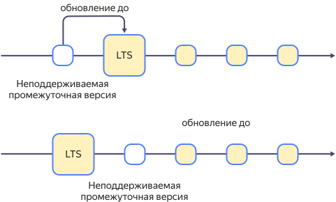

# Политика работы с версиями {{ CH }}

{{ CH }} использует политику частых релизов. В {{ mch-name }} доступен ограниченный набор версий {{ CH }}: {{ versions.console.str }}. Список версий постоянно актуализируется. При устаревании используемая в кластере {{ mch-name }} версия {{ CH }} обновляется.

Обновление до актуальных версий позволяет получать новую функциональность, патчи и исправления, направленные на улучшение безопасности, что повышает общую стабильность кластера.

Каждая версия {{ CH }}, которая поддерживается {{ mch-name }}, проходит всестороннее тестирование. 

После обновления до новой поддерживаемой версии {{ CH }} ваши данные останутся в целости и будут доступны.

## Политика поддержки версий {#versioning-policy}

{{ mch-name }} использует два типа версий {{ CH }}:
- **LTS** (версии с расширенным периодом поддержки, Long-Term Support). 

  Срок поддержки LTS-версий — один год, новые версии выпускаются каждые полгода.

  Поддерживаются две LTS-версии: текущая и предыдущая. 
  
  При релизе в {{ mch-name }} новой LTS-версии прекращается поддержка самой старой из доступных LTS-версий.

- **Промежуточные**.

  Поддерживаются три самых новых версии {{ CH }}, в том числе промежуточные. Если одна из этих версий является LTS-версией, то поддерживаются только две промежуточных версии.

  При релизе в {{ mch-name }} новой промежуточной версии {{ CH }} прекращается поддержка самой старой из промежуточных версий.

Вы можете вручную [изменить версию кластера](../operations/cluster-version-update.md) на одну из поддерживаемых версий.



* Создание новых хостов в кластерах на неподдерживаемой версии {{ CH }} становится невозможным.
* Кластеры на неподдерживаемой версии {{ CH }} будут автоматически обновлены в соответствии с [политикой обновления](#update-policy).



## Политика обновления {#update-policy}



- LTS-версии

  Кластер {{ mch-name }} на неподдерживаемой версии {{ CH }} будет обновлен до следующей LTS-версии.
  
  
  
  
  
  Уведомления о планируемом обновлении кластеров, использующих неподдерживаемую LTS-версию, будут отправлены пользователям за **два месяца** и за **одну неделю** до обновления.

   

- Промежуточные версии

  Кластер {{ mch-name }} на неподдерживаемой версии {{ CH }} будет обновлен либо до LTS-версии, если она доступна, либо до самой новой промежуточной версии.
  
  
  
  
     
  * Уведомления о планируемом обновлении кластеров, использующих неподдерживаемую промежуточную версию, будут отправлены пользователям за **одну неделю** до обновления.
  * В случае перехода на LTS-версию к кластеру будет применяться соответствующая политика обновлений.

  



